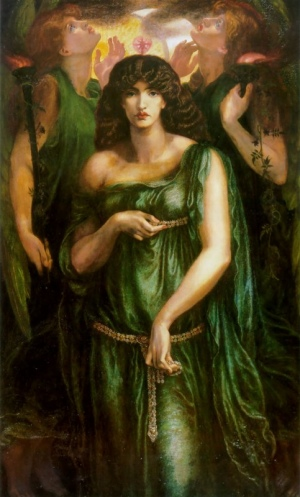

  
[Intangible Textual Heritage](../../../index)  [Classics](../../index) 
[Lucian](../index) 

------------------------------------------------------------------------

[Buy this Book at
Amazon.com](https://www.amazon.com/exec/obidos/ASIN/B002ECE91S/internetsacredte)

------------------------------------------------------------------------

<table width="75%">
<colgroup>
<col style="width: 50%" />
<col style="width: 50%" />
</colgroup>
<tbody>
<tr class="odd">
<td width="50%" data-valign="TOP"> 
Astarte Syriaca (1875-1877), by Dante Gabriel Rossetti (Public Domain Image)</td>
<td width="50%" data-valign="CENTER"><h1 id="the-syrian-goddess" data-align="CENTER">The Syrian Goddess</h1>
<h4 id="de-dea-syria-by-lucian-of-samosata" data-align="CENTER">De Dea Syria, by Lucian of Samosata</h4>
<h2 id="by-herbert-a.-strong-and-john-garstang" data-align="CENTER">by Herbert A. Strong and John Garstang</h2>
<h3 id="section" data-align="CENTER">[1913]</h3></td>
</tr>
</tbody>
</table>

------------------------------------------------------------------------

[Contents](#contents)    [Start Reading](tsg00)    [Page
Index](pageidx)    [Text \[Zipped\]](tsg.txt.gz)

------------------------------------------------------------------------

|                                                                                                                           |
|---------------------------------------------------------------------------------------------------------------------------|
|  |

Lucian of Samosata's De Dea Syria, (the Syrian Goddess) is one of the
most 'notorious' classical writings. Not only does it acknowledge that
at one time a paramount Goddess was worshipped in regions of the Ancient
Near East, it goes into details of the practices of her devotees which
later generations considered reprehensible. Nonetheless De Dea played an
important role in the development of modern
[Neopaganism](../../../pag/index); Robert Graves cited it as one of the
few actual accounts of ancient Goddess-worship.

Lucian recounts his personal observations of the worship of the Goddess
Atargatis (a form of Isthar or Astarte) at the temple of Hierapolis, in
what is today Turkey. Lucian writes in the style of
[Herodotus](../../hh/index), and, remarkably, in Herodotus' dialect of
Greek, which at that time was over five hundred years old. Lucian
describes huge phalliform idols, cross-dressing priests who castrated
themselves, ritual prostitution of female worshippers, and occasional
infant human sacrifice. Unlike most of the other writings of Lucian, he
is not being explicitly satirical or ironic, nor is he writing fiction.
Strong and Garstang claim that this was largely a historically valid
description, supported by other ancient writers, texts, and archaeology.
Among other passages of interest, there is a variant account of the
Greek flood myth of Deucalion which is here blended with pre-biblical
[Ancient Near Eastern](../../../ane/index) deluge accounts.

Victorian and early 20th century scholars found this text difficult to
process. It is conspicuously absent from the expurgated [Fowler and
Fowler translation of Lucian's Works](../fowl/index) of 1905. While A.M.
Harmon included De Dea in volume four of the Loeb Classics Library
Lucian in 1925, he rendered it in middle English! Harmon's rationale was
that Lucian wrote De Dea in an archaic dialect of Greek, so this was an
attempt to convey the experience of a contemporary of Lucian reading
this. But it is not helpful for the modern non-academic reader.
Fortunately, Strong had translated De Dea into clear modern English in
1913, and so this is the edition which I used. However, the Strong
translation has never been reprinted and used copies are almost
impossible to come by. I had to obtain a copy of this book by
interlibrary loan from a small college in Pennsylvania. Even still,
Strong and Garstang wreathe the translation in a thick nimbus of
apparatus, which gives the appearance of a scholarly distancing tactic.
This tendency has continued into the 21st century: a recent academic
edition ran to 600 pages--all for a text about the length of a short
magazine article. ([Lucian, On the Syrian
Goddess](https://www.amazon.com/exec/obidos/ASIN/019925138X/internetsacredte),
J.L. Lightfoot, Oxford University Press \[2003\])

Lucian's authorship of De Dea has been questioned. One issue is the
archaic dialect. In addition, his other works are quite cynical about
religion. And where is Lucian's relentless humor? The effect is like
watching Robin Williams do a completely straight reading of the
Gettysburg Address. Is he being absurdist by affecting not only a
different dialect, but a pious attitude, as some have suggested? Or is
he being serious, for once? There is one clue: in a personal note at the
end, Lucian says that a lock of his youthful hair was dedicated to the
Goddess at this temple. This may hold the key to why he wrote this
piece.

------------------------------------------------------------------------

 [Title Page and Front Matter](tsg00)  
[Editor's Preface](tsg01)  
[Summary of Contents](tsg02)  
[List of Illustrations](tsg03)  
[Introduction](tsg04)  
[Life Of Lucian](tsg05)  
[Analysis of the Subject-Matter](tsg06)  
[Translation and Notes](tsg07)  
[Appendix](tsg08)  
[Bibliography](tsg09)  
[Index](tsg10)  
[Advertisement: The Land of the Hittites](tsg11)  
