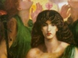

  
[Intangible Textual Heritage](../../../index)  [Classics](../../index) 
[Lucian](../index)  [Index](index)  [Previous](tsg05)  [Next](tsg07) 

------------------------------------------------------------------------

[Buy this Book at
Amazon.com](https://www.amazon.com/exec/obidos/ASIN/B002ECE91S/internetsacredte)

------------------------------------------------------------------------

  
*The Syrian Goddess*, by Lucian, tr. by Herbert A. Strong and John
Garstang, \[1913\], at Intangible Textual Heritage

------------------------------------------------------------------------

p. 38 p. 39

# LUCIAN'S "DE DEA SYRIA."

### ANALYSIS OF THE SUBJECT-MATTER.

|                          |                                                            |                                                  |
|--------------------------|------------------------------------------------------------|--------------------------------------------------|
|                          |                                                            | PAGE                  |
|                          |      INTRODUCTORY                                          |                                                  |
| § [1](tsg07.htm#an_1).   | The Sacred City                                            | [41](tsg07.htm#page_41)                          |
|   [2](tsg07.htm#an_2).   | Origins of Temples and Shrines                             | [42](tsg07.htm#page_42)                          |
|                          | THE OLDEST SHRINES AND CULTS OF SYRIA.                     |                                                  |
|   [3](tsg07.htm#an_3).   | Hercules of Tyre                                           | [43](tsg07.htm#page_43)                          |
|   [4](tsg07.htm#an_4).   | The Phœnician Astarte at Sidon. Legend of Europa           | [44](tsg07.htm#page_44)                          |
|   [6](tsg07.htm#an_6).   | Aphrodite of Byblos and the Legend of Adonis               | [45](tsg07.htm#page_45)                          |
|   [7](tsg07.htm#an_7).   | Legend of Osiris at Byblos                                 | [47](tsg07.htm#page_47)                          |
|   [8](tsg07.htm#an_8).   | The Adonis River; its red colour                           | [47](tsg07.htm#page_47)                          |
|   [9](tsg07.htm#an_9).   | Cult of Aphrodite in the Lebanon at Aphaca                 | [48](tsg07.htm#page_48)                          |
|   [10](tsg07.htm#an_10). | Hierapolis: The greatest Sanctuary. Its Pilgrims           | [49](tsg07.htm#page_49)                          |
|                          |      LEGENDS OF FOUNDATION.                                |                                                  |
|   [12](tsg07.htm#an_12). | Ascribed by some to Deukalion. Story of the Deluge         | [50](tsg07.htm#page_50)                          |
|   [13](tsg07.htm#an_13). | Story of the Chasm                                         | [51](tsg07.htm#page_51)                          |
|   [14](tsg07.htm#an_14). | Assigned by others to Semiramis. Derceto, the Fish-Goddess | [52](tsg07.htm#page_52)                          |
|   [15](tsg07.htm#an_15). | By others again to the Lydian Attis                        | [55](tsg07.htm#page_55)                          |
|   [16](tsg07.htm#an_16). | Lucian shares the View that it was founded by Dionysus     | [57](tsg07.htm#page_57)                          |
|   [17](tsg07.htm#an_17). | Re-built by Stratonice                                     | [58](tsg07.htm#page_58)                          |
|   [19](tsg07.htm#an_19). | Story of Stratonice and Combabus                           | [60](tsg07.htm#page_60)                          |
|                          |      DESCRIPTION OF THE TEMPLE AND SHRINES.                |                                                  |
|   [31](tsg07.htm#an_31). | The Inner Sanctuary. The Effigies                          | [69](tsg07.htm#page_69)                          |
|   [32](tsg07.htm#an_32). | Comprehensive Character of the Goddess                     | [71](tsg07.htm#page_71)                          |
|   [33](tsg07.htm#an_33). | Object between the God and Goddess                         | [73](tsg07.htm#page_73)                          |
|   [34](tsg07.htm#an_34). | The Sun God                                                | [74](tsg07.htm#page_74)                          |
|   [35](tsg07.htm#an_35). | A Bearded Apollo                                           | [74](tsg07.htm#page_74)                          |
|   [36](tsg07.htm#an_36). | Image of the God borne by the Priests in Divination        | [75](tsg07.htm#page_75)                          |
|                          | p. 40                            |                                                  |
| § [38](tsg07.htm#an_38). | Atlas and other Images                                     | [77](tsg07.htm#page_77)                          |
|   [41](tsg07.htm#an_41). | Sacred Animals                                             | [78](tsg07.htm#page_78)                          |
|   [42](tsg07.htm#an_42). | The Priests and Temple Attendants                          | [79](tsg07.htm#page_79)                          |
|                          |      RITES AND CEREMONIES.                                 |                                                  |
|   [44](tsg07.htm#an_44). | The Sacrifices                                             | [80](tsg07.htm#page_80)                          |
|   [45](tsg07.htm#an_45). | Sacred Lake and Fishes                                     | [81](tsg07.htm#page_81)                          |
|   [47](tsg07.htm#an_47). | Ceremony at the Lake                                       | [81](tsg07.htm#page_81)                          |
|   [48](tsg07.htm#an_48). | Ceremony at the Euphrates ("The Sea")                      | [82](tsg07.htm#page_82)                          |
|   [49](tsg07.htm#an_49). | Festival of the Pyre                                       | [83](tsg07.htm#page_83)                          |
|                          |      CUSTOMS AND INSTITUTIONS.                             |                                                  |
|   [50](tsg07.htm#an_50). | The Galli                                                  | [84](tsg07.htm#page_84)                          |
|   [51](tsg07.htm#an_51). | Their Initiation Ceremonies                                |  [84](tsg07.htm#page_84)                         |
|   [52](tsg07.htm#an_52). | Their Burial                                               | [85](tsg07.htm#page_85)                          |
|   [54](tsg07.htm#an_54). | Animals used in Sacrifice. Sanctity of the Dove            | [85](tsg07.htm#page_85), [86](tsg07.htm#page_86) |
|   [55](tsg07.htm#an_55). | Tonsure and other Customs of Pilgrims                      | [87](tsg07.htm#page_87)                          |
|   [57](tsg07.htm#an_57). | Method of Sacrifice. The Libation                          | [87](tsg07.htm#page_87), [88](tsg07.htm#page_88) |
|   [58](tsg07.htm#an_58). | Human Sacrifice                                            | [88](tsg07.htm#page_88)                          |
|   [59](tsg07.htm#an_59). | Tattoo                                                     | [89](tsg07.htm#page_89)                          |
|   [60](tsg07.htm#an_60). | Sacrifice of Hair                                          | [89](tsg07.htm#page_89)                          |

 

------------------------------------------------------------------------

[Next: Translation and Notes](tsg07)
