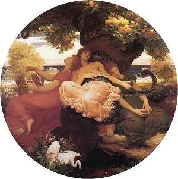

  
[Intangible Textual Heritage](../../index)  [Classics](../index.md) 

------------------------------------------------------------------------

[Buy this Book at
Amazon.com](https://www.amazon.com/exec/obidos/ASIN/B00085N62Q/internetsacredte.md)

------------------------------------------------------------------------

<table width="75%">
<colgroup>
<col style="width: 50%" />
<col style="width: 50%" />
</colgroup>
<tbody>
<tr class="odd">
<td width="50%" data-valign="TOP"></td>
<td width="50%" data-valign="CENTER"><h1 id="myths-of-greece-and-rome" data-align="CENTER">Myths of Greece and Rome</h1>
<h2 id="by-jane-harrison" data-align="CENTER">by Jane Harrison</h2>
<h4 id="section" data-align="CENTER">[1928]</h4></td>
</tr>
</tbody>
</table>

------------------------------------------------------------------------

[Contents](#contents)    [Start Reading](mgr00.md)

------------------------------------------------------------------------

This short review of the Greek pantheon (alas, there is little about
Rome), is part of a series of inexpensive adult education books
published during the 1920s. The author, Jane Harrison, was one of the
most prominent classicists of the era; so this is a bit like hiring a
French chef to cook up a big mess of *pommes frites*. Besides being a
respected academic, Harrison influenced many of the 20th century
[neo-Pagans](../../pag/index) and [Goddess](../../wmn/index.md) theorists.

Harrison is making a point here: Greek mythology was not the static
pageant that we learned in school, or read in [Bulfinch](../bulf/index.md).
It did not spring forth fully formed, but evolved out of a set of
ancient local deities. She proposes that the Greek goddesses emerged
from native Pelasgian tutelary spirits, and much of the male pantheon
was imposed by Indo-Europeans. Her analysis of the evolution of the
attributes of the god Poseidon as originating from a Minoan bull god is
speculative but intriguing. Whether Harrison was correct or not, her
reexamination of this subject which has been covered so many times is
refreshing.

------------------------------------------------------------------------

 [Title Page](mgr00.md)  
[Contents](mgr01.md)  
[Introductory](mgr02.md)  
[The Gods of Homer's Olympus](mgr03.md)  
[Zeus (Jove, Jupiter)](mgr04.md)  
[Hera](mgr05.md)  
[Athena (Minerva)](mgr06.md)  
[Aphrodite (Venus)](mgr07.md)  
[Artemis (Diana)](mgr08.md)  
[Apollo (Phœbus)](mgr09.md)  
[Ares (Mars)](mgr10.md)  
[Hermes (Mercury)](mgr11.md)  
[Poseidon (Neptune)](mgr12.md)  
[The Mother of the Gods](mgr13.md)  
[Demeter and Persephone (Ceres and Proserpine)](mgr14.md)  
[Dionysos](mgr15.md)  
[Eros](mgr16.md)  
[Bibliography](mgr17.md)  
