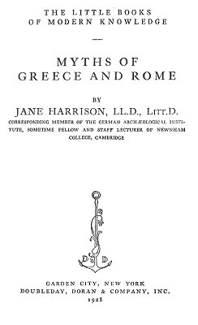
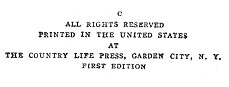

  
[Intangible Textual Heritage](../../index)  [Classics](../index) 
[Index](index)  [Next](mgr01) 

------------------------------------------------------------------------

[Buy this Book at
Amazon.com](https://www.amazon.com/exec/obidos/ASIN/B00085N62Q/internetsacredte)

------------------------------------------------------------------------

*Myths of Greece and Rome*, by Jane Harrison, \[1928\], at Intangible
Textual Heritage

------------------------------------------------------------------------

##### THE LITTLE BOOKS OF MODERN KNOWLEDGE

# MYTHS OF

# GREECE AND ROME

###### BY

## JANE HARRISON, LL.D., LITT.D.

###### CORRESPONDING MEMBER OF THE GERMAN ARCHÆOLOGICAL INSTITUTE, SOMETIME FELLOW AND STAFF LECTURER OF NEWNHAM COLLEGE, CAMBRIDGE

#### GARDEN CITY, NEW YORK

#### DOUBLEDAY, DORAN & COMPANY, INC.

#### 1928

Scanned at Intangible Textual Heritage, September 2006. Proofed and
formatted by John Bruno Hare. This text is in the public domain in the
United States because it was not renewed in a timely fashion at the US
Copyright Office, as required by law at the time. These files may be
used for any non-commercial purpose, provided this notice of attribution
is left intact in all copies.

   
Title Page

   
Verso

------------------------------------------------------------------------

[Next: Contents](mgr01)
