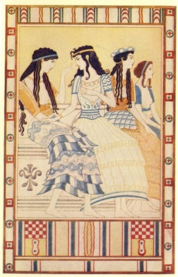

  
[Intangible Textual Heritage](../../index)  [Classics](../index.md) 

------------------------------------------------------------------------

[Buy this Book at
Amazon.com](https://www.amazon.com/exec/obidos/ASIN/B002BA5ITU/internetsacredte.md)

------------------------------------------------------------------------

<table width="75%">
<colgroup>
<col style="width: 50%" />
<col style="width: 50%" />
</colgroup>
<tbody>
<tr class="odd">
<td width="50%" data-valign="TOP"></td>
<td width="50%" data-valign="CENTER"><h1 id="myths-of-crete-pre-hellenic-europe" data-align="center">Myths of Crete &amp; Pre-Hellenic Europe</h1>
<h2 id="by-donald-a.-mackenzie" data-align="center">By Donald A. Mackenzie</h2>
<h4 id="section" data-align="center">[1917]</h4></td>
</tr>
</tbody>
</table>

------------------------------------------------------------------------

[Contents](#contents)    [Start Reading](moc00.md)    [Page
Index](pageidx)    [Text \[Zipped\]](moc.txt.gz.md)

------------------------------------------------------------------------

|                                                                                                                           |
|---------------------------------------------------------------------------------------------------------------------------|
|  |

When I first saw learned of the existence of this book, I was a little
suprised, since very little concrete information is available on this
topic, and even less was known in 1917. However, to paraphrase a recent
President of the United States, Myths of Crete depends on what your
definition of *of* is....

There is substantial mythology *about* Crete. The Minoan civilization,
which predated the better known classical Hellenic period by several
hundred years, disappeared catastrophically, battered by volcanic
eruptions and barbarian incursions. Successive generations, starting
with the classical Greeks, created a vast number of myths about the
vanished sea-empire. The Homeric epics, Daedalus and Icarus, King Minos
and the Minotaur, and even, as Mackenzie points out, Atlantis, were all
influenced by hearsay and speculation about the lost Cretan empire.

At the beginning of the 20th century archeologists finally started to
excavate the Minoan ruins. Based lagely on circumstantial evidence such
as the vivid wall art and the startling Goddess iconography,
popularizers like Mackenzie built an entire new set of myths about the
ancient Cretans. This mythology was eagerly adopted by neo-pagans,
starting with Robert Graves, who wrote a little-known science fiction
novel on the subject, Watch the Northwind Rise.

What do we actually know about Minoan mythology as of today? In a word,
nothing. The Minoans developed the first known European writing systems,
known as Linear A and B. Linear B was deciphered by Michael Ventris in
1952. Only commercial documents have been found, as befits a sea-trading
empire. The other Minoan script, Linear A, remains a mystery. Although
the phonetic values of some Linear A symbols have been tenatively
identified, they have yet to be translated. So we have no translated
Minoan religious documents to work with, although we can infer that
certain Linear A texts are magical or religious in nature because they
are inscribed on ritual objects.

We can assume from the prevelence of female images in ritual contexts
that the Minoans worshipped one or more Goddesses. We also know that
animals played an important role in their rituals, particularly snakes
and bulls. However, any attempt at this point to make definite
statements about their mythology or spiritual practices is inferential
at best.

One factual correction must be noted. The story of Schliemann's Atlantis
bequest, reported in [Chapter V, page 98](moc10.htm#page_98.md), turned out
to be a complete hoax. This yarn appeared in a sensationalist Hearst
newspaper in 1914, and as this book was written only a few years later,
we can probably forgive Mackenzie for reporting it as fact. The entire
article, *[How I found the Lost Atlantis](../../atl/hif/index.md)*, along
with our analysis of it, is also at Intangible Textual Heritage.

Nevertheless, Mackenzie, who also wrote [Myths and Legends of Ancient
Egypt](../../egy/eml/index.md), manages to stretch the subject matter out
into a full 300 page book. Informative, well researched and very
readable, Myths of Crete is a unique book about a very opaque period of
history.

*--J.B. Hare, June 2002.* 

------------------------------------------------------------------------

[Title Page](moc00.md)  
[Preface](moc01.md)  
[Contents](moc02.md)  
[Plates in Colour](moc03.md)  
[Plates in Monochrome](moc04.md)  
[Introduction](moc05.md)  
[Chapter I. Primitive Europeans of the Glacial and Inter-glacial
Periods](moc06.md)  
[Chapter II. Palæolithic Magic and Religion](moc07.md)  
[Chapter III. Ancient Peoples of the Goddess Cult](moc08.md)  
[Chapter IV. History in Myth and Legend--Schliemann's
Discoveries](moc09.md)  
[Chapter V. Crete as the Lost Atlantis](moc10.md)  
[Chapter VI. The Great Palace of Knossos](moc11.md)  
[Chapter VII. Races and Myths of Neolithic Crete](moc12.md)  
[Chapter VII. Pre-Hellenic Earth and Corn Mothers](moc13.md)  
[Chapter IX. Growth of Cretan Culture and Commerce](moc14.md)  
[Chapter X. Trading Relations with Troy](moc15.md)  
[Chapter XI. Life in the Little Towns](moc16.md)  
[Chapter XII. The Palace of Phæstos](moc17.md)  
[Chapter XIII. Cave Deities and their Symbols](moc18.md)  
[Chapter XIV. Decline of Crete and Rise of Greece](moc19.md)  
