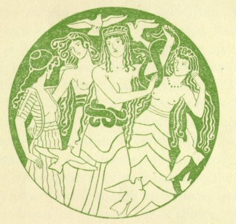
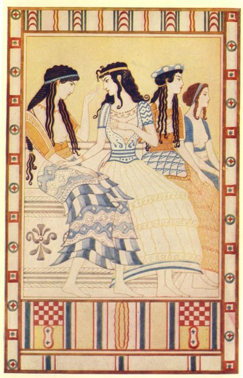

  
[Intangible Textual Heritage](../../index)  [Classics](../index) 
[Index](index)  [Next](moc01) 

------------------------------------------------------------------------

[Buy this Book at
Amazon.com](https://www.amazon.com/exec/obidos/ASIN/B002BA5ITU/internetsacredte)

------------------------------------------------------------------------

  
*Myths of Crete and Pre-Hellenic Europe*, by Donald A. Mackenzie,
\[1917\], at Intangible Textual Heritage

------------------------------------------------------------------------

# MYTHS OF CRETE & PRE-HELLENIC EUROPE

## By DONALD A. MACKENZIE

 

#### With Illustrations in Colour by John Duncan, A.R.S.A. and from Photographs

##### THE GRESHAM PUBLISHING COMPANY LIMITED

##### 66 CHANDOS STREET COVENT GARDEN LONDON

\[1917\]

Scanned, proofed and formatted at Intangible Textual Heritage, May-June
2002, by John Bruno Hare. This text is in the public domain because it
was published prior to 1923.

 

Ladies of the Minoan Court

From the painting by John Duncan, A.R.S.A.

------------------------------------------------------------------------

[Next: Preface](moc01)
