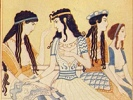

  
[Intangible Textual Heritage](../../index)  [Classics](../index) 
[Index](index)  [Previous](moc02)  [Next](moc04) 

------------------------------------------------------------------------

[Buy this Book at
Amazon.com](https://www.amazon.com/exec/obidos/ASIN/B002BA5ITU/internetsacredte)

------------------------------------------------------------------------

  
*Myths of Crete and Pre-Hellenic Europe*, by Donald A. Mackenzie,
\[1917\], at Intangible Textual Heritage

------------------------------------------------------------------------

p. xi

# PLATES IN COLOUR

<table data-border="0" width="779">
<colgroup>
<col style="width: 50%" />
<col style="width: 50%" />
</colgroup>
<tbody>
<tr class="odd">
<td data-valign="TOP" width="73%">
 
</td>
<td data-valign="TOP" width="27%">
Page
</td>
</tr>
<tr class="even">
<td data-valign="TOP" width="73%">
LADIES OF THE MINOAN COURT 
              <em>From the painting by John Duncan, A.R.S.A.</em>
</td>
<td data-valign="TOP" width="27%"><em></em>

Frontispiece
</td>
</tr>
<tr class="odd">
<td data-valign="TOP" width="73%">
THE SNAKE GODDESS OF CRETE 
              <em>From the painting by John Duncan, A.R.S.A.</em>
</td>
<td data-valign="TOP" width="27%"><em></em>

facing <a href="moc08.htm#page_58">58</a>
</td>
</tr>
<tr class="even">
<td data-valign="TOP" width="73%">
THE BULL-BAITERS 
              <em>From the painting by John Duncan, A.R.S.A.</em>
</td>
<td data-valign="TOP" width="27%">
   "   <a href="moc13.htm#page_186">186</a>
</td>
</tr>
<tr class="odd">
<td data-valign="TOP" width="73%">
SEA TRADERS FROM CRETE 
              <em>From the painting by John Duncan, A.R.S.A.</em>
</td>
<td data-valign="TOP" width="27%">
   "   <a href="moc15.htm#page_218">218</a>
</td>
</tr>
</tbody>
</table>

 

------------------------------------------------------------------------

[Next: Plates in Monochrome](moc04)
