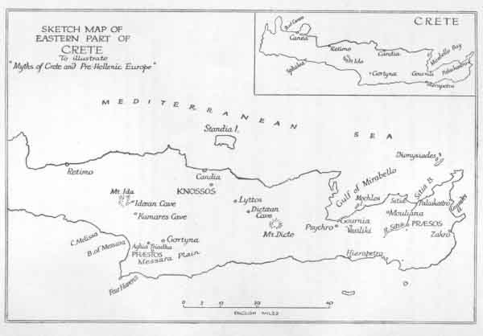

  
[Intangible Textual Heritage](../../index)  [Classics](../index.md) 
[Index](index)  [Previous](moc03)  [Next](moc05.md) 

------------------------------------------------------------------------

[Buy this Book at
Amazon.com](https://www.amazon.com/exec/obidos/ASIN/B002BA5ITU/internetsacredte.md)

------------------------------------------------------------------------

  
*Myths of Crete and Pre-Hellenic Europe*, by Donald A. Mackenzie,
\[1917\], at Intangible Textual Heritage

------------------------------------------------------------------------

p. xiii

# PLATES IN MONOCHROME

<table data-border="0" width="877">
<colgroup>
<col style="width: 50%" />
<col style="width: 50%" />
</colgroup>
<tbody>
<tr class="odd">
<td data-valign="TOP" width="85%">
 
</td>
<td data-valign="TOP" width="15%">
Page
</td>
</tr>
<tr class="even">
<td data-valign="TOP" width="85%">
INSCRIBED TABLETS FOUND IN CRETE
</td>
<td data-valign="TOP" width="15%">
facing <a href="moc05.htm#page_xxxii">xxxii</a>
</td>
</tr>
<tr class="odd">
<td data-valign="TOP" width="85%">
LIMESTONE SARCOPHAGUS FOUND AT AGHIA TRIADHA
</td>
<td data-valign="TOP" width="15%">
<a href="moc05.htm#page_xliv">xliv</a>
</td>
</tr>
<tr class="even">
<td data-valign="TOP" width="85%">
VOTIVE OFFERINGS FROM THE DICTEAN CAVE
</td>
<td data-valign="TOP" width="15%">
<a href="moc05.htm#page_xlviii">xlviii</a>
</td>
</tr>
<tr class="odd">
<td data-valign="TOP" width="85%">
EXAMPLES OF PALÆOLITHIC ART 
                  <em>From various sources</em>
</td>
<td data-valign="TOP" width="15%">
<a href="moc06.htm#page_16">16</a>
</td>
</tr>
<tr class="even">
<td data-valign="TOP" width="85%">
PALÆOLITHIC ART: PAINTINGS OF BISON AND DEER 
                  <em>From copies of the originals by L'Abbé Breuil</em>
</td>
<td data-valign="TOP" width="15%">
<a href="moc06.htm#page_20">20</a>
</td>
</tr>
<tr class="odd">
<td data-valign="TOP" width="85%">
GROUP OF FIGURINES, IN TERRA-COTTA, FROM PALAIKASTRO
</td>
<td data-valign="TOP" width="15%">
<a href="moc07.htm#page_30">30</a>
</td>
</tr>
<tr class="even">
<td data-valign="TOP" width="85%">
IVORY FIGURINE AND HEAD--"THE LEAPER"--FROM KNOSSOS 
                  <em>Reproduced from the "Annual of the British School at Athens"</em>
</td>
<td data-valign="TOP" width="15%">
<a href="moc07.htm#page_48">48</a>
</td>
</tr>
<tr class="odd">
<td data-valign="TOP" width="85%">
THE LION GATE, MYCENÆ From photograph by English Photo. Co.
</td>
<td data-valign="TOP" width="15%">
<a href="moc10.htm#page_98">98</a>
</td>
</tr>
<tr class="even">
<td data-valign="TOP" width="85%">
BULL'S HEAD, IN STEATITE, FROM KNOSSOS
</td>
<td data-valign="TOP" width="15%">
<a href="moc10.htm#page_109">109</a>
</td>
</tr>
<tr class="odd">
<td data-valign="TOP" width="85%">
p. xiv
</td>
<td data-valign="TOP" width="15%">
 
</td>
</tr>
<tr class="even">
<td data-valign="TOP" width="85%">
THE THRONE OF MINOS, KNOSSOS
</td>
<td data-valign="TOP" width="15%"><em></em>

facing <a href="moc10.htm#page_112">112</a>
</td>
</tr>
<tr class="odd">
<td data-valign="TOP" width="85%">
THE CUP-BEARER, KNOSSOS 
                  <em>From photograph lent by Sir Arthur Evans</em>
</td>
<td data-valign="TOP" width="15%">
<a href="moc11.htm#page_118">118</a>
</td>
</tr>
<tr class="even">
<td data-valign="TOP" width="85%">
PAINTED PLASTER RELIEF-BULL'S HEAD-KNOSSOS 
                  <em>From photograph lent by Sir Arthur Evans</em>
</td>
<td data-valign="TOP" width="15%">
<a href="moc11.htm#page_124">124</a>
</td>
</tr>
<tr class="odd">
<td data-valign="TOP" width="85%">
A GLIMPSE OF THE EXCAVATED REMAINS OF THE PALACE OF KNOSSOS
</td>
<td data-valign="TOP" width="15%">
<a href="moc11.htm#page_130">130</a>
</td>
</tr>
<tr class="even">
<td data-valign="TOP" width="85%">
A CRETAN SHRINE: RESTORED BY SIR ARTHUR EVANS
</td>
<td data-valign="TOP" width="15%">
<a href="moc11.htm#page_138">138</a>
</td>
</tr>
<tr class="odd">
<td data-valign="TOP" width="85%">
WILD GOAT AND YOUNG: FAIENCE RELIEF, FROM KNOSSOS 
                  <em>Reproduced from the "Annual by the British School at Athens"</em>
</td>
<td data-valign="TOP" width="15%">
<a href="moc12.htm#page_152">152</a>
</td>
</tr>
<tr class="even">
<td data-valign="TOP" width="85%">
THE PRINCIPAL ROOM OF THE MUSEUM AT CANDIA, CRETE
</td>
<td data-valign="TOP" width="15%">
<a href="moc12.htm#page_160">160</a>
</td>
</tr>
<tr class="odd">
<td data-valign="TOP" width="85%">
MAGAZINE OF JARS AND KASELLES, KNOSSOS
</td>
<td data-valign="TOP" width="15%">
<a href="moc14.htm#page_196">196</a>
</td>
</tr>
<tr class="even">
<td data-valign="TOP" width="85%">
EARLY MINOAN POTTERY, INCLUDING EXAMPLES WITH "BEAK" OR "TEAPOT SPOUTS"
</td>
<td data-valign="TOP" width="15%">
<a href="moc14.htm#page_208">208</a>
</td>
</tr>
<tr class="odd">
<td data-valign="TOP" width="85%">
THE "HARVESTER VASE" (STONE) FOUND AT AGHIA TRIADHA
</td>
<td data-valign="TOP" width="15%">
<a href="moc14.htm#page_212">212</a>
</td>
</tr>
<tr class="even">
<td data-valign="TOP" width="85%">
GENERAL VIEW OF "THE TREASURE OF PRIAM" 
                  <em>From the photograph by Schliemann</em>
</td>
<td data-valign="TOP" width="15%">
<a href="moc15.htm#page_234">234</a>
</td>
</tr>
<tr class="odd">
<td data-valign="TOP" width="85%">
GROUP OF JEWELS FROM THE ISLAND OF MOCHLOS
</td>
<td data-valign="TOP" width="15%">
<a href="moc15.htm#page_238">238</a>
</td>
</tr>
<tr class="even">
<td data-valign="TOP" width="85%">
DECORATIVE MOTIFS AND SYMBOLS 
                   <em>(Minoan and Celtic patterns compared)</em>
</td>
<td data-valign="TOP" width="15%">
<a href="moc15.htm#page_248">248</a>
</td>
</tr>
<tr class="odd">
<td data-valign="TOP" width="85%">
p. xv
</td>
<td data-valign="TOP" width="15%">
 
</td>
</tr>
<tr class="even">
<td data-valign="TOP" width="85%">
THE RUINS OF THE LITTLE TOWN OF GOURNIA
</td>
<td data-valign="TOP" width="15%"><em></em>

facing <a href="moc16.htm#page_258">258</a>
</td>
</tr>
<tr class="odd">
<td data-valign="TOP" width="85%">
THE ISLAND OF MOCHLOS, OFF THE NORTH COAST OF CRETE
</td>
<td data-valign="TOP" width="15%">
<a href="moc16.htm#page_266">266</a>
</td>
</tr>
<tr class="even">
<td data-valign="TOP" width="85%">
DECORATED POTTERY FROM PALAIKASTRO
</td>
<td data-valign="TOP" width="15%">
<a href="moc16.htm#page_270">270</a>
</td>
</tr>
<tr class="odd">
<td data-valign="TOP" width="85%">
THE GRAND STAIRCASE, PALACE OF PHÆSTOS
</td>
<td data-valign="TOP" width="15%">
<a href="moc17.htm#page_284">284</a>
</td>
</tr>
<tr class="even">
<td data-valign="TOP" width="85%">
THREE VASES, SCULPTURED IN STONE, FOUND AT AGHIA TRIADHA
</td>
<td data-valign="TOP" width="15%">
<a href="moc17.htm#page_288">288</a>
</td>
</tr>
<tr class="odd">
<td data-valign="TOP" width="85%">
WEAPONS AND IMPLEMENTS, IN BRONZE, FROM THE DICTEAN CAVE
</td>
<td data-valign="TOP" width="15%">
<a href="moc18.htm#page_296">296</a>
</td>
</tr>
<tr class="even">
<td data-valign="TOP" width="85%">
BRONZE IMPLEMENTS FROM GOURNIA
</td>
<td data-valign="TOP" width="15%">
<a href="moc18.htm#page_300">300</a>
</td>
</tr>
<tr class="odd">
<td data-valign="TOP" width="85%">
PILLAR AT KNOSSOS, INCISED WITH DOUBLE-AXE SYMBOLS
</td>
<td data-valign="TOP" width="15%">
<a href="moc18.htm#page_310">310</a>
</td>
</tr>
<tr class="even">
<td data-valign="TOP" width="85%">
MINOAN POTTERY FROM ZAKRO
</td>
<td data-valign="TOP" width="15%">
<a href="moc19.htm#page_316">316</a>
</td>
</tr>
<tr class="odd">
<td data-valign="TOP" width="85%">
RUINS OF THE "ROYAL VILLA", AGHIA TRIADHA
</td>
<td data-valign="TOP" width="15%">
<a href="moc19.htm#page_328">328</a>
</td>
</tr>
</tbody>
</table>

 

 

\*\*\* The Monochrome Plates, unless where
otherwise stated, are reproduced from photographs by G. Maraghiannis,
Candia, Crete.

 

p. xvi

 

Sketch Map of Eastern Part of Crete

 

------------------------------------------------------------------------

[Next: Introduction](moc05.md)
