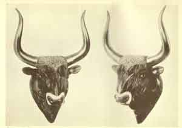
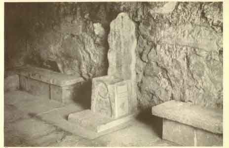

  
[Intangible Textual Heritage](../../index)  [Classics](../index.md) 
[Index](index)  [Previous](moc09)  [Next](moc11.md) 

------------------------------------------------------------------------

[Buy this Book at
Amazon.com](https://www.amazon.com/exec/obidos/ASIN/B002BA5ITU/internetsacredte.md)

------------------------------------------------------------------------

  
*Myths of Crete and Pre-Hellenic Europe*, by Donald A. Mackenzie,
\[1917\], at Intangible Textual Heritage

------------------------------------------------------------------------

p. 97

# CHAPTER V

### Crete as the Lost Atlantis

Quest for Home of Pre-Hellenic Culture--The Legendary Clues--Myth of the
Lost Atlantis--Schliemann's Remarkable Bequest--His Grandson's
Researches--Supposed Connection of Egyptian with Central American
Civilization--Views of Geologists regarding a Submerged
Continent--Geikie versus Hull--Evidence of New and Old World Fauna--The
Race Problem--Plato's Atlantis Narrative--Lost Island identified with
Crete--Sea Trade, Palaces, and Bull Fights--Greek and Libyan
Traditions--How the Lost Atlantis Myth Originated--Legend of Zeus and
Europe--Water-bull and Water-horse Stories --The Legendary Minos and
Osiris--The Minotaur--Story of Dædalus and Babylonian and Indian
Parallels--Athens and Crete--The Theseus Legend--Value of Traditions.

ALTHOUGH Schliemann's theories regarding Priam's treasure and
Agamemnon's tomb aroused a storm of criticism, it had to be recognized
that he discovered traces of a brilliant pre-Hellenic civilization which
had flourished in Greece and Asia Minor for many long centuries. The
problem as to where it had originated, however, remained obscure, and
towards its solution not a few skilled archæologists began to direct
their energies. Indeed, the quest soon became hot and fast. The
cumulative evidence of classical writers seemed to point to Crete.
Homer, Hesiod, Strabo, Thucydides, and Herodotus had perpetuated
traditions regarding King Minos, the great lawgiver, who had cleared the
Ægean of pirates. He was reputed to have been a son of Zeus, and that
deity, according to one legend, had been born in a Cretan cave.

p. 98

\[paragraph continues\] Schliemann gave
serious consideration to these clues, and had endeavoured, as has been
stated, to make arrangements to excavate at Knossos. He also conducted
researches with Virchow at Sais, in northern Egypt, but no discovery was
made to indicate that pre-Hellenic civilization had emanated from the
land of the Pharaohs in its fully-developed form. The larger problem
appears to have engaged his mind: Where did Egyptian civilization
originate?

Ere he died Schliemann formulated a bold theory to account not only for
early northern European and North African civilization but also that of
Central America as well. It was based on Plato's myth of the Lost
Atlantis. He was convinced that this great island had had real
existence, and that colonies of its inhabitants settled in Mexico,
Egypt, and Greece at a remote period, introducing into these countries a
full-blown culture.

Here, again, as will be shown, Schliemann had intuitive perception of a
basis of fact embedded in the debris of tradition. Had he lived long
enough he would no doubt have adjusted his view in the light of those
discoveries which have been made during recent years, and accepted Crete
as the mysterious island referred to by Plato.

NOTE: Schliemann's Atlantis bequest was a hoax, created for a Hearst
newspaper. For more information, refer to [How I Found the Lost
Atlantis, by Dr. Paul Schliemann](../../atl/hif/index.md).--*John Bruno
Hare*

The Atlantis theory appealed as strongly to the great pioneer's
imagination during the last months of his life as did his Troy theory in
the days of his boyhood. But the frailties of old age oppressed him, and
he realized that he could never put it to proof. He desired, however,
that the work should be undertaken by one of his kinsmen, and committed
his secret to writing, enclosing his manuscript in a sealed envelope
inscribed as follows:--

This can be opened only by a member of my family who solemnly vows to
devote his life to the researches outlined therein.

p. 99

Not long before he expired he asked for a pencil and piece of paper and
wrote:

Confidential addition to the sealed envelope. Break the owl-headed vase.
Pay attention to the contents. It concerns Atlantis. Investigate the
east of the ruins of the temple of Sais and the cemetery in Chacuna
valley. Important. It proves the system. Night approaches--Lebewohl.

This last document was enclosed, and afterwards deposited with the other
in one of the banks of France by the party to whom both were entrusted.
A large sum of money was set aside to defray the expenses of the
mysterious undertaking.

In 1906 Dr. Paul Schliemann, a grandson of the great discoverer of
pre-Hellenic civilization, vowed to devote his life to the researches
referred to in the sealed envelopes, and made himself acquainted with
their contents. A few years later he contributed to certain newspapers
in New York and London a signed statement, [1](#fn_120.md) in which he made a revelation of his
grandfather's last bequest.

The first paper said:

Whoever opens this must solemnly swear to carry out the work I have left
unfinished. I have come to the conclusion that Atlantis was not only a
great territory between America and the West Coast of Africa and Europe,
but the cradle of all our civilization as well. There has been much
dispute among scientists on this matter. According to one group the
tradition of Atlantis is purely fictional, founded upon fragmentary
accounts of a deluge some thousands of years before the Christian era.
Others declare the tradition wholly historical, but not capable of
absolute proof.

Dr. Schliemann's papers are of lengthy character. Briefly stated, they
set forth that he found at Troy a

p. 100

bronze vase containing fragments of pottery, images, and coins of "a
peculiar metal", and "objects made of fossilized bone". He added: "Some
of these objects and the bronze vase were engraved with a sentence in
Phœnician hieroglyphics. The sentence read, 'From the King Chronos of
Atlantis'."

Ten years later, when in the Louvre, Paris, he examined a collection of
objects taken from Tiahuanaco, in Central America, and "discovered
pieces of pottery of exactly the same shape and material, and objects of
fossilized bone which reproduced line for line those I had found",
Schliemann wrote, "in the bronze vase of the 'Treasure of Priam'". Among
these objects was an owl-headed vase. He also professed to have read, or
to have had read to him, extracts from Egyptian papyri preserved in the
Museum at St. Petersburg which made reference to the "Land of Atlantis",
whence had come the ancestors of the Egyptians "3350 years ago" and the
"sages of Atlantis" who flourished during a period of "13,900 years".
Another inscription, discovered near the Lion's Gate at Mycenæ, set
forth that Thoth was a son of a "priest of Atlantis" who "landed after
many wanderings in Egypt. He built the first temple at Sais, and there
taught the wisdom of his native land."

Dr. Paul Schliemann has broken open the "owl-headed vase" at Paris,
referred to in his grandfather's last memorandum, and states that he
found in it a coin or medal of "silver-like metal" inscribed in
Phœnician as follows: "Issued in the Temple of Transparent Walls". He
claims, also, to have made discoveries in Egypt, Mexico, and elsewhere
which justify his grandfather's theory. "I have reasons", he has
written, "for saying that the strange medals were used as money in
Atlantis forty thousand years ago."

p. 101

The first question which arises in connection with the late Dr.
Schliemann's theory is: Did the "Lost Atlantis" ever have existence in
fact? On this point Professor James Geikie has written as follows:--

Geologists have often speculated as to a former connection between the
Old World and the New. There can be little doubt, indeed, that such a
land connection did obtain between Asia and Europe at a geologically
recent date, and it is quite possible that there may have been a land
bridge also between Europe and North America by way of the Faröe
Islands. [1](#fn_121.md) Others have suggested the
former existence of a land bridge further south. They suppose that the
North Atlantic may have been dry land--traversed from west to east by a
Mediterranean Sea--of which the existing Mediterranean and the Gulf of
Mexico are the remaining portions. But the facts which have suggested
that speculation have been otherwise accounted for. All that is definite
and certain is that there has been considerable loss of land so far as
Europe is concerned. Our continent formerly extended further westward.
But I know of no geological evidence that puts it beyond doubt that the
Atlantic basin is the site of a drowned continent. On the contrary, such
evidence as we have leads rather to the belief that the Atlantic basin,
like that of the Pacific, is of primeval origin." [2](#fn_122.md)

That veteran geologist, Professor Edward Hull, takes a different view of
the problem, and has written:

"The tradition of Atlantis 'beyond the Pillars of Hercules' can scarcely
be supposed to have originated in the mind of man without a basis of
reality. In the centre of the North Atlantic Ocean rise from the surface
the Azores volcanic islands, the summits of a group of islands rising
from a platform corresponding to the continental platform of Europe on
one hand and of America on the other. The rise of the level of the ocean
bed, amounting from 7000 to 10,000 feet, as shown by the soundings on
the Admiralty

p. 102

charts, would have reduced the depth of the ocean by so much and have
extended the land areas to an extent which would have brought Atlantis
within navigable distance of both continents for early inhabitants using
canoes. We know from our investigations [1](#fn_123.md) that this elevation occurred during the
post-tertiary period, [2](#fn_124.md) and at a
presumed date 9000 or 10,000 B.C. If we add 1000 years of our era, the
question arises: Would not this lapse of time have been sufficient to
account for the subsidence which the region in question underwent in
order to restore the land and sea to their present limits? Of course,
this would depend on the rate of subsidence. But, at any rate, the
result, as regards Atlantis, would have been the submergence under the
ocean, with the exception of its present islands. The glacial period,
when much of Europe and the British Isles was covered by snow and ice,
can scarcely have been farther back than 10,000 years, and this is
presumably the age of Atlantis."

Dr. Scharff, Director of the Natural History Museum, Dublin, is also a
believer in the "Lost Atlantis". He has been led to the conclusion, in
his studies of the migrations of animals between the continents of
America and Europe, [3](#fn_125.md) that a land
bridge once crossed the Atlantic Ocean between Southern Europe and the
West Indies. "It probably became disconnected". he says, "in Miocene
times. Since then this land once more became united with our continent,
and may not have been finally severed until the Pleistocene period.
United with the West Indies and Central America in early Tertiary times,
it probably subsided partly during the Oligocene period [4](#fn_126.md) and later, leaving only a few isolated
peaks as islands in the midst of the vast ocean which has since replaced
it."

It will be seen that scientific opinion is divided regarding

p. 103

the existence of a mid-Atlantic continent. If, however, the views of
Hull and Scharff are accepted, they cannot be held to prove that Plato's
Atlantis was situated beyond the "Pillars of Hercules". Schliemann's
hypothesis, as expounded by his grandson, renders it necessary to assume
that this lost country, "which used the ancient medals as an equivalent
of labour, had a more advanced currency system than we have at present".
If such was the case, it appears strange that no traces of the high
civilization have survived on those islands which are referred to as the
"few isolated peaks" of the submerged continent.

The particular race which is supposed to have come from Atlantis has yet
to be identified. Was it represented in Europe by Chellean man? The
Chellean "hand axe" has been traced from France to South Africa, through
Asia, across the "land bridge" to North America, and southward through
South America. It never reached Australia or New Zealand. But Chellean
man was a savage, not much more advanced, indeed, than were the
Tasmanians. Cro-Magnon man, on the other hand, had achieved a high
degree of culture, but no traces either of his physical type or of his
cave drawings have been discovered in the New World. Besides, his
culture developed from the Chellean through the Acheulian and Mousterian
stages, as has been fully demonstrated. He cannot therefore be claimed
for Atlantis. Nor can Mediterranean man, who had spread through Egypt
and along the North African coast, and had settled in Southern and
Western Europe, as well as in Mesopotamia, before the age of metal.
There are no aboriginal representatives of his type in America.

Have the settlers from Atlantis vanished entirely in the New and Old
Worlds? Did they perish like the mythical elder races of Mexico, India,
Babylonia, Greece, and Ireland?

p. 104

Another insurmountable difficulty is the fact that copper was not
utilized in Egypt and Central America at the same early period. The
Egyptians and Sumerians worked that metal at about 3000 B.C. In Crete
the Bronze Age was inaugurated between 3000 B.C. and 2800 B.C., and in
Great Britain before 1500 B.C. The American peoples did not begin to
utilize metal until a considerable period after bronze had been
supplanted by iron in Europe. "Most students of American archaeology are
agreed that the Mexican and Peruvian bronzes are not of any great
antiquity, and that the Bronze Age must have been over in China long
before it began in the New World." [1](#fn_127.md)

In Dr. Heinrich Schliemann's day the antiquity of Central American
civilization was greatly exaggerated. We now know that the Maya did not
develop their culture on the Mexican plateau much before the eighth
century of the Christian era, and that the Aztecs arrived about 1200
A.D.; the later Mexican confederacy had flourished for only a century
before it was shattered by Cortez. [2](#fn_128.md)
Most of the resemblances which have been noted between the Egyptian and
Central American civilizations are of a superficial character.

Plato's legend regarding the "Lost Atlantis" was of Egyptian origin. It
is related in the Timeus and Critias. A certain Solon visited Sais,
where he "was very honourably received" by the priests of the goddess
Neith. One of the eldest of these spoke with contempt regarding the
"puerile fables" of the Greeks, and said: "You are unacquainted with
that most noble and excellent race of men who once inhabited your
country, from whom your whole

p. 105

present state are descended, though only a small remnant of this
admirable people is now remaining". He went on to say that, according to
Egyptian annals, Athens once overcame "a prodigious force", when "a
mighty warlike power, rushing from the Atlantic sea, spread itself with
hostile fury over all Europe and Asia". The narrative continues:

"That sea (the Atlantic) was then navigable, and had an island fronting
that mouth which you in your tongue call the Pillars of Hercules; and
this island was larger than Libya and Asia put together; and there was a
passage hence for travellers of that day to the rest of the islands, as
well as from those islands to the whole opposite continent that
surrounds that the real sea. . . . In this Atlantic island, then, was
formed a powerful league of Kings, who subdued the entire island,
together with many others, and parts also of the Continent; besides
which they subjected to their rule the inland parts of Libya, as far as
Egypt, and Europe also, as far as Tyrrhenia. The whole of this force,
then, being collected in a powerful league, undertook at one blow to
enslave both your country and ours, and all the land besides that lies
within the mouth. This was the period, Solon, when the power of your
state (Athens) was universally celebrated for its virtue and strength;
for surpassing all others in magnanimity and military skill, sometimes
taking the lead of the Greek nation, at others left to itself by the
defection of the rest, and brought into the most extreme danger, it
still prevailed, raised the trophy over its assailants, kept from
slavery those not as yet enslaved, insured likewise the most ample
liberty for all of us without exception who dwell within the Pillars of
Hercules.

Subsequently, however, through violent earthquakes and deluges which
brought desolation in a single day and night, the whole of your warlike
race was at once merged under the earth; and the Atlantic island itself
was plunged beneath the sea and entirely disappeared; whence even now
that sea is neither navigable nor to be traced out, being blocked up by
the great depth of mud which the subsiding island produced." [1](#fn_129.md)

p. 106

An anonymous contributor to the *Times* [1](#fn_130.md) was the first to draw attention to the
remarkable resemblance between Plato's Atlantis and the island of Crete.
His theory that the Egyptian priest's legend was based on traditions
regarding Cretan sea-power and the raids of piratical bands on the
Egyptian coast during the Nineteenth and Twentieth Dynasties has found
general favour among prominent archæologists.

Crete, one of the largest islands in the Mediterranean, is about 160
miles long, and varies in breadth from about 35 miles in the middle to
10 between Retimo and Sphakia, and only 6 miles in one place between the
Gulf of Mirabello and the coast of Hierapetra. Deep gulfs indent its
northern coast, and its southern shore is rugged and rock-bound. A ridge
of hills extends from east to west, culminating about the centre in
well-wooded Mount Psiloriti, the ancient Mount Ida, which rises to a
height of about 8159 feet. Strabo called the hills in the western part
of the island Leuca Oré, or "the white mountains". In the south-west the
mountains almost fringe the shore. The ancient capital was situated at
Knossos, near Candia, on the north. In ancient days the island was four
days' sail from Egypt and two from Cyrenaica. It may well be said of
Crete, as of Atlantis, that "there was a passage hence for travellers of
that day to the rest of the islands, as well as from those islands to
the whole opposite continent".

In the Critias [2](#fn_131.md) Plato says of
Atlantis:

"The whole region was said to be exceedingly lofty and precipitous
towards the sea, and the plain about the city (? Knossos), which
encircles it, is itself surrounded by mountains sloping down to the sea,
being level and smooth, all much extended, three thousand stadia in one
direction, and the central part from the

p. 107

sea above two thousand. And this district of the whole island was turned
towards the south, and in an opposite direction from the north. The
mountains around it, too, were at that time celebrated, as exceeding in
number, size, and beauty all those of the present time, having in them
many hamlets enriched with villages."

In Atlantis also, as in Crete, the prosperity of the island kingdom
depended on its sea trade. They (the island kings) were "rulers", Solon
was informed, "in the sea of islands (? the Ægean), and, as we before
said, yet further extended their empire to all the country as far as
Egypt and Tyrrhenia".

During recent years archæologists have discovered that a great
civilization--the earliest in Europe--flourished in Crete for many long
centuries before the rise of Mycenæ and Tiryns. It was already well
developed ere the pyramids near Cairo were erected, and before the dawn
of the Twelfth Dynasty a palace had been built at Knossos. Some time
during the Eighteenth Dynasty, and ere the famous Akhenaton was born,
Crete was overrun by raiders, who displaced the native rulers, as the
Egyptian Pharaohs had been displaced at an earlier period by the Hyksos.
This calamity was sudden and overwhelming, and must have made a deep
impression on those states which had commercial relations with the
famous island kingdom. Its sea traders bad intimate relations with Egypt
for many centuries. Evidence has been forthcoming that they visited the
Delta coast as early as at least the Old Kingdom period. During the time
of Queen Hatshepsut and Thothmes III they were depicted on the walls of
Theban tombs, and were known as the Kheftiu and "Princes of the Isles in
the midst of the Great Green Sea". But no reference was made to them
after the middle of the Eighteenth Dynasty. The

p. 108

Cretan sea traders vanished entirely, and their place was taken
ultimately by the Phœnicians.

In the Atlantis legend there are several pointed references to a
civilization closely resembling that of Crete. We read of busy harbours
and far-travelled merchants, of a king's palace, like the palace of
Knossos, which was built of stone, and of private and public baths; "the
king's baths", says Plato, "and those of private persons were apart",
and there were "separate baths for women". Crete was famous for its
sacrificial bull fights; so was Atlantis; and it is suggestive to find
that on both islands the method obtained of capturing the animals
without the aid of weapons. Plato says of Atlantis in this connection:

"As there were bulls grazing at liberty in the temple of Poseidon, ten
men only of the whole number, after invoking the god to receive their
sacrifice propitiously, went out to hunt swordless, with staves and
chains, and whichever of the bulls they took, they brought it to the
column and slaughtered it." [1](#fn_132.md)

Plato's legend used to be regarded by European scholars as "wholly
mythical". It would now appear, however, that it had a genuine
historical basis.

Solon visited Egypt over a thousand years after Crete had been divested
of its ancient supremacy as a maritime power, and the aged priest of
Sais evidently repeated to him traditions regarding it. Whether he was
informed, or concluded from the Egyptian references, that Atlantis was
situated beyond "the Pillars of Hercules" is quite uncertain. It was
"the island farthest west", and this "would well describe Crete", Hawes
suggests, "to a home-staying Egyptian of the Theban Empire".

When Crete was suddenly overwhelmed by invaders

 

 

BULL'S HEAD, IN STEATITE, FROM KNOSSOS: FULL FACE AND PROFILE VIEWS

 

p. 109

at the height of its power and prosperity, and its sailors and traders
vanished from the Mediterranean, many wild rumours must have obtained
currency. It need not surprise us to find that some believed the island
itself "was plunged beneath the sea", and that in time the age during
which flourished its kings and seafarers and bull-baiters, "won its way
to the mythical", as Thucydides says in another connection.

Plato had no idea that Crete was so "old in story and that its ancient
inhabitants were the pioneers of civilization in Europe, although he may
have believed, like Herodotus, that the island was at one time "wholly
peopled with barbarians" [1](#fn_133.md)
(non-Hellenic folk). He had even less knowledge of the Atlantic Ocean,
otherwise he could not have believed that navigation beyond the Pillars
of Hercules was hampered by the mud-banks which marked the site of the
"lost Atlantis".

It is possible that the Egyptian legend was influenced by the ancient
folk-tale, "The Shipwrecked Sailor". This hero sojourned on an island
which afterwards vanished in the midst of the sea. [2](#fn_134.md)Or, perhaps, some Egyptian navigator, who
set out on a voyage to Crete, at a period subsequent to the fall of
Knossos, went off his course and got into trouble with sand-banks. On
his return home he may have told as marvellous a story as the
"shipwrecked sailor", believing that the island he sought had really
been submerged.

The priest of Sais appears also to have mingled with his legend of
Atlantis information derived from traditions and records regarding the
settlement of Europeans on the North African coast, and the sea-raids
during the reigns of Meneptah and Rameses III, [3](#fn_135.md) when, as one Egyptian

p. 110

record sets forth, "the isles were restless, disturbed among
themselves". Certain tribes from these isles, who had established
themselves in Libya, actually provided mercenaries for the army and
fleet of Rameses III to drive back the "late comers". [1](#fn_136.md) As Plato says of the conquerors from
Atlantis, they had "subjected to their rule the inland parts of Libya,
as far as Egypt".

It will thus be seen that Schliemann was not far astray when he
identified Plato's Atlantis as the cradle of Ægean civilization. Had he
been able, as he desired, to excavate in Crete, he might have changed
his mind regarding the real significance of the Græco-Egyptian myth.

The poets and historians of ancient Greece had preserved several
suggestive legends regarding Crete. They had much to say regarding its
King Minos, who flourished before the Trojan war. According to
Strabo [2](#fn_137.md) he resided at Knossos, and
made just laws which were afterwards borrowed by the Greeks.
Thucydides [3](#fn_138.md) states that he was the
first to have a navy, and that he cleared the Ægean of pirates. The poet
of the Odyssey says:

There is a land amid the wine-dark sea  
Called Crete; rich, fruitful, girded by the waves;  
She boasts unnumbered men and ninety towns . . .  
One city in extent the rest exceeds,  
Knossos; the city in which Minos reigned--  
The King who 'gan to reign in his ninth year  
And converse held with Zeus. [4](#fn_139.md)

Minos was fabled to be the son of Zeus by a human mother, the beautiful
Europé, daughter of Agenor, King of Phœnicia. The legend sets forth that
one day Europé was bathing with her maids, when Zeus beheld and fell in
love with her. He changed himself into a

p. 111

bull, whose comely form and tameness attracted the attention of the
princess. She advanced towards the animal, and was so fascinated by it
that she mounted on its back. When she did so, the bull rushed into the
water and swam to Crete. There she became the mother of Zeus's three
sons, Minos, Rhadamanthus, and Sarpedon.

This story resembles the Scottish kelpie or "water-horse" stories. When
a human being mounts on the back of one of these supernatural animals,
he or she finds it impossible to dismount, and is carried away to a dark
loch. Sometimes the "water-horse" makes love in human form.

Herodotus states that "certain Greeks, who would probably be Cretans,
made a landing at Tyre, on the Phœnician coast, and bore off the King's
daughter, Europé" [1](#fn_140.md) He suggested
that Europe may have been so called after the Tyrian princess, and had
been nameless before her time. [2](#fn_141.md)

Minos was supposed to have received his code of laws from his father
Zeus, whom he visited in his cave on Mount Ida while the people were
assembled round its base. [3](#fn_142.md) When he
died he became, like the Egyptian Osiris, a judge in Hades. Ulysses
related in the Odyssey, in the account of his visit to the land of
shades:

There saw I Minos, offspring famed of Jove (Zeus);  
His golden sceptre in his hand, he sat  
Judge of the dead; they pleading, each in turn,  
His cause, some stood, some sat, filling the house,  
Whose spacious folding gates were never closed. [4](#fn_143.md)

It was related of Minos--the later king of that name--that his
succession to the Cretan throne was disputed.

p. 112

\[paragraph continues\] To emphasize his
divine right, he stated that the gods would grant him anything he
desired. Accordingly he invoked Poseidon, god of the deep, to send him a
bull from the ocean, which he promised to offer up in sacrifice. When,
however, the animal appeared he was so greatly fascinated by its beauty
that he substituted another. Poseidon was wroth, and caused Minos to be
punished by causing his wife, Pasiphaë, to give birth to a monster, half
bull and half man, called the Minotaur.

It was necessary to build a special residence for the Minotaur, to whom
sacrificial offerings had to be made. Minos accordingly employed
Dædalus, [1](#fn_144.md) a skilled Athenian
artificer, on his return from Egypt, to construct a labyrinth at
Knossos, similar to the one situated near Lake Mœris. When the work was
accomplished Minos had Dædalus confined in the Labyrinth, but he was
secretly liberated by Queen Pasiphaë. Then he procured wings for himself
and his son Icarus. Together they flew over the Ægean, but Icarus soared
so near the sun that the wax with which his wings were fastened to his
body melted, and he fell into the Icarian Sea, to which his name was
given. Dædalus alighted without mishap at Cumæ in Italy, where he
erected a temple to Apollo, to whom he dedicated his wings. [2](#fn_145.md)

Icarus thus met a similar fate to Etana, of Babylonian fame, Nimrod in
the Koran legend, and the son of the eagle giant Garuda, in the Indian
epic *Ramayana*. Etana and Nimrod ascended on the backs of eagles, whose
pinions were burnt by the sun. The Indian eagle was similarly punished
for its presumption. [3](#fn_146.md)

Dædalus afterwards took refuge in Sicani (Sicily), where Cocalus was
king. Minos fitted out a great

 

 

THE THRONE OF MINOS, KNOSSOS (See description, page [p. 112](#page_112).md)

 

p. 113

expedition and visited Sicily in pursuit of Dædalus, whom he desired to
put to death. There he was treacherously murdered by Cocalus or his
daughters. A temple erected to his memory was dedicated to Aphrodite.

Minos had previously decreed that every year Athens should send to Crete
seven youths and seven maidens to be devoured by the Minotaur.

This punishment was imposed upon the Athenians because they had
jealously murdered Androgeos, son of Minos and Pasiphaë, who had
surpassed all his opponents at the Panathenaic games.

For two years this tribute of human lives was paid by the subject city.
But at length the hero, Theseus,

           vowed his life to sell  
For his dear Athens, which he loved so well,  
So that funereal ship might sail no more  
Freighted with living death to Creta's shore. [1](#fn_147.md)

In the third year he sailed with the sons and daughters of the noblest
families in Athens. On his arrival in Crete he was informed that he must
enter the Labyrinth naked and alone, and there be devoured by the
Minotaur. [2](#fn_148.md) He invoked the goddess
Aphrodite, who caused a beautiful Cretan maiden to fall in love with
him. This was Ariadne, daughter of Minos. She secretly gave Theseus a
magic sword to slay the Minotaur, and a clue: of thread, with the aid of
which the hero could be enabled to extricate himself from the Labyrinth.
As he passed along the winding and intricate passages he unwound the
clue. He slew the Minotaur, and thus delivered Athens from its tribute.
On his return voyage he was accompanied by Ariadne, whom, however, he
deserted at Naxos.

p. 114

It is believed that this legend is reminiscent of a period when Athens
was subject to the rule of Crete, and it had to provide male and female
toreadors for the bullring at Knossos. According to the exponents of the
solar myth theories, Minos was the sun and Pasiphaë the moon, or the
Minotaur was the sun, and the Labyrinth the sky by night, its windings
being the course followed by the moon.

Hesiod, Homer, Thucydides, and Herodotus make reference to only one
Minos, the son of Zeus, the great lawgiver. But Diodorus [1](#fn_149.md) and Plutarch [2](#fn_150.md) tell of a second Minos, who was the
oppressor of the Athenians and the king who obtained the bull from
Poseidon. Certain archæologists are of opinion that Minos was not a
personal name, but a royal title which was used as is Pharaoh n the
Bible, and that each Cretan ruler may have been a Minos, as each
Egyptian king was an Osiris. Others hold that Minos became as popular a
throne name as Rameses in Egypt and Caesar at Rome.

It was chiefly because persistent Greek legends gave recognition to
Crete as the source of pre-Hellenic culture and religion that
archæologists desired to excavate on that island. In the next chapter it
will be found that when opportunity came to test tradition in this
regard the results obtained exceeded the most sanguine expectations.

------------------------------------------------------------------------

### Footnotes

[99:1](moc10.htm#fr_120.md) It appeared in the
London Budget (which has since ceased to exist) on 17th November, 1912.

[101:1](moc10.htm#fr_121.md) See Chapter I.

[101:2](moc10.htm#fr_122.md) *London Budget*, 8th
December, 1912. See also Geikie's *The Deeps of the Pacific Ocean and
their Origin*, *The Great Sea Age*, *Prehistoric Europe*, and *The
Antiquity of Man in Europe*.

[102:1](moc10.htm#fr_123.md) Professor Hull and
Professor J. W. Spencer in *Sub-Oceanic Physiography of the North
Atlantic Ocean* (London, 1912), and Professor Hull in *London Budget*,
1st December, 1912.

[102:2](moc10.htm#fr_124.md) *During the
Pleistocene Age*.

[102:3](moc10.htm#fr_125.md) *Distribution and
Origin of Life in America*.

[102:4](moc10.htm#fr_126.md) A vast
interval--perhaps millions of years--separated the Oligocene period from
even the earliest culture stages of Pleistocene times.

[104:1](moc10.htm#fr_127.md) *British Museum Guide
to the Antiquities of the Bronze Age*, pp. 110, 111.

[104:2](moc10.htm#fr_128.md) *Through Southern
Mexico*, H. Gadow (1908), and *Bureau of American Ethnology*, E.
Forstemann, Bull. 28 (1904).

[105:1](moc10.htm#fr_129.md) The *Timæus*, Section
VI.

[106:1](moc10.htm#fr_130.md) 19th February, 1909.

[106:2](moc10.htm#fr_131.md) Section XIII.

[108:1](moc10.htm#fr_132.md) *The Critias*,
Section XV.

[109:1](moc10.htm#fr_133.md) *Herod*., I, 173.

[109:2](moc10.htm#fr_134.md) *Egyptian Myth and
Legend*, pp. 248-251.

[109:3](moc10.htm#fr_135.md) *Ibid*., pp. 349-350.

[110:1](moc10.htm#fr_136.md) Between 1200 and 1190
B.C.

[110:2](moc10.htm#fr_137.md) *Strabo*, X.

[110:3](moc10.htm#fr_138.md) *Thucydides*, I, 4.

[110:4](moc10.htm#fr_139.md) *Odyssey*, XIX, 170
*et seq*.

[111:1](moc10.htm#fr_140.md) *Herodotus*, I, 2.

[111:2](moc10.htm#fr_141.md) *Ibid*., IV, 45.

[111:3](moc10.htm#fr_142.md) *Strabo*, 476.

[111:4](moc10.htm#fr_143.md) *Odyssey*, Cowper's
trans., XI, 696-700.

[112:1](moc10.htm#fr_144.md) *Thucydides*, I, 4.

[112:2](moc10.htm#fr_145.md) *Virgil*, Book VI.

[112:3](moc10.htm#fr_146.md) *Babylonian Myth and
Legend*, pp. 165 *et seq*.

[113:1](moc10.htm#fr_147.md) *Catullus*, 64
(Martin's translation).

[113:2](moc10.htm#fr_148.md) *Classic Myth and
Legend*, pp. 182 *et seq*.

[114:1](moc10.htm#fr_149.md) IV. 60.

[114:2](moc10.htm#fr_150.md) Theseus, 20.

------------------------------------------------------------------------

[Next: Chapter VI. The Great Palace of Knossos](moc11.md)
