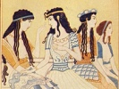

  
[Intangible Textual Heritage](../../index)  [Classics](../index.md) 
[Index](index)  [Previous](moc11)  [Next](moc13.md) 

------------------------------------------------------------------------

[Buy this Book at
Amazon.com](https://www.amazon.com/exec/obidos/ASIN/B002BA5ITU/internetsacredte.md)

------------------------------------------------------------------------

  
*Myths of Crete and Pre-Hellenic Europe*, by Donald A. Mackenzie,
\[1917\], at Intangible Textual Heritage

------------------------------------------------------------------------

p. 143

# CHAPTER VII

### Races and Myths of Neolithic Crete

The Cave--dwellers of Crete--Azilian Stage of Culture--The Neolithic
Folk--Obsidian obtained from Melos--Neolithic Finds at Knossos and
Phæstos--Island inhabited at 10,000 B.C.--Settlers of the Mediterranean
Race--The Evidence of Early Egyptian Graves--Migrations from North
Africa into Europe--Appearance of Anatolians in Crete--The
Agriculturists and Bearded Pastoralists--Racial Religious Beliefs in
Scotland and Greece--The Various Cults of Zeus--Political Significance
of Zeus Worship--Legend of the Cretan Zeus--the Tomb of the
God--Traditional Holy Places appropriated by Early Christians--Cretan
Zeus like Osiris, Adonis, Tammuz, Attis, and other Young Gods--Kings as
Incarnations of Deities--Egyptian and Greek Mysticism--Demeter and
Dionysus--Totemic Animals Tabooed--Pig Sacred in Egypt and Crete--The
Sacred Goat--Bull Cult of Knossos--Links between Libya and Crete--The
Double--axe Symbol--Maltese Story of "Axe Land"--Etymology and
Labyrinth--Neolithic Houses in Crete--Survival of Palæolithic Traditions
and Customs and Types--Religious Borrowing.

WHO were the earliest inhabitants of Crete and whence came they? The
problem is involved in obscurity, but certain suggestive facts may be
stated which throw some light upon it. As already indicated (Chapter
III) no bones of Palæolithic man have been discovered on the island.
Signor Taramelli, an Italian excavator, recently explored, however, the
interesting grotto of Miamu, which was inhabited by early settlers who
appear to have been either in the Late Magdelenian or the Azillan stage
of culture. The deposit of the partly artificial cave yielded on
examination a number of bone heads of weapons and bone spatulas,
somewhat like the "spoon-shaped celts"

p. 144

of the Swiss lake-dwellings and the Rhone valley, which were probably
utilized by huntsmen for scooping out marrow from the bones of roasted
animals. Evidently, therefore, Crete had been occupied at a remote
period by cave-dwellers. The lower grotto deposit was overlaid by Bronze
Age remains.

During the long interval which followed the last glacial epoch, there
was a gradual and general subsidence of land round the Mediterranean as
elsewhere. But after Crete had become detached from Greece, it still
remained for a period of uncertain duration connected with Asia Minor,
where there were, no doubt, communities of cave-dwellers as in Phœnicia
and Palestine. These ancient folks of the Cretan grotto of Miamu may
have been isolated from their congeners on the mainland like the
"beachcombers" of the "kitchen middens" in England and Scotland. We
cannot say whether they became extinct or not. It is possible that the
seafaring pioneers of the Neolithic Age found inhabitants on the island.

The earliest traces of the Neolithic folk have been discovered in the
vicinity of the mountain village of Magasa. Among the relics were
polished stone axes, numerous bone awls, and fragments of coarse pottery
belonging to a similar stage of culture to that which obtained among the
Neolithic cave-dwellers of Gezer, Palestine, who, as has been indicated,
made pottery also. Apparently the Magasa settlers came from the north in
their many-oared galleys, resembling those depicted on the painted
pre-Dynastic pottery of Egypt. As much is indicated by the finds of
obsidian flakes, Neolithic man, it may be explained, not only
constructed knives, saws, arrow-heads, and other small implements from
flint found in chalk deposits, and chert nodules embedded in limestone,
but also from obsidian, which is the "glassy" variety of

p. 145

volcanic rock-hardened lava--known as liparite, [1](#fn_173.md) the "frothy" variety being
"pumice-stone". Now, there is no obsidian in Crete. The only source of
it in the Ægean is the Island of Melos (now Milos, or Milo), where the
famous statue of Venus de Milo was discovered. Evidently an early
Neolithic civilization had local development in the Cyclades, amidst

                               the sprinkled isles,  
Lily on lily, that o'erlace the sea,  
And laugh their pride when the light wave lisps "Greece". [2](#fn_174.md)

Obsidian artifacts have been found in various islands of the Ægean, as
well as on the mainland at Mycenæ and elsewhere, on the island of
Cyprus, and as far westward as Malta, where it was imported, apparently
from Melos, to be worked, for flakes as well as knives have been found,
and also in Sicily. Schliemann discovered knives and flakes of obsidian
in "the four lowest prehistoric cities at Hissarlik". He remarked
regarding them at the time: "All are two-edged, and some are so sharp
that one might shave with them". [3](#fn_175.md)
The Jews still use flint and obsidian knives in religious ceremonies.
Obsidian implements have also been taken from Neolithic strata near
Nineveh. In Egypt, during the Old Kingdom Period, the beaten-copper
statues of Pepi I and his son were given eyes of obsidian.

When Knossos and Phæstos were first selected as settlements, the Cretans
had advanced into the later stage of Neolithic culture. Their obsidian
knives were finely wrought, and have been found associated with
serpentine maces, axes of diorite and other hard stone, and, as it is of
special interest to note, clay and stone spindle whorls, indicating that
the art of spinning was well known.

p. 146

It has been stated that the beginning of the Neolithic Age has been
dated approximately 103000 B.C. The calculation has been arrived at by
the comparative study of the stratified deposit at Knossos. The layers
of the historic period are about 18 feet deep. Below these are the
Neolithic layers, through which a depth of about 20 feet has been
reached. Roughly about 3 feet was accumulated every thousand years.
Allowing for variation in the deposits, the minimum date 10,000 B.C.
appears to be safe; even 12,000 B.C. or 13,000 B.C. is possible. There
is no trace in the first layer of a culture so low as that of Magasa.
The earliest "folk-wave" which reached Knossos came with a form of
culture which had been developed elsewhere.

Unfortunately no human remains have been unearthed in the Neolithic
deposit to afford evidence regarding the racial affinities of these
pioneers of civilization. Ethnologists are of opinion that they were
representations of the Mediterranean race, and arrive at their
conclusion on the following grounds: The large majority of the skulls
found in Bronze Age graves are long, and are similar to those taken from
Neolithic graves in Greece and elsewhere throughout Europe, especially
in the south and west, as well as those from the pre-Dynastic graves of
Egypt. The average stature of the Minoan Cretans was about 5 feet 4.
inches. In the early Bronze Age there was a broad-headed minority.

It has been found that, as Dr. Collignon says, "when a race is well
seated in a region, fixed to the soil by agriculture, acclimatized by
natural selection, and sufficiently dense, it opposes an enormous
resistance to absorption by the new-comers, whoever they may be". This
view finds conspicuous support in the permanence of the Cro-Magnon type
of mankind in the Dordogne

p. 147

valley. An interval of at least 20,000 years has not altered particular
skull and face forms there. In Egypt at the present day the fellaheen
resemble to a marked degree their Neolithic ancestors. Ethnologists
explain in this connection that physical characteristics are controlled
by the females of a community. Intrusions of males as traders, settlers,
or conquerors may have been productive of variations, but the tendency
to revert to the original type has operated to a marked degree, the
"unfits" being eliminated by local diseases from generation to
generation. In those districts, however, where settlers of alien type
were accompanied by their wives and families, ethnic changes have been
more pronounced. It is not surprising to find, in this connection, that
in a country like Great Britain primitive types should be found to be
still persistent. The majority of the invaders who crossed the seas were
evidently males.

Since Sergi first roused a storm of criticism by advancing his theory of
the North African origin of the Mediterranean race, a considerable mass
of data has been accumulated which tends to confirm his conclusions.
Egypt has provided evidence which sets beyond dispute the fact that once
a racial type had been fixed it persisted for many thousands of years
with little or no change. The problem as to why some heads are long and
some are broad still remains obscure. All that can be said is that
certain peoples developed in isolation during untold ages their peculiar
physical characteristics, which changes of food and location have failed
to alter.

Numerous graves were found during recent years in Upper Egypt in which
the bodies have been preserved for a space of at least sixty
centuries--"not the mere bones only", says Professor Elliot Smith, "but
also the skin and hair, the muscles and organs of the body; and

p. 148

even such delicate tissues as the nerves and brain, and, most marvellous
of all, the lens of the eye. "Thus", he adds, "we are able to form a
very precise idea of the structure of the proto-Egyptian." This
distinguished ethnologist's description of the early inhabitant of the
Nile valley is of special interest: "The proto-Egyptian was a man of
small stature, his mean height" was "a little under 5 feet 5 inches in
the flesh for men, and almost 5 feet in the case of women. . . . He was
of very slender build, for his bones are singularly slight and free from
pronounced roughness and projecting bosses that indicate great muscular
development. In fact, there is a suggestion of effeminate grace and
frailty about his bones. . . . Like all his kinsmen of the Mediterranean
group of peoples, the proto-Egyptian, when free from alien admixture,
had a very scanty endowment of beard and almost no moustache. On neither
lip were there ever more than a few sparsely scattered hairs, and in
most cases also the cheeks were equally scantily equipped. But there was
always a short tuft of beard under the chin." The burial customs and the
ceramic and other remains of the Mediterranean peoples were of similar
character everywhere. [1](#fn_176.md)

In some pre-Dynastic Egyptian graves the dead were wrapped in "flaxen
cloth of considerable fineness". It is probable, therefore, that the
spindle whorls found in Crete were invented in Egypt. The brunette
complexion of the Mediterranean Neolithic folk was probably acquired on
the North African coast whence they spread into Europe. As ships were
depicted on Egyptian pre-Dynastic pottery, it is possible that companies
of them crossed the Mediterranean Sea. The great majority entered
Europe, however, across the Straits of Gibraltar, and by the Palestine

p. 149

and Asia Minor route, along the ancient "way of the Philistines".

The stomachs of some of the naturally mummified bodies have been taken
out, and when their undigested contents were submitted to examination)
discovery was made, among other things, of fish bone and scales,
fragments of mammalian bones, remains of plants used as drugs, and husks
of barley and millet. The Mediterranean folks who remained in Egypt were
evidently agriculturists, stock-breeders and fishermen, and
non-vegetarians.

A people who had adopted the agricultural mode of life were able to
occupy more limited areas than huntsmen or pastoralists. Europe must
have been thinly populated at the dawn of the Neolithic Age, when the
Mediterranean peoples began to "peg out claims" in its valleys, round
its shores, and on green inviting islands. The Cretan pioneers were
undoubtedly agriculturists. They grew peas and barley, and ground their
meal in stone mortars and querns; they fenced their land, and must
therefore have had land laws; and they kept herds of sheep, cattle,
pigs, and goats. The fig- and olive-trees were also cultivated. In
short, they had imported to Crete the agricultural and horticultural
civilization which the Egyptians credited to Osiris and Isis, before
they had begun to carry on a sea trade with the home country. Evidence
has also been forthcoming that the Neolithic peoples of western Europe
and the British Isles were similarly agriculturists. Sometimes the teeth
taken from graves are found to be in a ground-down condition. This was
partly due to the deposit of grit in limestone and sandstone mortars and
querns, which mixed with the meal. [1](#fn_177.md)
The Neolithic folk who utilized soft stones for milling must have been
as

p. 150

familiar as some of their modern descendants with the agonies of
toothache and indigestion.

The minority of broad-heads in the early Minoan period in Crete may have
been survivals from Palæolithic times, or the descendants of slaves. It
is more probable, however, that they represented an infusion of traders
and artisans from Asia Minor. Professor Elliot Smith, who believes that
the Egyptians were the first to work copper, suggests that "the
broad-headed, long-bearded Asiatics", of Alpine or Armenoid type,
"learned of its usefulness by contact with the Egyptians in Syria", and
passed on their acquired knowledge to other peoples. Referring to Crete
in particular he says: "We can have no doubt these people (the
Armenoids) began to make their way into Crete, from Anatolia perhaps, at
the time when the diffusion of the knowledge of copper was
beginning". [1](#fn_178.md) At a much later period
the artisans of North Syria and Anatolia were famous as metal-workers.
One of the results of the wars waged by Egypt, after the expulsion of
the Hyksos, was the introduction to the Nile valley of coats of mail,
gilded chariots, gold and silver vases, and other articles which were
greatly prized. "At this period", writes Professor Flinders Petrie, "the
civilization of Syria was equal or superior to that of Egypt. . . . Here
was luxury far beyond that of the Egyptians, and technical work which
could teach them, rather than be taught." [2](#fn_179.md) Many thousands of prisoners were also
taken, and, when tribute was arranged for, the Pharaoh made it a
condition that his vassals should send "the foreign workmen" with it.
Kings and noblemen also received wives from Syria and Anatolia. During
the Eighteenth Dynasty the typical Egyptian face, as a result, underwent
a change. The upper and artisan classes became half foreigners. As at

p. 151

the present day, however, the peasants were unaffected by the alien
infusion, and they constituted the large majority of the inhabitants.

The broad-heads represent an ancient stock which had an area of
characterization somewhere in Central Asia. They were apparently
separated, during the Late Glacial and Inter-glacial Periods, for many
thousands of years from the fair northerners and the brunette
Mediterraneans--long enough, at any rate, to develop distinctive
physical characteristics, and also, it would appear, distinctive modes
of thought. They were mainly a pastoral people, and clung to an upland
habitat along the grassy steppes. In contrast to the lithe and slight
agriculturists from North Africa, they were heavily bearded and
muscular; they also included short and tall stocks. During the Neolithic
Period these broad-heads were filtering into Europe, but it was not
until the early Copper Age that their western migrations assumed
greatest volume.

Evidence as to the source of early Cretan culture and the homeland of
the pioneer settlers may be obtained, not only by studying physical
characteristics, but also early religious beliefs. There is nothing so
persistent as "immemorial modes of thought". At the present day it is
possible to find, even in these islands, small communities descended
from alien settlers, who have for long centuries lived beside and never
mixed with the descendants of the aborigines. Round the east coast of
Scotland, for instance, the fisher-folks in not a few of the small towns
are endogamous-they rarely marry outside their own kindred; and they not
only speak a different dialect from their neighbours, but have different
superstitions. So distinctive, too, are their physical traits that they
are easily distinguished in certain localities.

In ancient times peoples of different origin lived more

p. 152

strictly apart than is the case nowadays. Herodotus and other Greek
writers sought for clues as to tribal origins by making reference to
burial customs and religious beliefs.

The Carians maintain they are the aboriginal inhabitants of the part of
the mainland where they now dwell, and never had any other name than
that which they still bear; and in proof of this they show an ancient
temple of the Carian Jove in the country of the Mylasians. [1](#fn_180.md)

There is a third temple, that of the Carian Zeus, common to all Carians,
in the use of which also the Lydians and Mysians participate, on the
ground that they are brethren. [2](#fn_181.md)

One of the interesting phases of Cretan religion was the worship of the
local Zeus. The deity must not be confused, however, with the so-called
Aryan or Indo-European Zeus of the philologists of a past generation.
The name Zeus is less ancient than the deities to whom it was applied.
It is derived from the root *div*, meaning "bright" or "shining". In
Sanskrit it is Dyaus, in Latin Diespiter, Divus, Diovis, and Jove, in
Anglo-Saxon Tiw, and in Norse Tyr; an old Germanic name of Odin was
Divus or Tivi, and his descendants were the Tivar. The Greeks had not a
few varieties of Zeus. These included: "Zeus, god of vintage", "Zeus,
god of sailors," "Bald Zeus", "Dark Zeus" (god of death and the
underworld), "Zeus-Trophonios" (earth-god), "Zeus of thunder and rain",
"Zeus, lord of flies", "Zeus, god of boundaries", "Zeus Soter", as well
as the "Carian Zeus" and the "Cretan Zeus". The chief gods of alien
peoples were also called Zeus or Jupiter. Merodach of Babylon was
"Jupiter Belus" and Amon of Thebes "Jupiter Amon", and so on.

The worship of Zeus, the father-god, had a political significance. He
was imposed as the chief deity on

 

 

WILD GOAT AND YOUNG: FAIENCE RELIEF, FROM KNOSSOS (See page 139)

Reproduced from "Annual of the British School at Athens", by kind
permission of the Committee and of Messrs. Macmillan & Co., Ltd.

 

p. 153

various Pantheons by the Hellenic conquerors of prehistoric Greece, but
local deities suffered little or no change except in name. Dionysus
might be called Zeus, but he still continued to be Dionysus, the son of
the Great Mother, and did not become Zeus the self-created father-god.

The legend of the Cretan Zeus is as follows: It had been prophesied by
Uranus and Gaia that Cronos would be displaced by one of his own
children. He endeavoured to avert this calamity by swallowing each babe
that was born to his wife, Rhea. After he had thus disposed of five of
his family, Rhea went to Crete, and in a mountain cave there gave birth
to Zeus. She then returned to her husband and presented him with a stone
dressed up as a babe, which he swallowed.

Rhea was assisted by her priests, the Curetes, who danced a war or
fertility dance, and her child was fostered by nymphs (the Cretan
"mothers"), who gave him honey, so that Cronos would not hear his cries.
Milk for nourishment was provided by the goat Amalthea. So strong was
the child that soon after birth he broke off one of the goat's horns,
which he presented to the nymphs: it afterwards became known as
Cornucopia, the "horn of plenty", because it became filled with whatever
its owner desired.

When Zeus grew up he rescued his brothers and sisters from the stomach
of Cronos, and also took forth the stone which had been substituted for
himself: this stone became sacred to his worshippers. Afterwards he
deposed his father and sat on the throne as chief deity. Like other
ancient gods, he reigned for a time and then died. His grave was pointed
out in Crete, as several classical authors have testified. [1](#fn_182.md) Perhaps it was on

p. 154

account of their habit of repeating this and other ancient legends that
the Cretans became so notorious among orthodox Greeks. Paul wrote of
them: "There are many unruly and vain talkers and deceivers . . . whose
mouths must be stopped; who subvert whole houses, teaching things which
they ought not. . . . One of themselves, even a prophet of their own,
said, The Cretans are always liars." [1](#fn_183.md)

"Later Cretan tradition", writes Sir Arthur Evans, "has persistently
connected the tomb of Zeus with Mount Juktas, which rises as the most
prominent height on the land side above the site of Knossos. Personal
experiences obtained during two recent explorations of this peak go far
to confirm this tradition. All that is not precipitous of the highest
point of the ridge of Juktas is enclosed by a 'Cyclopean' wall of large
roughly oblong blocks, and within this enclosure, especially towards the
summit, the ground is strewn with pottery, dating from Mycenæan to Roman
times, and including a large number of small cups of pale clay exactly
resembling those which occur in votive deposits of Mycenæan date in the
caves of Dikta and of Ida, also intimately connected with the cult of
the Cretan Zeus."

In the vicinity is "the small church of Aphendi Kristos, or the Lord
Christ, a name which in Crete clings in an especial way to the ancient
sanctuaries of Zeus, and marks here in a conspicuous manner the diverted
but abiding sanctity of the spot. Popular tradition, the existing cult,
and the archaeological traces point alike to the fact that there was
here 'a holy sepulchre' of remote antiquity." [2](#fn_184.md)

Early Christian missionaries similarly appropriated elsewhere the "holy
places" of the Pagan cults. St. Paul's

p. 155

\[paragraph continues\] Cathedral in
London probably marks the site of the ancient sanctuary of the god Lud,
which was approached by Ludgate (the way of Lud). Ancient sculptured
stones are often found built into the walls of old chapels. Sometimes
the local saint was worshipped after death as if he had acquired the
attributes of the Pagan deity he displaced. Bulls were offered up in
Applecross, Ross-shire, in 1656, "upon the 25th August", runs a minute
of Dingwall Presbytery, "which day is dedicate, as they conceive, to Sn.
Mourie as they call him". [1](#fn_185.md)

The Cretan Zeus was a deity who each year died a violent death and came
to life again. He thus resembled closely the Egyptian Osiris, the
culture king, who introduced agriculture, was slain by Set (one of whose
forms was the black pig), and afterwards became Judge of the Dead. We do
not know what name was borne by this Cretan deity. It may have been
"Velchanos", the youthful warrior of Cretan tradition. A Knossian cult
may have called him Minos. As we have seen, this culture king, who
during life was famed as a lawgiver, became one of the judges of the
dead in the Homeric Hades. Apparently he was deified and regarded as a
form of the Cretan Dionysus, who differed somewhat from the Thracian
Dionysus.

At what period Zeus-Dionysus was introduced into Crete it is impossible
to say with certainty. His close association with agriculture and the
underworld suggests that he was known at an early period, but, as will
be shown in the next chapter, not necessarily the earliest.

To the agriculturists the myths and customs associated with the sowing
and reaping of grain were of as much importance as the implements they
used. Every people who

p. 156

in early times adopted the agricultural mode of life adopted also the
religious practices associated with it. Persistent folk-legends in
Greece pointed to Egypt as the fountainhead of agricultural religion.
Diodorus Siculus says that the mysteries of Dionysus are identical with
those of Osiris, and that the Isis and Demeter mysteries are the same
also, the only difference being in the names applied to the
deities. [1](#fn_186.md) "Osiris", says Herodotus,
"is named Dionysus (Bacchus) by the Greeks." [2](#fn_187.md)

The Cretan Zeus-Dionysus links not only with Osiris, but also with
Tammuz of Babylon, Ashur of Assyria, Attis of Phrygia, Adonis of Greece,
Agni of India and his twin-brother Indra, the Germanic Scef and Frey and
Heimdal, and the Scoto-Irish Diarmid. Each of these deities was
apparently a developed form of a primitive culture-god, who was a deity
of love, fertility, and vegetation; he symbolized the grass required by
pastoralists, the fruit of wild and cultivated trees, the spring
flowers, and the corn; in short, he was the provider of the food-supply,
and he was the life-principle in the food.

In pre-historic times, when the migrating peoples had a vague conception
of the mysterious Power which controlled the Universe and the lives of
men, they did not give concrete and permanent form to the deities they
worshipped and propitiated and controlled by the performance of magical
ceremonies. They believed that the Power was manifested in various forms
at different periods, and existed in all forms at one and the same time.
Osiris appeared among men as a wise king who introduced agriculture and
inaugurated just laws; he was at the same time the moon and the young
bull, goat, or boar, who was given origin by a "ray of light" issuing
from the moon. He was the ancestor of men and edible animals; he was

p. 157

the "vital spark" or life-essence n all that grew; he was the Nile which
fertilized the sun-parched desert. Each Pharaoh was an Osiris, and each
pious individual who died became one with Osiris in the agricultural
heaven which he attained by obeying the laws of Osiris. Thus Proclus
says, in reference to the Greek mysteries: "The gods assume many forms
and change from one to another; now they are manifested in the emission
of shapeless light, now they are of human shape, and anon appear in
other and different forms". [1](#fn_188.md)

The Cretan god was the son of the Great Mother who has been identified
with Rhea. Apparently he also became her husband. Osiris was the son of
Isis, or of Isis and Nepthys--"the bull begotten of the two cows Isis
and Nepthys", and he was also at once the husband and father of Isis.
Tammuz was the son and spouse of Ishtar, and the later Adonis the lover
and son of Aphrodite.

The goddess Demeter and the god Dionysus, her son, were said to be of
Cretan origin. According to Firmicus Maternus, Dionysus was the
illegitimate son of King Jupiter of Crete, and was hated by Queen Juno.
On one occasion, when Jupiter prepared to leave the island, he appointed
Dionysus to reign in his place. Juno plotted, during her husband's
absence, with the Titans, who lured the young prince away and devoured
him. Minerva, his sister, however, rescued his heart and gave it to
Jupiter on his return, and that high god enclosed the heart in a case
and placed it in a temple which he erected, so that it might be
worshipped. Other myths of similar character are told regarding the
young god who was mangled like the Egyptian Osiris. One variation states
that Jupiter had the heart pounded in a mortar and given to Semele, who,
after eating it, gave birth once more to Dionysus.

p. 158

In the Egyptian Anpu-Bata story, Bata, who is evidently a primitive god
resembling Osiris, exists in various forms at different periods. His
soul enters a blossom, and when the blossom is destroyed the soul enters
a sacred bull; the bull is slain and the soul is enclosed in two trees:
the trees are cut down, and a chip having entered the mouth of the
Pharaoh's wife, that lady gives birth to a child who is no other than
the original Bata.

The identification of the god with an animal suggests totemism. In one
of the early culture stages it was believed that the spirit of the
eponymous tribal ancestor existed in a bull, a bear, a pig, or a deer,
as the case might be. Invariably the animal was an edible one--the
source of the food-supply, or the guardian of it. Osiris, in one part of
Egypt, was a bull and in another a goat. He appears also to have had a
boar form. Set went out to hunt a wild boar when he found the body of
Osiris and tore it in pieces.

The sacred animal was tabooed for a certain period of the year, or
altogether. In Egypt the pig was never eaten except sacrificially.
Herodotus says: "The pig is regarded among them (the Egyptians) as an
unclean animal, so much so that if a man in passing accidentally touch a
pig, he instantly hurries to the river and plunges in with all his
clothes on. Hence, too, the swineherds, notwithstanding that they are of
pure Egyptian blood, are forbidden to enter into any of the temples,
which are open to all other Egyptians; and further, no one will give his
daughter in marriage to a swineherd, or take a wife from among them, so
that the swineherds are forced to intermarry among themselves. They do
not offer swine in sacrifice to any of their gods, excepting Bacchus
(Osiris) and the moon, whom they honour in this way at the same

p. 159

time, sacrificing pigs to both of them at the same full moon, and
afterwards eating of the flesh. . . . At any other time they would not
so much as taste it." [1](#fn_189.md)

According to one of the Cretan legends regarding Zeus-Dionysus, as
related by Athenæus, [2](#fn_190.md) the animal
which nourished with its milk the young god of the cave was a sow.
"Wherefore all the Cretans consider this animal sacred, and will not
taste of its flesh; and the men of Præsos perform sacred rites with the
sow, making her the first offering at the sacrifice." [3](#fn_191.md) The pig taboo extended as far as Wales,
Scotland, and Ireland, and is still remembered. [4](#fn_192.md)

Dionysus was also associated with the goat, as we have seen. A clay
impression of a gem from Knossos shows an infant sitting beside a horned
sheep. [5](#fn_193.md) Possibly we have here
another form of the legend. The various animals may have been totemic.
Different tribes claimed descent from different animals which were
associated with the culture-god whom they adopted.

It would appear that the bull tribe achieved ascendancy in Crete, for
the horns of that animal, a piece of "ritual furniture", which Sir
Arthur Evans refers to "by anticipation" as "the horns of consecration",
is the commonest cult objective on pottery, frescoes, gems, steles, and
altars. The horns were evidently a symbol of the god of fertility. It
would appear that before Zeus-Dionysus was depicted in human shape he
was worshipped through his symbols or attributes.

Another symbol of the god was the 8-form shield. In North Africa it is
found associated with the Libyan

p. 160

goddess Neith, who was a Great Mother with a fatherless son. On Mycenæan
and Cretan signets and seals this shield is sometimes shown with human
head and arms. It was used by one of the Hittite tribes, and may be
identical with the Bœotian shield. A similar pattern also "appears as an
ornamental motive on a bronze belt of the latest Bronze or earliest
Hallstatt period in Hungary". [1](#fn_194.md) The
so-called "spectacle marking" on the Scottish sculptured stones, which
sometimes appears upright and sometimes longwise, may have been an
8-form shield of symbolic significance--an attribute of the god or
goddess of fertility.

The double axe was another distinctive symbol of the Cretan god. In
Malta certain folk-tales make reference to "Bufies", which is believed
to signify "Axe-land", situated somewhere beyond the Sahara. "Axe-land",
says Mr. R. N. Bradley, "must be one of the original homes of the axe,
and therefore possibly of Neolithic culture." [2](#fn_195.md) Votive stone axes, perforated for
suspension, are common in Malta, Cyprus, and other Mediterranean
islands. On the sculptured stones of Brittany the double axe appears as
a symbol or hieroglyph, and it is sometimes grasped by an outstretched
hand. [3](#fn_196.md) In Crete the double axe with
long handle was depicted between the "horns of consecration" in outline
on stones of pillars of palaces and the Dictæan inner cave, and inside
houses, apparently as a charm. It figures on a gold signet from Mycenæ
in elaborate form, beside a goddess, seated beneath a vine. On the upper
part of the signet the sun and crescent moon are enclosed by "water
rays". Hovering high on the left is the 8-form shield with human head,
an uplifted arm with a

 

 

THE PRINCIPAL ROOM OF THE MUSEUM AT CANDIA, CRETE

In the foreground is a great double axe from Aghia Triadha.

 

p. 161

staff or spear in the hand, and a single leg below. The goddess is
approached by votaries, who make offerings of flowers including the iris
and hyacinth. On a gem from Knossos the goddess grasps the double axe in
her hand, as she does also on a mould from Palaikastro, and other
objects found elsewhere. Sir Arthur Evans is of opinion that "labyrinth"
is derived from *labrys*, the Lydian (or Carian) name for the Greek
double-edged axe. [1](#fn_197.md) "The suffix in
-nth has been conclusively shown", says Professor Burrows, "to belong to
that interesting group of pre-Hellenic words that survives both in
place-names like Corinth (Corinthos) and Zakynthos . . . and in common
words that would naturally be borrowed by the invaders from the old
population." Some of these are the words for "barley-cake", "basket",
"hedge-sparrow", and "worm". "The similarly formed word for 'mouse'," he
adds, "which remains as the ordinary Greek word. . . . is quoted by the
Greek grammarians as a Cretan word." [2](#fn_198.md)

Words like "absinth" and "hyacinth" are similarly survivals that have
been borrowed. Professor Burrows thinks, however, that *laura*, *lavra*,
or *labra*, signified "passage". Laburinthos would thus mean "place of
passages". He notes that "the early Eastern Church called its
monasteries Laurai, or Labri as they were sometimes spelt. The name must
have been originally given, either from the cloisters round them, or
because of the long passages, with the monks' cells leading off them;
but this does not seem to have been consciously felt, and the word was
used for the monastery as a whole. The name indeed is still seen in The
Lavra, a monastery at Mount Athos." [3](#fn_199.md)

The Cretan Zeus was, as a deity of vegetation, associated

p. 162

with tree- and water-worship. In the myth about Cronos swallowing the
stone there is evidently a memory of stone-worship also.

It would appear that more than one folk-wave entered Crete during the
thousands of years which were covered by the Neolithic Period. At
Knossos the earliest settlers constructed wattle huts, plastered with
mud, and were well advanced in civilization. The Magasa folks, on the
other hand, who produced fewer and cruder artifacts, had more
substantial houses. They built low walls of stone) and erected a timber
framework, which they enclosed in brick. A similar architectural method
appears to have obtained among the Anatolian Hittites in historic times.
Inside the Magasa house walls were plastered, and the flat roofs were
made of plastered reeds. Both these sections of Cretans, as has been
shown, obtained obsidian from Melos, and worked it beside their
dwellings, as the finds of flake testify. Whether, however, either or
both of them were contemporaries of the dwellers in the artificial cave
at Miamu is uncertain. It is suggestive, however, to find that the
historic Cretans had sacred caves like the Hittites, the prehistoric
people of Phoenicia, and the French and Spanish Palæolithic folk of the
Aurignacian and Magdalenian stages of culture. Did they adopt certain of
the religious customs of the descendants of the Palæolithic folks who
survived on the island? Or was there among the earliest settlers a
community of Libyans of mingled stock? The Cro-Magnon type survives till
the present day on the North African coast, where it has been identified
by Collignon and Bertholon among the Berbers. [1](#fn_200.md) It may be that there were tall men among
the Cretans, who were distinguished as warriors, as was Goliath among
the Philistines. The Philistines were of Cretan origin.

p. 163

\[paragraph continues\] Some of the
athletes depicted on vases and frescoes appear to have been above the
average stature. It is of interest to recall, too, in this connection,
that the slim waists that distinguished the Cretans were characteristic
also of the Aurignacian cave-dwellers. This custom of waist-tightening
may have survived from the archæological Hunting Period. In Gaelic
stories there are references to the "hunger belt". It is possible, too,
that the Cretan girdle had a religious significance, like the "prayer
belt" of Russia. Sir Arthur Evans found at Knossos snake girdles which
had been deposited as votive offerings in a sacred place. Two snakes
enfolded the hips of the snake-goddess. Aphrodite's girdle compelled
love. The Germanic Brunhild's great strength lay in her girdle. The
dwarf Laurin was subdued when his girdle was wrenched off by the heroic
Dietrich. [1](#fn_201.md) Ishtar wore a girdle.

As has been indicated also (Chapter II), the bell-mouthed skirt worn by
the Minoan women was similar to that of the Cro-Magnon women depicted in
the Aurignacian caves 10,000 years ere the Neolithic folk settled in
Crete. The gowns of the Egyptian women were of the "hobble" pattern.

Crete, of course, could not have maintained a large population of
hunters. There can be little doubt that its inhabitants were not
numerous at any period prior to the introduction of agriculture. As the
great bulk of its historic population were of Mediterranean type, it
would appear that North Africa was the source of the high civilization
which obtained at Knossos during the Late Neolithic Period. The religion
of the Cretan agriculturists resembled in essential details that of the
Egyptians. Their chief deity was the Great Mother, whose son died, like
Osiris, a violent death. No doubt religious borrowing

p. 164

took place when the Cretans traded with Egypt, and that the traditions
preserved by Herodotus and other writers in this connection were not
without some foundation. But, as there existed so close a resemblance
between the fundamental beliefs of the separated peoples, it is
impossible to discover to what extent Cretan religion was influenced by
Nilotic. The Sumerian Tammuz myth, which also resembles the Osirian, was
fully developed at the dawn of history, and Merodach, a fusion of Tammuz
and Ramman, had for one of his names Asari, which has been identified
with Asar (Osiris).

A conclusion which may be suggested is that the various sections of the
Mediterranean race had, prior to their migrations to suitable areas of
settlement from the North African homeland, adopted a system of
religious beliefs which was closely associated with their agricultural
mode of life, and passed it on afterwards to the peoples, who learned
from them how to till and sow the soil and reap the harvest in season.
The myths of the Phrygian Attis and the Germanic Scef are probably
relics of cultural contact in bygone ages.

------------------------------------------------------------------------

### Footnotes

[145:1](moc12.htm#fr_173.md) So called after the
semi-crystalline rock emitted as lava from the chief volcano of the
Lipari Islands.

[145:2](moc12.htm#fr_174.md) Browning's "Cleon".

[145:3](moc12.htm#fr_175.md) *Ilios*, p. 247.

[148:1](moc12.htm#fr_176.md) *The Ancient
Egyptians*, pp. 41 *et seq*.

[149:1](moc12.htm#fr_177.md) The writer and a
friend once tested a limestone quern and ascertained that it deposited
as much grit as covered a three-penny piece in about fifteen minutes.

[150:1](moc12.htm#fr_178.md) The Early Egyptians,
pp. 172, 173.

[150:2](moc12.htm#fr_179.md) A History of Egypt,
Vol. II, pp. 146, 147.

[152:1](moc12.htm#fr_180.md) *Herodotus*, I, 171.

[152:2](moc12.htm#fr_181.md) *Strabo*, 659.

[153:1](moc12.htm#fr_182.md) *Diodorus Siculus*,
III, 61; Cicero, *De natura deorum*, III, 21, 53; Lucian,
*Philopseudes*, 3, &c.

[154:1](moc12.htm#fr_183.md) *Titus*, i, 10-12.

[154:2](moc12.htm#fr_184.md) *Journal of Hellenic
Studies*, Vol. XXI, pp. 121, 122.

[155:1](moc12.htm#fr_185.md) St. Maelrubha, the
early Christian missionary, who gave his name to Loch Maree (formerly
Loch Ewe). He flourished in the seventh century.

[156:1](moc12.htm#fr_186.md) Diodorus Siculus, I,
96.

[156:2](moc12.htm#fr_187.md) Herodotus, II, 144.

[157:1](moc12.htm#fr_188.md) *Ennead*, I, 6, 9.

[159:1](moc12.htm#fr_189.md) *Herodotus*, II, 47.

[159:2](moc12.htm#fr_190.md) *Pausanias*, VII, 17,
5.

[159:3](moc12.htm#fr_191.md) *Cults of the Greek
States*, L. R. Farnell, Vol. I, p. 37.

[159:4](moc12.htm#fr_192.md) *Myths of Babylonia
and Assyria*, pp. 293-4, and *Egyptian Myth and Legend*, pp. vii, vii.

[159:5](moc12.htm#fr_193.md) *Journal of Hellenic
Studies*, Vol. XXI, p. 129.

[160:1](moc12.htm#fr_194.md) *British Museum Early
Iron Age Guide*, p. 7.

[160:2](moc12.htm#fr_195.md) *Malta and the
Mediterranean Race*, p. 126 (1912).

[160:3](moc12.htm#fr_196.md) See *The
Mediterranean Race*, G. Sergi, p. 313, for illustration or axes on one
of the sculptured stones.

[161:1](moc12.htm#fr_197.md) *Journal of Hellenic
Studies*, Vol. XXI, pp. 106 *et seq*.

[161:2](moc12.htm#fr_198.md) *The Discoveries in
Crete*, p. 120.

[161:3](moc12.htm#fr_199.md) *The Discoveries in
Crete*, pp. 118, 119.

[162:1](moc12.htm#fr_200.md) Ripley's *Races of
Europe*, p. 177.

[163:1](moc12.htm#fr_201.md) Teutonic *Myth and
Legend*, pp. 380 and 428.

------------------------------------------------------------------------

[Next: Chapter VII. Pre-Hellenic Earth and Corn Mothers](moc13.md)
