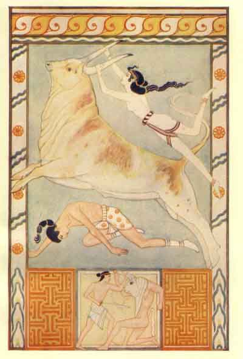

  
[Intangible Textual Heritage](../../index)  [Classics](../index) 
[Index](index)  [Previous](moc12)  [Next](moc14) 

------------------------------------------------------------------------

[Buy this Book at
Amazon.com](https://www.amazon.com/exec/obidos/ASIN/B002BA5ITU/internetsacredte)

------------------------------------------------------------------------

  
*Myths of Crete and Pre-Hellenic Europe*, by Donald A. Mackenzie,
\[1917\], at Intangible Textual Heritage

------------------------------------------------------------------------

p. 165

# CHAPTER VIII

### Pre-Hellenic Earth and Corn Mothers

Mythology and Floating Folk-beliefs--Legends of Egyptian Influence in
Crete--Primitive Spirit Groups as "Holy Mothers"--Evidence from Modern
Greece--Goddesses as Fairy Queens--The Great Mother of Gods, Demons, and
Mankind--Twin Deities and Bisexual Deities--Cult of Self-created Great
Father--Stages of Civilization reflected in Religious Beliefs--Female
Demons of Modern Greece--The Pre-Hellenic and Hellenic Forms of Rhea,
"Mother of the Gods--The Egyptian "Mothers" Neith and Nut--Earth Mother
as a Serpent--Demeter as the "Barley Mother"--Rhea and the Cretan
Snake-goddess--The Eleusinian Mysteries--The Mysteries of Crete and
Egypt--Isis and Demeter--The Corn and Earth Goddesses of India
--Demeter--Persephone Myth--Its Antiquity and Significance--The Later
Tammuz--Adonis Myth--The Demeter of Phigalia--Pre-Hellenic Cult of the
Earth Mother--Fusion of Myths of the Hunting Pastoral and Agricultural
Periods--Osiris and Minos--Osiris and the Minotaur--Eponymus Ancestor as
a Son of Earth --Minos and Pelasgus--First Man of "Lost
Atlantis"--Tribal Forms of Animal-headed Gods.

IN a previous chapter [1](#fn_202) it has been
shown that, during the Late Palæolithic and Neolithic Periods, the
worship of a goddess of maternity, who was at once a destroyer and
preserver, obtained among tribes of Eurafrican and Eurasian peoples, and
that memories of her primitive savage character have been perpetuated in
these islands in folk-tales and place-names until the present Age. The
past similarly lives in the present in Crete and Greece, where it is
still possible to find traces of the floating material from which
Homeric and Thesiodic Mythology

p. 166

was framed. Herodotus pondered over this aspect of the problem and
wrote: [1](#fn_203)

Whence the gods severally sprang, whether or no they had existed from
eternity, what forms they bore--these are questions of which the Greeks
knew nothing until the other day, so to speak, for Homer and Hesiod were
the first to compose Theogonies, and give their gods their epithets, to
allot them their several offices and occupations, and describe their
forms; and they lived but four hundred years before my time as I
believe. [2](#fn_204)

Herodotus received his information regarding the literary conception of
the deities from three priestesses of the Dodonæans, who also said:

Two black doves flew away from Egyptian Thebes, and while one directed
its flight to Libya, the other came to them. She alighted on an oak, and
sitting there began to speak with a human voice, and told them that on
the spot where she was, there should thenceforth be an oracle of Jove
(Zeus). They understood the announcement to be from Heaven, so they set
to work at once and erected a shrine. The dove which flew to Libya bade
the Libyans to establish there the oracle of Ammon (Amon).

In Egypt Herodotus was given a different version of the legend. The
priests of Jupiter (Amon) at Thebes said:

Two of the sacred women were once carried off from Thebes by the
Phœnicians. The story went that one of them was sold into Libya, and the
other into Greece, and these women were the first founders of the
oracles in the two countries.

Herodotus also held that the names of some of the deities came from
Egypt.

In early times the Pelasgi, as I know by information which I got at
Dodona, offered sacrifices of all kinds, and prayed to the gods, but had
no distinct names or appellations for them, since they had never heard
of any. They called them gods (θεοὶ {Greek *ðeoì*},

p. 167

disposers), because they had disposed and arranged all things in such a
beautiful order. After a long lapse of time the names of the gods came
to Greece from Egypt, and the Pelasgi learnt them, only as yet they knew
nothing of Bacchus, of whom they first heard at a much later date. Not
long after the arrival of the names, they sent to consult the oracle at
Dodona about them. This is the most ancient oracle in Greece, and at
that time there was no other. To their question, "whether they should
adopt the names that had been imported from the foreigners?" the oracle
replied by recommending the use of the names of the gods, and from them
the names passed afterwards to the Greeks. [1](#fn_205)

These statements seem to bear out what the results of modern research
tend to emphasize: that the systematized mythology was a creation of
priests and. poets, and had a political as well as a religious
significance. The most ancient conceptions and beliefs were perpetuated,
however, by the masses of the people, and may still be winnowed from
existing folk-beliefs and stories.

In Crete the dove and serpent goddesses appear to have evolved from
primitive spirit groups. These were first conceived of as mothers. "The
prominence of the idea of maternity in the Cretan religion", says Mr.
Farnell, "is illustrated by the Cretan cult of 'Meteres', the 'Holy
Mothers' who were transplanted at an early time from Crete to Engyon in
Sicily." [2](#fn_206)

In modern Greece the memory of the spirit groups still survives. Nymphs
and Nereids haunt mountains and valleys, oceans and streams, and are
ruled over by the "Queen of the mountains", the "Queen of the shore", or
primitive forms of the owl-headed Athene or the beautiful and
blood-thirsty Artemis. They are, in short, exceedingly like our fairies,
who obey the commands of Queen Mab. Some of the Celtic goddesses exist
in

p. 168

groups: "Proximæ (the kinswomen); Dervonæ (the oak spirits); Niskai (the
water spirits); Mairæ, Matronæ, Matres or Matræ (the mothers); Quadriviæ
(the goddesses; of cross-roads). The Matræs, Matræ, and Matronæ are
often qualified by some local name. Deities of this type appear to have
been popular in Britain, in the neighbourhood of Cologne, and in
Province. . . . In some parts of Wales 'Y Mamau' (the mothers) is the
name for the fairies." [1](#fn_207) The "seven
Hathors" of Egypt who presided at birth were similarly "mothers" and
"fates". The "Golden Aphrodite" of Greece was chief of the "deathless
fates". Demeter's priestesses, the earthly representatives of her
nymphs, conducted a religious ceremony at weddings, as a Cos inscription
shows. [2](#fn_208) Fairies in our folk-tales
are so fond of pretty children that they endeavour to steal them, and,
when they are successful, substitute changelings. The Greek Nereids
have, according to modern folk-belief, similar propensities. [3](#fn_209)

Ancient and modern evidence tends to emphasize the widespread prevalence
among the peoples of the Mediterranean race of the belief in the female
origin and control of life. The primitive "queens" appear to have
developed into goddesses, who were differentiated in localities to
accord with human experiences and habits of life. Among the goddesses
one was regarded as the Great Mother, who gave birth to the chief
deities, male and female, the demons and the ancestors of mankind. "One
is the race of men", sang Pindar, "with the race of gods; for one is the
mother that gave to both one breath of life; yet sundered are they by
powers wholly

p. 169

diverse, in that mankind is as naught, but heaven is builded of brass
that abideth ever unshaken." [1](#fn_210)

Sometimes the Great Mother is of dual personality. The Egyptian sisters
Isis and Nepthys were both mothers of Osiris, as has been
indicated--"the progeny of the two cows Isis and Nepthys". In the Indian
epic the *Máhabhárata*, the monarch Jarasandha was similarly reputed to
be the joint son of the two queens. The two parts of his body were
united by Jara, the household genius, after birth, and his name
signifies "united by Jara". [2](#fn_211) Two
goddesses were associated with the Sumerian god Tammuz. These were
Ishtar and Belit-sheri. Ishtar was his "mother", and he became her
lover; Belit-sheri was his "sister". Isis was at once the "mother",
"sister", "wife", and "daughter" of Osiris. Demeter and Kore, and
Demeter and Persephone were Greek pairs who had similar functions. The
model of a Mycenæan shrine discovered by Schliemann is surmounted by two
doves which were, no doubt, sister goddesses. Images of goddesses
holding a dove in either hand have also been found.

Another mystic conception was that the Great Mother was bi-sexual. The
Libyan Neith was occasionally depicted as androgyne. Isis was the
Egyptian "bearded Aphrodite", "the woman who was made a male", as one of
the religious chants states, "by her father, Osiris". [3](#fn_212) The Babylonian Ishtar and the Germanic
Freya were likewise double-sexed. This idea that deities were abnormal
and superhuman applied not only to goddesses. One of the Orphic hymns
sets forth:

Zeus was the first of all, Zeus last, the lord of lightning;  
Zeus was the head, the middle, from him all things were created;  
Zeus was Man and again Zeus was the Virgin Eternal.

p. 170

\[paragraph continues\] Adonis similarly
was "both maiden and youth". The Babylonian Nannar (Sin), the moon-god,
was "father" and "mother" of gods and men. So was the Syrian Baal. In
India Shiva is sometimes depicted with the right side female and the
left male. The Persian Mithra was a god and goddess combined. Herodotus,
in fact, appears not to have known that he was other than a female
deity. He says the Persians worshipped Urania, "which they borrowed from
the Arabians and Assyrians. Mylitta is the name by which the Assyrians
know this goddess, whom the Arabians call Alitta, and the Persians
Mithra". [1](#fn_213)

At what remote period this conception became prevalent it is impossible
to ascertain. It may have had origin in the Palæolithic Age, when
bearded steatopygous female figurines were carved from ivory similar to
those found in the pre-Dynastic graves of Egypt. Traces of the doctrine
involved are found among the Esquimaux, whose artifacts so closely
resemble those of the Magdalenian stage of culture, and among certain
North American tribes. Another view is that the conception resulted from
the early fusion of god and goddess cults, and of the rival fundamental
ideas connected with them. Babylonia may have been the region from which
the mystical doctrine was transferred to India on the one hand and Syria
on the other. According to Richard Burton [2](#fn_214) "the Phœnicians spread their androgynic
worship over Greece".

In contrast to the conception of the peoples of the goddess cult, that
life and the world was of female origin, was that of the peoples of the
god cult, who believed that the first Being was the Great Father. The
Scandinavians, or a section of them, believed that Ymer was the earth
father, and that the underworld deities had origin from

p. 171

the perspiration of his armpits, while the demons sprang from his feet.
One of the several creation myths in India sets forth that the
world-giant Purusha was, like Ymer, the source of all life. The highest
caste, the Brahman, sprang from his mouth, the second, the Kshatriya,
from his arms, the third, the Vaisya, from his thighs, and the fourth,
the Sudra, from his feet. [1](#fn_215) In
Anatolia the Armenoid Hatti were father-worshippers. During the period
of their political supremacy their "Lord of Heaven", a sky and
atmospheric deity with solar attributes, was all powerful. "With the
Hittites", says Professor Garstang, "fell their chief god from his
predominant place. . . . But the Great Mother lived on, being the
goddess of the land. Her cult, modified in some cases profoundly, by
time and changed political circumstances, was found surviving at the
dawn of Greek history in several places in the interior." [2](#fn_216) Zeus of the Hellenic Greeks was
similarly a father god and was imposed, as has been indicated, on the
pre-Hellenic inhabitants of Greece after conquest. In Egypt Ptah, the
god of Memphis, who wielded a hammer like the Hittite father god, and
was, therefore, a thunderer also, was a "perfect god". At the beginning
he built up his body and shaped his limbs ere the sky was fashioned and
the world set in order. "No father begot thee", a priestly poet
declared, "and no mother gave thee birth. Thou didst fashion thyself
without the aid of any other being." [3](#fn_217)

There is no trace of beliefs of the father cult in Crete. The Hellenic
Zeus, as has been shown, was little more than a name on the island. It
was applied to the young god who was the son of the Great Mother.

The various representations of the Cretan goddess

p. 172

suggest that, if they had no totemic significance, she was supposed to
assume various aspects at different seasons and under different
circumstances. As the Lady of Serpents she may have been the goddess of
the Underworld, and as the Lady of Trees and Doves, the goddess of birth
and fertility. She was also a mountain-goddess who wielded an axe or
wand. It is possible that she was never sharply defined, and was closely
associated with the vague spirit group of mothers--the "meteres", over
whom she may have presided as "queen".

All the ancient deities reflected the habits of life of their
worshippers, and retained traces of savage conceptions after they
assumed benevolent attributes among cultured peoples. The Cretan Great
Mother was evidently the goddess of the Neolithic folk who adopted the
agricultural mode of life and kept domesticated animals. She was the
earth mother and the corn mother, and the protector and multiplier of
flocks and herds. As the Neolithic folk were also huntsmen, their
goddess was associated with wild animals. She had evidently existence
before Osiris taught his people how to sow grain and cultivate
fruit-trees. When we find her guarded by lions it becomes evident that
she was the dreaded being who had to be propitiated, like Black Annis of
Leicester. This savage aspect of her character must not be lost sight
of. It still survives in Greek folk-belief. The mother who gave origin
to demons as well as gods was evidently, like the Babylonian Tiamat and
the blood-thirsty Ishtar, possessed of primitive demoniac traits. The
peasants of Greece at the present day remember Lamia, the "Queen of
Libya" who was loved by Zeus. Her children were robbed by Hera, and she
"took up her abode in a grim and lonely cavern, and there changed into a
malicious and greedy monster, who in envy and despair stole and killed
the

p. 173

children of more fortunate mothers". Another kind of Lamia, the Gello,
transforms herself into a fish, a serpent, a kite, or a skylark, and
devours babes also. When one of these demons is slain, no grass grows
where her blood falls. [1](#fn_218) In Gaelic
folk-tales no grass grows under whin-bushes or holly-trees, because the
Cailleach has touched the ground there with her hammer.

The Cretan mother-goddess appears to have possessed the attributes of
the various goddesses who were differentiated in classic mythology. The
pre-Hellenic Mother, one of whose names appears to have been Rhea, was
taken over by the Greeks and given a place in the Olympian group. Her
original character became vague. She was seated on a throne beside which
her lion crouched in repose, and her ancient functions were performed by
her children: Hestia, who resembled the Roman Vesta; Demeter, who
resembled the Roman Ceres; Hera, who resembled the Roman Juno; and the
gods Zeus and Poseidon, her sons, who link with the Roman Jupiter and
Neptune. Her husband was the savage Cronos, who devoured his children
like so many other primitive deities in various lands.

But the Hellenic Rhea, although called the "Mother of the Gods", was not
a self-created being, but the daughter of Gaia, the earth mother, and
Uranus, the sky father, who equate with the Aryo-Indian Dyaus, and
Prithivi, the sky father and earth mother of Indra. In Egypt, on the
other hand, the mother goddess was Nut of the sky, and the father the
earth-god Seb. The Libyan Neith, however, who appears to have been a
form of Nut, was an earth, sky, and atmospheric goddess. Her worshippers
made her declare:

I am what has been, what is, and what shall be,

p. 174

and those of Nut said of that Great Mother:

She hath built up life from her own body.

It would appear that the pre-Hellenic and Cretan Rhea was at once Gaia,
Demeter, Artemis, and the earlier Aphrodite, and that she was originally
identical with the pre-Hellenic Athene and Artemis, and the Phrygian
Cybele.

Gaia was vaguely defined, yet belief in her was widespread. She was a
divine prophetess, a fate, a power behind the gods. Like all primitive
deities, including the Sumerian Tiamat, she had to be propitiated or
fought against. Apparently one of her incarnations; was the Delphian
snake, others being snakes of different cults which were oracles. The
priestesses who drank the blood of bulls and entered sacred caves to
prophesy were believed to hold commune with the earth mother, the divine
revealer. The wisdom with which serpents were supposed to be endowed was
of great antiquity. They were also protectors of tribes and households,
and symbols of fertility. In Egypt Isis and Nepthys had serpent forms.
The tutelary goddess of the Delta was Uazit, the winged serpent, and
oracles were ascribed to her. She was the guardian of the child Horus
when Set sought for him with murderous intent. Snakes, "dragons", and
"worms" were protectors of hidden treasure. Sacrifices were offered to
these blood-thirsty monsters, so that they might be propitiated, either
as protectors of households or givers of crops and edible animals. The
ancient custom of slaying a human being or animal when foundation-stones
were laid or seeds were sown appears to have been connected with the
belief that the earth genius must be sacrificed to so that her goodwill
and co-operation might be secured. In the snake-goddess of Crete we
should

p. 175

recognize, it would appear, the anthropomorphic form of the primitive
Gaia.

The earth mother who possessed stores of hidden treasure was, as
Anesidora, "she who sends up gifts". One of her gifts was the
food-supply. She provided grass for flocks and herds, caused trees to
blossom and bear fruit, and to her agricultural worshippers gave rich
harvests.

The specialized form of the goddess most closely associated with crops
was Demeter. *Meter* signified "mother", but the meaning of the prefix
is uncertain. According to W. Mannhardt *deai* was the Cretan word for
"barley", and the goddess was the "Barley Mother". [1](#fn_219) Others hold that the prefix is a
dialectic variant of the word for "earth".

But although the etymology of her name may remain doubtful, her real
character is otherwise revealed. Melanippides and Euripides identified
her with Rhea when they called her "mother of the gods", and the fact
that the "earth snake" was invariably associated with her shows that she
shared the attributes of Gaia, the elder "mother", and resembled closely
the snake-goddess of Crete. She was associated with tree-worship, and
the story was told that she punished Erysichthon by causing him to
suffer dreadful hunger for cutting down trees in her sacred grove. In
one of the hymns she is petitioned to gift the apple crop. As
tree-goddesses were also water-goddesses, it is interesting to find that
springs were dedicated to her in Attica and elsewhere, and that
Euripides referred to her wanderings over rivers and the ocean. This
poet also associated her with mountains, so that she must have been a
guardian of animals like the primitive Scoto-Irish Cailleach, and a
mountain-goddess like the Cretan "lady" who was depicted on the summit
of a high peak.

p. 176

It was chiefly, however, as a provider of the food-supply that Demeter
was addressed. She was asked for gifts of cattle and corn and fruit, and
bulls and cows were sacrificed to her. Consequently she was a deity of
fertility and a love-goddess. The pig was also sacrificed to her as to
other earth spirits. As has been stated, pork was tabooed in Crete, and
appears to have been eaten sacrificially only. Demeter's connection with
the underworld emphasizes her character as a Fate--a goddess of birth
and death, who controlled and measured the lives of mankind.

Demeter's great festival was called the Eleusina, the legendary
explanation being that it was first celebrated at Eleusis, in Attica.
One of its features was the mystic ceremony of initiation. Little is
known regarding the Eleusinian mysteries. It would appear, however, from
stray literary references to, and sculptured scenes of, the ceremony
performed, that it was of elaborate character. The candidate fasted, and
bathed in the sea with a young pig which was to be sacrificed. Having
thus been purified, he entered the sacred place, where he drank of a
posset prepared from the "first fruits"--barley or grapes. For a time
his head and shoulders were covered by a cloth, so that he could not see
what was happening about him. Probably he was terrorized. A priest
instructed him, and he performed symbolic acts, and took vows.

The ceremony appears to have had a religious significance. "Whoever goes
uninitiated to Hades", says Plato, "will lie in mud, but he who has been
purified and is fully initiate, when he comes thither will dwell with
the gods " [1](#fn_220)

According to Diodorus Siculus, [2](#fn_221) the
Cretans professed that they gave the mysteries to Greece, and that they

p. 177

were performed openly on their island and communicated to everyone in
ancient times. The same writer says that the Cretans received the
mysteries from Egypt, the mysteries of Isis being the same as those of
Demeter and the mysteries of Osiris the same as those of Dionysus. [1](#fn_222) Plutarch expresses a similar view. [2](#fn_223) Herodotus, referring to the festival at
Busiris, in the Delta, says that "it is in honour of Isis, who is called
in the Greek tongue Demeter". [3](#fn_224)
Apparently there were strong resemblances between the mysteries of Isis
and those of Demeter.

It does not follow, however, that the Cretans had no anthropomorphic
goddess, and knew naught of the mysteries until they began to trade with
Egypt across the Mediterranean Sea. The resemblance between Isis and
Demeter may have been due to both Egyptians and Cretans having inherited
similar beliefs from their common ancestors in the area where the
Mediterranean race was characterized. As much is suggested by the fact
that there existed apparently in Crete, and undoubtedly in pre-Hellenic
Greece, an ancient myth in which Demeter is associated, not with the
young god Dionysus, who links with Osiris, Attis, and Tammuz, but with a
young goddess. This myth did not survive in Egypt; that, however, it
existed there at one time is suggested by the close association of Isis
and Nepthys, the joint mothers of Osiris. In India the story of Sita,
who was an incarnation of Lakshmi, is suggestive in this connection.
This heroine of the *Rámáyana*, having served her purpose on earth,
departs to the Underworld.

The earth was rent and parted, and a golden throne arose,  
Held aloft by jewelled Nagas [4](#fn_225) as
the leaves enfold the rose,  
And the Mother [5](#fn_226) in embraces held
her spotless, sinless child.

p. 178

Then they vanished together. "In the ancient hymns of the *Rig Veda*",
says Romesh C. Dutt, "Sita is simply the goddess of the field furrow
which bears crops for men. We find how that simple conception is
concealed in the *Rámáyana*, where Sita, the heroine of the epic, is
still born of the field furrow, and after all her adventures returns to
the earth." [1](#fn_227)

The daughter of Demeter was Kore-Persephone. The ancient legend
regarding the abduction of the young goddess is as follows.

It chanced that one day Persephone, daughter of Demeter, was wandering
in a flowery meadow gathering lilies and violets, roses and crocuses,
and hyacinths and narcissuses. Suddenly the earth opened, and Pluto, god
of Hades, appeared, seated in a golden car. Seizing the maiden, he
carried her off. Her cries were heard by the golden-haired Demeter, who
assumed a dark mantle and wandered over mountains, rivers, and oceans,
searching in vain for her daughter. On the tenth day she met Hecate, who
conducted her to the sun-god. This all-seeing deity informed Demeter
that Pluto had carried off Persephone with the consent of Zeus. On
hearing this, Demeter withdrew from Olympus, and she vowed never to
return until her daughter was restored to her. She also cast a blight
upon the earth, and men ploughed and sowed in vain; no barley grew, nor
did trees yield fruit. The goddess retired to Eleusia, and the king's
daughters found her sitting at the Maiden's Well below an olive-tree.
Celeus, the king, received her hospitably, and she became the nurse of
his sons Triptolemus and Demophon. She desired to make Demophon an
immortal, and put him one night in a fire; but his mother screamed
aloud, with the result that the spell was broken, and he perished.

p. 179

\[paragraph continues\] Similarly, Isis
thrust into the fire the infant son of the King of Byblus, whom she had
been engaged to nurse, when searching for Osiris. [1](#fn_228) Demeter compensated the parents for
their loss (or sacrifice) by giving Triptolemus seeds and instructing
him in the art of agriculture. She also conferred upon him a chariot
which was drawn by winged dragons. Pausanias says that she instructed
Triptolemus and his father in the performance of her rites and
mysteries. [2](#fn_229)

Many stories were related regarding Demeter's wanderings. One was that
she fled from Poseidon as a mare, and that he assumed the form of a
stallion. She afterwards became the mother of the horse Areion, which
had the gift of speech. Hesiod, however, makes Medusa the spouse of
Poseidon in his horse form and the mother of the winged Pegasus.

In Phigalia Pausanias [3](#fn_230) saw the cave
"sacred to Black Demeter". Here she was fabled to have dwelt for a time
sorrowing for her daughter. Meanwhile the blight remained upon the
earth, and mankind were perishing from famine. The gods searched for,
and Pan discovered, her hiding-place. Then Zeus sent the Fates to her,
and when he was informed that she would not remove the blight until
Persephone was restored to her, he commanded that she should be released
by Pluto. The god of Hades accordingly restored Persephone to her
mother. She was brought from Hades by Hermes, and was received with glad
heart by her mother, who at once restored fertility to the earth.

Zeus, however, had made it a condition of Persephone's release that she
had not eaten aught in Hades. To secure her return, Pluto gave her a
pomegranate seed before her departure, and when this fact was revealed
the young

p. 180

goddess had to return again to the gloomy Underworld. Once more Demeter
sorrowed, and cursed the earth in her wrath. A compromise had,
therefore, to be effected, and Zeus decreed that Persephone should spend
one-third of each year on earth with her mother, and the remaining
two-thirds with Pluto in Hades.

In this Demeter-Persephone myth the young goddess plays the same part as
Tammuz and Adonis, who spent part of the year on earth with one goddess,
and part of the year in the Underworld with the other. She is not slain
and dismembered like these gods and the Egyptian Osiris. The part of
Osiris is taken by Triptolemus, who received the grain seeds from
Demeter, as Osiris, the deified king, received them from Isis. It is
evident, therefore, that if the Cretans and pre-Hellenic Greeks borrowed
the mysteries from Egypt, they did so before the Osirian myth was fully
developed-that is, before the migration from North Africa of the tribes
of the Mediterranean race. It is unnecessary to assume that the earliest
agricultural settlers in Greece and Crete had no knowledge of the
Mysteries. Even the Australian savages have their initiation and other
rites.

It is evident that the primitive form of Demeter in Arcadia bore a close
resemblance to the repulsive hags of England and Scotland. Like the
snake-goddess of Crete, she retained in her symbols her early demoniac
traits. Pausanias [1](#fn_231) tells that in
the cave of Phigalia the ancient figure of the Black Demeter was of
wood; it was seated on a rock and had a mare's head, [2](#fn_232) which had above it the figures of snakes
and other monsters. She held a dolphin in one hand and a dove in the
other. When this statue

p. 181

was accidentally burnt, the Phigalians neglected the festivals and
ceased to offer up sacrifices. Then a terrible famine afflicted the
land. An oracle was consulted, and the people were informed that they
were being punished for forgetting that Demeter had introduced among
them the cultivation of corn.

Professor Frazer, [1](#fn_233) dealing with the
form of the myth as it is given in the *Homeric Hymn to Demeter*,
regards Demeter and Persephone as personifications of the corn--the
former as the old corn of last year and the latter as the seed corn in
autumn and sprouting in spring. Persephone's period in Hades was the
period in which the sprouting seed remained under the earth. [2](#fn_234) The Black Demeter appears to have been
the personification of the barren earth in winter, the Green Demeter the
goddess of growing corn, and the Yellow Demeter the harvest deity. In
their seasonal festivals the ancient agriculturists rejoiced and
sorrowed alternately in sympathy with the goddess.

It would appear that the various names of the ancient earth mother were
in turn individualized as separate deities. "As pre-Homeric offshoots of
Gaia", says Dr. Farnell, "we must recognize Demeter, Persephone, and
Themis." [3](#fn_235) Themis was the Titan who
became the second wife of Zeus. Kore appears, too, to have been
originally identical with Demeter. "From the two distinct names", Dr.
Farnell considers, "two distinct personalities arose. . . . Then as
these two personalities were distinct, and yet in function and idea
identical, early Greek theology must have been called upon to define
their relations. They might have been explained as sisters, but as there

p. 182

was a male deity in the background, and Demeter's name spoke of
maternity, it was more natural to regard them as mother and daughter.
And apart from any myth about Demeter's motherhood, Persephone-Kore
might well have been a very early cult title, meaning simply the
girl-Persephone, just as Hera, the stately bride mother, was called,
'Hera the girl' at Stymphalos . . . or the facts could be brought into
accord with another supposition. 'Kore' may have been detached from such
a ritual name as Demeter-Kore, 'the girl-Demeter'." [1](#fn_236)

In Crete, therefore, the snake-, dove-, and mountain-goddesses may have
been seasonal forms of the Mother Earth. Until the inscriptions are
read, however, it cannot be said with certainty whether or not they
developed into separate personalities. All that can be said is that the
legends which associate Rhea and Demeter with Crete are highly
suggestive in this connection. Athene, a pre-Hellenic goddess, who was
associated with the ubiquitous earth-snake, may have been a specialized
form of Gaia also. Like the Libyan Neith, she developed as a war- and
fertility-goddess, and was identified with that deity by Herodotus and
other writers. The animals sacrificed to her were the bull, cow, sheep,
and pig, and, once a year, the tabooed goat.

What appears to be certain is that in pre-Hellenic Greece and Crete, and
elsewhere throughout Europe, the Earth Mother was worshipped and
propitiated from an early pre-historic period. Her mysteries were
performed in caves, as were also the Palæolithic mysteries. In the caves
there were sacred serpents, and it may be that the prophetic priestesses
who entered them were serpent-charmers.

Cave worship was of immense antiquity. The cave

p. 183

was evidently regarded as the door of the Underworld, in which dwelt the
snake form of Mother Earth. Swine were sacrificed to her, a custom which
appears to have had origin in the Archæological "Hunting Period". In the
Scoto-Irish Fian (Fingalian) stories the love hero, Diarmid, the Adonis
of the pre-Agricultural peoples, is slain by the boar leader of the
swine-herd of Mala Lith, "Gray Eyebrows", the dark-visaged Cailleach
(Old Wife), who was the mother of men and demons and wild animals. This
legend may be a reminiscence of human sacrifice. Demeter's pig, like
Athene's goat, was perhaps of totemic origin. The boar clan and the goat
clan would have made blood offerings to their totems, as do the
Australian Kangaroo and Witchetty-grub tribes to theirs, to secure the
food-supply.

In the "Pastoral Period" sacrifices of bulls and cows must have become
prevalent. The goddess was then the cow mother, who caused the herds to
multiply, and provided them with grass. Hathor, the Egyptian goddess,
had the body of a woman and the head of a cow. In one of the archaic
versions of the Osirian myth Horus cuts off the head of his mother Isis,
and the moon-god Thoth replaces it with a cow's head. Isis had also a
serpent form, being evidently an earth-mother in origin.

When agriculture was introduced, the various tribes recognized their
earth-black and grass-green mother-goddess in a new form--the
harvest-haired corn spirit. But she still retained all her immemorial
attributes: she did not cease to be the earth-snake, the hag huntress
among the mountains and in valleys, the cow goddess of grassy steppes
and green oases, and the spirit of fig-tree and olive and vine. Around
her, too, hovered the animistic groups who were remembered in after time
as nymphs and fairies. She also retained her association

p. 184

with the animal forms she assumed in season as the deity of fertility.
There were serpents in her hair, a dove in one hand and a dolphin in the
other, like the Demeter of the cave of Phigalia Withal, she was the
standing-stone which was visited at certain phases of the moon by women
who prayed for offspring. In the Scoto-Irish legend, the Cailleach,
after the period of spring storms, transforms herself into "a gray stone
looking over the sea". In India goats are sacrificed to the stone of the
goddess Durga, which stands below a sacred tree. The legend of the birth
of the Cretan Zeus is of special interest in this connection. Cronos
swallowed a stone, believing it was Rhea's son, and it was afterwards
set up as a sacred object at Delphi. The original Zeus was evidently
worshipped as a stone pillar--the pillar which enclosed his spirit, or
the spirit of his earthly representative, the priest-king.

The earliest form of the agricultural myth, judging from the
Demeter-Persephone legend, appears to have been one in which goddesses
only were concerned. All the ceremonies performed were based on the
experiences of the sorrowing and wandering mother, the dark woman who
concealed herself in a cave, and the abducted daughter condemned to pass
part of the year in the Underworld.

It is possible that the Osirian legend, in which the daughter is
displaced by the slain young god, came to Crete from Egypt by an
indirect route-perhaps with a community of late invaders from Syria or
Anatolia. After Osiris taught the Egyptians the art of agriculture he
went abroad on a mission of civilization, and when he was slain, and set
adrift in a chest, Isis voyaged to Byblus to recover his body. This may
be a memory of the missionary enterprise of the Osirian cult. Minos, the
Cretan king who resembles Osiris as an earthly king and lawgiver,
became, like his prototype, a judge of the dead.

p. 185

\[paragraph continues\] His mother,
Europé, a princess of Phœnicia, who was abducted by the Zeus bull, may
have been a form of the cow Isis.

The Minotaur may have been a still more primitive form of Osiris. That
god, as Apuatu, his earliest known form, was "the opener". He was
therefore identical with the animal-headed Anubis. The mother of the
Minotaur was Pasiphaë, the queen. Like the Egyptian Queen Isis, she
appears to have had originally a cow form, which gave rise to the legend
that Dædalus constructed for her the image of a cow, which she entered.
The legend that the Minotaur was slain by Theseus may have displaced an
earlier myth about the slaying of the corn-god in his bull form. In the
Anpu-Bata Egyptian story the sacred bull is slain so that its spirit may
enter its tree incarnation. The Apis bull was periodically sacrificed in
early times.

Although human sacrifices were offered to the Minotaur--the victims, no
doubt, of the bull-ring--that fact need not be urged against the
identification of the bloodthirsty monster with Osiris. It is not
improbable that the primitive Osiris was a bull-headed man like the
Minotaur, which in one of the Cretan seal impressions is depicted seated
on a throne below a tree conversing with a priest; its close resemblance
to Anubis and Sebek is highly suggestive of Egyptian origin. [1](#fn_237) Professor Breasted has proved, from the
evidence of the early Pyramid texts, that Osiris had at one time as
unsavoury a reputation as the Cretan Minotaur. He calls him "a dangerous
god", and adds: "The tradition of his \[Osiris's\] unfavourable
character survived in vague reminiscences long centuries after he had
gained wide popularity. At that time \[the prehistoric period\] the

p. 186

dark and forbidding realm which he ruled had been feared and dreaded. In
the beginning, too, he bad been local to the Delta, where he had his
home in the city of Dedu, later called Busiris by the Greeks. His
transformation into a friend of man and kindly ruler of the dead took
place here in prehistoric ages." [1](#fn_238)

Osiris in his later form was a deified ruler, who received knowledge of
the art of agriculture from the earth-goddess, like the Greek
Triptolemus. His violent death, with dismemberment, is suggestive of the
sacrifice of the old king so that his spirit might pass to his
successor. There can be little doubt that human sacrifices were at one
time prevalent among the peoples of the Mediterranean race, although
they were forbidden ultimately in Osirian texts. Isis and Demeter, as
has been shown, burned children before they revealed to mankind the art
of agriculture. Dr. Farnell favours the view that the ancient custom of
human sacrifice has survived as a memory in the legend which relates
that the daughters of Cecrops, having been driven mad by the goddess
Athena, flung themselves down from the rock of the Acropolis of Athens.
Of similar character is the tradition that the first lot of maidens who
were sent from Locris to be priestesses and handmaidens in Athena's
temple were slain and burnt, their ashes having been afterwards cast
from a mountain into the sea. "It is clear", Dr. Farnell comments, "this
is no mere story of murder, but a reminiscence of peculiar rites." [2](#fn_239)

Europé, as bride of Zeus, was probably, like Pasiphaë, wife of Minos, a
developed form of the Earth Mother. Minos and the Minotaur may similarly
be regarded as forms of Osiris, the former an eponymous patriarch whose

 

 

THE BULL-BAITERS

From the painting by John Duncan, A.R.S.A.

(See page 287)

 

p. 187

spirit passed from king to son, and the latter as a link between the
animal and anthropomorphic forms of the tribal deity, who was also the
eponymous ancestor. According to Pausanias [1](#fn_240) the Arcadians believed that the first
settler in their land was Pelasgus, the eponymous ancestor, apparently,
of the Pelasgians. Asius, he says, referred to him as follows:--

Divine Pelasgus on the tree-clad hills  
Black earth brought forth, to be of mortal race.

"And Pelasgus", he proceeds, "when he became king contrived huts that
men should be free from cold and rain, and not be exposed to the fierce
sun, and also garments made of the hides of pigs, such as the poor now
use in Eubœa and Phocis. He was the inventor of these comforts. He, too,
taught people to abstain from green leaves and grass and roots that were
not good to eat, some even deadly to those who eat them. He discovered
also that the fruit of some trees was good, especially acorns." [2](#fn_241)

A similar legend is related by Plato regarding the patriarch of his Lost
Atlantis. He states that on the hill above the palace (Knossos) lived
"one of those men who in primitive times sprang from the earth, by name
Evenor. His wife was Leucippe. They had only one daughter, named Clito".
Clito became the wife of Poseidon, and the ancestress of all the
tribes. [3](#fn_242)

Minos, like Pelasgus, was evidently a semi-divine patriarch. Sir Arthur
Evans shows that the "tomb of Zeus" was at one time called the "tomb of
Minos". This "seems to record a true religious process", he says, "by
which the cult of Minos passed into that of Zeus". [4](#fn_243)

Probably the legend of the birth of Minos was appropriated

p. 188

by the Zeus cult. The child was suckled, according to one legend, by a
sow, and to another by a goat--totemic animals, perhaps, from whom the
food-supply was received. A Knossos seal impression depicts a child
suckled by a horned sheep. Sir Arthur Evans refers, in this connection,
to the legends of the son of Akakallis, daughter of Minos, being suckled
by a bitch; of Miletos, "the mythical founder of the Cretan city of that
name", being nursed by wolves; and of the fabled suckling of the Roman
twins by a she-wolf. "There is", he says, "some interesting evidence of
a cumulative nature, which shows that Rome itself was indebted to
prehistoric Greece for some of the oldest elements in her
religion." [1](#fn_244) The Indian heroine,
Shakuntala, was guarded at birth by vultures, as Semiramis was by doves,
while the eagle protected Gilgamesh and the Persian patriarch
Akhamanish. In Egypt Horus was nourished and concealed by the
serpent-goddess Uazit.

All the eponymous heroes had probably animal forms at the earliest
period. Serpents figure prominently in the winged disk of Horus,
suggesting the fusion of the falcon and serpent clans of Egypt. The
young god was usually depicted with a falcon's head and a human body,
and he was an eponymous ancestor. In the bull-headed Minotaur,
therefore, it would appear that we have a survival of an early form of a
Cretan Osiris or Horus, the link between the bestial deity and human
beings.

The Minotaur, however, was not the only man monster who received
recognition in Crete. At Zagros Mr. Hogarth discovered a large number of
clay sealings depicting man-stags, man-lions, man-goats, eagle-women,
goat-women, and so on. One of the forms of the Sumerian Tammuz-Ningirsu
was a lion-headed eagle.

p. 189

It may be that, before the legendary Minos established his empire, Crete
was divided into petty states, each of which had its separate
animal-headed god or goddess. These deities may have been originally
totems. When the totem was slain the priest-king was wrapped in its
skin, as was the Sumerian Ea in the skin of the fish. The priest-king
was an incarnation of the totem. If the custom of depicting deities
partly in bestial and partly in human form arose in this way, it was of
exceedingly remote origin, for, as we have seen (Chapter II), there were
animal-headed deities in the Late Palæolithic Period.

Greek legends regarding Crete take no account of the stag- and
eagle-headed monsters. The Minotaur with bull's head and forelegs and
human body and legs overshadowed them all. This fact is highly
suggestive. Possibly the explanation is that the bull clan of Minos,
which was established at Knossos, attained political supremacy over the
whole island, with the result that its Minotaur became the chief deity.
This would account also for the myths regarding the sea-bull forms of
Poseidon and Zeus, and the notorious ceremonies associated with the
bull-ring at Knossos. The Minos clan may have invaded and conquered the
island. Some authorities are inclined to regard Minos as a conqueror.
Plato says of Atlantis that it was governed by a warrior class which
lived separately in the more elevated parts, and had "common rooms of
entertainment". [1](#fn_245)

The same writer goes on to say that after a bull was captured at the
annual festival, the people gathered round the fire in which it was
sacrificed, to judge transgressors of the laws inscribed on a certain
column. [2](#fn_246) The laws were probably
those which were credited to Minos.

The conclusions which may be drawn from the evidence

p. 190

available are as follows: Traces survived in Cretan religion of various
stages of culture. New settlements were effected on the island from time
to time by peoples of common origin, who introduced advanced systems of
religion which were grafted on to the old. The worship of the Earth
Mother was ever pre-eminent. At first she was the culture deity who
instructed mankind. Then the tribal hero whom she favoured was elevated
to the Pantheon, the living king being his incarnation on earth, while
the dead king was his incarnation in the Underworld as the judge of the
dead. As this deified hero displaced an earlier man-monster, who was the
son of the mother goddess, and her earthly representative, the legend
arose that the hero had actually slain him. [1](#fn_247) Minos, who hated the Minotaur, may have
been the original of the legendary Theseus. That is, Theseus may have
been a real king who released Athens from the sway of the Minoan kings
and absorbed the Minos-Heracles myth of Crete. The Minos clan came,
perhaps, like the legendary Europé, from the Syrian coast, where it had
adopted the later Osirian faith. After Crete traded directly with Egypt
cultural influences filtered across the Mediterranean. It is unlikely,
however, that the religion of the Cretan people as a whole was so
profoundly affected by the imported beliefs of the rival cults of Egypt
and Libya as they were by those of kindred peoples who settled on the
island and exercised direct political influence there. In pre-Hellenic
times the Minoan kings colonized parts of Greece, and traditions of
Crete's cultural influence survived long after the Homeric Age, although
the splendour of its ancient civilization became a blurred and faded
memory which in time was associated with the Lost Atlantis.

------------------------------------------------------------------------

### Footnotes

[165:1](moc13.htm#fr_202) Chapter III.

[166:1](moc13.htm#fr_203) Herodotus, II, 53-5.

[166:2](moc13.htm#fr_204) That is during the
ninth century B.C.

[167:1](moc13.htm#fr_205) *Herodotus*, II, 52.

[167:2](moc13.htm#fr_206) *Cults of the Greek
States*, Vol. III. p. 195.

[168:1](moc13.htm#fr_207) *Celtic Religion*,
Prof. Anwyl, pp. 41, 48.

[168:2](moc13.htm#fr_208) Rouse's *Greek Votive
Offerings*, p. 246.

[168:3](moc13.htm#fr_209) *Modern Greek
Folk-lore and Ancient Greek Religion*, J. C. Lawson, p. 141.

[169:1](moc13.htm#fr_210) Pindar, Nem. VI, 1,
quoted by Lawson in *Modern Greek Folk-lore*, p. 65.

[169:2](moc13.htm#fr_211) *Indian Myth and
Legend*, p. 229.

[169:3](moc13.htm#fr_212) *The Burden of Isis*,
Dennis, p. 49. ("Wisdom of the East" Series.)

[170:1](moc13.htm#fr_213) *Herodotus*, I, 131.

[170:2](moc13.htm#fr_214) *The Thousand Nights
and a Night*, Vol. X, p. 231 (1886).

[171:1](moc13.htm#fr_215) *Indian Myth and
Legend*, p. 89.

[171:2](moc13.htm#fr_216) *The Syrian Goddess*,
pp. 17, 18.

[171:3](moc13.htm#fr_217) *Egyptian Myth and
Legend*, p. 156.

[173:1](moc13.htm#fr_218) Lawson's *Modern
Greek Folk-lore*, pp. 173 *et seq*.

[175:1](moc13.htm#fr_219) Mythologische
Forschungen, pp. 292 *et seq*.

[176:1](moc13.htm#fr_220) *Phædo*, 69 c.

[176:2](moc13.htm#fr_221) V, 77.

[177:1](moc13.htm#fr_222) *Phædo*, 1-96.

[177:2](moc13.htm#fr_223) *Isis et Osiris*, 35.

[177:3](moc13.htm#fr_224) II, 59.

[177:4](moc13.htm#fr_225) Serpents.

[177:5](moc13.htm#fr_226) Bashudha, the earth
mother.

[178:1](moc13.htm#fr_227) The *Rámáyana*
condensed into English verse (Temple Classics, 1898).

[179:1](moc13.htm#fr_228) *Egyptian Myth and
Legend*.

[179:2](moc13.htm#fr_229) II, 14.

[179:3](moc13.htm#fr_230) VIII, 42.

[180:1](moc13.htm#fr_231) VIII, 42.

[180:2](moc13.htm#fr_232) The result,
apparently, of the local fusion of the old earth-goddess cult and the
horse cult of invaders.

[181:1](moc13.htm#fr_233) *Golden Bough*
("Spirits of the Corn and Wild"), Vol. II, pp. 37 *et seq*.

[181:2](moc13.htm#fr_234) The length of the
period is differently estimated by various writers.

[181:3](moc13.htm#fr_235) *Cults of the Greek
States*, Vol. V, pp. i 19 *et seq*.

[182:1](moc13.htm#fr_236) *Cults of the Greek
States*, Vol. V, pp. 119-24.

[185:1](moc13.htm#fr_237) *The British School
at Athens*, Vol. VII, p. 18.

[186:1](moc13.htm#fr_238) *Development of
Religion and Thought in Ancient Egypt*, p. 38 (1912).

[186:2](moc13.htm#fr_239) *Cults of the Greek
States*, Vol. I, pp. 260 *et seq*.

[187:1](moc13.htm#fr_240) VIII, 1.

[187:2](moc13.htm#fr_241) *Pausanias*, trans.
by A. R. Shilleto, Vol. II, pp. 61-2.

[187:3](moc13.htm#fr_242) *The Critias*,
Section VIII.

[187:4](moc13.htm#fr_243) *Journal of Hellenic
Studies*, Vol. XXI, p. 121.

[188:1](moc13.htm#fr_244) *Journal of Hellenic
Studies*, Vol. XXI, pp. 128, 129.

[189:1](moc13.htm#fr_245) *The Critias*,
Section VI,

[189:2](moc13.htm#fr_246) *Ibid*., Section XV.

[190:1](moc13.htm#fr_247) The sacrificial
slaying of the sacred animal may have also survived in the legend.

------------------------------------------------------------------------

[Next: Chapter IX. Growth of Cretan Culture and Commerce](moc14)
