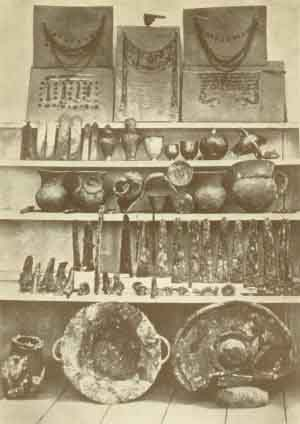
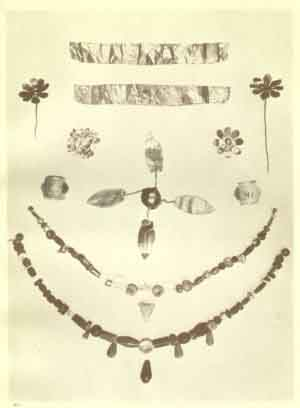
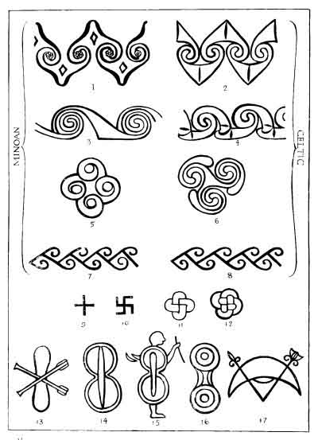

  
[Intangible Textual Heritage](../../index)  [Classics](../index.md) 
[Index](index)  [Previous](moc14)  [Next](moc16.md) 

------------------------------------------------------------------------

[Buy this Book at
Amazon.com](https://www.amazon.com/exec/obidos/ASIN/B002BA5ITU/internetsacredte.md)

------------------------------------------------------------------------

  
*Myths of Crete and Pre-Hellenic Europe*, by Donald A. Mackenzie,
\[1917\], at Intangible Textual Heritage

------------------------------------------------------------------------

p. 216

# CHAPTER X

### Trading Relations with Troy

Obsidian Finds in Troy--Early Shipping Traffic--Copper Age in
Cyprus--Doubt about Crete--Transition from Stone to Bronze in Troy--Was
Copper first worked in Egypt?--The Oldest Bronze Articles--Bronze
manufactured in Crete--Probable Sources of Tin Supply--A Visit to
Troy--Homeric Memories--The Nine Cities at Hissarlik--The First and
Second Citadels of Troy--Hand-made and Wheel-made Pottery--Symbolic
Decorations--Trojan Eye Symbol on Yorkshire Relic--The
Mother--goddess--Treasure of Priam and a Cretan Hoard--Engravings of
Ships with Sails--Cretan and Egyptian Jewellery--Silver Cup and Silver
Bowls--Homeric References--Ægean Influence on Anatolian Coast--The
Inland Hittite Power--Ethnics of Anatolia--Danubian Cultural
Area--Troy's Connections with Thrace--Ancient Conflicts on Plain of
Troy--Problem of the Jade Traffic--European Jade Objects not all
imported--Crete and the European Trade Routes-- Distribution of the
Developed Spiral.

THE influence of Ægean culture, which assumed its specific character in
Crete, extended as far distant as Troad, that strip of north-western
Anatolian coastland which came under the sway of the Trojans. "In the
Early Minoan period 'Crete'", writes Mr. and Mrs. Hawes. [1](#fn_271.md) "was in contact with Egypt on the one
hand and with Hissarlik (Troy) and the Cyclades on the other--pupil of
the former, teacher of the latter." It is possible that Troy's earliest
connection with Crete goes back to the Neolithic Period, for finds have
been made in the stratum of the first city of flakes and small artifacts
of obsidian. This highly-prized stone was probably carried over the sea
from Melos rather than along an overland trade route from Sinai.

p. 217

It would appear that there was a certain amount of regular shipping
traffic on the Ægean Sea in Neolithic times. Crete, as we have seen,
imported obsidian from Melos long before the introduction of metal
working. The beginnings of the trade can be traced at Magasa, where the
flakes were found to be associated with an extremely crude pottery of
great antiquity, and it was well developed apparently during the later
stage of Neolithic culture, to which the obsidian knives from Knossos
are assigned. It is unlikely that Melos was uninhabited when obsidian
was first worked there. Ultimately its people exchanged it for marble
from Paros, which was utilized to shape rough amulets or figurines of
the mother goddess. But, so far, except for the evidence afforded by
these finds of obsidian, no other indications that the Cycladic islands
were occupied during the Neolithic Age have been forthcoming. Stone
weapons have, however, been found in southern Greece and on the large
island of Eubœa. Some of these are so small that they seem to have been
charms, or votive objects, rather than real weapons. The Ægean Neolithic
folk were evidently a peaceful people, and it may be that island
communities utilized wood freely for implements of daily use. Wooden
hand ploughs and wooden bowls were used in the Scottish Hebrides until a
comparatively recent date, and the Egyptian peasants carried staves to
drive their herds, and found them sufficient for purposes of defence.

The early peoples who reached Crete probably came by way of the
Cyclades, either from the Anatolian or Grecian coasts. Before they
accomplished this feat, the art of navigation must have advanced
considerably. If it is held, on the other hand, that they passed direct
oversea from Cyprus or Libya, we must conclude that they were skilled
mariners who possessed well-equipped vessels and

p. 218

were quite capable of conducting a sea traffic from the very beginning.
Perhaps when the Cretan inscriptions can be read some light will be
thrown on this aspect of the problem.

Among the isles, Crete, with its long record of human activity, was ever
prominent in promoting commercial intercourse, and as mercantile
enterprise was the principal factor in its development, Troy was
probably reached by its wind-bronzed and adventurous mariners, who,
having familiarized themselves with the "swan ways" of the Cyclades,
undertook the exploration of the eastern and western shores of the Ægean
Sea, gaining knowledge of prominent landmarks like Mount Athos and the
massive mountain ridge of Samothrace.

Traffic by the sea, as well as by the land routes, must have been
greatly stimulated after the knowledge of how to work metals became
widespread. Ships could then be constructed more stoutly and with
greater celerity, and must consequently have increased in number.
Pharaoh Sneferu's order for a new fleet of forty odd vessels to convey
timber from Phœnicia is an interesting example of the manner in which
ambitious monarchs might strive for mercantile supremacy. No doubt it
was in consequence of the growing competition that experienced seafarers
made voyages of exploration and opened up new routes in all directions.
Malta, as we have seen, received obsidian from Melos; it also imported
jade, which probably came from Anatolia. Jade was carried as well to
Sicily, and as the Cretans imported liparite from the Lipari islands,
after they had established a connection with Egypt, it was probably by
them that jade objects were distributed westward.

It is uncertain when Cyprus was first visited by the Cretan mariners.
The Neolithic relics of that island are

 

 

SEA-TRADERS FROM CRETE,

From the Painting by John Duncan, *A.R.S.A*.

 

p. 219

notably scanty, and some think it was not occupied prior to the age of
metals, as it is devoid of Neolithic strata. No doubt the earliest
Cypriotes, who settled in the eastern river valleys, came from the
Syrian coast. Their pottery was hand-made, and ornamented with incised
designs, and compares more closely to Anatolian than pre-Dynastic
Egyptian or Cretan varieties. The island had its Copper Age, and towards
the close of it wheel-made pottery was manufactured.

It is held by some authorities, including Myers and Hall, that copper
was first worked in Cyprus. If such was the case, it is remarkable that
the island has not yielded traces of early commercial connections with
Crete and Egypt. "Up to the present," says Mosso, "there is no evidence
that copper was worked in the Isle of Cyprus before it was used in Egypt
and Crete. . . . The word Cyprus comes from the name of the plant
κύπρο?&lt;υ?&gt;σ?&lt;?/υ?&gt; {Greek *kúpro<u>s</u>*}, which is the
henna (*Lawsonia inermis*), used for dyeing the nails red." [1](#fn_272.md) Cypriote copper blades are of later date
than those found in Crete, and the earliest flat axe of copper is of
Egyptian Neolithic form. [2](#fn_273.md)

There can be no doubt that Cyprus had a Copper Age before the Age of
Bronze. The same cannot be said with certainty, however, regarding
Crete. Copper weapons have been found in tombs, but they are small and
of votive character, and the larger ones, of which they were copies,
were perhaps of bronze. The few copper dagger blades that have been
unearthed are difficult to place, and the view has been urged that
bronze is as old in Crete as copper. The island of Minos "shows",

p. 220

\[paragraph continues\] Mrs. Hawes says,
"the same phenomenon as Hissarlik, [1](#fn_274.md)
the sudden appearance of bronze at a date not later than 2500 B.C. On
the evidence at present available no Copper Age can be predicated for
the island. . . . The natural conclusion is that Crete knew nothing of
copper until it knew tin also and the superiority of the alloy. This
knowledge must have come through the extension of trade relations., not
by conquest, for no country shows more independence in its metal series
than Crete." [2](#fn_275.md)

Whence was the bronze obtained by the Cretans? Was it from Egypt or
Anatolia? Both Crete and Troy were able soon after the dawn of their
Bronze Ages to import silver, which during the Old Kingdom Period was
rarer than gold in Egypt. The silver may have come from the same region
as tin. One possible source of supplies of silver was Cilicia, where
silver mines are still worked; the other was Spain, in which country
evidence has been forthcoming of early commercial relations with Crete.

Once the secret of how to work metals passed from centre to centre of
Neolithic culture, the ingenuity expended for long Ages in the shaping
of artifacts of flint, obsidian, and jade was directed into new and
inspiring channels. Cretans, Trojans, Cilicians, and Cappadocians alike
may have been stimulated to inaugurate a new era by foreign influences,
but they did not remain as slavish imitators. The pupil not only strove
to excel the teacher, but even to surpass him. As in our own day a new
invention may be improved by a people who have borrowed it, so at the
dawn of the Metal Age the borrowers

p. 221

appear to have contributed towards the development of a discovery which
was to revolutionize the ancient world. Ægean Bronze Age culture has
distinctive features which establish its independent character. It was
not of sporadic development. The indigenous influences which were
manifested during the lengthy Neolithic Age were not cut off by the
importation of metal, but were rather given opportunity to achieve freer
and more brilliant growth in every sphere of human activity. That being
so, we are confronted by an exceedingly difficult problem when we seek
to discover whence either Crete or Troy imported bronze, or the copper
and tin with which to manufacture it. The influences exercised by local
cultures tend to conceal the sources from which borrowings were made.

Copper was known in Egypt in pre-Dynastic times. Indeed, some
authorities hold that it first came into use in that country. "It was
the custom of the proto-Egyptian women, and possibly at times of the men
also," says Professor Elliot Smith, "to use the crude copper ore,
malachite, as the ingredient of a face paint; and for long ages before
the metal copper was known, this cosmetic had been an article of daily
use. It is quite certain that such circumstances as these were the
predisposing factors in the accidental discovery of the metal. For on
some occasion a fragment of malachite, or the cosmetic paste prepared
from it, dropped by chance into a charcoal fire, would have provided the
bead of metallic copper and the germ of the idea that began to transform
the world more than sixty centuries ago." At first copper was used for
small ornaments and then to make needles, one end of a copper wire being
bent down to form an "eye". In time, chisels and axes and other
implements were manufactured in imitation of those of stone which were
in use. "Every

p. 222

stage in the history and evolution of the working of copper", he holds,
"is represented in Egypt, and is preserved under circumstances that
enable us to appreciate in some measure the motives which led the
Egyptians on, step by step, to the full realization of the immensity of
the power they had thus acquired." [1](#fn_276.md)
Professor Elliot Smith follows Dr. Reisner in this connection. [2](#fn_277.md)

Others hold that copper was first worked in Asia. Professor Myers, as we
have indicated, favours Cyprus. [3](#fn_278.md)
Mr. Hall, who supports the view that the knowledge of corn passed from
Palestine to Egypt and Babylonia, thinks that the knowledge of metal may
have come from the same quarter, Sinai, Syria and Cyprus being "the
original focus of the distribution of copper over Europe and the Near
East. Copper came gradually into use among the prehistoric Southern
Egyptians towards the end of the predynastic age. And they must have
obtained this knowledge of it from the Northerners." Mr. Hall adds: "Dr.
Reisner considers the Egyptian evidence alone. and not in connection
with that from the rest of the Levant". [4](#fn_279.md)

It is also contended that the manufacture of bronze was not an Egyptian
invention, and that Troy and Crete were probably in touch with the
centre where copper was first hardened by tin and antimony. Mr. Hall
suggests that this art "came from the Middle East, where tin is found,
to Greece, as well as Babylonia and, eventually, to Egypt". [5](#fn_280.md) Babylonia, like Cyprus, had a long
Copper Age.

No direct proof has yet been forthcoming, however, that Egypt imported
its first bronze implements. The fact cannot be overlooked that the
oldest bronze relics yet

p. 223

found come from the Nile valley. No discovery has yet been made that
bronze was manufactured elsewhere prior to 3000 B.C. A few objects of
bronze have been found in First Dynasty tombs. Maspero gave Angelo Mosso
a piece of metal plate from an Abydos tomb to analyse. The test showed
"copper 96.00 and tin 3.75 per cent". [1](#fn_281.md) Another important relic is the famous
"bronze rod of Medum", which belongs to the Third Dynasty period. It was
found embedded in the fillings of a mastaba associated with the pyramid
of King Sneferu. Pure copper was also used extensively throughout Egypt
for the manufacture of weapons and implements from pre-Dynastic times
till the Twelfth Dynasty. Iron was known at an early period, and is
referred to in the Pyramid texts. It probably had a religious
significance.

The Egyptians may have received their earliest supplies of copper from
Sinai, which they visited to obtain turquoise in the Neolithic
Age. [2](#fn_282.md) We know that expeditions were
sent to work in the copper mines in that region at a later period (Third
Dynasty). Whence was the tin obtained to harden the copper? A possible
source of supply is North-western Arabia. That it could be found there
is suggested by the Biblical reference to the spoils taken by Moses from
the Midianites, which included "the gold and the silver, the brass, the
iron, the tin and the lead". [3](#fn_283.md)
Another possible source is Anatolia, where tin is said to exist. The
raiders against whom Pharaoh Sneferu of the Third Dynasty waged war on
the Delta frontier may have come down an ancient trade route, having
ascertained that rich plunder could be obtained in Egypt. There is also
tin in Italy as well as copper, but the earliest copper weapons found in
that country are of

p. 224

advanced Cretan type (Middle Minoan). Local forms which have been found
are not of earlier date.

It may be that Egypt's scanty supplies of tin during the Old Kingdom Age
came from more than one source. Mr. W. M. Muller sees on a Sixth Dynasty
relief "Ægeans bearing tin into Egypt". If the figures referred to are
Ægeans, they were certainly Cretans. It is of special interest to find
in dealing with Egypt's early imports of metal that a socketed bronze
hoe of the Sixth Dynasty resembles examples from Cyprus and South Russia
which are preserved in the British Museum. This artifact may have come
down the sea trade route by which sporadic supplies of tin and bronze
were carried. The manufacture of bronze in Egypt never assumed great
dimensions, on account of the difficulty experienced in obtaining tin,
prior to the Twelfth Dynasty. Its early Metal Age was mainly a Copper
one.

After the mariners of Crete began to bring home supplies of bronze, its
traders no doubt did their utmost to acquire the secret of how to
manufacture it. It may be that, like Solomon, who sent Hiram of Tyre
annual supplies of wheat and oil in return for timber from Lebanon and
skilled workers in metal, [1](#fn_284.md) a Cretan
monarch made arrangements with an Egyptian or Anatolian Hiram to send
him artisans who were skilled in the manufacture of bronze.

One of the places in Crete where bronze was cast was a headland on the
Gulf of Mirabello about three miles east of Gournia. An ancient copper
mine there is called by the peasants "Chrysocamino", which signifies
"the oven of gold" or "the golden furnace". Describing it, Dr. Hazzidaki
writes: "The seashore rises for above 100 metres, and here is the cave
with so small an

p. 225

entrance that one has to go down and creep in on hands and knees. The
cave is 52 metres long, the roof is irregular in height, about 2 metres
near the entrance, that is, 2 metres from it, and in the middle it
reaches a height of 20 metres, and at the far end it is 12 metres high.
The walls and roof are covered with stalactites, and the rock is
calcareous. Great blocks of stone have fallen from above, especially at
the far end of the cave." Small fragments of primitive pottery of
uncertain date were found in the cave. and also pieces of Middle Minoan
times.

Smelting operations were carried on near the entrance of the cave, as is
indicated by a piece of crucible found by Dr. Hazzidaki. Inside, pieces
of scoria were picked up. The copper appears to have been entirely
worked out. [1](#fn_285.md) Specimens of rock
taken from a cliff in the vicinity have yielded a small percentage of
copper.

Bronze was also cast in Gournia. This is proved "by the finding of
scraps of bronze and slag, pure copper adhering to smelting vessels, a
crucible pot for carrying a charge of metal, and by numerous stone
moulds, into which the molten metal was run for making knives, nails,
awls and chisels". Copper was used for the manufacture of bowls, jars,
and other utensils, but "weapons were of bronze, containing as much as
ten per cent alloy with copper". [2](#fn_286.md)
Copper daggers with an extremely small percentage of tin have also been
found.

But although copper could be found in Crete, the tin, as has been
indicated, had to be imported. "By the beginning of the Bronze
Age", [3](#fn_287.md) writes Dr. Mackenzie in this
connection, "the valley of the Rhone must have played a dominant role of
communication between the

p. 226

great world of the Mediterranean and the north; by that time it was
probably already the high continental trade route towards the tin mines
of Britain." Angelo Mosso also favours the hypothesis that Crete's early
supplies came from England. "We know the road", he says, "followed by
the caravans bringing English tin through France to the mouth of the
Rhone at the end of the Neolithic period, while no trace of any trade in
tin has so far been discovered in the East." [1](#fn_288.md) Mosso's reference to the "East" applies
to "the mountains of China where tin is found".

Mrs. Hawes, who favours a Nearer Eastern source, writes as follows:
"When the Pumpelly expedition returned from Turkestan in 1904, one of
the members brought potsherds indistinguishable at first sight from the
brilliantly mottled ware found at Vasiliki during the same season. . . .
The strong likeness between the two fabrics, of which the writer has
personal knowledge from having handled them together, is more reasonably
explained by intercourse than by accident. Moreover, Dr. Hubert Schmidt,
who accompanied the expedition, reports that a neighbouring tumulus
(near the large one in which the pottery was found) gave him a
three-sided seal-stone of Middle Minoan type, engraved with Minoan
designs--man, lion, steer, and griffin. How shall we explain those
evidences of Ægean influence in Southern Turkestan? They must be brought
in line with other proofs of contact."

This distinguished lady archæologist refutes Dr. Muller's view that the
Ægeans who carried tin into Egypt obtained their supplies from a trade
route that connected Central Germany with the sea coast. "The
backwardness of Europe in learning to employ metal", she says, "is

p. 227

undeniable." Hungary, like Cyprus, had a Copper Age before bronze became
known. "We see", she writes, "that at C. 2500 B.C. Asia Minor shared
with the Ægean the knowledge of bronze, whereas three centuries later
Europe was still in the Stone Age. . . . As further explanation of the
priority of bronze in Asia Minor, we may now suggest the probability
that, long before tin was discovered in Europe, it was being brought
overland through Asia Minor, and also by way of Transcaucasia and the
Black Sea from distant Khorassan, Strabo's Drangiana, where its presence
has been confirmed. Excavations at Elizabethpol in Transcaucasia have
revealed a culture in early contact with the Ægean." [1](#fn_289.md) She thinks that carriers "not unlike the
swift Scythians of Herodotus, frequented both the tin-producing region
south-east of the Caspian and the copper region of the Danube at an
early date". [2](#fn_290.md)

Troy was a probable "clearing house" of the early tin and bronze trade.
We should therefore visit it before dealing with Ægean commercial
connections with Western Europe.

Our course is a north-eastern one across the island-strewn Ægean Sea.
This way went the Homeric Achæans who fought for the possession of
Helen, the heiress of the Spartan throne, and no doubt with desire also
to expand their area of political influence in the interests of
commerce. We cast anchor as we draw near the southern shore at the mouth
of the Hellespont. Since the dawn of history myriads of vessels have
passed beyond this point to navigate the narrow strait, the modern
Dardanelles, that leads towards the Sea of Marmora and the great Black
Sea beyond it.

p. 228

The famous Troad lies before us. It is a country which does not make
much appeal nowadays, but must have offered many attractions to early
settlers. The valleys are suitable for agriculture; there is excellent
herbage on the hillsides for flocks and herds, and an abundance of game
among the mountains. During winter the south winds from the
Mediterranean impart to it a milder climate than prevails in the
Balkans, or the uplands of Phrygia, and the summer heat is tempered by
the cool Etesian winds. Water is plentiful; there are numerous springs
and generous rivers flowing from the mountains. Withal there is an
abundance of timber, much good clay for brick-making, and an endless
supply of limestone with which to erect dwellings and strong, high walls
to protect citizens and their domesticated animals against the attacks
of bears and lions and cunning wolves that prowl through the forests and
up and down the green valleys, not to speak of human enemies.

We land at the mouth of the famous river Scamander, turning our backs on
the unpicturesque tongue of European land known to the ancients as
Chersonesus, and in our day as the peninsula of Gallipoli; we also take
our eyes from the shouldering hills of the island of Imbros, behind
which towers sublime Mount Saoce, the loftiest peak of Samothrace, on
which the god Poseidon aforetime sat to watch the Homeric heroes
performing mighty feats of arms.

Our steps are directed inland, and we proceed to cross the long and
windy Plain of Troy, remembering

       Old unhappy far-off things  
And battles long ago.

Yonder towards the south-east, blue above the ridges of woody hills, is
the Anatolian range of Mount Ida, which

p. 229

forms a noble frontier of the Troad; there Paris was once a shepherd;
thither, too, fled Æneas after Troy fell. To the west is the high
coastland of the Ægean Sea, and eastward and north-eastward are broken
groups of featureless mountains divided by pleasant valleys. Less than 4
miles in front of us we can distinguish a boat-shaped hillock, on the
spur of a sloping hill, rising abruptly from the plain: that is famous
Hissarlik, the site of the ruins of the various citadels of Troy.

The memoried plain is bordered on either side by the Rivers Simœis and
Scamander. There are marshes to avoid, as in Homer's time, but these are
easily detected at their utmost limits by the clumps of long grasses and
weeds, and of whispering tamarisks which also fringe the steep and
crumbling river banks.

The Simœis has shrunk to a few inches in depth, for it is now late
summer; puffs of wind blow clay dust from its clay-caked and
stone-strewn bed. Down a beautiful valley it flows westward, as if to
cross the plain towards the Ægean Sea, until it curves round a ridge of
hills and directs its course to the shore of the Hellespont. The more
famous Scamander is about 2 feet deep and about 20 feet in breadth.
When, however, the snows are melting on the Ida range it is exceedingly
turbulent, and of such great volume that it carries down trees and
boulders, and occasionally overflows its reedy banks to submerge the
plain. The Simœis similarly rages furiously at this period.

There is an interesting reference in the *Iliad* to the sudden rise of
the rivers after a "cloud burst". When Achilles drove one part of the
Trojan army into the city and another into the Scamander,

                             the plain he found  
All flooded o'er, and, floating, armour fair,  
And many a corpse of men in battle slain.

p. 230

The Scamander was supposed to be increasing for the express purpose of
resisting his advance. The roar of its spring flood resounds in the
sonorous hexameters of Homer, but sinks to a spray-like hiss in an
English translation.

                                Rearing high  
His crested wave, to Simœis thus he [1](#fn_291.md) cried:  
"Dear brother, aid me with united force  
This mortal's course to check; he, unrestrained,  
Will royal Priam's city soon destroy.  
Nor will the Trojans his assault endure.  
Haste to the rescue then, and from their source  
Fill all thy stream, and all thy channels swell;  
Rouse thy big waves, and roll a torrent down  
Of logs and stones, to whelm this man of might." [2](#fn_292.md)

We reach Hissarlik and ascend it to survey a maze of ruins. The fields
around us were tilled and irrigated aforetime, when there were watchmen
on the "topless towers" to give warning of the approach of raiders.
These keen-eyed men could see far up the valleys; nor could vessels
cross the Hellespont without their knowledge; and they had glimpses to
the west, across the Scamander, of the Ægean Sea, which is but 3¼ miles
distant, and were thus able to herald the approach of the galleys of
Crete.

Before Schliemann began to excavate on this wonderful hillock, by
cutting a deep broad trench through the various strata, it towered about
160 feet above the level of the plain; but when the earliest Neolithic
people first chose it as a settlement, it was not much more than 50 feet
high. Distinct traces survive of nine cities in all, the latest being
the Troy of the Roman Age. Each city, after the first, had been erected
on the levelled debris of

p. 231

the previous one. So the hill, like a stooping giant, gathered from age
to age an increasing burden for its great unwearied back.

Troy I was built in the Neolithic Age. Its deposit of from 12 to 14 feet
indicates that it endured for many long centuries. Portions of its walls
constructed of small stories, here and there in herring-bone pattern,
were laid bare by Schliemann. As the foundations, in some parts, do not
reach the bedrock, it is evident that the hillock was occupied for a
considerable period before stone was utilized for building purposes. The
earliest defensive works may have been ramparts of earth.

Hissarlik was apparently from the earliest period the citadel of the
city which lay round it on the plain. Here dwelt, in a palace, the king
and his family, and here also were stored the treasure and winter
food-supply of the tribe. When enemies poured down the mountain passes,
or across the Hellespont from Europe, the citadel became a shelter for
women and children, and for flocks and herds. Inside its walls, too, the
warriors found safe retreat when attacked by overwhelming numbers. The
hill forts and brochs of Scotland appear to have served a similar
purpose.

Within the area of Troy's Neolithic citadel traces survive of the stone
foundations of houses and of certain erections usually referred to as
"sheep-folds". Of special interest are the remains of pottery which have
come to light. The fragments unearthed by Schliemann were of the
hand-made variety, and these are numerous and varied enough to show that
the Trojan ceramic art was developed locally and attained a
comparatively high degree of excellence. Invariably the pottery is dark
and decorated with geometric designs, the incisions being filled in with
white chalk as in Crete and Egypt. A fine surface finish was effected by
the use of the smoothing-stone.

p. 232

Doubt has been expressed as to whether all the bronze implements which
Schliemann associated with this early stratum really belong to it. Some
of these may have fallen down the sides of his trench, and got mixed up
with the relics of a deposit with which they had originally no
connection. It appears certain, however, that the Neolithic city was in
existence at the dawn of the Metal Age in Crete, for some of the bronze
implements in question are unlike those found in later strata.

The second city was erected before 2500 B.C. Whether or not there was a
fresh racial infusion we have) as yet, no means of knowing. It is
significant to find in this connection that there are distinct traces of
development from the Neolithic period, especially in the ceramic relics,
a sure indication that a considerable portion of the old stock remained.
For the first time the hillock was levelled, a process which no doubt
obliterated much valuable evidence, and it then stood about 100 feet
above the sea-level. Retaining stone walls, which sloped inward, were
also erected, and those round the south-western and western sides of the
eminence can still be traced.

This was the city which Schliemann believed to be Homer's Troy, because
it contained a great amount of burnt debris. But in this he was
mistaken. Shortly before he died, however, he found some Mycenæan
potsherds which afforded a clue to the mystery and enabled Dr. Dörpfeld,
the distinguished German archæologist, who conducted subsequent
excavations, to locate Homer's city in the sixth stratum.

Dr. Dörpfeld has divided the history of the second stratum into three
periods. These may be referred to as Troy II A, B, C. The citadel of
Troy II A, was little more than a tribal fortress about 100 yards in
diameter. There were two main entrance gates, one on the south-western

p. 233

side and the other on the southern. The pottery which was manufactured
resembled the hand-made variety of the Neolithic settlement, but the
workmanship displayed was on the whole inferior. Apparently we meet here
with the decadent period during which vessels of stone were being
constructed with the use of copper drills.

In the Stratum II B the new pottery makes its appearance. The Egyptian
potter's wheel had evidently reached Troy as well as Crete, while the
enclosed baking-furnace also came into use. There can be no doubt,
therefore, that a brisk trade was being conducted along the trade routes
both by land and sea. Considerable progress was effected also in
architectural work, brick as well as stone being largely used.

The evidence of Stratum II C shows that the citizens of Troy were
progressing by leaps and bounds. Traces of destruction by fire of
earlier buildings suggest that frequent conflicts were waged round the
fortress, and it is possible, therefore, that the extensions and
alterations which were effected from time to time were rendered
necessary to maintain the prestige of the city in stirring and difficult
times, when hordes of nomads were enabled by the acquisition of metal
weapons to overrun large portions of territory.

It was during the period covered by the deposits of the second city of
Troy that the great masses of Asiatic pastoral nomads pressed into
Europe and conquered the more passive and more highly-cultured
agriculturists of the Mediterranean race. As much is indicated by the
burial remains of the Early Bronze Age in Europe, which show that a
broad-headed people pressed westward, first along the uplands and then
across the valleys, in increasing numbers, here adopting the funerary
customs of their predecessors, and there introducing their own.

p. 234

Troy continued to develop its own civilization, resisting, it would
appear, for a long period the raids of plundering barbarians. That its
wheel-made pottery was not imported is made evident by its distinctly
local characteristics. The hand-made jars, with side projections,
pierced for suspension, which were characteristic of Stratum II A,
assumed more artistic character in Stratum II B, when the wheel came
into use. Another link between earlier and later times is the "face
urn". These interesting Trojan products indicate that the decoration of
pottery may have had a mythological significance. Zigzag, St. Andrew's
Cross, herring-bone, and V-shaped designs, as well as rippling lines,
"trickle ornaments", and dots, may therefore have meant much to the
people who believed that their food-supply was the gift of a deity, or
group of deities, whose favours they constantly invoked by performing
ceremonies and offering sacrifices. In the Odyssey the Phæacians toasted
the deity when they drank together. King Alcinous, addressing his guests
after Odysseus had partaken of his meal, spoke as follows:--

Pontonoüs! mingling wine, bear it around  
To ev'ry guest in turn, that we may pour  
To thunder-bearer Jove (Zeus) . . .  
                         When, at length,  
All had libation made, and were sufficed,  
Departing to his house, each sought repose. [1](#fn_293.md)

Food and drinking vessels may have been dedicated to deities as well as
the potter's wheel, which, as has been indicated, was credited to the
god Ptah in Egypt. The spirit of the god, or of one of his emissaries,
may have been in the cup. It is of interest, therefore, to find that the
lips of some of the Troy vessels are ornamented with

 

 

GENERAL VIEW OF "THE TREASURE OF PRIAM"

(From the photograph by Schliemann in "Atlas Trojanischer Alterthümer.)

The topmost row shows the Golden Diadems, Fillet, Ear-rings, and small
Jewels. Second row--Silver "Talents" and of Silver and Gold. The Silver
Vases and curious Plate of Copper. Third Row--Silver Vases and curious
Plate of Copper. Fourth row--Weapons and Helmet--crests of Copper or
Bronze. On floor--Vessel, Caldron, and Shield (all copper).

 

p. 235

circles enclosing dots. One characteristic fragment shows two circles
with a straight line drawn down between them. It is obvious that the
potter desired to represent a face with staring eyes. Schliemann
believed that the face was intended for that of an owl, and constantly
made reference to "owl-headed" vases. Another fragment, however, shows
clearly that the crude artistic efforts were directed towards the
representation of the human face. No attempt was made to indicate the
nose line, but the eyes were fairly well shaped, and above these the
eyebrows were drawn also. In other examples the eyebrows and nose were
shaped like a bird in flight, the eyes being represented by perforated
circles, while a straight line represented the mouth.

This tendency towards realism is found to be less pronounced, however,
as the vessels become of more complicated and finer construction. The
arched eyebrow, the eyes and ears, yield to purely decorative
tendencies, and become symbols, as do also the dots, rings, and cones
representing female breasts; the swastika on the lower part of the body
is evidently a fertility symbol. This process of developing symbols from
natural objects can be traced even in the Palæolithic Age. It does not
follow, however, that the change robbed the ornaments entirely of their
religious and magical character, difficult as it may be to discover
where a symbol is divested of significance and a purely artistic motive
begins.

The Trojan method of representing the human face, with the
bird-wing-shaped nose and eyebrows and the eye dots, is paralleled by
similar designs on objects from the Greek islands. Interesting examples
of the same artistic motive have been found in the East Riding of
Yorkshire. In a trench surrounding a burial cairn on Folkton Wold were
discovered chalk drums associated

p. 236

with unburnt burials. These are ornamented with spirals, St. Andrew's
Cross, and other characteristic Ægean designs, and also with the
eyebrows and eye symbols. As the latter appear on standing-stones of the
Marne and Gard valleys in France, and on early Bronze Age vessels in
Spain, it may be that the chalk drums are interesting survivals of
racial or cultural influence which reached these islands across the
English Channel by way of Spain. [1](#fn_294.md)

The second stratum of Troy is remarkable for its treasure hoards.
Schliemann found no fewer than seventeen of these. The most famous is
the "royal treasure", or, as he called it, "the treasure of Priam",
which, with the assistance of his wife., he concealed during the
workmen's dinner-hour. The objects were of rich and varied character. In
a silver jar had been stored two great diadems of elaborate
construction, which were worn by females of high rank. One is composed
of four rows of small heart-shaped leaves of gold connected with fine
wire, and is fringed with a row of larger pendants suggesting the human
form. On either side are tails, terminating with larger pendants in a
bunch. This diadem is about the breadth of the forehead, and when
clasped round the head the hair was bunched above it, while the tails
fell downwards and lay on the shoulders. Elaborate ear-rings were also
worn, as well as rich necklaces made of small gold rings strung
together, and bracelets of twisted gold. Some of the ear-rings are of
spiral design. The spiral is also associated with the rosette to
ornament elaborate gold hairpins and broad bracelets. A small gold
eagle-shaped ornament is of special interest, as it indicates the
sanctity with which that bird was invested in this region.

Included in the hoard are several bars of silver, which

p. 237

may, as Schliemann suggested, have been used for money. A silver dagger
was no doubt a royal weapon used on occasions of great ceremony. Like
the bronze daggers it was pierced so as to hold the rivet with which it
was attached to the handle. One dagger handle is carved in ivory and is
reminiscent of Palæolithic Magdalenian Art, for it is shaped to
represent a crouched animal. A bronze handle of similar design has been
discovered in Etruria, and is now in the Kestner Museum at Hanover.

Among the objects in lead, special reference should be made to a
figurine of the mother-goddess. It is of somewhat conventional design,
like the terra-cotta figurines found in Cyprus, Mesopotamia, and Greece,
and those of marble and other stone in the Cycladic islands. The face is
stern, with a hard drooping mouth, and the eyes stare cold and angrily.
Long curls dangle down from the ears; the neck is exaggerated and
crossed with symbolic markings, and the hands are clasped across the
breast. The female characteristics are pronounced, and on the lower part
of the body the swastika, or hooked cross, is depicted on a V-shaped
projection surrounded by round bosses. The legs are merely suggested,
and may have been used as a handle, or as a spike to be thrust into the
soil of a holy mound. Votive figurines found at Anau in Turkestan, and
those also from Sumeria, were attached to nails, or terminated like
nails, so as apparently to be driven into sacred shrines, for the same
reason as the visitors to sacred wells drop pins into them, or attach
rags to overhanging trees. Prayer-nailing still obtains in the East.

It may be remarked here that the third, fourth, and fifth citadels of
Troy, which cover a period between about 2000 B.C. and 1500 B.C., are of
no great account. The city shrank in importance after the occurrence of
a great disaster which is indicated by the fire-swept remains of

p. 238

Stratum II C. The sixth, or Homeric Troy, will be referred to in a
subsequent chapter.

Since Schliemann's day, attempts have been made to relegate the
"treasure of Priam" to a comparatively late period, one nearer Troy VI
than Troy II A. Indeed, it has been asserted that this rich hoard fell
down the trench from the sixth city stratum. But although Schliemann
sometimes nodded, like Homer, his location of the treasure can no longer
be disputed. In 1908, Mr. Seager, the American archæologist, discovered
a similar hoard on the island of Mochlos, which lies about two hundred
yards off the north-eastern coast of Crete in the picturesque Gulf of
Mirabello. For some 4500 years the treasure had reposed in a necropolis
of the Early Minoan Period, happily secure from the attentions of
generations of tomb robbers. The island is barren and without a water
supply, and was consequently never suspected of containing anything of
value. At one time it may have been part of a peninsula which sheltered
a natural harbour much frequented by the earliest mariners.

The hoard included gold diadems, rings, pendants, hairpins, and fine
chains, "as beautifully wrought", Sir Arthur Evans has remarked, "as the
best Alexandrian fabrics of the beginning of our era". [1](#fn_295.md) There were no spiral designs as at Troy,
but wonderful artificial leaves and flowers. Of special interest are the
gold bands "with engraved repoussé eyes for the protective blind-folding
of the dead". These, Sir Arthur suggests, were "the distant
anticipations of the gold masks of the Mycenæ graves". Bead necklaces
were probably charms. Associated with these articles were miniature
stone vases of local material. Some were of Early Egyptian form, and all
were of exquisite workmanship.

 

 

GROUP OF JEWELS FROM THE HOARD DISCOVERED IN THE ISLAND OF MOCHLOS

(See page [238](#page_238).md)

 

p. 239

An engraving on a ring in this hoard depicts a ship with a sail and a
full equipment of oars. Troy may have been visited by the men who
crossed the seas in vessels of this kind. Traces of Cretan commerce have
been forthcoming at Hissarlik, and Trojan artifacts have been found in
Crete. In 1909 discovery was made at Phæstos of a fragment of pottery
which resembles fragments of the same date (Early Minoan II) found in
the second city of Troy. Relics of Cretan connections with Troy have
also been found at Vasiliki and other eastern sites.

Crete's reputation for metal-working was widespread among the ancients,
but no one dreamed, before Mr. Seager made his important discovery, it
was of such great antiquity. The remarkable technique displayed shows
that the craft had a long history. It no doubt owed something to Egypt,
if, indeed, it was not established on the island by Egyptian traders.
"Of the jewelry worn by the Pharaoh and his nobles, in the Old Kingdom,"
writes Professor Breasted, "almost nothing has survived, but the reliefs
in the tomb chapels often depict the goldsmith at his work) and his
descendants in the Middle Kingdom have left works which show that the
taste and cunning of the first dynasty had developed without cessation
in the Old Kingdom." [1](#fn_296.md) The Cretan
ornaments have distinct local characteristics. Like the painters and
potters, the goldsmiths showed a distinct feeling for nature, as in
their leaf and flower designs; one notable ornament is the Cretan
equal-limbed cross. Of special interest, too, is a clover-leaf
ornament-an anticipation of the Irish devotion to the shamrock.

At the time the articles in the Mochlos hoard were manufactured, there
must have been many wealthy men in Crete. Those whose ships visited Troy
and Spain

p. 240

were probably the possessors of articles of silver as well as gold. But
none of these have been discovered. Perhaps some of the Early Minoan
silver artifacts were so highly prized that they were kept as heirlooms.
Dr. Xanthondides found two silver daggers in a tomb at Kumasa, near
Gortyna, while excavating tombs of the Early Minoan III Period. They
were ribbed and of triangular shape, like other daggers of bronze.
Associated with these metal objects were steatite "libation vases", a
rough marble figure of the mother-goddess, three miniature vases with
lids on a reel-shaped stand, and an earthenware vessel of teapot shape
with geometric ornamentation. Sir Arthur Evans discovered several silver
bowls of the Middle Minoan Age at Knossos. Among the finds of the
American archæologists at Gournia is a shapely silver cup with handles,
from a house tomb, which recalls Homer's reference to "a silver cup, the
work of the Sidonians". [1](#fn_297.md) It is,
however, of much greater antiquity than anything which can be credited
to the Phœnicians. Perhaps it was won by the individual in whose grave
it lay for displaying skill as a boxer. A double silver cup was awarded
to the Homeric athlete Epeius, who "knocked out" Euryalus at the funeral
games that followed the burning of Patroclos. [2](#fn_298.md) Joseph, [3](#fn_299.md) who was so greatly honoured by the
Pharaoh, was the possessor of a silver cup, and must therefore have been
wealthy as well as influential.

The Cretans may have received their supplies of silver from Troy, where,
as is shown by the articles made from that metal in "Priam's treasure",
it was abundant enough.

Some hold that this silver came from Spain, and their theory will be
dealt with later in this chapter. Others favour the view that the
Trojans and Cretans imported it

p. 241

from Lydia or Cilicia. It is possible that silver was obtainable by the
island mariners at primitive commercial centres at or near Miletus,
Ephesus, or Pitane. But of this there is no direct proof. The remarkable
fact has to be given recognition in this connection that no traces of
early Ægean trade have been found at any of these points. [1](#fn_300.md) Even the islands of Samos, Chios, and
Mitylene have failed to yield any indications of commercial connections
with Crete and the Cyclades during the Early Bronze Age. "Except for
their north-western corner", writes Mr. Hogarth, "the Asiatic coasts of
the Ægean lay, until very late, outside the culture-area associated with
the name of that sea. But if 'tis true, 'tis strange! Why did the Cretan
and other Ægean sea-rovers, whether pirates or merchants, or both, fail
to settle on these particular coasts and isles? They had pushed their
wares into Hissarlik, and had filled all the opposite shores of Europe
with a culture much higher and more vigorous than any which has left a
contemporary trace in Anatolia." Mr. Hogarth believes that "there must
have been some strong continental power dominating all the west-central
coast of Asia Minor from an inland capital. It must have been a
non-maritime power, careless about developing its coast lands, but
careful to keep others away from them." This power was the Hittite--the
confederation of peoples controlled by the Hatti, the "white Syrians" of
Greek tradition, whose ancient capital was situated at Boghaz'köi. It is
possible that the early Ægean influences

p. 242

which permeated Anatolia were introduced through the medium of Troy.

Troy appears to have existed during the Late Stone and Early Bronze Ages
as the capital of an independent state. Its earliest settlers were
probably of the Mediterranean race, and congeners of the Neolithic folk
of Thrace and the Danube area, who had pressed northward through Syria
and round the southern Anatolian coast, or by way of the "Cilician
gates", to the western shores of the Ægean Sea, afterwards crossing into
Europe. This racial movement, which radiated also throughout the
agricultural valleys of Anatolia, appears to have taken place before the
broad-headed Hatti, who were a pastoral people, became the dominant
race. It may be also that there survived among the mountains descendants
of the ancient Palæolithic races. The Etruscans, for instance, whose
racial affinities are obscure, are believed to have come from Anatolia.

The Danubian cultural area was of wide extent. It included part of
southern Russia and part of southwestern Austria, the whole of Thrace
and Macedonia, and a portion of Thessaly. At several centres a high form
of Neolithic culture was developed. "There is reason to believe", writes
Mr. Hogarth in this connection, "that some population, racially kin to
that which developed the Ægean culture, was present on the Anatolian
coasts from early times, and also that there had been very early passage
of influences, and perhaps of peoples, from Balkanic Europe to Asia
Minor. Not only has the earliest sub-Neolithic stratum at Hissarlik
produced pottery and weapons closely resembling those of Neolithic
Danubian graves, but at two other places where sub-Neolithic settlements
have been explored in north-west Asia Minor, Danubian analogies are even
more certainly to be

p. 243

remarked. Those places are Boz Eyuk in Central Phrygia, and Yortan in
Mysia. The vases of the latter site, where there is a cemetery of the
earliest Bronze Age, show close analogies with Cypriote forms, and
suggest that the earliest migrants from Europe spread sporadically far
down through the peninsula to the Levant." [1](#fn_301.md)

Like Anatolia, the Danubian area was a melting-pot of races. In addition
to the Armenoids of Hatti type who invariably clung to an upland
habitat, but also fused in localities with the Mediterranean peoples,
the fair northern peoples pressed southward to absorb the local culture
and fuse with the earliest settlers. The ethnic friction which resulted
caused periodic migrations of displaced peoples. There was, therefore,
much crossing and re-crossing of the Hellespont and the Bosphorus in the
Late Neolithic and Early Bronze Age Periods.

Troy, by reason of its situation, must have been ever a meeting ground
of various ethnic elements. Many desperate conflicts, no doubt, were
waged on its windy plain long ages before the Homeric era. There were
rich spoils besides in its citadel to attract the invader. It lies at
the end of the northern trade route which runs through Anatolia towards
Mesopotamia, and must ever have been a "market-place" for traders, who
could exchange there their far-carried commodities for the products of
Thrace and the Ægean.

Various axes of green and white jade, which Schliemann found in the
stratum of the first city, may be relics of an ancient trading
connection with the east, as the knives and arrow-heads of obsidian
appear to be of a connection with the Cyclades.

When the jade objects were first found they caused a flutter in
archæological circles. It was pointed out that

p. 244

scrapers and other articles made of jade had been found associated with
the Swiss lake-dwellings, and at Neolithic sites in Brittany and in
Ireland, as well as elsewhere throughout Europe. The belief obtained
generally that these jade artifacts were imported into Europe from the
borders of China, and Professor Fischer expressed the wish "that before
the end of his life the fortune might be allotted to him of finding out
what people brought them to Europe". [1](#fn_302.md) Professor Max Müller believed that the
jade-carrying immigrants were the Aryans. "If", he wrote, "the Aryan
settlers could carry with them into Europe so ponderous a tool as their
language, without chipping or clipping a single facet, there is nothing
so very surprising in their having carried along, and carefully
preserved from generation to generation, so handy and so valuable an
instrument as a scraper or a knife, made of a substance which is *aere
perennius*." [2](#fn_303.md)

It is not now believed, however, that all the jade objects found in
Europe came from "a common far-distant home in the Kuen Luen Mountains".
Since Müller connected his Aryans with jade, the two species of it,
nephrite (jade proper) and jadeite, have been found in different parts
of Europe. Nephrite has been discovered in Silesia, Austria, and North
Germany, and it is believed to exist in Sweden, while jadeite, or a
similar rock, was found not long since among the Alps. It is probable,
therefore, that the Swiss and other scrapers were chipped from pebbles
of jade picked up by the European Neolithic people. The quantity and
quality of the Hissarlik axes, however, suggest an eastern source of
supply, and it may be that these and the Maltese polished axe pendants
of jade are genuine relics of primitive commerce. As the latter were
charms, it would appear that the magical qualities

p. 245

of jade were given recognition at a remote period. Among the Greeks it
was the "kidney stone", and among the Spaniards, who imported it from
Mexico, the "colic stone". Various rare stones were believed by the
ancient peoples to have curative qualities. Instances could be cited of
the possession, by representatives of ancient families at the present
day, of stone charms of this kind that have long been treasured as
heirlooms.

Although archæologists are less inclined nowadays than they were a
generation ago to believe in the existence of Neolithic trade-routes
which extended from the borders of China to Brittany, or to connect
certain races with relics of similar character found in widely separated
districts, there can be little doubt regarding the existence of
commercial relations between different cultural areas. The introduction
of metal appears to have done much to stimulate international trade. In
the Early Bronze Age the influence of the Ægean, which may have
"inspired every stage of culture" at Hissarlik, as Mr. Hogarth suggests,
appears to have penetrated Thrace. Evidence has been forthcoming that
two main trade-routes crossed Germany, one from the head of the
Adriatic, and the other from the lower Danube valley. It has been
suggested that some of the amber found in Crete came down these trade
routes from the Baltic. [1](#fn_304.md) France was
similarly crossed by the Rhone valley trade-route, down which, in time,
tin from Cornwall was carried. That the Cretans were the earliest
seafarers to come into direct touch with these routes is suggested by
various interesting links of evidence. The most remarkable are the
Egyptian glass beads found in South Germany, and the Egyptian blue-glaze
beads taken from ancient graves on Salisbury Plain, which will be dealt

p. 246

with in a later chapter, as they are connected with the Late Minoan
Period.

Certain Continental archæologists incline to the belief that not only
Crete but even Egypt was in direct touch with Western Europe at an
extremely remote period. Summarizing their views, Angelo Mosso writes:
"The vases found at Amerejo in Spain have the characteristic form of the
Egyptian vases of the close of the Neolithic Age. The resemblance of the
Egyptian idols with those of Crete and the Continent is an established
fact; the burial sites are similar; the flat copper axes of Egypt cannot
be distinguished from those of the Continent; the evolution of art in
Southern France and in Spain went on during the Neolithic Age, and we
know that navigation was general on the Mediterranean in the times
preceding the introduction of copper-all these data give good reason to
suppose that the pre-Dynastic Egyptians had relations with the west
which enabled them to procure cassiterite, which when mixed with copper
rendered it harder. . . . We hope", he adds, "that new discoveries may
throw light on the relations of Egypt with England." [1](#fn_305.md)

There can be little doubt that the Cretan mariners sailed westward as
far as the coast of Spain, although the precise period at which they
first undertook voyages in this direction may remain uncertain. Spain
could supply silver, copper, and other metals. The brothers Siret [2](#fn_306.md) are of opinion that this country was the
source of the earliest supplies of silver, the metal having been taken
from the silver-bearing veins before the discovery was made how to
extract it from lead as described by Pliny. [3](#fn_307.md)

p. 247

\[paragraph continues\] Mosso favours the
view that the silver articles found in Crete were made from silver
carried from Spain by the early mariners who sailed westward to fetch
tin from the Cassiterides Islands. He makes no reference to the Cilician
mines. [1](#fn_308.md)

It is difficult to fix the movements of the early traders in
chronological order. We cannot therefore ascertain from the
archæological evidence available when the Cretans came into touch with
the western Iberians, with whom they apparently shared a culture of
common origin. Prior to the Bronze Age a comparatively high civilization
was developing in southern Spain. The votive figures found in this
region resemble those of Cyprus, Hissarlik, Crete, and the Cyclades;
even the sacral horns were given recognition. Spanish Early Bronze Age
artifacts also show close resemblances to Ægean forms, and the brothers
Siret found in several places in Spain goblets similar to those taken
from Early Minoan strata in Crete, and others from the tombs of Abydos
in Egypt. These vessels were associated with flat copper axes and copper
knives with silver rivets, as well as stone and bone implements. Tin
appears to have been less plentiful at the period to which these finds
belong than silver. It may have come from the Balearic Islands,
Brittany, or England-the first named being the most probable source.

At Marseilles, where Greek merchants established themselves in later
times, the visits of the Cretans must have stimulated trade along the
Rhone valley route, which became gradually suffused with Ægean
influences. The trade-route from the head of the Adriatic, leading
towards the Brenner Pass, was similarly affected. Sicily and Italy have
yielded suggestive evidence of early contact with Crete. Daggers and
flat axes of Cretan shape

p. 248

have been found in Italian tombs of the early metal age. Sardinia
appears to have been visited also; it has yielded, among other things,
specimens of characteristic Ægean axe adzes, which have also been found
at Troy.

One of the most interesting links between Ægean, Trojan., Danubian, and
Western European cultures is the spiral decoration, which appears to
have been introduced along the trade-routes.

"The developed spiral", writes Mr. Hall, "appears suddenly in Egyptian
art on seals and (rarely) in painting, at the beginning of the Twelfth
Dynasty, [1](#fn_309.md) or shortly before," that
is, "at the end of the Third Early Minoan, or beginning of the First
Middle Minoan Period in Crete." [2](#fn_310.md) It
appears to have been introduced into Egypt from Crete, for it occurs on
objects of Early Minoan II and III date. There are spirals on the Trojan
gold pins of "Priam's treasure". Mr. Hall favours the view of Much, the
German archæologist, that "the spiral originated in metal wirework". He
thinks it may have been "an invention of early gold workers in Lydia
that reached Troy, was in the Cyclades translated into stone carving, in
Crete transferred to pottery and to the designs of button seals, and as
a seal design came to Egypt, where it was promptly adopted as the
characteristic decoration of the new form of seal that had as suddenly
become popular in the Nile land, the scarab". [3](#fn_311.md)

The spiral ornament travelled along the trade-routes through Europe.
Rings made of silver wire twisted in a spiral have been found by the
brothers Siret in Spanish tombs which have yielded the goblets of Cretan
form, already referred to. In the Danubian cultural area the spiral
occurs on pottery of the early metal age. Following

 

 

DECORATIVE MOTIFS AND SYMBOLS

Figs. 1 to 8. Minoan and Celtic patterns compared. The treatment in
different areas of motifs, which were probably of common origin, is of
special interest. Numbers 7 and 8 are identical. fig. 9. The
equal-limbed Cretan cross. Fig. 10, The swashtika symbol--cross with
arms bent. Figs. 11, and 12. Celtic knot developed from swashtika by
connecting points of bent arms by, curves--single treatment (point to
point) in ii and double treatment with swashtika reversed (inner curves
corner to elbow and outer curves point to point) in 12. Figs. 13 to 17.
Religious Symbols, perhaps connected with belief in weapon spirits; 13,
Shield and crossed arrows of Egypto-Libyan goddess Neith; 14, Mycenæan
8-form shield as symbol; 5, Cretan deity on seal; 16, Scoto-Celtic
"spectacle" symbol shown upright as on standing stone; 17, Scoto-Celtic
"crescent and arrow" symbol.

 

p. 249

the road along the Moldau and the Elbe, it reached the shores of
Jutland, and ultimately passed into Scandinavia. It reached England
either along the Rhone or Danube valley routes. Reference has been made
to the Yorkshire chalk drums on which it was inscribed. The New Grange
stones are decorated with it, and early Scottish sculptured stones show
local adaptations of the design. Eastward from the Danubian area it
penetrated as far as Koban in Russian Armenia, between the Caspian and
Black Seas, where it occurs on objects taken from a prehistoric cemetery
in which Babylonian influence is also in evidence.

The earliest connection between Crete and northern Europe is indicated
by the finds of Baltic amber in Early Minoan strata. It probably had a
religious significance. Amber was carried down the Elbe and Moldau route
as well as through the Rhone valley to the shores of the Mediterranean,
and across to England, Scotland, and Ireland. It is believed that this
trade was flourishing along the Elbe route before 2000 B.C.

The manner in which early commerce was conducted between the peoples of
northern and southern Europe is indicated by Herodotus, who refers to
offerings sent to Delos by the Hyperboreans. "They" (the Delians), he
wrote, "declare that certain offerings, packed in wheaten straw, were
brought from the country of the Hyperboreans into Scythia, and that the
Scythians received them and passed them on to their neighbours upon the
west, who continued to pass them on until they reached the Adriatic.
From hence they were sent southward, and when they came to Greece, were
received first of all by the Dodonæans. Thence they descended to the
Maliac Gulf, from which they were carried from city to city, till they
came at length to Carystus. The Carystians took them

p. 250

over to Tenos, without stopping at Andros; and the Tenians brought them
finally to Delos." [1](#fn_312.md)

Reference has been made to the engraving of a ship on a ring from the
Mochlos hoard. It is shown sailing from the shrine of the
mother-goddess, who evidently protected seamen as well as landsmen. A
similar ship, carrying two sails as well as oars, was depicted on a seal
stone of steatite, which also belongs to the Early Minoan Period. Two
crescent moons above the mast seem to indicate that the voyage was to
extend over a couple of months.

Other seal engravings show vessels with one, two, or even three masts.
Some have complex riggings and well-braced yards. A seal from Mirabello
shows a one-masted vessel with a square sail. [2](#fn_313.md) An ivory model of a ship found by Sir
Arthur Evans in a tomb at Knossos has a hatch over its hold to protect
the cargo. Terra-cotta and alabaster models were discovered at Aghia
Triadha, near Phæstos, by the Italian archæologists. A terra-cotta model
from Palaikastro belongs to the Early Minoan Age.

"The modern vessels of the Cretan fishermen, and especially those of the
fishers for sponges from the Isle of Kalimnos, differ little", writes
Angelo Mosso, "from the ships of antiquity." [3](#fn_314.md) Occasionally Maltese boats are found to
have the Horus eye on the prow, like the ancient Egyptian boats of the
dead found in tombs. Beside the eye a flag is sometimes painted. There
were ensigns on the prows of pre-Dynastic Nilotic vessels. Neolithic
ships carved on rocks in Upper Egypt had sails and oars like the Cretan
vessels, which they resemble in shape. Maltese boats retain the high
prows of the prehistoric ships, and

p. 251

\[paragraph continues\] Italian cargo
boats have oar helms similar to those of the Egyptian river vessels.
Seafarers have ever been intensely conservative. Some of the curious
superstitions that still prevail among them may be as old as the
pre-Dynastic pottery of Egypt and the maritime seal stones of Crete.
Early Minoan sailors may have whistled to conjure the wind spirit, like
our own fisherfolks, as they steered between the rocky isles of the
Ægean Sea, or struck out boldly now westward to Sicily, and anon
eastward towards Cyprus and the Syrian coast.

------------------------------------------------------------------------

### Footnotes

[216:1](moc15.htm#fr_271.md) *Crete, the
Forerunner of Greece*, p. 19.

[219:1](moc15.htm#fr_272.md) *Dawn of
Mediterranean Civilization*, pp. 299 *et seq*.

[219:2](moc15.htm#fr_273.md) Those who favour the
Cypriote origin of copper-working urge that the earliest Egyptian copper
artifacts are copies of those of Cyprus. It can be shown, on the other
hand, that some of the Egyptian copper artifacts are copies of Neolithic
forms.

[220:1](moc15.htm#fr_274.md) Schliemann was wrong
in asserting that Hissarlik (Troy) had a Copper Age.

[220:2](moc15.htm#fr_275.md) *Gournia*, Mrs. Hawes
and Others, p. 33. (American Exploration Society, Philadelphia, 1908.)

[222:1](moc15.htm#fr_276.md) *The Ancient
Egyptians*, pp. 3 et seq.

[222:2](moc15.htm#fr_277.md) *Prehistoric
Cemeteries of Naga-ed-Der*, Vol. I, p. 134.

[222:3](moc15.htm#fr_278.md) *Science Progress*,
1896, p. 347.

[222:4](moc15.htm#fr_279.md) *The Ancient History
of the Near East*, pp. 89 *et seq*. (1913.)

[222:5](moc15.htm#fr_280.md) *Ibid*., p. 33.

[223:1](moc15.htm#fr_281.md) *Dawn of
Mediterranean Civilization*, p. 57.

[223:2](moc15.htm#fr_282.md) *Ibid*., p. 59.

[223:3](moc15.htm#fr_283.md) *Numbers*, xxxi, 22.

[224:1](moc15.htm#fr_284.md) *I Kings*, v, 1-12,
and vii, 14. *et seq*.

[225:1](moc15.htm#fr_285.md) *The Dawn of
Mediterranean Civilization*, pp. 289-91.

[225:2](moc15.htm#fr_286.md) *Crete the Forerunner
of Greece*, pp. 289-91.

[225:3](moc15.htm#fr_287.md) *C.* 2800 B.C.

[226:1](moc15.htm#fr_288.md) *The Dawn of
Mediterranean Civilization*, pp. 62-3.

[227:1](moc15.htm#fr_289.md) Mrs. Hawes refers in
this connection to E. Rössler, *Zeits. f. Ethnol*., XXXVII, 1905, pp.
114 *et seq*.

[227:2](moc15.htm#fr_290.md) *Gournia*, p. 33.

[230:1](moc15.htm#fr_291.md) *Scamander*.

[230:2](moc15.htm#fr_292.md) *Iliad*, Book XXI
(Derby's translation), 340 *et seq*.

[234:1](moc15.htm#fr_293.md) Book VII (Cowper's
translation).

[236:1](moc15.htm#fr_294.md) *British Museum
Bronze Age Guide*, pp. 89-91.

[238:1](moc15.htm#fr_295.md) *Times*, 27th August,
1908.

[239:1](moc15.htm#fr_296.md) *A History Of Egypt*.
p. 94

[240:1](moc15.htm#fr_297.md) *Odyssey*, IV, 618.

[240:2](moc15.htm#fr_298.md) *Iliad*, XXIII, 741
et seq.

[240:3](moc15.htm#fr_299.md) *Genesis*, xliv. 2.

[241:1](moc15.htm#fr_300.md) Mrs. Hawes suggests
that "the objects given in exchange by the Cretans for European products
were of as inferior and ephemeral character as those with which modern
traders dupe the native; hence the phenomenon noted by Burrows (*The
Discoveries in Crete*, p. 190) that genuine Ægean articles are absent
from districts where Ægean influence is undeniable" (*Gournia*, p. 10).
Asia Minor may have received chiefly supplies of wine and food-stuffs.
Pharaoh Meneptah of the XIX Dynasty sent shiploads of grain to the
Hittites in time of famine (*A History of Egypt*, Professor Breasted, p.
465).

[243:1](moc15.htm#fr_301.md) *Ionia and the East*,
p. 58.

[244:1](moc15.htm#fr_302.md) Schliemann's *Ilios*,
p. 242.

[244:2](moc15.htm#fr_303.md) *Letter to Times*,
Dec. 18th, 1879.

[245:1](moc15.htm#fr_304.md) Much of the Cretan
amber is evidently from the Adriatic.

[246:1](moc15.htm#fr_305.md) *The Dawn of
Mediterranean Civilization*, p. 62.

[246:2](moc15.htm#fr_306.md) *Les premiers ages du
metal*, H. & L. Siret, p. 227.

[246:3](moc15.htm#fr_307.md) *Nat. History*,
XXXIII, 31.

[247:1](moc15.htm#fr_308.md) *Dawn of
Mediterranean Civilization*, pp. 372-3.

[248:1](moc15.htm#fr_309.md) *C*. 2000 B.C.

[248:2](moc15.htm#fr_310.md) Or Middle Minoan II,
according to Hawes.

[248:3](moc15.htm#fr_311.md) The Journal of
Egyptian Archæology, Part II, pp. 115, 116.

[250:1](moc15.htm#fr_312.md) *Herodotus*, IV, 33.

[250:2](moc15.htm#fr_313.md) Probably "white sails
and twisted ropes of ox-hide" (Odyssey, II 425-6).

[250:3](moc15.htm#fr_314.md) *Dawn of
Mediterranean Civilization*, p. 280.

------------------------------------------------------------------------

[Next: Chapter XI. Life in the Little Towns](moc16.md)
