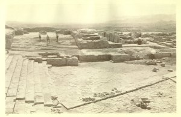
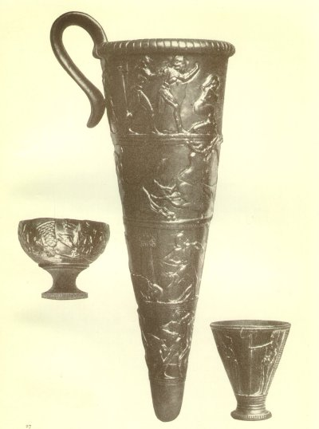

  
[Intangible Textual Heritage](../../index)  [Classics](../index.md) 
[Index](index)  [Previous](moc16)  [Next](moc18.md) 

------------------------------------------------------------------------

[Buy this Book at
Amazon.com](https://www.amazon.com/exec/obidos/ASIN/B002BA5ITU/internetsacredte.md)

------------------------------------------------------------------------

  
*Myths of Crete and Pre-Hellenic Europe*, by Donald A. Mackenzie,
\[1917\], at Intangible Textual Heritage

------------------------------------------------------------------------

p. 281

# CHAPTER XII

### The Palace of Phæstos

The Great Messara Plain--Site of Phæstos--The Trial Pits--Neolithic
Remains--The Whale's Backbone--Religious Significance of
Sea-shells--Ancient Musical Instruments--The Iron Charm--Beliefs
regarding Iron--Obsidian Razors--First and Second Palaces of
Phæstos--Grand Stairway and "Hall of State "--Villa of Aghia
Triadha--Famous Cat Fresco and Egyptian Prototypes--Sculptured Stone
Vases--The King and his Warriors--Boxers and Bull-baiters--Procession on
"Harvester Vase--A Painted Sarcophagus--Bull Sacrifice--Charioteers of
Hades--Burial Ceremony--Priests and Priestesses--The Double--axe
Symbol--Beliefs about Ravens and Doves--The Otherworld.

HAVING surveyed eastern Crete we return to Candia with some knowledge of
the character of the ancient civilization which culminated in the palace
glories of Knossos. It remains with us next to visit the southern part
of the island., which is fragrant with the memories of Minoan Phæstos,
and the city of Gortyna, established by the invading Greeks and rebuilt
by the Romans.

We strike southward by the road which crosses and ascends the river
valleys until we reach Daphnes, and find a break in the mountain spine
of the island which leads us to the great Messara plain. The sea is shut
off by rugged Kophino mountains that fringe the coast and divert the
flow of the River Hieropotamos towards the west.

Phæstos had a strategic situation. Its palace stood upon a low mountain
spur commanding the western approach to the Messara Plain. When the site
was located by Professor Halbherr, the Italian archæologist, slight

p. 282

traces only remained of its ruins in a field of rustling barley. A noble
panorama of mountain scenery is here unfolded before us. To the
north-east is Mount Dicte, and to the north-west the greater Mount Ida,
the monarchs of sublime and massive mountain ridges. "The outline of the
mountains", writes Mosso, "differs little from that of the Apennines,
but the blue colour is more intense. . . . Between the ridges the slopes
fade in the distance till the blue blends with the grey of the sky. The
villages look like eagles' nests perched on the cliffs, each girt round
with a garland of olives, they too shading into blue. . . . Before the
sun sets the shadows in the ravines of Ida deepen into indigo, and the
rocks of the whole chain become violet--an optical phenomenon rarely
seen in the Alps. The poets of classical Greece allude to this violet
colour in the mountains round Athens. In Italy only the shadows become
violet, but here in Crete the rocks are violet." [1](#fn_331.md)

When the palace of Phæstos was excavated, it was found to be of smaller
extent than that of Knossos. Beneath its ruins were found traces of an
earlier building resting on a Neolithic deposit.

An interesting account is given by Mosso of trial pits he sunk below the
latest palace floor to the virgin soil, with purpose to ascertain the
character of the earliest strata. The deepest of these was 5½ metres on
a slope of the hill while the shallowest was only ½ metre. Evidently the
ground had been levelled for the foundations of the palace.

As at Knossos, it was found that the earliest settlers were in a more
advanced stage of civilization than those in eastern Crete, who built
stone houses and hollowed out rock shelters. This is of special interest
in view of the

p. 283

theory, tentatively urged in some quarters, that there were settlements
of peoples from North Africa and Anatolia in Neolithic times.

The deep pit at the western side of the palace yielded important finds.
About 6 feet down, the foundations of a primitive dwelling were laid
bare. On the floor was lying a portion of a whale's backbone, which,
like similar relics from the Ligurian caves, may have been regarded as a
charm. Lower down in the remains of a still older dwelling were
sea-shells which had evidently a religious significance, as the Knossian
shrine objects have indicated. Two varieties of well-baked pottery came
to light--a dark and a red. Animal bones included those of the oxen,
sheep, boars, hares, and birds. Certain pointed bone implements may have
been potter's tools. The carved femora of great birds are believed by
Mosso to have been mouthpieces of musical instruments--the pipes of Pan
or a primitive bagpipe. [1](#fn_332.md) At a depth
of 4 metres there was a roughly-shaped headless figurine of the
mother-goddess. It has the characteristics of Cycladic and Trojan relics
of like character. Near the figure lay a piece of magnetite. "According
to the analysis", Mosso writes, "it consisted of oxydized iron. We may
be certain that it was a sacred stone from the fact that the Neolithic
folk had not made a weapon or a hammer of it. Possibly they believed it
to be a meteoric stone: it was known at that period that these stones
came from heaven, for they appear with a luminous track and fall to
earth with a sound." [2](#fn_333.md)

In Egypt iron was anciently known as "the metal of heaven". One theory
of heaven was that it was formed of a rectangular plate of iron which
rested either on the mountains that surrounded the earth or on pillars.
This

p. 284

divine metal was used as a charm. In the Scottish Highlands it is
supposed to prevent fairies and other demons from attacking mankind, and
it serves a similar purpose in India and West Africa. The fact that
Copts are forbidden to use it to exorcise demons indicates that it was
of magical potency in ancient Egypt. Perhaps it was on account of its
association with pagan religious beliefs, like the ear-rings worn by
Jacob's wives, that it was not used in the construction of the Jewish
altar.

Then Joshua built an altar unto the Lord God of Israel in Mount Ebal, as
Moses the servant of the Lord commanded the children of Israel, as it is
written in the book of the law of Moses, an altar of whole stones, over
which no man hath lift up any iron. [1](#fn_334.md)

A piece of magnetic iron was found in the Neolithic stratum of Troy,
which also yielded small ritual dishes like those of Phæstos. It has
already been stated that the Phæstian ceramic sequence accords with that
of Knossos. Obsidian knives gave indication, as elsewhere on the island,
of trading relations with Melos before the age of metal. "These knives",
writes Mosso, "cut so well that during the excavation I always kept one
in my pocket to cut my pencil point." [2](#fn_335.md) They continued in use long after the
introduction of bronze. An excavator informed the writer that he found a
worker with an obsidian razor. Asked why he used it, he remarked that
his father had done so before him. In Egypt the earliest razors were of
flint. A small flint razor recently found in northern Scotland had a
comparatively good shaving edge, as was proved when put to the test.

The ruins of the early palace of Phæstos were levelled, and formed in
many parts a foundation for the later palace. Owing to this fortunate
circumstance, pottery

 

 

THE GRAND STAIRCASE, PALACE OF PHÆSTOS

 

p. 285

and other relics were preserved. The early palace was erected in the
Middle Minoan I Period (*c*. 2200 B.C.), and the work of constructing
the second begun in the Late Minoan I Period (*c*. 1700 B.C.). Excellent
specimens were obtained from the first buildings of the fine Middle
Minoan Kamares pottery. But other finds were of scanty character. A
little gold lay beside charred wood. It probably "ornamented a small
piece of furniture", as Mosso suggests. Remains were also discovered "of
a cabinet with quadrangular tablets of very hard terracotta which fitted
together, and some cornices in repoussé work with undulating designs,
resembling the cornices which were in fashion at the beginning of last
century". Evidently the Cretans, like the Egyptians, had excellent
furniture.

The later palace was of less extent than its rival at Knossos, which,
however, it resembled in many details. Nor has it yielded so many
relics. The destroyers appear to have plundered it thoroughly before
setting it on fire.

The most imposing feature is the "grand staircase", between 40 and 50
feet wide, which led up to the Hall of State, or Reception Hall. There
is nothing to compare with this noble entrance at Knossos. It has been
conjectured that state ceremonials were observed in the hall, the walls
of which were probably decorated with frescoes. A small room leading off
the hall is surrounded by stone benches, and may have been a
"waiting-room" for guests and ambassadors. In the interior of the palace
is a spacious central court, 150 feet long and 70 feet broad, surrounded
by a maze of apartments, as is the one at Knossos. The theatral area was
at the south-east corner.

About 2 miles towards the north-west of Phæstos, at the hamlet of Aghia
Triadha, there was a smaller palace

p. 286

picturesquely situated on a sloping mountain ridge, and overlooking the
sea. It is usually referred to as a "royal villa". The ceramic remains
on the site indicate that it was occupied as far back as the First
Middle Minoan Period. When the villa was erected in First Late Minoan
times, portions of an earlier building were utilized. It was an imposing
building, and was entered by a flight of steps. Around it stood in the
first period a number of substantial houses, which may have been
occupied by rich traders or Cretan aristocrats. In the second period the
villa appears to have been a communal dwelling.

Like the Knossian palace, the villa was, when the destroyers had wreaked
their vengeance upon it, not entirely plundered of its archæological
treasures. Frescoes have been happily preserved. The most famous of
these depicts a cat hunting birds in a marsh. It was evidently painted
by one who had seen similar studies in Egyptian tombs at Beni Hassan and
Thebes. The Cretan artists were inferior draughtsmen to their Nilotic
contemporaries, but they were finer impressionists. In Egypt the cat is
statuesque and cold; at Aghia Triadha the ferocity and murderous
instincts of the callous animal are conveyed with impressive vivacity;
the artist undoubtedly conveys the mood, although his technique is
faulty. The Egyptian was essentially a stylist, and rarely produced the
nervous art which was so characteristic of Crete.

Three stone vases, with figures sculptured in relief, which were found
in the villa, are triumphs of Minoan art. On one is a group of warriors
with shields, and two outstanding figures, one posed stiffly with
outstretched right arm, and grasping a long staff or lance as if issuing
a military order, and the other with a drawn sword resting on his right
shoulder, standing at attention. The second vase is divided into four
zones, in which appear the figures

p. 287

of boxers, bulls, and toreadors. Some of the boxers wear helmets, and
others are bare-headed; they all appear to have something equivalent to
the boxing-glove on each of their hands. The bull-baiter is seen leaping
between the horns of the rearing bull. In Crete, as in Plato's "Lost
Atlantis", the sport or religious ceremony of bull-baiting was conducted
without weapons. The gymnast seized the approaching animal by the horns
and turned a somersault over its back, coming down behind the animal.
Various representations of this feat are shown on seals found on Cretan
sites and at Mycenæ. Sir Arthur Evans found at Knossos ivory figures of
leaping gymnasts who were probably bull-baiters. On a gold cup from
Vaphio, which is preserved in the museum at Athens, are two figures of
bulls. One is charging furiously, while a female gymnast grips the left
horn under one arm and the right horn between her legs. A male gymnast
is falling off its back. The other bull is caught in a net. A Knossian
fresco depicts two women and a man attacking a bull.

The third vase from Aghia Triadha is called by some archæologists the
"Harvester Vase" and by others the "Warrior Vase". Round it marches a
carved procession of animated human figures who are evidently taking
part in a ceremony. That this ceremony was of religious character seems
certain, because one of the men is holding up before him the Egyptian
metal rattle called the sistrum, which was used to summon the god and
charm away demons in Egyptian temples, and is referred to in the chants.
"Do we not behold the excellent sistrum-bearer approaching to thy temple
and drawing nigh," called the Isis priestess, invoking Osiris. . . .
"Behold the excellent sistrum-bearer and come to thy temple. Come to thy
temple immediately! Behold thou my heart, which

p. 288

grieveth for thee. Behold me seeking for thee. . . . Lo! I invoke thee
with walling that reacheth high as heaven." [1](#fn_336.md)

This sistrum-bearer on the vase has not a pinched Cretan waist, and may
represent an Egyptian. He is singing or wailing, as are also three of
his immediate followers who may be women with upper garments of leather.
Perhaps they are invoking the spirit of the slain corn-god.

The procession appears to be led by a long-haired elderly man, wearing a
bulging robe decorated with a scale pattern and heavily fringed. He
carries a long round-handled staff over his right shoulder. Is he a
priest, or a victim in a wicker-work cage who is about to be sacrificed?
All the figures are marching in step--performing, in fact, a sort of
Germanic "goose step", and most of them carry three-pronged forks, the
prongs being attached by cords to the long handles. These resemble the
harvesting-forks still in use in Crete. Some of them, however, are
fitted with short scythe-like blades, which may have been used either
for cutting corn or pruning trees. A single figure--evidently a youth,
is stooping low and grasping the thighs of a man who turns round with
open mouth as if shouting defiantly a ceremonial utterance of special
significance.

Those who see in the procession the celebration of a naval victory hold
that the three-pronged implements are really weapons. But no such
weapons have been found in Crete. If the ceremony was not a harvest one,
it may have been connected with the spring-time invocation of the deity
of fertility. Mr. Hall, who regards the vase as one of "the finest
pieces of small sculpture in the world", sees upon it "a procession of
drunken roistering

 

 

THREE VASES, SCULPTURED IN STONE, FOUND AT AGHIA TRIADHA

The largest of the three is known as the "Boxer Vase", and measures 18
inches high. The "Harvester Vase", on the left hand of the centre
subject, is shown on a larger scale in plate facing, page
[212](moc14.htm#page_212.md). The other small vase (actual size, 4 inches
high) is described on page [286](#page_286.md).

 

p. 289

peasants with agricultural implements." [1](#fn_337.md) "Extraordinary technique was required".
write Mr. and Mrs. Hawes, "to represent four abreast, each seen
distinctly, one beyond another. The Parthenon frieze presents no more
difficult problem in low relief." [2](#fn_338.md)

Another decorated object found at Aghia Triadha is a sarcophagus of
limestone shaped like a chest, which has been assigned to a period prior
to 1400 B.C. It is 52 inches long, 18 inches broad, and 32 inches in
depth. The body which it enclosed must have lain in a crouched position,
like the bodies placed in the pre-Dynastic Egyptian graves and in those
of the Late Stone and Bronze Ages in Western Europe. The sarcophagus had
been covered with plaster on which were painted scenes of undoubted
religious significance. At either end are chariots. In one, which is
drawn by two griffins, a woman is escorting a swathed pale figure,
apparently the deceased, on the way to the Otherworld; in the other,
which is drawn instead by horses, are two female figures. A long panel
on one of the sides is unfortunately badly damaged. It appears to
represent a sacrificial scene. A bull is being slain, and a man plays on
a double flute while its blood pours into a vessel. The panel on the
other side is in a good state of preservation, and affords an
interesting and suggestive glimpse of Cretan funerary services. At one
end the swathed figure of a youth stands before a tomb or shrine beside
a conventionalized representation of the sacred fig tree. In front, and
facing the deceased, a priest approaches carrying the model of a
boat--perhaps the "ferry boat" of Hades in which the soul is to reach
the "Isle of the Blest", after crossing the valleys and mountains like
the Indian Yama

p. 290

and Babylonian Gilgamesh. Two priests follow behind, carrying offerings.
Turned in the opposite direction are three priestesses, or, as some
think, two priestesses and a priest. The first pours a red liquid,
either wine or the blood of the sacrificed bull, into a large vessel
placed between two erect posts on pedestals. These posts are surmounted
by double axes on each of which a raven is perched. The second priestess
carries a couple of vases suspended from a pole, one in front and one
behind, which is carried on her right shoulder. The third figure--either
a priestess or a priest--plays a seven-stringed lyre held high in front.

The costumes are of special interest. Facing the deceased the three
priests wear robes suspended from their waists which terminate with
tail-like appendages. These are evidently the skins of animals. Egyptian
priests wore panthers' skins. The first priestess, who bends down
beneath the double axes, likewise wears an animal's skin, but she has
also an upper garment with half sleeves and a broad blue sash which
comes down under her left arm to the waist. Probably this sash formed a
St. Andrew's Cross on the back like the plaid on the Petsofa figure,
which Professor Myres has compared to the Scottish plaid. The second
priestess wears a long blue gown suspended from her shoulders and
reaching her ankles. The bodice has a floral edging and the gown is
decorated. She wears a flat round cap, and appears to have a sash like
that of the first priestess. The lyre player is similarly attired, but
has no sash, and the head is bare.

In the next chapter the significance of the tree-pillars and double axes
will be dealt with. Here it may be noted that the ravens take the place
of the doves as the birds of the Mother Goddess. The reason is obvious.

p. 291

\[paragraph continues\] Doves symbolized
fertility and immortality, while ravens were associated with destruction
and death. In the Scottish legends regarding Michael Scott, ravens and
doves, flying from opposite directions, approach his corpse after death.
The fact that the doves are the first to alight is taken as an
indication that Michael's soul will go to heaven. The ravens are the
messengers of Satan. Throughout Europe and Asia the ravens are birds of
ill omen, who foretell death and disaster. They were associated in
Greece and Italy with Apollo, the great patron of augurs. Crows were
similarly of ill repute. According to some writers, a number of them
fluttered over Cicero's head on the day he was murdered. Dark and
melancholy birds were evidently regarded as forms of the spirits of
darksome Hades. They were, it would seem, associated from an early
period with a sepulchral cult. So were doves. Perhaps the raven cult
believed in a gloomy after-life in a Hades as dismal as that of
Babylonia, while the dove cult had hopes of ultimate happiness. In Egypt
both the cults of Osiris and Ra believed in Heavens and Hells. The Ra
cult associated their Paradise with the sun: it was a place of
everlasting light; while their Hell was a place of darkness, lit for but
a single hour in the twenty-four by the sun's rays. In it lost souls
were tortured in pools of fire, or they remained in the place of outer
darkness, where they suffered from extreme cold.

In this religious scene on the Cretan sarcophagus, the raven spirits of
Hades, perched above the double axes, appear to be receiving a
propitiatory offering of blood or wine. It may be inferred, therefore,
that they could be prevailed upon to show favour to the dead. The kings
and heroes of the Greek epics were transported to the "Island of the
Blest", while others had to sojourn

p. 292

in gloomy Hades. Perhaps the Cretan who was interred in the sarcophagus
was regarded as being worthy of a happy fate in the after-life. He was,
no doubt, a youth of high birth. In Egypt the paradise of Ra was
reserved in early times for kings and queens and their families.

------------------------------------------------------------------------

### Footnotes

[282:1](moc17.htm#fr_331.md) *Palaces of Crete and
their Builders*, pp. 57, 59.

[283:1](moc17.htm#fr_332.md) *Dawn of Modern
Civilization*, pp. 69, 70.

[283:2](moc17.htm#fr_333.md) *Palaces of Crete and
their Builders*, p. 29.

[284:1](moc17.htm#fr_334.md) *Joshua*, viii, 30,
31.

[284:2](moc17.htm#fr_335.md) *Dawn of
Mediterranean Civilization*, p. 89.

[288:1](moc17.htm#fr_336.md) *The Burden of Isis*,
by J. T. Dennis, pp. 21 *et seq*. and 29 *et seq*.

[289:1](moc17.htm#fr_337.md) *The Ancient History
of the Near East*, p. 54

[289:2](moc17.htm#fr_338.md) *Crete, the
Forerunner of Greece*, p. 129.

------------------------------------------------------------------------

[Next: Chapter XIII. Cave Deities and their Symbols](moc18.md)
