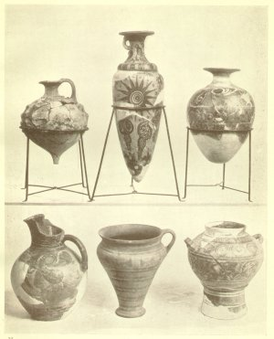
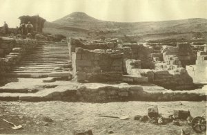

  
[Intangible Textual Heritage](../../index)  [Classics](../index.md) 
[Index](index)  [Previous](moc18.md) 

------------------------------------------------------------------------

[Buy this Book at
Amazon.com](https://www.amazon.com/exec/obidos/ASIN/B002BA5ITU/internetsacredte.md)

------------------------------------------------------------------------

  
*Myths of Crete and Pre-Hellenic Europe*, by Donald A. Mackenzie,
\[1917\], at Intangible Textual Heritage

------------------------------------------------------------------------

p. 313

# CHAPTER XIV

### Decline of Crete and Rise of Greece

Contemporary Rulers of Crete, Egypt, and Babylon--Crete in the Age of
Abraham--Political Changes in Western Asia--Inter--state Struggles in
Crete--Relations of Palace Kings with Small Towns--Egyptian Labyrinth
and Cretan Palaces--The Rise of the Hittites--Their Raid on
Babylon--Fall of Knossos--Lycian Tradition of Royal Rivals--Hyksos in
Egypt--Hyksos Relic in Crete--Introduction of the Horse--Cretan Culture
in the Cyclades and on Greek Mainland--The Golden Age of
Minos--Eighteenth Dynasty Wars of Egypt--The Cause of Racial
Movements--Overthrow of Minoan Power--Crete's Trade with Egypt and
Western Europe--Egyptian Beads in English Bronze-age Grave--The Tin
Trade of Cornwall--Pelasgian and Achæan Conquerors--Last Period of
Cretan Civilization--Prehistoric Dynasties of Greece--The Northern
Conquerors--Sea-raid on Egypt--The Homeric Siege of Troy--Dorian
Anarchy--Ionia the Culture Cradle of Historic Greece.

CRETE'S Early Minoan Age embraces roughly about six hundred years, from
2800 B.C. till 2200 B.C. During its third period Troy II was destroyed
by fire. In Egypt the Sixth Dynasty Kings, which included Pepi I and
Pepi II, reigned over a powerful kingdom for a century and a half, and
then followed an obscure period of three centuries, during which rival
States struggled for supremacy. In the end the princely family of Thebes
rose into prominence and established the Eleventh Dynasty. Babylonia was
similarly divided into petty kingdoms. About 2650 B.C. the northern
Semitic State of Akkad became powerful under Sargon 1, who was reputed
to be of miraculous birth and to have been rescued as a babe from an ark

p. 314

which was set adrift on the River Euphrates. [1](#fn_368.md) His son, Naram Sin, erected the famous
stele which depicts him winning a victory over a pigtailed people in a
wooded and mountainous country. He flourished about the is beginning of
Crete's Early Minoan II Period, and, like his father, proclaimed himself
"King of the Four Quarters". It is possible that both these monarchs
penetrated Syria and Palestine. They appear to have held sway over part
of Elam and Sumeria. Towards the close of the Early Minoan II Period,
Gudea was patesi of the Sumerian city of Lagash and traded with Syria.
The power of Akkad appears to have been shattered by an invasion of the
Gutium from the north. After these invaders were expelled, dynasties
flourished in the Sumerian cities of Erech, Ur, and Isin. Thereafter the
Amorite migration culminated in the rise of the Hammurabi Dynasty at
Babylon.

Some authorities believe that the Herakleopolite Kings of Egypt of the
Ninth and Tenth Dynasties were descendants of foreign conquerors who
entered through the eastern Delta and destroyed the mummies of the great
Pyramid Kings of the Fourth and Fifth Dynasties. This is possible, but
the evidence is of so slight a character that any conclusions drawn from
it cannot be regarded as definite.

When we reach Crete's Middle Minoan Period (2200-2 100 B.C.) a new Age
begins to dawn over the ancient world. The Theban Kings of the Eleventh
Dynasty establish their sway over the whole of Egypt. In Babylonia the
Sumerian power suffers decline, and two sets of invaders, the Amorites
in the north and the Elamites in the south, wage a determined struggle
for

p. 315

supremacy. This is roughly the Age of Abraham, whose migration from
Sumeria northward through Mesopotamia into Palestine appears to have
been one of the results of the ethnic disturbances waged in his native
land.

Troy has fallen, and invaders from Thrace have penetrated eastward
through Anatolia to constitute an element in the Muski-Phrygian blend.
The Hittites are powerful in Cappadocia, and are extending their sway
into northern Syria.

Of special interest is the Biblical reference to the battle of four
kings against five.

"And it came to pass in the days of Amraphel King of Shinar, Arioch King
of Ellasar, Chedorlaomer King of Elam, and Tidal King of Nations; that
these made war with Bera King of Sodom, and with Birsha King of
Gomorrah, Shinab King of Admah, and Shemeber King of Zeboiim, and the
King of Bela, which is Zoar." [1](#fn_369.md)

Amraphel is believed to be Hammurabi of Sumer (Shinar), Arioch of Larsa,
(Ellasar) a Sumerian city king who was a son of the Elamite monarch, and
Tidal a Hittite ruler. This confederacy may have been formed against
common enemies in the Western Land (Syria and Palestine) in the
interests of trade. It could not have been of long endurance. After
twelve years of subjection the western tribes rebelled, [2](#fn_370.md) and the four allies again "smote them".
Thereafter Hammurabi threw off his allegiance to Elam and extended his
sway over the greater part of Babylonia and Assyria, while he also
included the Western Land in his sphere of influence. About the same
period (2000 B.C.) the Twelfth Dynasty was established in Egypt, its
first great king, being Amenemhet I.

During the Middle Minoan I Period, which is roughly contemporary with
the Eleventh Dynasty of Egypt, the

p. 316

earlier palaces of Knossos and Phæstos were erected. It is probable that
they were occupied by independent rulers who occasionally came into
conflict like the Babylonian city kings. Each may have had his sphere of
influence on the island. At any rate it seems certain that such great
buildings represented centralized power which drew into the service of
the monarchs large masses of the population.

Both palaces were destroyed at a later period, but as they did not fall
simultaneously they do not seem to have been attacked by a common enemy
from across the sea. The fact that the first Phæstos palace endured
longest suggests that its monarch was the conqueror of Knossos and the
destroyer of the first palace there.

The fall of Knossos occurred in the Middle Minoan II Period (C.
2100-1900 B.C.). Evidences have been forthcoming both at Knossos and
Phæstos of disturbances in the early part of this period. At its close
the first Knossian palace was destroyed. The later palace must have been
rebuilt soon afterwards, for portions of the earlier walls were
utilized. Probably the stricken State made a speedy recovery. It may
have, indeed, overthrown its rival in turn. When the first palace of
Phæstos fell, its destruction was so complete that it lay in ruins for
about a century. The second palace was not erected until the Late Minoan
I Period, which began about 1700 B.C. No portion of the earlier
buildings were then made use of. The whole site was completely levelled
and covered with cement over the Middle Minoan remains, which were
happily preserved in this way among its ruins. It is possible that this
second Phæstian palace was erected by the ruler of Knossos. According to
Strabo, Phæstos was a colony of the northern State.

Before the first palaces were erected at Knossos and Phæstos, small
towns flourished in eastern Crete. One

 

 

MINOAN POTTERY FROM ZAKRO

Including examples of "Kamares" ware. The central vessel in the lower
row shows the use of the double-axe symbol.

 

p. 317

of these, as has been indicated, was situated near the island of
Mochlos, where the tomb treasures give indications of commercial and
industrial prosperity during the Early Minoan Age. Vasiliki was also,
without doubt, an important trading and governing centre. Petras, on the
shore of Sitia Bay, may have been the stronghold of one of the petty
States then in existence.

When the first palaces of Knossos and Phæstos were erected the Cretans
were trading with the Twelfth Dynasty merchants of Egypt. The spiral
design had become popular among Nilotic seal engravers, who combined it
with the lily flower, and the Cretan potters imitated them. Middle
Minoan vases from Phæstos are decorated with the Egyptian lily spiral,
which in one case is utilized in quite a new way. The papyrus designs
were also taken over by the Cretan artists, and used with characteristic
freedom. So greatly admired were the Kamares vases of Crete's Middle
Minoan Period that they were freely purchased in Egypt. Professor
Flinders Petrie found fragments of them in a tomb at Kahun of the
Twelfth Dynasty, while a Cretan vessel was found by Professor Garstang
in a grave of similar date at Abydos.

It was during the Twelfth Dynasty that the great Egyptian Labyrinth was
erected. Its builder was Pharaoh Amenemhet III. According to Herodotus
it had twelve covered courts and three thousand apartments, half of
which were underground. "No stranger", says Strabo, "could find his way
in or out of this building without a guide". It is possible that the
Egyptian Labyrinth was an imitation of the mazy palaces of Crete.

Probably it was owing to its close commercial connections with Crete
that Egypt received during the Twelfth Dynasty such liberal supplies of
tin that bronze was freely manufactured.

p. 318

Towards the close of Crete's Middle Minoan II Period the Twelfth
Egyptian Dynasty came to an end, and the Sebek-Ra rulers of the
Thirteenth Dynasty established their sway, which became centralized in
Upper Egypt. Foreign settlers were increasing in number in the Delta
region. In Asia great ethnic disturbances, due to widespread migrations,
were in progress. The Hittites had grown powerful and were known both in
Egypt and Babylonia. Assyria was overrun by a non-Semitic people who
ultimately established a military aristocracy in northern Mesopotamia
and brought into existence the Kingdom of Mitanni. In time the Hammurabi
Dynasty of Babylon was overthrown by Hittite raiders, who were followed
by the Kassites.

It is possible that the fall of Knossos may have not been unconnected
with the social and racial changes due to the settlement on the island
of roving bands of pastoral fighting-folks. These may have been employed
as mercenaries by rival Cretan kings. A memory of the ancient island
conflicts appears to survive in the following reference by Herodotus to
the Lycians: "The Lycians", he wrote, "are in good truth anciently from
Crete, which island, in former days, was wholly peopled by
barbarians. [1](#fn_371.md) A quarrel arising
there between the two sons of Europa, Sarpedon and Minos, as to which of
them should be king, Minos, whose party prevailed, drove Sarpedon and
his followers into banishment. The exiles sailed to Asia, and landed on
the Milyan territory. Milyas was the ancient name of the country now
inhabited by the Lycians; the Milyæ of the present day were, in those
times, called Solymi. So long as Sarpedon reigned, his followers kept
the name which they brought with them from Crete, and were called
Termilæ, as the Lycians still are by those who

p. 319

live in their neighbourhood. . . . Their customs are partly Cretan,
partly Carian." [1](#fn_372.md) Herodotus also
noted that the Lycians took "the mother's and not the father's name"--an
interesting and perhaps significant fact when we consider the prominent
part taken in social life by the Cretan women.

That the destruction of Knossos was due to internal revolt, which may or
may not have received outside aid, is highly probable. It was rebuilt at
the beginning of the Middle Minoan III Period, but before its rulers had
attained to the full height of their power a long era of prosperity was
in store for the smaller towns. Gournia, Zakro, Psyra, and Palaikastro
began to be important trading centres before 1700 B.C., and ere the
second palace of Phæstos was erected. It was after the Knossian palace
was remodelled that these towns were destroyed.

Ere the Middle Minoan III Period had drawn to a close the Hyksos
invaders had overrun Egypt, and the Hittites, Mitannians, and Kassites
were in ascendancy in Mesopotamia and Anatolia. Commercial relations
between Crete and Egypt were no doubt hampered for a time, but they
appear to have been resumed again. Perhaps the island kingdom received
refugees from the Delta region. These may have introduced the art of
writing on papyrus with a pen, which came into practice before the
beginning of the Late Minoan I Period.

The Late Minoan I Period endured for about two centuries (*c*. 1700-1500
B.C.). Trade became exceedingly brisk, and Gournia, Palaikastro, and
eastern towns reached their highest development. The fact that Zakro
became important suggests intimate relations with Egypt. Sir Arthur
Evans has discovered at Knossos an alabastron lid bearing the personal
name of one of the late Hyksos

p. 320

Pharaohs, Khian, whose throne name, Seuserenra, appears on a figure of a
lion found at Baghdad. A seal impression found by the same excavator in
the royal villa near the palace belongs to the early part of Late Minoan
I. It is of special interest because the subject is a horse which has
been carried overseas in a one-masted vessel. This animal was introduced
into Babylonia by the Kassites, and was called "the ass of the east".
The Mitannians, who were probably allies of the Kassites, had horses and
chariots, and the horse appeared in Egypt during the Hyksos era. Perhaps
the successful invasion of the Hyksos was due to the use of cavalry.

Sir Arthur Evans is of opinion that his Knossian seal impression is a
record of the introduction into Crete of the thoroughbred horse. Mr. and
Mrs. Hawes state, however, that they possess an Early Minoan seal stone
on which a horse figures. This fact is interesting. It may not indicate
that the horse was a domesticated animal, although it may have been a
sacred one. The Demeter of Phigalia, as has been stated, was
horse-headed. In the Palæolithic Age there were wild horses in Europe,
and in one of the cave-pictures of the Aurignacian Period a man is shown
beside small horses with a stave on his shoulder, suggesting that he is
herding them. At this remote period the animal was freely eaten. There
is no evidence that the horse was used in warfare much earlier than the
Kassite Period in Babylonia, and it was certainly quite unknown in Egypt
before the Hyksos Age.

Cretan culture extended during the Late Minoan I times through the
Cycladic islands. At Phylakopi, in Melos, a second city came into
existence round its obsidian "factory". Cretan products were freely
imported and Cretan script was in use. In one of its buildings, which
may have been the palace, was found a well-preserved

p. 321

fresco showing flying fish skimming over transparent waters in which lie
shells, sponges, and rocks. It was undoubtedly the work of a Cretan
artist. In all probability there was a Minoan colony at Phylakopi.

But Cretan influence was not confined to the islands. Both Mycenæ and
Tiryns on the Grecian mainland were stimulated by it as early as the
Middle Minoan III Period. The contents of the shaft graves of Mycenæ,
which Schliemann assigned to the Homeric Age, are of Late Minoan I
antiquity (*c*. 1500 B.C.), as are also boar-hunt frescoes recently
found at Tiryns, which are distinctively Cretan, and the famous Vaphio
cups with the bull-snaring scenes. The Peloponnesian colonies of Crete
appear to have been established in the Middle Minoan III Period (*c*.
1800-1700 B.C.). In Bœotia there were settlements in Late Minoan I
times, if not earlier, and tombs have yielded Cretan, and imitations of
Cretan products, which confirm the traditions of the source of early
Grecian culture, the religious mysteries, and so forth. With Cretan
modes of life came Cretan modes of thought to a people who were not much
advanced from the Neolithic stage of culture. It is probable that the
islanders formed a military aristocracy from which sprung the kings who
ruled the various important city States in pre-Homeric times.

Pausanias [1](#fn_373.md) tells us that the lion
gate of Mycenæ and the walls of Tiryns were the work of the Cyclopes who
laboured for Proctus. He writes, too, with conviction of the men in
ancient days who "were guests at the tables of the gods in consequence
of their righteousness and piety", and adds that "those who were good
clearly met with honour from the gods, and similarly those who were
wicked, with wrath. The gods in those days were sometimes mortals who
are still worshipped, like Aristæus, and

p. 322

\[paragraph continues\] Britomartis of
Crete, and Hercules, the son of Alcmena, and Amphiarus, the son of
Œcles, and beside them Castor and Pollux." [1](#fn_374.md) So were the ancients who believed in
giants and gods identified with them.

During the last century of the Late Minoan I Period the Hyksos were
overthrown in Egypt, and the Theban Eighteenth Dynasty was established.
The Cretans were known then in the Nile valley as the Keftiu, and
characteristic wasp-waisted figures carrying Minoan vases were depicted
in the tombs. It was during this period that the later Phæstian palace
was erected.

The Late Minoan II Period, also known as the "Palace" Period, began
towards the close of the reign of Pharaoh Thothmes I, the father of
Queen Hatshepsut. It lasted for about half a century, from c. 1500 till
1450 B.C. One by one the coast towns perished, the latest to survive
being Palaikastro, which some identify as the ancient city port of
Heleia. Some think that Palaikastro existed as late as the Late Minoan
III Period, and was ruled by an independent prince.

It is uncertain whether the towns were plundered by piratical bands from
the Cyclades and the Greek mainland, or were wiped out by the central
Cretan power which was established at Knossos. The later Knossian palace
was remodelled during Late Minoan II times, and did not therefore suffer
from the depredations of invaders. It would seem that we now reach the
age of the legendary Minos who struck down all rivals and became supreme
ruler in Crete. "The first person known to us in history as having
established a navy", writes Thucydides, "is Minos. He made himself
master of what is now called the Hellenic Sea, and ruled over the
Cyclades, into most of which he sent his first colonies, expelling the
Carians

p. 323

and appointing his own sons governors; and thus did his best to put down
piracy in those waters, a necessary step to secure the revenues for his
own use. For in early times the Hellenes and the barbarians of the coast
and islands, as communication by sea became more common, were tempted to
turn pirates, under the conduct of their most powerful men; the motives
being to serve their own cupidity and to support the needy. They would
fall upon a town unprotected by walls, and consisting of a mere
collection of villages, and would plunder it; indeed, this came to be
the main source of their livelihood, no disgrace being yet attached to
such an achievement, but even some glory. An illustration of this is
furnished by the honour with which some of the inhabitants of the
continent still regard a successful marauder, and by the question we
find the old poets everywhere representing the people as asking the
voyagers--'Are they pirates?'--as if those who are asked the question
would have no idea of disclaiming the imputation, or their interrogators
of reproaching them for it. The same rapine prevailed also by
land." [1](#fn_375.md)

The Empire of Minos appears to have embraced part of the Greek mainland.
Athens was compelled to send its annual tribute of youths and maidens to
Knossos, and Tiryns, Mycenæ, Lakonia, Pylos, and Orchœmenos became
important centres of Ægean culture. The tradition that the Cyclopes who
erected the walls of Tiryns came from Lycia may be due to the tendency
to foreshorten historical events. It is possible, however, that Minoan
traders had already settled on the Anatolian coast and maintained
commercial relations with the Peloponnese and Crete.

Thothmes III of Egypt, the great conqueror, flourished

p. 324

during the later part of the Late Minoan II Period. In the hymn
addressed to him as from the god Amon, the priestly poet declares:

I have come giving thee to smite the western land,  
Keftyew (Crete) and Cyprus are in terror. [1](#fn_376.md)

The activities of Thothmes did not extend to Crete, but there can be
little doubt that his operations exercised a marked influence on the
trade of the island kingdom. Probably it prospered greatly under the
settled conditions which he brought about, as it had evidently prospered
after the expulsion of the Hyksos from Egypt. A brisk demand for Cretan
imports in the Nile valley may well have been one of the causes of the
commercial "boom" which is suggested by the increasing wealth of Knossos
during the Late Minoan II Period.

The great Egyptian wars, however, were bound in time to affect Crete in
another direction. The expulsion of the Hyksos brought about a pressure
of peoples in Syria, Anatolia, and south-eastern Europe, which was to
test the stability of existing States. Semitic hordes poured towards
Babylonia and hampered trade; at the same time they reinforced the
growing power of Assyria. The Mitannian area of control was being
circumscribed and Hittite prestige seriously affected in Cappadocia. Ere
the Hittites were able to profit by the weakening of the Syrians and
Mitannians, against whom Thothmes III was battling constantly, they must
have been forced to direct their expansion westward. The plain of Troy
was probably at this period the scene of many conflicts. In the Danubian
area there appears to have been much ethnic friction. Invasions from
Anatolia and the constant pressure exercised by northern tribes directed
a steady stream of pastoral

p. 325

fighting-folks southward through the Balkans and into the northern
States of Greece. The mainland capitals, including Mycenæ and Tiryns,
which had become centres of Ægean culture and trade, must have offered
strong temptations to the hardy mountaineers of Thessaly, whence the
Achæans are supposed to have come. Probably the migrations of the
pastoralists were propelled by migrations from the north. The ultimate
result of these migratory "folk-waves", which increased in volume as
time went on, was the destruction not only of the Minoan Empire, but the
complete overthrow of Knossian power in Crete itself. The Palace Period
was the Golden Age of Cretan culture, which suffered steady decline
after 1450 B.C.

It was probably during this half-century of Minoan ascendancy that
Crete's overseas commerce assumed its greatest dimensions. The organized
navy ensured the safe passage in the Ægean Sea of ships which tapped the
Danube valley trade, and penetrating the Dardanelles got into touch with
caravans from the cast. It also helped to foster trade with western
ports. The Rhone valley route running to Marseilles appears to have
been, as has been indicated, one of the sources from which British tin
was received.

At what period this traffic had origin is at present wrapped in
obscurity. It seems probable, however, that it was carried on as early
as 1500 B.C. One of the reasons for this belief is the discovery of
Egyptian relics in southern England. Among the relics taken from Bronze
Age graves are numerous Egyptian beads of blue-glazed faience. "They are
beads, moreover, which", writes Professor Sayce, "belong to one
particular period in Egyptian history, the latter part of the age of the
Eighteenth Dynasty and the earlier of that of the Nineteenth Dynasty. .
. . There is a large number of them in the Devizes Museum,

p. 326

as they are met with plentifully in the Early Bronze Age tumuli of
Wiltshire in association with amber beads and barrel-shaped beads of jet
and lignite. Three of them come from Stonehenge itself. Similar beads of
'ivory' have been found in a Bronze Age cist near Warminster: if the
material is really ivory it must have been derived from the East. The
cylindrical faience beads, it may be added, have been discovered in
Dorsetshire as well as Wiltshire." Mr. H. R. Hall, dealing with the same
Egyptian relics, says: "My own interest in the matter is due to the fact
that in the course of the excavations of the \[Egyptian\] Fund at Deir
el Bahari, we discovered thousands of blue glaze beads of the exact
particular type (already well known from other Egyptian diggings) of
these found in Britain. Ours are, in all probability, mostly of the time
of Hatshepsut, and so date to about 1500 B.C." [1](#fn_377.md) Similar beads have also been discovered
in Crete and Western Europe. The British finds help to fix the age of
Stonehenge, the inner circle of which, according to Professor Boyd
Dawkins, is formed of stones taken from Brittany.

By whom were these Egyptian beads carried to Britain between 1500 B.C.
and 1400 B.C.? Certainly not the Phœnicians. The sea-traders of the
Mediterranean were at the time the Cretans. Whether or not their
merchants visited England we have no means of knowing. It is possible
that they did. It is also possible, and even highly probable, that
during the early Bronze Age in England, which may have been of greater
antiquity than has hitherto been supposed, there existed a comparatively
high degree of civilization, and communities of traders.

According to Diodorus Siculus, tin was carried in wagons by the people
of Belerium (Land's End) to the

p. 327

Island of Ictis, [1](#fn_378.md) which could be
reached at low tide. The tin was purchased on Ictis by traders and then
shipped to Gaul, being afterwards conveyed overland to the mouth of the
Rhone on pack-horses. Ships crossed the English Channel as early as
Neolithic times, when the earliest settlers of the Mediterranean race
migrated from Gaul. The Veneti of Brittany in Cæsar's time had a navy,
as well as trading-vessels, like the ancient Cretans. In the early
Bronze Age amber was imported into England from the mouth of the Elbe,
so that a connection was established between our shores and the Danubian
trade route. Gold was carried from Ireland and Wales and Scotland to
Scandinavia. It may have been due to the racial migrations which
followed the expulsion of the Hyksos from Egypt that "the men of the
round barrows" invaded these islands in the early British Bronze Age.
Probably they followed in the tracks of the traders up the valleys of
the Danube and the Elbe as well as from the Alpine districts towards
Brittany. It need arouse no surprise that the effects of the distant
Egyptian wars should have been felt in Europe. The building of the
Chinese wall, which directed westward the drift of Asiatic nomads, was
the indirect cause of the fall of Rome.

Crete's Late Minoan II Period of splendour and commercial prosperity was
brought to an abrupt close by the sack of Knossos. This disaster must
have fallen like "a bolt from the blue". It was evidently as unexpected
as it was complete. Workmen were engaged in renovating the stately
dwelling, new frescoes were being painted, and builders were erecting a
new wing, when the invaders

p. 328

swept inland from the seashore, put to the sword soldier and artisan,
and probably women and children, then plundered the palace and set it on
fire. Phæstos palace and the villa of Aghia Triadha shared similar
rates.

It may be that the invaders attacked Crete when its army and navy were
engaged elsewhere. The tradition recorded by Herodotus, which is of
special interest in this connection, sets forth that Minos went to
Sicily in search of Dædalus, the great architect, and there was
murdered. An expedition followed to avenge his death, and besieged
Camicus for five years. Their efforts were, however, unsuccessful. On
their way home their vessels were wrecked on the south coast of Italy,
where they founded the town of Hyria. Thereafter, the Præsians informed
Herodotus, "men of various nations flocked to Crete, which was stripped
of its inhabitants". [1](#fn_379.md) Memories of
Minoan colonies may have mingled with this tradition. One of the several
cities called Minoa was situated in Sicily.

It is generally believed that the destroyers of Knossos were not Achæans
alone, but the mixed peoples on the Greek coast who had come under the
influence of Minoan civilization. Thucydides says that after Minos had
formed his navy, and communication by sea became easier, "the coast
populations began to apply themselves more closely to the acquisition of
wealth, and their life became more settled; some even began to build
themselves walls on the strength of their newly acquired riches". These
Cretanized mainlanders were subjected to the constant pressure of the
northern tribes. "The country called Hellas", wrote Thucydides, "had in
ancient times no settled population; on the contrary, migrations were of
frequent occurrence, the several tribes readily abandoning their

 

 

RUINS OF THE "ROYAL VILLA", AGHIA TRIADHA. (See page
[286](moc17.htm#page_286).md).

 

p. 329

homes under pressure of superior numbers. . . . The goodness of the land
favoured the aggrandizement of particular individuals, and thus created
faction, which proved a fertile source of ruin. It also invited
invasion." [1](#fn_380.md) It is possible, as some
have urged, that Minos himself was a conqueror of Crete, and was
supported by Pelasgians and Achæans who had acquired the elements of
Minoan culture on the mainland.

The Late Minoan III Period begins with a partial revival of Minoan
civilization. A portion of the Knossian palace was reoccupied, and new
houses were erected at Gournia and Palaikastro beside the ruins of those
which were destroyed in the early Palace Period. Trading relations with
Egypt were resumed, and hundreds of Cretan vases of *Bügelkannen* type
were imported into the Nile valley. These and others were imitated in
faience and alabaster by Egyptian artisans. But Cretan culture was on
the down grade. The island artisans of the Late Minoan III Period were
imitators of their predecessors, and sometimes slovenly imitators; they
invented nothing new. It was an age of decadence and transition.
Ultimately Knossos and the small towns were entirely deserted, and the
people retreated to the inner mountain valleys and plateaux. The Cretans
ceased to be known in Egypt as the Keftiu during the reign of Amenhotep
III, the father of Akhenaton. [2](#fn_381.md) The
founders of Præsos, who claimed to be the "true Cretans", were no doubt
descendants of the old Minoan peoples and the Achæo-Pelasgian elements
from the Continent.

But although Late Minoan III culture perished by slow degrees in Crete,
it flourished in Cyprus. Apparently large numbers of Cretans and Cretan
colonists from the mainland settled on that island and achieved a
political

p. 330

ascendancy over the natives. Others settled on Rhodes. About the same
time the Minoan colonies in Lycia and Caria were strongly reinforced,
and for a period, if Greek tradition is to be relied upon, the Carians
monopolized the sea trade of the Ægean. It is believed that large
numbers of Cretans also fled to Phœnicia and stimulated maritime
enterprise in that quarter. "In the Homeric poems", says Professor
Myres, "more visits are paid by western seafarers to Phœnicia and Sidon
than 'Phœnician' merchants pay to the west. . . . The wide Phœnician
trade of historic times had clearly begun to grow as the Minoan
sea-power failed." [1](#fn_382.md)

About a century after the fall of Knossos, Mycenæ, Tiryns, and other
mainland towns had reached the height of their prosperity. It is
possible that they owed their supremacy to Hittite influence. At any
rate, persistent Greek legends associate their rulers with Anatolia. The
walls of Tiryns were reputed to have been built by Cyclopes from Lycia,
and Pelops, who gave his name to the Peloponnesus, was reputed to have
come from Asia Minor. "The account given by those Peloponnesians", says
Thucydides, "who have been the recipients of the most creditable
traditions is this. First of all Pelops, arriving among a needy
population from Asia with vast wealth, acquired such power that,
stranger though he was, the country was called after him; and this power
fortune saw fit materially to increase in the hands of his
descendants." [2](#fn_383.md) The complicated
family history of Pelopidæ and Atridæ is of special interest in this
connection. Atreus, son of Pelops, married his son Plisthenes to Aerope,
granddaughter of King Minos of Crete. Her father had given her and her
sister to the King of Eubœa, because it had been foretold he would die
by the hand of one of his children. The sons of Aerope

p. 331

were Agamemnon and Menelaus. Afterwards Atreus married Aerope, his
daughter-in-law, and brought up her sons, who were consequently called
the Atridæ. But this fickle lady deserted Atreus and became the wife of
his brother Thyestes. Then Atreus took to wife Pelopea, whose
descendants were called the Pelopidæ. He was not aware that this lady
was his brother's daughter. Many crimes and calamities are associated
with the traditions of these princes and princesses. The chief interest
they have for us here is the wonderful relation the traditions regarding
them bear to the history of the period. A Minoan king of Crete is to be
slain by his own kin from the mainland, and invaders from Anatolia
intermarry with Cretan stock in the Peloponnesus. This appears to be as
good history as the reference in Ezekiel to the ethnics of Jerusalem:
"Thy birth and thy nativity is of the land of Canaan; thy father was an
Amorite, and thy mother an Hittite". [1](#fn_384.md) Mycenæ's mother was a Cretan and his
father an Anatolian, perhaps of Indo-European speech like the military
aristocracy of the Mitannian State, which appears to have for a period
achieved political ascendancy over the Hittites.

In this connection special interest attaches to our own legends about
the invading giants who gave their names to Alban (Albion) and Erin. It
seems probable that these giants symbolized the folks who overran Great
Britain and Ireland in the early Bronze Age. "Alban" (genitive of
"Alba") or "Albion" and "Alps" are derived from a common root,
signifying "white". Were the invaders of ancient Britain "Whitelanders",
i.e. an Alpine folk?

The Mycenæan period of Greek civilization was remembered as that of the
third or Bronze Race of Hesiod.

p. 332

"Their gear was of bronze, they had bronze houses; they tilled the soil
with bronze; black iron there was none." Nestor, in the *Iliad*, refers
to the Bronze Age folk as the heroes of an earlier generation who were
greater than Agamemnon and his host.

I lived with men, and they despised me not,  
Abler in counsel, greater than yourselves.  
Such men I never saw, and ne'er shall see,  
As Pirithous and Dryas, wise and brave,  
Cœneus, Exadius, god-like Polypheme,  
And Theseus, Ægeus' more than mortal son.  
The mightiest they among the sons of men. . . . [1](#fn_385.md)

Another element which entered into the ethnic fusion in Mycenæan Greece
was the Danubian. The influence of Danubian culture extended as far
south as Thessaly, where the Achæans were predominant. These Achæan
pastoralists were drifting southward into the Peloponnesus as early as
the Late Minoan I Period, and some of them may have reached Crete. But
their greatest migration appears to have occurred at the close of the
Pelopid Dynasty, and it is probable that they were the late conquerors
of Mycenæ and Tiryns. After holding sway in the Peloponnesus for a
period of uncertain duration, they were overthrown in turn by the
Dorians.

About the time that the legendary Pelops secured the ascendancy of his
stock on the Greek mainland, Crete was in a state of decay. In Egypt the
brilliant reign of Amenhotep III marked the zenith of Egyptian power in
the Nile valley and Syria. Mitanni, in northern Mesopotamia, which was
ruled by kings with Indo-European names, was being threatened on one
side by the growing power of Assyria, and on the other by that of the
Hittites.

p. 333

\[paragraph continues\] After Akhenaton,
the dreamer king, ascended the Egyptian throne and inaugurated his
religious revolution, the kingdom of Mitanni was overthrown, and the
Egyptian Empire in northern Syria went to pieces. The Hittites had
leagued themselves with the Amorites, and were pressing southward,
gaining control of the trade routes from Babylonia and Egypt.

The eastward expansion of the Hittites was accompanied by a shrinkage of
their power in the west. Reinforced by folk-waves from Thrace, the
people of the Phrygian area then began to gather strength, and asserted
themselves later as the Muski, [1](#fn_386.md) the
forerunners of the historic Phrygians. The sixth city of Troy also came
into prominence. It was contemporary with Mycenæ and Tiryns, and like
these cities owed its rise to the fusion of Danubian and Ægean cultures,
the latter predominating.

This was Homer's Troy, and so powerful did it become that when the
Achæans entered into possession of the Peloponnesian centres of Mycenæan
culture they found that it constituted a serious menace to their
ascendancy.

As in Egypt, descent in Crete and its colonial settlements was by the
female line. The Achæan chiefs therefore followed the example of Atreus
by marrying a royal princess, so as to secure the succession of their
descendants to the thrones of the various States which they overpowered.
Menelaus had married Helen, Queen of Sparta, and departed overseas on an
expedition. During his absence, Priam, King of Troy, abducted Helen, who
became the wife of his son Paris. The Trojans were thus enabled to claim
Sparta as part of their dominions. On his return, the Achæan monarch
found it necessary to fit out a great

p. 334

expedition and inaugurate the famous siege of Troy, so as to recover the
queen by whose right he held the Spartan throne. Such appears to be the
historical germ of the Homeric narrative.

The Greeks dated the period of the Trojan war as from 1194 till 1184
B.C. This appears to be an accurate calculation. A few years previously,
in 1200 B.C., the second great sea raid on Egypt took place during the
reign of Rameses III of the Twentieth Dynasty. Perhaps the absence of
Menelaus was not unconnected with this adventure.

The first sea raid occurred about a quarter of a century earlier, during
the reign of Merne-ptah, son of Rameses II. It was conducted in
conjunction with the Hittites, and taken part in by the Shardana, who
may have given their name to Sardinia; the Akhaivasha, usually
identified with the Achæans; the Shakalsha, who may have been Cretanized
Sicilians; and the Tursha, perhaps the Turseni, who were represented in
Etruria. The piratical peoples were probably remnants of the Cretans and
their conquerors. They were defeated by Merne-ptah, but some settled in
Libya and became mercenaries in the Egyptian army.

The second raid was of great dimensions. It included the Danauna, the
Danaans, the Shakalsha, the Tursha, the Tikkarai, who may have come from
Zakro in Crete, and the Pulesti, the Philistines. The sea force which
sailed south by Cyprus was supported by land raiders from North Syria
and Anatolia. Among the latter were the Philistines, who gave their name
to Palestine. Rameses III won victories on sea and land, being assisted
by the raiders' kinsmen, the Shardana mercenaries.

It is suggestive to find that the siege of Homer's Troy occurred a few
years afterwards. The conquerors of pre-Mycenæan Greece, having been
foiled in their attempt to

p. 335

overrun Egypt, sought expansion eastward, and had first to strike down
the Phrygian city which threatened their supremacy.

Troy VI had been built about 1500 B.C., that is, about the beginning of
Crete's Late Minoan II or Palace Period. It was surrounded by great
stone walls 16 feet thick and 20 feet: high, which were surmounted by
first a brick and then a stone parapet, which added another 6 feet to
them. The walls were flanked by three great towers about 30 feet in
height. As the stone-work has Egyptian characteristics, it is possible
that the builders were imported from Egypt during the Eighteenth
Dynasty. There were at least three city gates, and these were all on the
southern side. Wells were sunk to the water-bearing strata of the hill.

When Troy VI was set on fire it did not suffer so greatly, being largely
built of stone, as did the second city. The houses were, however,
overthrown, and the upper portions of the walls demolished. Scarcely an
object of any value survived the sack of the wealthy city. The ceramic
remains are partly Mycenæan, or Late Minoan III, and partly Trojan.

After the fall of Troy the European elements in Anatolia were
strengthened. Carian and Lycian pirates infested the seas. There were
also settlements of Ægean stock in Cilicia. The Muski-Phrygians,
pressing eastward from central Anatolia, appear to have contributed to
the overthrow of the tottering empire of the Hittites. In Palestine the
Philistines gradually extended their area of control, moving steadily
southward, as the Empire of Egypt shrank by slow degrees.

The Achæans of Greece met in time the same fate as their predecessors of
the Late Mycenæan Period, the Pelopid Dynasty. About two generations
after the Trojan war the Dorians, who had been gradually filtering south

p. 336

ward through Thessaly, gradually achieved ascendancy. In time, assisted
by Illyrian allies, they overran the Peloponnese. The dispossessed
Achæan aristocracy and followers were forced into the land of the
Ionians, which afterwards became known as Achaia. Dorians also found
their way to Crete, which, like Rhodes, was eventually conquered.

For generations Greece was devastated by inter-tribal wars, and lapsed
into a condition of decline. Periodic migrations took place of its
merchants and traders and artisans, and these settled in Crete, Sicily,
Sardinia, and Italy. Many found refuge in Anatolia, where grew up Ionian
Greece along the coastland of Lycia and Caria.

"It was in Ægean Ionia", writes Mr. Hall, "that the torch of Greek
civilization was kept alight, while the homeland was in a mediæval
condition of comparative barbarism; Cyprus, too, helped though she was
too far off for her purer Minoan culture to affect the Ægean peoples
very greatly. It was in Ionia that the new Greek civilization arose:
Ionia, in whom the old Ægean blood and spirit most survived, taught the
new Greece, gave her coined money and letters, art and poesy, and her
shipmen, forcing the Phœnicians from before them, carried her new
culture to what were then deemed the ends of the earth." [1](#fn_387.md)

------------------------------------------------------------------------

### Footnotes

[314:1](moc19.htm#fr_368.md) In this tradition two
Semitic rulers, Sharrukin and the later Shargan-Sharri, were confused.

[315:1](moc19.htm#fr_369.md) *Genesis*, xiv, 1-2.

[315:2](moc19.htm#fr_370.md) *Ibid*., xiv, 4 *et
seq*.

[318:1](moc19.htm#fr_371.md) That is, non-Greeks.

[319:1](moc19.htm#fr_372.md) *Herodotus*, I, 173.

[321:1](moc19.htm#fr_373.md) III, 46.

[322:1](moc19.htm#fr_374.md) VIII, 2.

[323:1](moc19.htm#fr_375.md) *History of the
Peloponnesian War*, I, 4, 5 (Richard Crawley's translation).

[324:1](moc19.htm#fr_376.md) Breasted's *History
of Egypt*. p. 319.

[326:1](moc19.htm#fr_377.md) The Journal of
Egyptian Archæology (January, 1914), pp. 18-19.

[327:1](moc19.htm#fr_378.md) One theory is that
Ictis is the Isle of Wight. Some geologists contend that at this period
the island was not entirely cut off from the mainland. The Isle of
Thanet has also been identified as Ictis. Another theory is that the
reference is to St. Michael's Mount on the south coast of Cornwall,
which is connected with the mainland at low water by a causeway.

[328:1](moc19.htm#fr_379.md) Herodotus, VII, 170,
171.

[329:1](moc19.htm#fr_380.md) *The Peloponnesian
War*, I, 2-8.

[329:2](moc19.htm#fr_381.md) Before 1375 B.C.

[330:1](moc19.htm#fr_382.md) *The Dawn of
History*, p. 215.

[330:2](moc19.htm#fr_383.md) *The Peloponnesian
War*, I, 6-9.

[331:1](moc19.htm#fr_384.md) *Ezekiel*, xvi, 3.

[332:1](moc19.htm#fr_385.md) *Iliad*, Book I,
309-15 (Derby's translation).

[333:1](moc19.htm#fr_386.md) Pronounced
*Moosh'ke*. In the Old Testament they are referred to as "the Meshech"
(*Ezekiel*, xxxii).

[336:1](moc19.htm#fr_387.md) *The Ancient History
of the Near East*, p. 79.
