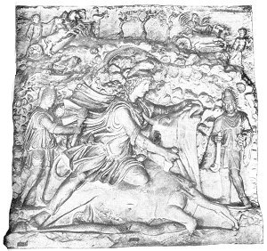

[Intangible Textual Heritage](../../index)  [Classics](../index) 

------------------------------------------------------------------------

<table width="75%">
<colgroup>
<col style="width: 50%" />
<col style="width: 50%" />
</colgroup>
<tbody>
<tr class="odd">
<td data-valign="TOP" width="50%"></td>
<td data-valign="TOP" width="50%"><h1 id="the-mysteries-of-mithra" data-align="CENTER">THE MYSTERIES OF MITHRA</h1>
<h2 id="by-franz-cumont" data-align="CENTER">by Franz Cumont</h2>
<h4 id="section" data-align="CENTER">[1903]</h4></td>
</tr>
</tbody>
</table>

------------------------------------------------------------------------

[Title Page](mom00)  
[Preface to the French Edition](mom01)  
[Table of Contents](mom02)  
[List of Illustrations](mom03)  
[The Origins Of Mithraism](mom04)  
[The Dissemination of Mithraism in the Roman Empire](mom05)  
[Mithra and the Imperial Power of Rome](mom06)  
[The Doctrine of the Mithraic Mysteries](mom07)  
[The Mithraic Liturgy, Clergy and Devotees](mom08)  
[Mithraism and the Religions of the Empire](mom09)  
[Mithraic Art](mom10)  
[Index](mom11)  
