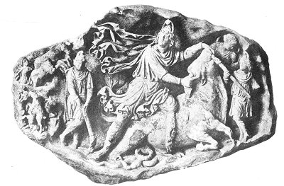

[Intangible Textual Heritage](../../index)  [Classics](../index.md) 
[Index](index)  [Previous](mom02)  [Next](mom04.md) 

------------------------------------------------------------------------

p. xii

 

   
THE TARUOCTONOUS, OR BULL-SLAYING, MITHRA.  
Bas-relief Discovered in Aquileia.

 

p. xiii

# List of Illustrations

|                                   |                                                                                                                          |                           |
|-----------------------------------|--------------------------------------------------------------------------------------------------------------------------|---------------------------|
| FIGURE                            |                                                                                                                          | PAGE                      |
| [1](mom04.htm#img_1).             | King Antiochus and Mithra. Bas-relief of Nemrood Dagh                                                                    | [14](mom04.htm#page_14.md)   |
| [2](mom04.htm#img_2).             | Imperial Coins of Trapezus (Trebizond)                                                                                   | [18](mom04.htm#page_18.md)   |
| [3](mom04.htm#img_3).             | Bactrian Coins                                                                                                           | [19](mom04.htm#page_19.md)   |
| [4](mom04.htm#img_4).             | Tauroctonous, or Bull-slaying, Mithra. Typical Representation. (Borghesi Bas-relief from the Capitol. Now in the Louvre) | [21](mom04.htm#page_21.md)   |
| [5](mom04.htm#img_5).             | Tauroctonous Mithra. Artistic Type. (St. Petersburg)                                                                     | [22](mom04.htm#page_22.md)   |
| [6](mom04.htm#img_6).             | Tauroctonous Mithra. Artistic Type. (Vatican)                                                                            | [23](mom04.htm#page_23.md)   |
| [7](mom04.htm#img_7).             | Tauroctonous Mithra. Early Artistic Type. (Boston)                                                                       | [24](mom04.htm#page_24.md)   |
| [8](mom04.htm#img_8).             | King Antiochus and Ahura-Mazda. Bas-relief of Nemrood Dagh                                                               | [27](mom04.htm#page_27.md)   |
| [9](mom04.htm#img_9).             | Mithraic Medallion from Tarsus, Cilicia                                                                                  | [32](mom04.htm#page_32.md)   |
| [10](mom05.htm#img_10).           | Tauroctonous Mithra. (British Museum)                                                                                    | [39](mom05.htm#page_39.md)   |
| [11](mom05.htm#img_11).           | Sun-God. Fragment of the Bas-relief of Virunum                                                                           | [50](mom05.htm#page_50.md)   |
| [12](mom05.htm#img_12).           | Bas-relief of Osterburken                                                                                                | [51](mom05.htm#page_51.md)   |
| [13](mom05.htm#img_13).           | Plan of the Mithræum of Heddernheim                                                                                      | [53](mom05.htm#page_53.md)   |
| [14](mom05.htm#img_14).           | Reverse of the Bas-relief of Heddernheim                                                                                 | [54](mom05.htm#page_54.md)   |
| [15](mom05.htm#img_15).           | Bas-relief of Neuenheim                                                                                                  | [55](mom05.htm#page_55.md)   |
| [16](mom05.htm#img_16).           | Plan of a Mithræum in Ostia                                                                                              | [65](mom05.htm#page_65.md)   |
| [17](mom05.htm#img_17).           | Silvanus                                                                                                                 | [66](mom05.htm#page_66.md)   |
| [18](mom05.htm#img_18).           | Statues of Torch-bearers. (Lateran)                                                                                      | [68](mom05.htm#page_68.md)   |
| [19](mom06.htm#img_19).           | Pedestal Found at Carnuntum                                                                                              | [88](mom06.htm#page_88.md)   |
| [20](mom07.htm#img_20).           | Mithraic Kronos Found in Ostia                                                                                           | [105](mom07.htm#page_105.md) |
| [21](mom07.htm#img_21).           | Mithraic Kronos of Florence                                                                                              | [106](mom07.htm#page_106.md) |
| [22](mom07.htm#img_22).           | Mithraic Kronos of Rome                                                                                                  | [108](mom07.htm#page_108.md) |
| [23](mom07.htm#img_23).           | Mithraic Kronos Found in Ostia                                                                                           | [110](mom07.htm#page_110.md) |
| [24](mom07.htm#img_24).           | Fragment of a Bas-relief Found in Virunum. (Klagenfurt)                                                                  | [113](mom07.htm#page_113.md) |
| [25](mom07.htm#img_25).           | Bas-relief of Heddernheim                                                                                                | [117](mom07.htm#page_117.md) |
| [26](mom07.htm#img_26).           | Bas-relief of London                                                                                                     | [122](mom07.htm#page_122.md) |
| [27](mom07.htm#img_27).           | Mithraic Cameo                                                                                                           | [123](mom07.htm#page_123.md) |
| [28](mom07.htm#img_28).           | Mithraic Cameo, Showing Mithra and the Dioscuri                                                                          | [124](mom07.htm#page_124.md) |
| [29](mom07.htm#img_29).           | Statues of Torch-bearers. (Palermo)                                                                                      | [128](mom07.htm#page_128.md) |
| [30](mom07.htm#img_30).           | Mithra Born from the Rock                                                                                                | [130](mom07.htm#page_130.md) |
| p. xiv |                                                                                                                          |                           |
| [31](mom07.htm#img_31).           | Mithra Born from the Rock                                                                                                | [131](mom07.htm#page_131.md) |
| [32](mom07.htm#img_32).           | Fragment of Bas-relief of Virunum                                                                                        | [133](mom07.htm#page_133.md) |
| [33](mom07.htm#img_33).           | Tauroctonous and Taurophorous (Bull-bearing) Mithra. Clay Cup of Lanuvium                                                | [134](mom07.htm#page_134.md) |
| [34](mom07.htm#img_34).           | Two Bronze Mithraic Plaques. (Vatican)                                                                                   | [136](mom07.htm#page_136.md) |
| [35](mom07.htm#img_35).           | Bas-relief of Apulum                                                                                                     | [139](mom07.htm#page_139.md) |
| [36](mom07.htm#img_36).           | Inscription to Mithra Nabarze. (Sarmizegetusa)                                                                           | [142](mom07.htm#page_142.md) |
| [37](mom08.htm#img_37).           | Tauroctonous Mithra. Bas-relief of Bologna                                                                               | [151](mom08.htm#page_151.md) |
| [38](mom08.htm#img_38).           | Mithraic Communion. Bas-relief of Konjica                                                                                | [159](mom08.htm#page_159.md) |
| [39](mom08.htm#img_39).           | Restoration of a Mithræum at Carnuntum                                                                                   | [163](mom08.htm#page_163.md) |
| [40](mom09.htm#img_40).           | Tauroctonous Mithra of Toronto                                                                                           | [176](mom09.htm#page_176.md) |
| [41](mom09.htm#img_41).           | Mithraic Gems. (Metropolitan Museum of Art, New York City)                                                               | [183](mom09.htm#page_183.md) |
| [42](mom09.htm#img_42).           | Mithraic Cameo                                                                                                           | [185](mom09.htm#page_185.md) |
| [43](mom09.htm#img_43).           | Sol, the Sun-God                                                                                                         | [186](mom09.htm#page_186.md) |
| [44](mom09.htm#img_44).           | The Passion of the God. Head of the So-called Dying Alexander of the Uffizi Gallery                                      | [192](mom09.htm#page_192.md) |
| [45](mom09.htm#img_45).           | Bas-relief of Mayence. Mithra Drawing His Bow                                                                            | [196](mom09.htm#page_196.md) |
| [46](mom09.htm#img_46).           | Chained Skeleton Discovered at Saarebourg                                                                                | [204](mom09.htm#page_204.md) |
| [47](mom10.htm#img_47).           | Mithraic Dadophorus. Wrongly Restored as Paris                                                                           | [212](mom10.htm#page_212.md) |
| [48](mom10.htm#img_48).           | Counterpart of the Preceding                                                                                             | [213](mom10.htm#page_213.md) |
| [49](mom10.htm#img_49).           | Mithraic Kronos of Modena                                                                                                | [222](mom10.htm#page_222.md) |
| [50](mom10.htm#img_50).           | Birth of Erichthonios. Greek Vase                                                                                        | [225](mom10.htm#page_225.md) |

 

------------------------------------------------------------------------

[Next: The Origins Of Mithraism](mom04.md)
