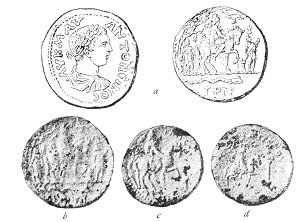
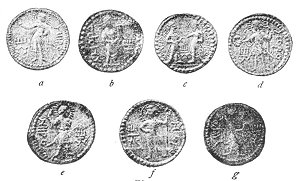
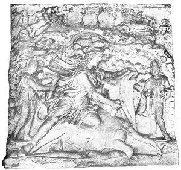
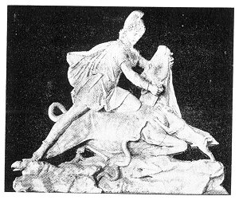
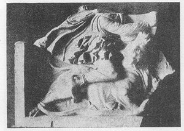
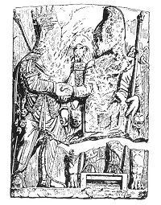
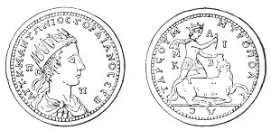

[Intangible Textual Heritage](../../index)  [Classics](../index.md) 
[Index](index)  [Previous](mom03)  [Next](mom05.md) 

------------------------------------------------------------------------

p. 1

# THE MYSTERIES OF MITHRA

## THE ORIGINS OF MITHRAISM

IN THAT unknown epoch when the ancestors of the Persians were still
united with those of the Hindus, they were already worshippers of
Mithra. The hymns of the Vedas celebrated his name, as did those of the
Avesta, and despite the differences obtaining between the two
theological systems of which these books were the expression, the Vedic
Mitra and the Iranian Mithra have preserved so many traits of
resemblance that it is impossible to entertain any doubt concerning
their common origin. Both religions saw in him a god of light, invoked
together with Heaven, bearing in the one case the name of Varuna and in
the other that of Ahura; in ethics he was recognized as the protector of
truth, the antagonist of falsehood and error. But the sacred poetry of
India has preserved of him an obscured memory only. A single fragment,
and even that partially effaced, is all that has been specially
dedicated to him. He appears mainly in incidental allusions,--the silent
witnesses of his ancient grandeur. Still, though his physiognomy is not
so distinctly

p. 2

limned in the Sanskrit literature as it is in the Zend writings, the
faintness of its outlines is not sufficient to disguise the primitive
identity of his character.

According to a recent theory, this god, with whom the peoples of Europe
were unacquainted, was not a member of the ancient Aryan pantheon.
Mitra-Varuna, and the five other Adityas celebrated by the Vedas,
likewise Mithra-Ahura and the Amshaspands, who, according to the Avestan
conception surround the Creator, are on this theory nothing but the sun,
the moon, and the planets, the worship of which was adopted by the
Indo-Iranians "from a neighboring people, their superiors in the
knowledge of the starry firmament," who could be none other than the
Accadian or Semitic inhabitants of Babylonia. [1](#fn_2.md) But this hypothetical adoption, if it really
took place, must have occurred in a prehistoric epoch, and, without
attempting to dissipate the obscurity of these primitive times, it will
be sufficient for us to state that the tribes of Iran never ceased to
worship Mithra from their first assumption of worldly power till the day
of their conversion to Islam.

In the Avesta, Mithra is the genius of the celestial light. He appears
before sunrise on the rocky summits of the mountains; during the day he
traverses the wide firmament in his chariot drawn by four white horses,
and when

p. 3

night falls he still illumines with flickering glow the surface of the
earth, "ever waking, ever watchful." He is neither sun, nor moon, nor
stars, but with "his hundred ears and his hundred eyes" watches
constantly the world. Mithra hears all, sees all, knows all: none can
deceive him. By a natural transition he became for ethics the god of
truth and integrity, the one that was invoked in solemn oaths, that
pledged the fulfilment of contracts, that punished perjurers.

The light that dissipates darkness restores happiness and life on earth;
the heat that accompanies it fecundates nature. Mithra is "the lord of
wide pastures," the one that renders them fertile. "He giveth increase,
he giveth abundance, he giveth cattle, he giveth progeny and life." He
scatters the waters of the heavens and causes the plants to spring forth
from the ground; on them that honor him, he bestows health of body,
abundance of riches, and talented posterity. For he is the dispenser not
only of material blessings but of spiritual advantages as well. His is
the beneficent genius that accords peace of conscience, wisdom, and
honor along with prosperity, and causes harmony to reign among all his
votaries. The devas, who inhabit the places of darkness, disseminate on
earth along with barrenness and suffering all manner of vice and
impurity. Mithra, "wakeful and sleepless, protects the creation of
Mazda" against

p. 4

their machinations. He combats unceasingly the spirits of evil; and the
iniquitous that serve them feel also the terrible visitations of his
wrath. From his celestial eyrie he spies out his enemies; armed in
fullest panoply he swoops down upon them, scatters and slaughters them.
He desolates and lays waste the homes of the wicked, he annihilates the
tribes and the nations that are hostile to him. On the other hand he is
the puissant ally of the faithful in their warlike expeditions. The
blows of their enemies "miss their mark, for Mithra, sore incensed,
receives them"; and he assures victory unto them that "have had fit
instruction in the Good, that honor him and offer him the sacrificial
libations." [1](#fn_3.md)

This character of god of hosts, which has been the predominating trait
of Mithra from the days of the Achæmenides, undoubtedly became
accentuated in the period of confusion during which the Iranian tribes
were still at war with one another; but it is after all only the
development of the ancient conception of struggle between day and night.
In general, the picture that the Avesta offers us of the old Aryan
deity, is, as we have already said, similar to that which the Vedas have
drawn in less marked outlines, and it hence follows that Mazdaism left
its main primitive foundation unaltered.

Still, though the Avestan hymns furnish the

p. 5

distinctest glimpses of the true physiognomy of the ancient god of
light, the Zoroastrian system, in adopting his worship, has singularly
lessened his importance. As the price of his admission to the Avestan
Heaven, he was compelled to submit to its laws. Theology had placed
Ahura-Mazda on the pinnacle of the celestial hierarchy, and
thenceforward it could recognize none as his peer. Mithra was not even
made one of the six Amshaspands that aided the Supreme Deity in
governing the universe. He was relegated, with the majority of the
ancient divinities of nature, to the host of lesser genii or *yazatas*
created by Mazda. He was associated with some of the deified
abstractions which the Persians had learned to worship. As protector of
warriors, he received for his companion, Verethraghna, or Victory; as
the defender of the truth, he was associated with the pious Sraosha, or
Obedience to divine law, with Rashnu, Justice, with Arshtât, Rectitude.
As the tutelar genius of prosperity, he is invoked with Ashi-Vañuhi,
Riches, and with Pâreñdî, Abundance. In company with Sraosha and Rashnu,
he protects the soul of the just against the demons that seek to drag it
down to Hell, and under their guardianship it soars aloft to Paradise.
This Iranian belief gave birth to the doctrine of redemption by Mithra,
which we find developed in the Occident.

At the same time, his cult was subjected to

p. 6

a rigorous ceremonial, conforming to the Mazdean liturgy. Sacrificial
offerings were made to him of "small cattle and large, and of flying
birds." These immolations were preceded or accompanied with the usual
libations of the juice of Haoma, and with the recitation of ritual
prayers,--the bundle of sacred twigs (*baresman*) always in the hand.
But before daring to approach the altar, the votary was obliged to
purify himself by repeated ablutions and flagellations. These rigorous
prescriptions recall the rite of baptism and the corporeal tests imposed
on the Roman neophytes before initiation.

Mithra, thus, was adopted in the theological system of Zoroastrianism; a
convenient place was assigned to him in the divine hierarchy; he was
associated with companions of unimpeachable orthodoxy; homage was
rendered to him on the same footing with the other genii. But his
puissant personality had not bent lightly to the rigorous restrictions
that had been imposed upon him, and there are to be found in the sacred
text vestiges of a more ancient conception, according to which he
occupied in the Iranian pantheon a much more elevated position. Several
times he is invoked in company with Ahura: the two gods form a pair, for
the light of Heaven and Heaven itself are in their nature inseparable.
Furthermore, if it is said that Ahura created Mithra as he did all
things, it is likewise said

p. 7

that he made him just as great and worthy as himself. Mithra is indeed a
yazata, but he is also the most potent and most glorious of the yazata.
"Ahura-Mazda established him to maintain and watch over all this moving
world." [1](#fn_4.md) It is through the agency of
this ever-victorious warrior that the Supreme Being destroys the demons
and causes even the Spirit of Evil, Ahriman himself, to tremble.

Compare these texts with the celebrated passage in which Plutarch [2](#fn_5.md) expounds the dualistic doctrine of the
Persians: Oromazes dwells in the domain of eternal light "as far above
the sun as the sun is distant from the earth"; Ahriman reigns in the
realm of darkness, and Mithra occupies an intermediary place between
them. The beginning of the Bundahish [3](#fn_6.md)
expounds a quite similar theory, save that in place of Mithra it is the
air (*Vayu*) that is placed between Ormazd and Ahriman. The
contradiction is only one of terms, for according to Iranian ideas the
air is indissolubly conjoined with the light, which it is thought to
support. In fine, a supreme god, enthroned in the empyrean above the
stars, where a perpetual serenity exists; below him an active deity, his
emissary and chief of the celestial armies in their ceaseless combat

p. 8

with the Spirit of Darkness, who from the bowels of Hell sends forth his
devas to the surface of the earth,--this is the religious conception,
far simpler than that of Zoroastrianism, which appears to have been
generally accepted among the subjects of the Achæmenides.

The conspicuous rôle that the religion of the ancient Persians accorded
to Mithra is attested by a multitude of proofs. He alone, with the
goddess Anâhita, is invoked in the inscriptions of Artaxerxes alongside
of Ahura-Mazda. The "great kings" were certainly very closely attached
to him, and looked upon him as their special protector. It is he whom
they call to bear witness to the truth of their words, and whom they
invoke on the eve of battle. They unquestionably regarded him as the god
that brought victory to monarchs; he it was, they thought, who caused
that mysterious light to descend upon them which, according to the
Mazdean belief, is a guaranty of perpetual success to princes, whose
authority it consecrates.

The nobility followed the example of the sovereign. The great number of
theophorous, or god-bearing, names, compounded with that of Mithra,
which were borne by their members from remotest antiquity, is proof of
the fact that the reverence for this god was general among them.

Mithra occupied a large place in the official cult. In the calendar the
seventh month was

p. 9

dedicated to him and also doubtless the sixteenth day of each month. At
the time of his festival, the king, if we may believe Ctesias, [1](#fn_7.md) was permitted to indulge in copious
libations in his honor and to execute the sacred dances. Certainly this
festival was the occasion of solemn sacrifices and stately ceremonies.
The *Mithrakana* were famed throughout all Hither Asia, and in their
form *Mihragân* were destined, in modern times, to be celebrated at the
commencement of winter by Mussulman Persia. The fame of Mithra extended
to the borders of the Ægean Sea; he is the only Iranian god whose name
was popular in ancient Greece, and this fact alone proves how deeply he
was venerated by the nations of the great neighboring empire.

The religion observed by the monarch and by the entire aristocracy that
aided him in governing his vast territories could not possibly remain
confined to a few provinces of his empire. We know that Artaxerxes Ochus
had caused statues of the goddess Anâhita to be erected in his different
capitals, at Babylon, Damascus, and Sardis, as well as at Susa,
Ecbatana, and Persepolis. Babylon, in particular, being the winter
residence of the sovereigns, was the seat of a numerous body of official
clergy, called *Magi*, who sat in authority over the indigenous priests.
The

p. 10

prerogatives that the imperial protocol guaranteed to this official
clergy could not render them exempt from the influence of the powerful
sacerdotal caste that flourished beside them. The erudite and refined
theology of the Chaldæans was thus superposed on the primitive Mazdean
belief, which was rather a congeries of traditions than a well
-established body of definite dogmas. The legends of the two religions
were assimilated, their divinities -were identified, and the Semitic
worship of the stars (astrolatry), the monstrous fruit of long-continued
scientific observations, became amalgamated with the nature-myths of the
Iranians. Ahura-Mazda was confounded with Bel, who reigned over the
heavens; Anâhita was likened to Ishtar, who presided over the planet
Venus; while Mithra became the Sun, Shamash. As Mithra in Persia, so
Shamash in Babylon is the god of justice; like him, he also appears in
the east, on the summits of mountains, and pursues his daily course
across the heavens in a resplendent chariot; like him, finally, he too
gives victory to the arms of warriors, and is the protector of kings.
The transformation wrought by Semitic theories in the beliefs of the
Persians was of so profound a character that, centuries after, in Rome,
the original home of Mithra was not infrequently placed on the banks of
the Euphrates. According to Ptolemæus, [1](#fn_8.md)
this

p. 11

potent solar deity was worshipped in all the countries that stretched
from India to Assyria.

But Babylon was a step only in the propagation of Mazdaism. Very early
the Magi had crossed Mesopotamia and penetrated to the heart of Asia
Minor. Even under the first of the Achæmenides, it appears, they
established themselves in multitudes in Armenia, where the indigenous
religion gradually succumbed to their cult, and also in Cappadocia,
where their altars still burned in great numbers in the days of the
famous geographer Strabo. They swarmed, at a very remote epoch, into
distant Pontus, into Galatia, into Phrygia. In Lydia even, under the
reign of the Antonines, their descendants still chanted their barbaric
hymns in a sanctuary attributed to Cyrus. These communities, in
Cappadocia at least, were destined to survive the triumph of
Christianity and to be perpetuated until the fifth century of our era,
faithfully transmitting from generation to generation their manners,
usages, and modes of worship.

At first blush the fall of the empire of Darius would appear to have
been necessarily fatal to these religious colonies, so widely scattered
and henceforward to be severed from the country of their birth. But in
point of fact it was precisely the contrary that happened, and the Magi
found in the Diadochi, the successors of Alexander the Great, no less
efficient protection than that which they

p. 12

enjoyed under the Great King and his satraps. After the dismemberment of
the empire of Alexander (323 B.C.), there were established in Pontus,
Cappadocia, Armenia, and Commagene, dynasties which the complaisant
genealogists of the day feigned to trace back to the Achæmenian kings.
Whether these royal houses were of Iranian extraction or not, their
supposititious descent nevertheless imposed upon them the obligation of
worshipping the gods of their fictitious ancestors. In opposition to the
Greek kings of Pergamon and Antioch, they represented the ancient
traditions in religion and politics. These princes and the magnates of
their *entourage* took a sort of aristocratic pride in slavishly
imitating the ancient masters of Asia. While not evincing outspoken
hostility to other religions practised in their domains, they yet
reserved especial favors for the temples of the Mazdean divinities.
Oromazes (Ahura-Mazda), Omanos (Vohumano), Artagnes (Verethraghna),
Anaïtis (Anâhita), and still others received their homage. But Mithra,
above all, was the object of their predilection. The monarchs of these
nations cherished for him a devotion that was in some measure personal,
as the frequency of the name Mithradates in all their families attests.
Evidently Mithra had remained for them, as he had been for Artaxerxes
and Darius, the god that granted monarchs victory,--the manifestation

p. 13

and enduring guaranty of their legitimate rights.

This reverence for Persian customs, inherited from legendary ancestors,
this idea that piety is the bulwark of the throne and the sole condition
of success, is explicitly affirmed in the pompous inscription [1](#fn_9.md) engraved on the colossal tomb that Antiochus
I., Epiphanes, of Commagene (69-34 B.C.), erected on a spur of the
mountain-range Taurus, commanding a distant view of the valley of the
Euphrates (Figure I). But, being a descendant by his mother of the
Seleucidæ of Syria, and supposedly by his father of Darius, son of
Hystaspes, the king of Commagene merged the memories of his double
origin, and blended together the gods and the rites of the Persians and
the Greeks, just as in his own dynasty the name of Antiochus alternated
with that of Mithridates.

Similarly in the neighboring countries, the Iranian princes and priests
gradually succumbed to the growing power of the Grecian civilization.
Under the Achæmenides, all the different nations lying between the
Pontus Euxinus and Mount Taurus were suffered by the tolerance of the
central authority to practise their local cults, customs, and languages.
But in the great confusion caused by the collapse of the Persian empire,
all political and

p. 14

religious barriers were demolished. Heterogeneous races had suddenly
come in contact with one another, and as a result Hither Asia passed
through a phase of syncretism analogous

 

   
KING ANTIOCHUS AND MITHRA.  
(Bas-relief of the colossal temple built by Antiochus I. of Commagene,
69-31 B.C., on the Nemrood Dagh, a spur of the Taurus Mountains. *T. et
M.*, p. 188.)

 

to that which is more distinctly observable under the Roman empire. The
contact of all the theologies of the Orient and all the philosophies of
Greece produced the most startling combinations, and the competition

p. 15

between the different creeds became exceedingly brisk. Many of the Magi,
from Armenia to Phrygia and Lydia, then doubtless departed from their
traditional reserve to devote themselves to active propaganda, and like
the Jews of the same epoch they succeeded in gathering around them
numerous proselytes. Later, when persecuted by the Christian emperors,
they were obliged to revert to their quondam exclusiveness, and to
relapse into a rigorism that became more and more inaccessible.

It was undoubtedly during the period of moral and religious fermentation
provoked by the Macedonian conquest that Mithraism received
approximately its definitive form. It was already thoroughly
consolidated when it spread throughout the Roman empire. Its dogmas and
its liturgic traditions must have been firmly established from the
beginning of its diffusion. But unfortunately we are unable to determine
precisely either the country or the period of time in which Mazdaism
assumed the characteristics that distinguished it in Italy. Our
ignorance of the religious movements that agitated the Orient in the
Alexandrian epoch, the almost complete absence of direct testimony
bearing on the history of the Iranian sects during the first three
centuries before our era, are our main obstacles in obtaining certain
knowledge of the development of Parseeism. The most we can do is to
unravel the principal factors that combined

p. 16

to transform the religion of the Magi of Asia Minor, and endeavor to
show how in different regions varying influences variously altered its
original character.

In Armenia, Mazdaism had coalesced with the national beliefs of the
country and also with a Semitic element imported from Syria. Mithra
remained one of the principal divinities of the syncretic theology that
issued from this triple influence. As in the Occident, some saw in
Mithra the genius of fire, others identified him with the sun; and
fantastic legends were woven about his name. He was said to have sprung
from the incestuous intercourse of Ahura-Mazda with his own mother, and
again to have been the offspring of a common mortal. We shall refrain
from dwelling upon these and other singular myths. Their character is
radically different from the dogmas accepted by the Occidental votaries
of the Persian god. That peculiar admixture of disparate doctrines which
constituted the religion of the Armenians appears to have had no other
relationship with Mithraism than that of a partial community of origin.

In the remaining portions of Asia Minor the changes which Mazdaism
underwent were far from being as profound as in Armenia. The opposition
between the indigenous cults and the religion whose Iranian origin its
votaries delighted in recalling, never ceased to be felt. The pure
doctrine of which the worshippers

p. 17

of fire were the guardians could not reconcile itself easily with the
orgies celebrated in honor of the lover of Cybele. Nevertheless, during
the long centuries that the emigrant Magi lived peacefully among the
autochthonous tribes, certain amalgamations of the conceptions of the
two races could not help being effected. In Pontus, Mithra is
represented on horseback like Men, the lunar god honored throughout the
entire peninsula. In other places, he is pictured in broad, slit
trousers (*anaxyrides*), recalling to mind the mutilation of Attis. In
Lydia, Mithra-Anâhita became Sabazius-Anaïtis. Other local divinities
likewise lent themselves to identification with the powerful *yazata*.
It would appear as if the priests of these uncultured countries had
endeavored to make their popular gods the compeers of those whom the
princes and nobility worshipped. But we have too little knowledge of the
religions of these countries to determine the precise features which
they respectively derived from Parseeism or imparted to it. That there
was a reciprocal influence we definitely know, but its precise scope we
are unable to ascertain. Still, however superficial it may have
been, [1](#fn_10.md) it certainly

p. 18

 

   
Fig. 2.  
IMPERIAL COINS OF TRAPEZUS (TREBIZOND), A CITY OF PONTUS.

 

Representing a divinity on horseback resembling both Men and Mithra, and
showing that in Pontus the two were identified.

a\. Bronze coins. Obverse: Bust of Alexander Severus, clad in a
paludamentum; head crowned with laurel. Reverse: The composite
Men-Mithra in Oriental costume, wearing a Phrygian cap, and mounted on a
horse that advances toward the right. In front, a flaming altar. On
either side, the characteristic Mithraic torches, respectively elevated
and reversed. At the right, a tree with branches overspreading the
horseman. In front, a raven bending towards him. (218 A.D.)

b\. A similar coin.

c\. Obverse: Alexander Severus. Reverse: Men-Mithra on horseback
advancing towards the right. In the foreground, a flaming altar; in the
roar, a tree upon which a raven is perched.

d\. A similar coin, having on its obverse the bust of Gordianus III.
(*T. et M.*, p. 190.)

 

p. 19

did prepare for the intimate union which was soon to be effected in the
West between the Mysteries of Mithra and those of the Great Mother.

 

   
Fig. 3.  
BACTRIAN COINS.

 

On the coins of the Scythian kings Kanerkes and Hooerkes, who reigned
over Kabul and the Northwest of India from 87 to 120 A.D., the image of
Mithra is found in company with those of other Persian, Greek, and Hindu
gods. These coins have little direct connection with the Mysteries as
they appeared in the Occident, but they merit our attention as being the
only representations of Mithra which are found outside the boundaries of
the Roman world.

a\. Obverse: An image of King Kanerkes. Reverse: An image of Mithra.

b\. The obverse has a bust of King Hooerkes, and the reverse an image of
Mithra as a goddess.

c\. Bust of Hooerkes with a lunar and a solar god (Mithra) on its
reverse side.

d\. Bust of Hooerkes, with Mithra alone on its reverse.

e, f, g. Similar coins. (*T. et M.*, p. 186.)

 

p. 20

When, as the outcome of the expedition of Alexander (334-323 B.C.), the
civilization of Greece spread throughout all Hither Asia, it impressed
itself upon Mazdaism as far east as Bactriana. Nevertheless, Iranism, if
we may employ such a designation, never surrendered to Hellenism. Iran
proper soon recovered its moral autonomy, as well as its political
independence; and generally speaking, the power of resistance offered by
Persian traditions to an assimilation which was elsewhere easily
effected is one of the most salient traits of the history of the
relations of Greece with the Orient. But the Magi of Asia Minor, being
much nearer to the great foci of Occidental culture, were more vividly
illumined by their radiation. Without suffering themselves to be
absorbed by the religion of the conquering strangers, they combined
their cults with it. In order to harmonize their barbaric beliefs with
the Hellenic ideas, recourse was had to the ancient practice of
identification. They strove to demonstrate that the Mazdean heaven was
inhabited by the same denizens as Olympus: Ahura-Mazda as Supreme Being
was confounded with Zeus; Verethraghna, the victorious hero, with
Heracles; Anâhita, to whom the bull was consecrated, became Artemis
Tauropolos, and the identification went so far as to localize in her
temples the fable of Orestes. Mithra, already regarded in Babylon as the
peer of Shamash, was naturally

p. 21

 

   
Fig. 4  
TYPICAL REPRESENTATION OF MITHRA.  
(Famous Borghesi bas-relief in white marble, now in the Louvre, Paris,
but originally taken from the mithræum of the Capitol.)

Mithra is sacrificing the bull in the cave. The characteristic features
of the Mithra monuments are all represented here: the youths with the
upright and the inverted torch, the snake, the dog, the raven, Helios,
the god of the sun, and Selene, the goddess of the moon. Owing to the
Phrygian cap, the resemblance of the face to that of Alexander, and the
imitation of the *motif* of the classical Greek group of Nike
sacrificing a bull,--all characteristics of the Diadochian epoch,--the
original of all the works of this type has been attributed to an artist
of Pergamon. (*T. et M.*, p. 194.)

 

p. 22

associated with Helios; but he was not subordinated to him, and his
Persian name was never replaced in the liturgy by a translation, as had
been the case with the other divinities worshipped in the Mysteries.

The synonomy thus speciously established

 

   
Fig. 5.  
TAUROCTONOUS MITHRA.

Artistic Type.

(Bas-relief, formerly in domo Andreæ Cinquinæ, now in St. Petersburg.
*T. et M.*, p. 229.)

 

between appellations having no relationship did not remain the exclusive
diversion of the mythologists; it was attended with the grave
consequence that the vague personifications conceived by the Oriental
imagination now

p. 23

assumed the precise forms with which the Greek artists had invested the
Olympian gods. Possibly they had never before been represented in the
guise of the human form, or if images of them existed in imitation of
the

 

   
Fig. 6.  
TAUROCTONOUS MITHRA.

Artistic Type (Second Century).

(Grand group of white marble, now in the Vatican. *T. et M.*, p. 210)

 

Assyrian idols they were doubtless both grotesque and crude. In thus
imparting to the Mazdean heroes all the seductiveness of the Hellenic
ideal, the conception of their character was necessarily modified; and,
pruned of their exotic features, they were rendered

p. 24

more readily acceptable to the Occidental peoples. One of the
indispensable conditions for the success of this exotic religion in the
Roman world was fulfilled when towards the second century before our era
a sculptor of the school of Pergamon composed the pathetic

 

   
Fig. 7.  
TAUROCTONOUS MITHRA.

Early Artistic Type.

(Bas-relief of white marble, Rome, now in the Museum of Fine Arts,
Boston.)

 

group of Mithra Tauroctonos, to which universal custom thenceforward
reserved the place of honor in the apse of the *spelæa*. [1](#fn_11.md)

But not only did art employ its powers to soften the repulsive features
which these rude

p. 25

Mysteries might possess for minds formed in the schools of Greece;
philosophy also strove to reconcile their doctrines with its teachings,
or rather the Asiatic priests pretended to discover in their sacred
traditions the theories of the philosophic sects. None of these sects so
readily lent itself to alliance with the popular devotion as that of the
Stoa, and its influence on the formation of Mithraism was profound. An
ancient myth sung by the Magi is quoted by Dion Chrysostomos [1](#fn_12.md) on account of its allegorical resemblance
to the Stoic cosmology; and many other Persian ideas were similarly
modified by the pantheistic conceptions of the disciples of Zeno.
Thinkers accustomed themselves more and more to discovering in the
dogmas and liturgic usages of the Orientals the obscure reflections of
an ancient wisdom, and these tendencies harmonized too much with the
pretensions and the interest of the Mazdean clergy not to be encouraged
by them with every means in their power.

But if philosophical speculation transformed the character of the
beliefs of the Magi, investing them with a scope which they did not
originally possess, its influence was nevertheless upon the whole
conservative rather than revolutionary. The very fact that it invested
legends which were ofttimes puerile with a symbolical significance, that
it furnished

p. 26

rational explanations for usages which were apparently absurd, did much
towards insuring their perpetuity. If the theological foundation of the
religion was sensibly modified, its liturgic framework remained
relatively fixed, and the changes wrought in the dogma were in accord
with the reverence due to the ritual. The superstitious formalism of
which the minute prescriptions of the Vendidad were the expression is
certainly prior to the period of the Sassanids. The sacrifices which the
Magi of Cappadocia offered in the time of Strabo (*circa* 63 B.C.-21
A.D.) are reminiscent of all the peculiarities of the Avestan liturgy.
It was the same psalmodic prayers before the altar of fire; and the same
bundle of sacred twigs (*baresman*); the same oblations of milk, oil,
and honey; the same precautions lest the breath of the officiating
priest should contaminate the divine flame. The inscription of Antiochus
of Commagene (69-34 B.C.) in the rules that it prescribes gives evidence
of a like scrupulous fidelity to the ancient Iranian customs. The king
exults in having always honored the gods of his ancestors according to
the tradition of the Persians and the Greeks; he expresses the desire
that the priests established in the new temple shall wear the sacerdotal
vestments of the same Persians, and that they shall officiate
conformably to the ancient sacred custom. The sixteenth day of each
month, which is to be

p. 27

specially celebrated, is not to be the birthday of the king alone, but
also the day which from time immemorial was specially consecrated to
Mithra. Many, many years after, another

 

   
Fig. 8.  
KING ANTIOCHUS AND AHURA-MAZDA.

(Bas-relief of the temple of Antiochus I. of Commagene, 69-34 B.C., on
the Nemrood Dagh, a spur of the Taurus Mountains. *T. et M.*, p. 188.)

 

Commagenean, Lucian of Samosata, in a passage apparently inspired by
practices he had witnessed in his own country, could still deride the
repeated purifications, the interminable chants, and the long Medean
robes of the

p. 28

sectarians of Zoroaster. [1](#fn_13.md)
Furthermore, he taunted them with being ignorant even of Greek and with
mumbling an incoherent and unintelligible gibberish. [2](#fn_14.md)

The conservative spirit of the Magi of Cappadocia, which bound them to
the time-worn usages that had been handed down from generation to
generation, abated not one jot of its power after the triumph of
Christianity; and St. Basil [3](#fn_15.md) has
recorded the fact of its persistence as late as the end of the fourth
century. Even in Italy it is certain that the Iranian Mysteries never
ceased to retain a goodly proportion of the ritual forms that Mazdaism
had observed in Asia Minor time out of mind. [4](#fn_16.md) The principal innovation consisted in
substituting for the Persian as the liturgic language, the Greek, and
later perhaps the Latin. This reform presupposes the existence of sacred
books, and it is probable that subsequently to the Alexandrian epoch the
prayers and canticles that had been originally transmitted orally were
committed to writing, lest their memory should fade forever. But this
necessary accommodation to the new environments did not prevent
Mithraism from

p. 29

preserving to the very end a ceremonial which was essentially Persian.

The Greek name of "Mysteries" which writers have applied to this
religion should not mislead us. The adepts of Mithraism did not imitate
the Hellenic cults in the organization of their secret societies, the
esoteric doctrine of which was made known only after a succession of
graduated initiations. In Persia itself the Magi constituted an
exclusive caste, which appears to have been subdivided into several
subordinate classes. And those of them who took up their abode in the
midst of foreign nations different in language and manners were still
more jealous in concealing their hereditary faith from the profane. The
knowledge of their arcana gave them a lofty consciousness of their moral
superiority and insured their prestige over the ignorant populations
that surrounded them. It is probable that the Mazdean priesthood in Asia
Minor as in Persia was primitively the hereditary attribute of a tribe,
in which it was handed down from father to son; that afterwards its
incumbents consented, after appropriate ceremonies of initiation, to
communicate its secret dogmas to strangers, and that these proselytes
were then gradually admitted to all the different ceremonies of the
cult. The Iranian diaspora is comparable in this respect, as in many
others, with that of the Jews. Usage soon distinguished between the
different

p. 30

classes of neophytes, ultimately culminating in the establishment of a
fixed hierarchy. But the complete revelation of the sacred beliefs and
practices was always reserved for the privileged few; and this mystic
knowledge appeared to increase in excellence in proportion as it became
more occult.

All the original rites that characterized the Mithraic cult of the
Romans unquestionably go back to Asiatic origins: the animal disguises
used in certain ceremonies are a survival of a very widely-diffused
prehistoric custom which still survives in our day; the practice of
consecrating mountain caves to the god is undoubtedly a heritage of the
time when temples were not yet constructed; the cruel tests imposed on
the initiated recall the bloody mutilations that the servitors of Mâ and
of Cybele perpetrated. Similarly, the legends of which Mithra is the
hero cannot have been invented save in a pastoral epoch. These antique
traditions of a primitive and crude civilization subsist in the
Mysteries by the side of a subtle theology and a lofty system of ethics.

An analysis of the constituent elements of Mithraism, like a
cross-section of a geological formation, shows the stratifications of
this composite mass in their regular order of deposition. The basal
layer of this religion, its lower and primordial stratum, is the faith
of ancient Iran, from which it took its origin.

p. 31

Above this Mazdean substratum was deposited in Babylon a thick sediment
of Semitic doctrines, and afterwards the local beliefs of Asia Minor
added to it their alluvial deposits. Finally, a luxuriant vegetation of
Hellenic ideas burst forth from this fertile soil and partly concealed
from view its true original nature.

This composite religion, in which so many heterogeneous elements were
welded together, is the adequate expression of the complex civilization
that flourished in the Alexandrian epoch in Armenia, Cappadocia, and
Pontus. If Mithridates Eupator had realized his ambitious dreams, this
Hellenized Parseeism would doubtless have become the state-religion of a
vast Asiatic empire. But the course of its destinies was changed by the
vanquishment of this great adversary of Rome (66 B.C.). The *débris* of
the Pontic armies and fleets, the fugitives driven out by the war and
flocking in from all parts of the Orient, disseminated the Iranian
Mysteries among that nation of pirates that rose to power under the
protecting shelter of the mountains of Cilicia. Mithra became firmly
established in this country, in which Tarsus continued to worship him
until the downfall of the empire (Figure [9](#img_9).md). Supported by its
bellicose religion, this republic of adventurers dared to dispute the
supremacy of the seas with the Roman colossus. Doubtless they considered
themselves the chosen

p. 32

nation, destined to carry to victory the religion of the invincible god.
Strong in the consciousness of his protection, these audacious mariners
boldly pillaged the most venerated sanctuaries

 

   
Fig. 9.  
MITHRAIC MEDALLION OF BRONZE FROM TARSUS, CILICIA.

Obverse: Bust of Gordianus III., clad in a paludamentum and wearing a
rayed crown. Reverse: Mithra, wearing a rayed crown and clad in a
floating chlamys, a tunic covered by a breast-plate, and anaxyrides
(trousers), seizes with his left band the nostrils of the bull, which he
has forced to its knees, while in his right hand he holds aloft a knife
with which he is about to slay the animal. (*T. et M.*, p. 190.)

 

of Greece and Italy, and the Latin world rang for the first time with
the name of the barbaric divinity that was soon to impose upon it his
adoration.

------------------------------------------------------------------------

### Footnotes

[2:1](mom04.htm#fr_2.md) Oldenberg, Die Religion des
Veda, 1894, p. 185.

[4:1](mom04.htm#fr_3.md) *Zend-Avesta*, Yasht, X.,
Passim.

[7:1](mom04.htm#fr_4.md) *Yasht*, X., 103.

[7:2](mom04.htm#fr_5.md) Plutarch, *De Iside et
Osiride*, 46-47; *Textes et monuments*, Vol. II., p. 33.

[7:3](mom04.htm#fr_6.md) West, *Pahlavi Texts*, I.
(also, *Sacred Books of the East*, V.), 1890, p. 3, *et seq.*

[9:1](mom04.htm#fr_7.md) *Ctesias apud Athen*., X.,
45 (*Textes et monuments*, hereafter cited as "*T. et M.*," Vol. II., p.
10).

[10:1](mom04.htm#fr_8.md) Ptol., *Tetrabibl*., II.,
2.

[13:1](mom04.htm#fr_9.md) Michel, *Recueil inscr.
gr*., No. 735. Compare *T. et M.*, Vol. II., p. 89, No. 1.

[17:1](mom04.htm#fr_10.md) M. Jean Réville (*Études
de théologie et d'hist. publ. en hommage à la faculté de Montauban*,
Paris 1901, p. 336) is inclined to accord a considerable share in the
formation of Mithraism to the religions of Asia; but it is impossible in
the present state of our knowledge to form any estimate of the extent of
this influence.

[24:1](mom04.htm#fr_11.md) Compare the Chapter on
''Mithraic Art."

[25:1](mom04.htm#fr_12.md) Dion Chrys., *Or.,
XXXVI*., §39, *et seq.* (*T. et M.*, Vol. II., p. 60, No. 461).

[28:1](mom04.htm#fr_13.md) Luc., *Menipp*., c. 6
(*T. et M.*, Vol. II., p. 22).

[28:2](mom04.htm#fr_14.md) Luc., *Deorum conc*., c.
9, *Jup. Trag*., c. 8, c. 13 (*T. et M.*, *ibid.*)

[28:3](mom04.htm#fr_15.md) Basil., *Epist. 238 ad
Epiph*. (*T. et M.*, Vol. I., p. 10, No. 3). Compare Priscus, fr. 31 (I.
342 *Hist. min*., Dind.).

[28:4](mom04.htm#fr_16.md) See the Chapter on
"Liturgy, Clergy, &c."

------------------------------------------------------------------------

[Next: The Dissemination of Mithraism in the Roman Empire](mom05.md)
