[Intangible Textual Heritage](../../index)  [Classics](../index.md) 
[Index](index)  [Previous](mom06)  [Next](mom08.md) 

------------------------------------------------------------------------

p. 104

# THE DOCTRINE OF THE MITHRAIC MYSTERIES

FOR more than three centuries Mithraism was practised in the remotest
provinces of the Roman empire and under the most diverse conditions. It
is not to be supposed for a moment that during this long period its
sacred traditions remained unchanged, or that the philosophies which one
after another swayed the minds of antiquity, or for that matter the
political and social conditions of the empire, did not exercise upon
them some influence. But undoubted though it be that the Persian
Mysteries underwent some modification in the Occident, the inadequacy of
the data at our disposal prevents us from following this evolution in
its various phases and from distinctly defining the local differences
which it may have presented. All that we can do is to sketch in large
outlines the character of the doctrines which were taught by it,
indicating the additions and revisions which they apparently underwent.
Besides, the alterations that it suffered were largely superficial. The
identity of the images and hieratical formulas of the most remote
periods and places, proves that before the time of its introduction into
the Latin countries reformed Mazdaism had

p. 105

already consolidated its theology. Contrary to the ancient Græco-Roman
paganism, which

 

 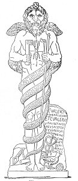  
MITHRAIC KRONOS (ÆON OR ZERVAN AKARANA) REPRESENTING BOUNDLESS TIME.

The statue here reproduced was found in the, mithræum of Ostia before
mentioned, where C. Valerius Heracles and his sons dedicated it in the
year 190 A.D. This leontocephalous figure is entirely nude, the body
being entwined six times by a serpent, the head of which rests on the
skull of the god. Four wings decorated with the symbols of the seasons
issue from the back. Each hand holds a key, and the right in addition a
long scepter, the symbol of authority, A thunderbolt is engraved on the
breast. On the base of the statue may be seen the hammer and tongs of
Vulcan, the cock and the pine-cone consecrated to Æsculapius (or
possibly to the Sun and to Attis), and the wand of Mercury--all
characteristic adjuncts of the Mithraic Saturn, and symbolizing the
embodiment in him of the powers of all the gods. (*T. et M.*, p. 238.)

 

was an assemblage of practices and beliefs without logical bond,
Mithraism had a genuine

p. 106

 

 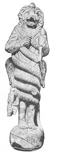  
Fig. 21.  
MITHRAIC KRONOS OF FLORENCE.  
(*T. et M.*, p. 259.)

 

theology, a dogmatic system, which borrowed from science its fundamental
principles. The belief appears generally to prevail that

p. 107

Mithra was the only Iranian god that was introduced into the Occident,
and that everything in his religion that does not relate directly to him
was adventitious and recent. This is a gratuitous and erroneous
supposition. Mithra was accompanied in his migrations by a large
representation from the Mazdean Pantheon, and if he was in the eyes of
his devotees the principal hero of the religion to which he gave his
name, he was nevertheless not its Supreme God.

At the pinnacle of the divine hierarchy and at the origin of things, the
Mithraic theology, the heir of that of the Zervanitic Magi, placed
boundless Time. Sometimes they would call it Αἰών or Sæculum, Κρόνος or
Saturnus; but these appellations were conventional and contingent, for
he was considered ineffable, bereft alike of name, sex, and passions. In
imitation of his Oriental prototype, he was represented in the likeness
of a human monster with the head of a lion and his body enveloped by a
serpent. The multiplicity of attributes with which his statues are
loaded is in keeping with the kaleidoscopic nature of his character. He
bears the scepter and the bolts of divine sovereignty and holds in each
hand a key as the monarch of the heavens whose portals he opens. His
wings are symbolic of the rapidity of his flight. The reptile whose
sinuous folds enwrap him, typifies the tortuous course of the Sun on the
ecliptic; the signs of

p. 108

 

 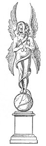  
Fig. 22.  
MITHRAIC KRONOS (ÆON, OR INFINITE TIME).

Nude leontocephalous figure standing upright on a globe; in each hand a
key; four wings; thrice entwined by a serpent, the head of which passes
over the skull and is about to enter the mouth. Sketched by Bartoli from
a description found in a mithræum discovered in the 16th century in
Rome, between the Quirinal and the Viminal. (*T. et. M.*, Fig. 21, p.
196.)

 

p. 109

the zodiac engraved on his body and the emblems of the seasons that
accompany them, are meant to represent the celestial and terrestrial
phenomena that signalize the eternal flight of the years. He creates and
destroys all things; he is the Lord and master of the four elements that
compose the universe, he virtually unites in his person the power of all
the gods, whom he alone has begotten. Sometimes he is identified with
Destiny, at others with the primitive light or the primitive fire; while
both conceptions rendered it possible for him to be compared with the
Supreme Cause of the Stoics,--the heat which pervades all things, which
has shaped all things, and which under another aspect was Fatality
(Εἱμαρμένη). See Figs. [20](#img_20)-[23](#img_23.md); also Fig.
[49](mom10.htm#img_49.md).

The preachers of Mithra sought to resolve the grand problem of the
origin of the world by the hypothesis of a series of successive
generations. The first principle, according to an ancient belief found
in India as well as in Greece, begot a primordial couple, the Heaven and
the Earth; and the latter, impregnated by her brother, gave birth to the
vast Ocean which was equal in power to its parents, and which appears to
have formed with them the supreme triad of the Mithraic Pantheon. The
relation of this triad to Kronos or Time from which it had sprung, was
not clearly defined; and the starry Heavens of which the revolutions
determined, as was believed, the course

p. 110

 

 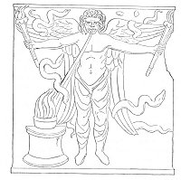  
Fig. 23.  
MITHRAIC LEONTOCEPHALOUS KRONOS.

Bas-relief of white marble. Found in the same mithræum as the statue of
Figure [22](#img_22.md). Naked to the waist; the limbs clothed in wide
trousers; the arms extended; and in each hand a torch. From the back
four wings issue, two pointing upwards and two downwards, and around
each is a serpent. Before the god is a circular burning altar, and from
his mouth a band representing his breath extends to the fire of the
altar. (*T. et M.*, Fig. 22, p. 196.)

 

of all events, appear at times to have been confounded with the eternal
Destiny.

p. 111

These three cosmic divinities were personified under other names less
transparent. The Heavens were naught less than Ormazd or Jupiter, the
Earth was identified with Speñta-Armaîti or Juno, and the Ocean was
similarly called Apâm-Napât or Neptune. Like the Greek theogonies, so
the Mithraic traditions narrated that Zeus succeeded Kronos, the king of
the first ages, in the government of the world. The bas-reliefs show us
this Mazdean Saturn placing in the hands of his son the thunderbolts
which were the symbol of his sovereign power. Henceforward Jupiter with
his consort Juno was to reign over all the other gods, all of whom owe
to this couple their existence.

The Olympian deities were sprung in fact from the marriage of the
celestial Jupiter with the terrestrial Juno. Their eldest daughter is
Fortune (*Fortuna primigenia*), who bestows on her worshippers every
grace of body and every beauty of soul. Her beneficent generosity is
contrasted with Anangke, which represents the unalterable rigor of fate.
Themis or the Law, the Moiræ or the Fates, were other personifications
of Destiny, which manifests under various forms a character which was
susceptible of infinite development. The sovereign couple further gave
birth not only to Neptune who became their peer, but to a long line of
other immortals: Artagnes or Hercules, whose heroic deeds the sacred

p. 112

hymns celebrated; Shahrîvar or Mars, who was the god of the metals and
succored the pious warrior in his combats; Vulcan or Atar, the genius of
fire; Mercury, the messenger of Zeus; Bacchus or Haoma, the
personification of the plant that furnished the sacred drink; Silvanus
or Drvâspa, protector of horses and agriculture; then Anaïtis, the
goddess of the fecundating waters, who has been likened to Venus and
Cybele and who, presiding over war, was also invoked under the name of
Minerva; Diana or Luna, who made the honey which was used in the
purifications; Vanaiñiti or Nike, who gave victory to kings; Asha or
Arete, perfect virtue; and others besides. This innumerable multitude of
divinities was enthroned with Jupiter or Zeus on the sun-tipped summits
of Mt. Olympus and composed the celestial court.

Contrasted with this luminous abode, where dwelt the Most High gods in
resplendent radiance, was a dark and dismal domain in the bowels of the
earth. Here Ahriman or Pluto, born like Jupiter of Infinite Time,
reigned with Hecate over the maleficent monsters that had issued from
their impure embraces.

These demoniac confederates of the King of Hell then ascended to the
assault of Heaven and attempted to dethrone the successor of Kronos;
but, shattered like the Greek giants by the ruler of the gods, these
rebel monsters were hurled backward into the abyss from

p. 113

 

 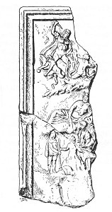  
Fig. 24.  
FRAGMENTS OF A BAS-RELIEF IN WHITE ITALIAN MARBLE.

Found at Virunum, in Noricum, and now in the Historical Museum
Rudolfinum, Klagenfurt, Austria. The central part of the monument is
entirely destroyed; the head of the sun-god from the left-hand corner
alone having been left (see Fig. [11](mom05.htm#img_11).md), The left
border represents a Hellenized illustration of Ahura-Mazda's struggle
with demons, after the manner of the gigantomachy. The lower part of the
same fragment exhibits the birth of Mithra. (*T. et M.*, p. 336.)

 

p. 114

which they had risen (Figure [24](#img_24).md). They made their escape,
however, from that place and wandered about on the surface of the earth,
there to spread misery and to corrupt the hearts of men, who, in order
to ward off the evils that menaced them, were obliged to appease these
perverse spirits by offering them expiatory sacrifices. The initiate
also knew how by appropriate rites and incantations to enlist them in
his service and to employ them against the enemies whose destruction he
was meditating.

The gods no longer confined themselves to the ethereal spheres which
were their appanage. If theogony represents them as gathered in Olympus
around their parents and sovereigns, cosmology exhibits them under
another aspect. Their energy filled the world, and they were the active
principles of its transformations. Fire, personified in the name of
Vulcan, was the most exalted of these natural forces, and it was
worshipped in all its manifestations, whether it shone in the stars or
in the lightning, whether it animated living creatures, stimulated the
growth of plants, or lay dormant in the bowels of the earth. In the deep
recesses of the subterranean crypts It burned perpetually on the altars,
and its votaries were fearful to contaminate its purity by sacrilegious
contact.

They opined with primitive artlessness that fire and water were brother
and sister, and

p. 115

they entertained the same superstitious respect for the one as for the
other. They worshipped alike the saline floods which filled the deep
seas and which were termed indifferently Neptune and Oceanus, the
springs that gurgled from the recesses of the earth, the rivers that
flowed over its surface, and the placid lakes resplendent in their
limpid sheen. A perpetual spring bubbled in the vicinity of the temples,
and was the recipient of the homage and the offerings of its visitors.
This font perennial (*fons perennis*) was alike the symbolization of the
material and moral boons that the inexhaustible generosity of Infinite
Time scattered throughout the universe, and that of the spiritual
rejuvenation accorded to wearied souls in the eternity of felicity.

The primitive earth, the nourishing earth, the mother earth (*terra
mater*), fecundated by the waters of Heaven, occupied a like important
place, if not in the ritual, at least in the doctrine of this religion;
and the four cardinal winds which were correlated with the deified
Seasons were invoked as genii to be both feared and loved: feared
because they were the capricious arbiters of the temperature, which
brought heat or cold, tempests or calms, which alternately moistened and
dried the atmosphere, which produced the vegetation of the spring and
withered the foliage of the autumn,--and loved as the diverse
manifestations of the air itself, which is the principle of all life.

p. 116

In other words, Mithraism deified the four simple bodies which,
according to the physics of the ancients, composed the universe. An
allegorical group, often reproduced, in which a lion represented fire, a
cup water, a serpent the earth, pictured the struggle of the opposing
elements, which were constantly devouring one another and whose
perpetual transmutations and infinitely variable combinations provoked
all the phenomena of nature (Fig. [25](#img_25).md).

Hymns of fantastic symbolism celebrated the metamorphoses which the
antitheses of these four elements produced in the world. The Supreme God
drives a chariot drawn by four steeds which turn ceaselessly round in a
fixed circle. The first, which bears on its shining coat the signs of
the planets and constellations, is sturdy and agile and traverses the
circumference of the fixed circle with extreme velocity; the second,
less vigorous and less rapid in its movements, wears a somber robe, of
which one side only is illuminated by the rays of the sun; the third
proceeds more slowly still; and the fourth turns slowly in the same
spot, champing restlessly its steel bit, whilst its companions move
round it as round a stationary column in the center. The quadriga turns
slowly and unimpeded, regularly completing its eternal course. But at a
certain moment the fiery breath of the first horse falling upon the
fourth ignites its mane,

p. 117

and its neighbor, exhausted by its efforts, inundates it with torrents
of perspiration. Finally,

 

 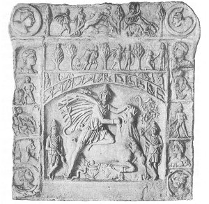  
Fig. 25.  
GRAND MITHRAIC BAS-RELIEF OF HEDDERNHEIM, GERMANY.

In the center Mithra with the two torch-bearers; immediately above, the
signs of the Zodiac; immediately above these, Mithra aiming his arrow at
the rock (page [138](#page_138).md); below the bull a group composed of the
lion, the cup, and the servant. For the obverse of this bas-relief, see
*supra*, p. 54. (*T. et M.*, p. 364.)

 

a still more remarkable phenomenon takes place. The appearance of the
quartette

p. 118

is transformed. The steeds interchange natures in such wise that the
substance of all passes over to the most robust and ardent of the group,
just as if a sculptor, after having modelled figures in wax, had
borrowed the attributes of one to complete the others, and had ended by
merging all into a single form. Then, the conquering steed in this
divine struggle, having become by his triumph omnipotent, is identified
with the charioteer himself. The first horse is the incarnation of fire
or ether, the second of air, the third of water, and the fourth of the
earth. The accidents which befall the last-mentioned horse, the earth,
represent the conflagrations and inundations which have desolated and
will in the future desolate our world; and the victory of the first
horse is the symbolic image of the final conflict that shall destroy the
existing order of all things.

The cosmic quadriga, which draws the suprasensible Cause, has not been
figured in the sacred iconography. The latter reserved for a visible god
this emblematic group. The votaries of Mithra, like the ancient
Persians, adored the Sun that traversed each day in its chariot the
spaces of the firmament and sank at dusk extinguishing its fires in the
ocean. When it appeared again on the horizon, its brilliant light
scattered in flight the spirits of darkness, and it purified all
creation, to which its radiance restored life. A like worship was

p. 119

accorded to the Moon, which voyaged in the spheres above on a cart drawn
by white bulls. The animal of reproduction and of agriculture had been
assigned to the goddess that presided over the increase of plants and
the generation of living creatures.

The elements, accordingly, were not the only natural bodies that were
deified in the Mysteries. The two luminaries that fecundated nature were
worshipped here the same as in primitive Mazdaism, but the conceptions
which the Aryas formed of them have been profoundly transformed by the
influences of Chaldæan theories.

As we have already said, [1](#fn_32.md) the ancient
belief of the Persians had been forcibly subjected in Babylon to the
influence of a theology which was based on the science of its day, and
the majority of the gods of Iran had been likened to the stars
worshipped in the valley of the Euphrates. They acquired thus a new
character entirely different from their original one, and the name of
the same deity thus assumed and preserved in the Occident a double
meaning. The Magi were unsuccessful in harmonizing these new doctrines
with their ancient religion, for the Semitic astrology was as
irreconcilable with the naturalism of Iran as it was with the paganism
of Greece. But looking upon these contradictions as simple differences
of degree in the perception of one and

p. 120

the same truth, the clergy reserved for the *élite* exclusively the
revelation of the original Mazdean doctrines concerning the origin and
destiny of man and the world, whilst the multitude were forced to remain
content with the brilliant and superficial symbolism inspired by the
speculations of the Chaldæans. The astronomical allegories concealed
from the curiosity of the vulgar the real scope of the hieratic
representations, and the promise of complete illumination, long
withheld, fed the ardor of faith with the fascinating allurements of
mystery.

The most potent of these sidereal deities, those which were most often
invoked and for which were reserved the richest offerings, were the
Planets. Conformably to astrological theories, the planets were endowed
with virtues and qualities for which it is frequently difficult for us
to discover adequate reasons. Each of the planetary bodies presided over
a day of the week, to each some one metal was consecrated, each was
associated with some one degree in the initiation, and their number has
caused a special religious potency to be attributed to the number seven.
In descending from the empyrean to the earth, the souls, it was thought,
successively received from them their passions and qualities. These
planetary bodies were frequently represented on the monuments, now by
symbols recalling the elements of which they were formed or the
sacrifices which were offered to them, and now

p. 121

under the aspect of the immortal gods throned on the Greek Olympus:
Helios, Selene, Ares, Hermes, Zeus, Aphrodite, Kronos. But these images
have here an entirely different signification from what they possess
when they stand for Ahura-Mazda, Zervan, or the other gods of Mazdaism.
Then the personifications of the Heavens or of Infinite Time are not
seen in them, but only the luminous stars whose wandering course can be
followed amid the constellations. This double system of interpretation
was particularly applied to the Sun, conceived now as identical with
Mithra and now as distinct from him. In reality there were two solar
divinities in the Mysteries, one Iranian and the heir of the Persian
Hvare, the other Semitic, the substitute of the Babylonian Shamash,
identified with Mithra.

By the side of the planetary gods who have still a double character,
purely sidereal divinities received their tribute of homage. The twelve
signs of the Zodiac, which in their daily revolution subject creatures
to their adverse influences, were represented in all of the mithræums
under their traditional aspect (Fig. [26](#img_26).md). Each of them was
without doubt the object of particular veneration during the month over
which it presided, and they were customarily grouped by threes according
to the Seasons to which they conformed and with the worship of which
theirs was associated. (See also Fig. [49](mom10.htm#img_49)..md)

p. 122

But the signs of the Zodiac were not the only constellations that were
incorporated by the priests in their theology. The astronomical method
of interpretation, having been

 

 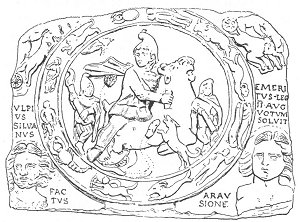  
Fig. 26.  
MARBLE BAS-RELIEF FOUND IN LONDON.

In the center the tauroctonous Mithra with the torch-bearers surrounded
by the twelve signs of the Zodiac. In the lower corners busts of the
Winds; in the upper corners the Sun on his quadriga and the Moon on a
chariot drawn by bulls. The inscription reads: Ulpius Silvanus emeritus
leg(ionis) II Aug(ustæ) votum solvit. (that is, honorably discharged at
Orange). (*T. et M.*, p. 389.)

 

once adopted in the Mysteries, was freely extended and made to embrace
all possible figures. There was scarcely any object or animal that was
not in some way conceived as

p. 123

the symbolic image of a stellar group. Thus the raven, the cup, the dog,
and the lion, that ordinarily accompany the group of the tauroctonous
Mithra, were readily identified with the constellations of the same
name. The two celestial hemispheres that alternately pass above and
below the earth were personified and likened to the Dioscuri, who,
according to

 

   
Fig. 27.  
MITHRAIC CAMEO.

After Chiflet, reproduced from C. W. King.

 

the Hellenic fable, lived and died by turns. Mythology and erudition
were everywhere mingled. The hymns described a hero like the Greek Atlas
who bore on his untiring shoulders the globe of Heaven, and who is
regarded as the inventor of astronomy. But these demi-gods were
relegated to the background; the planets and the signs of the Zodiac
never ceased to preserve their incontestable primacy, for it was they
above all others, according to the astrologers, that con

p. 124

trolled the existence of men and guided the Course of things.

This was the capital doctrine that Babylon introduced into Mazdaism:
belief in Fatality,

 

 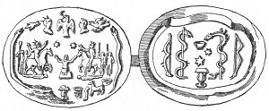  
MITHRAIC CAMEO.

Showing Mithra born from the rock between the Dioscuri, surrounded by
Mithraic symbols, among them the cup and bread of the Eucharist.
(Reproduced from Walsh.)

 

the conception of an inevitable Destiny controlling the events of this
world and inseparably conjoined with the revolution of the starry
heavens. This Destiny, identified with Zervan,

p. 125

became the Supreme Being which engendered all things and ruled the
universe. The development of the universe is subject to immutable laws
and its various parts are united in the most intimate solidarity. The
position of the planets, their mutual relations and energies, at every
moment different, produce the series of terrestrial phenomena.
Astrology, of which these postulates were the dogmas, certainly owes
some share of its success to the Mithraic propaganda, and Mithraism is
therefore partly responsible for the triumph in the West of this
pseudo-science with its long train of errors and terrors.

The rigorous logic of its deductions assured to this stupendous chimera
a more complete domination over reflecting minds than the belief in the
infernal powers and in the invocation of spirits, although the latter
commanded greater sway over popular credulity. The independent power
attributed by Mazdaism to the principle of evil afforded justification
for all manner of occult practices. Necromancy, oneiromancy, belief in
the evil eye and in talismans, in witchcraft and conjurations, in fine,
all the puerile and sinister aberrations of ancient paganism, found
their justification in the rôle assigned to demons who incessantly
interfered in the affairs of men. The Persian Mysteries are not free
from the grave reproach of having condoned, if not of having really
taught, these various superstitions. And

p. 126

the title "Magus" became in the popular mind, not without good reason, a
synonym for "magician."

Yet neither the conception of an inexorable necessity unpityingly
forcing the human race toward an unknown goal, nor even the fear of
malevolent spirits bent on its destruction, was competent to attract the
multitudes to the altars of the Mithraic gods. The rigor of these somber
doctrines was tempered by a belief in benevolent powers sympathizing
with the sufferings of mortals. Even the planets were not, as in the
didactic works of the theoretical astrologists, cosmic powers whose
favorable or sinister influence waxed great or diminished conformably to
the revolutions of a circle fixed for all eternity. They were, as in the
doctrine of the old Chaldæan religion, divinities that saw and heard,
that rejoiced or lamented, whose wrath might be appeased, and whose
favor might be gained by prayers and by offerings. The faithful reposed
their confidence in the support of these benevolent protectors who
combated without respite the powers of evil.

The hymns that celebrated the exploits of the gods have unfortunately
almost all perished, and we know these epic traditions only through the
monuments which served to illustrate them. Nevertheless, the character
of this sacred poetry is recognizable in the *débris* which has come
down to us. Thus, the labors

p. 127

of Verethraghna, the Mazdean Hercules, were chanted in Armenia. It is
told here how he strangled the dragons and aided Jupiter in his
triumphant combat with the monstrous giants; and like the votaries of
the Avesta, the Roman adepts of Mazdaism compared him to a bellicose and
destructive boar.

But the hero that enjoyed the greatest rôle in these warlike tales was
Mithra. Certain mighty deeds, which in the books of Zoroastrianism were
attributed to other divinities, were associated with his person. He had
become the center of a cycle of legends which alone explain the
preponderant place that was accorded him in this religion. It is because
of the astounding feats accomplished by him that this god, who did not
hold supreme rank in the celestial hierarchy, has given his name to the
Persian Mysteries that were disseminated in the Occident.

For the ancient Magi, Mithra was, as we have seen, the god of light, and
as the light is borne by the air he was thought to inhabit the Middle
Zone between Heaven and Hell, and for this reason the name of μεσίτης
was given to him. In order to signalize this attribute in the ritual,
the sixteenth or middle day of each month was consecrated to him. When
he was identified with Shamash, [1](#fn_33.md) his
priests in investing him with the appellation of "intermediary"
doubtless had in mind the fact that, according

p. 128

to the Chaldæan doctrines, the sun occupied the middle place in the
planetary choir. But this middle position was not exclusively a position
in space; it was also invested with an important moral significance.
Mithra was the

 

 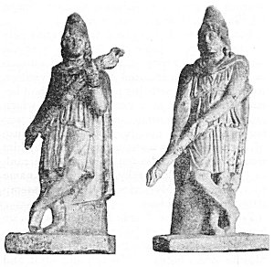  
Fig. 29.

STATUES OF TORCH-BEARERS.

(Museum of Palermo. *T. et M.*, p. 270.)

 

"mediator" between the unapproachable and unknowable god that reigned in
the ethereal spheres and the human race that struggled and suffered here
below. Shamash had already enjoyed analogous functions in Babylon,

p. 129

and the Greek philosophers also saw in the glittering globe that poured
down upon this world its light, the ever-present image of the invisible
Being, of whom reason alone could conceive the existence.

It was in this adventitious quality of the genius of the solar light
that Mithra was best known in the Occident, and his monuments frequently
suggest this borrowed character. It was customary to represent him
between two youthful figures, one with an uplifted, the other with an
inverted, torch. These youths bore the enigmatic epithets of *Cauti* and
*Cautopati*, and were naught else than the double incarnation of his
person (Figs. [18](mom05.htm#img_18) and [29](#img_29).md). These two
dadophori, as they were called, and the tauroctonous hero formed
together a triad, and in this "triple Mithra" was variously seen either
the star of day, whose coming at morn the cock announced, who passed at
midday triumphantly into the zenith and at night languorously fell
toward the horizon; or the sun which, as it waxed in strength, entered
the constellation of Taurus and marked the beginning of spring,--the sun
whose conquering ardors fecundated nature in the heart of summer and the
sun that afterwards, enfeebled, traversed the sign of the Scorpion and
announced the return of winter. From another point of view, one of these
torchbearers was regarded as the emblem of heat and of life, and the
other as the emblem of

p. 130

cold and of death. Similarly, the tauroctonous group was variously
explained with the aid of an astronomical symbolism more ingenious than
rational. Yet these sidereal interpretations were nothing more than
intellectual diversions designed to amuse the neophytes

 

 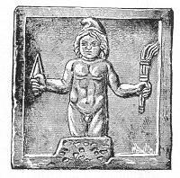  
Fig. 30.  
MITHRA BORN FROM THE ROCK.

Bas-relief found in the crypt of St. Clements at Rome. (*T. et M.*, p.
202.)

 

prior to their receiving the revelation of the esoteric doctrines that
constituted the ancient Iranian legend of Mithra. The story of this
legend is lost, but the bas-reliefs recount certain episodes of it, and
its contents appear to have been somewhat as follows:

The light bursting from the heavens, which

p. 131

were conceived as a solid vault, became, in the mythology of the Magi,
Mithra born from the rock. The tradition ran that the "Generative Rock,"
of which a standing image was worshipped in the temples, had given birth
to Mithra. on the banks of a river, under the

 

 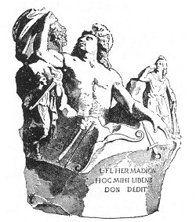  
Fig. 31.  
MITHRA BORN FROM THE ROCK.

Holding in his hand the Grape which in the West replaced the Haoma of
the Persians. (*T. et M.*, p. 231.)

 

shade of a sacred tree, and that shepherds alone, [1](#fn_34.md) ensconced in a neighboring mountain, had
witnessed the miracle of his entrance into the world. They had seen him
issue forth from the rocky mass, his head adorned with a Phrygian cap,
armed with a knife, and carrying

p. 132

a torch that had illuminated the somber depths. below (Fig.
[30](#img_30).md). Worshipfully the shepherds drew near, offering the
divine infant the first fruits of their flock and their harvests. But
the young hero was naked and exposed to the winds that blew with
violence: he had concealed himself in the branches of a fig-tree, and
detaching the fruit from the tree with the aid of his knife, he ate of
it, and stripping it of its leaves he made himself garments. Thus
equipped for the battle, he was able henceforward to measure his
strength with the other powers, that peopled the marvellous world into
which he had entered. For although the shepherds were pasturing their
flocks when he was born, all these things came to pass before there were
men on earth.

The god with whom Mithra first measured his strength was the Sun. The
latter was compelled to render homage to the superiority of his rival
and to receive from him his investiture. His conqueror placed upon his
head the radiant crown that he has borne in his daily course ever since
his downfall. Then he caused him to rise again, and extending to him his
right hand concluded with him a solemn covenant of friendship. And ever
after, the two allied heroes faithfully supported each other in all
their enterprises (Fig. [32](#img_32).md).

The most extraordinary of these epic adventures was Mithra's combat with
the bull, the first living creature created by Ormazd. This

p. 133

 

 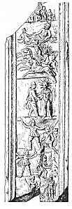  
Fig. 32.  
FRAGMENT OF THE BAS-RELIEF OF VIRUNUM.

Showing scenes from the life of Mithra. Among them Mithra crowning the
sun-god with a radiate halo, his ascension in the solar chariot to
Heaven, and his smiting the rock from which the waters flowed. (*T. et.
M.*, p. 336)

 

p. 134

ingenious fable carries us back to the very beginnings of civilization.
It could never have risen save among a people of shepherds and

 

 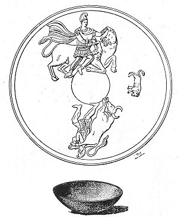  
Fig. 33.  
THE TAUROCTONOUS (BULL-SLAYING) MITHRA AND THE TAUROPHOROUS
(BULL-BEARING) MITHRA; BETWEEN THEM THE DOG.

Clay cup found at Lanuvium. (*T. et M.* Fig. 80, p. 247.)

 

hunters with whom cattle, the source of all wealth, had become an object
of religious

p. 135

veneration. In the eyes of such a people, the capture of a wild bull was
an achievement so highly fraught with honor as to be apparently no
derogation even for a god.

The redoubtable bull was grazing in a pasture on the mountain-side; the
hero, resorting to a bold stratagem, seized it by the horns and
succeeded in mounting it. The infuriated quadruped, breaking into a
gallop, struggled in vain to free itself from its rider; the latter,
although unseated by the bull's mad rush, never for a moment relaxed his
hold; he suffered himself to be dragged along, suspended from the horns
of the animal, which, finally exhausted by its efforts, was forced to
surrender. Its conqueror then seizing it by its hind hoofs, dragged it
backwards over a road strewn with obstacles (Fig. [33](#img_33).md) into
the cave which served as his home.

This painful journey (*Transitus*) of Mithra became the symbol of human
sufferings. But the bull, it would appear, succeeded in making its
escape from its prison, and roamed again at large over the mountain
pastures. The Sun then sent the raven, his messenger, to carry to his
ally the command to slay the fugitive. Mithra received this cruel
mission much against his will, but submitting to the decree of Heaven he
pursued the truant beast with his agile dog, succeeded in overtaking it
just at the moment when it was taking refuge in the cave which it had
quitted, and seizing it

p. 136

by the nostrils with one hand, with the other he plunged deep into its
flank his hunting-knife. Then came an extraordinary prodigy to pass.

 

 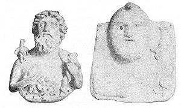  
Fig. 34.  
TWO BRONZE PLAQUES (VATICAN).

The one to the left has the head of Jupiter (Silvanus?). The right hand
holds a pine-cone, the left a branch entwined by a serpent. On the right
shoulder is an eagle, and the breast is decorated with Mithraic figures
in relief: the tauroctonous Mithra, a cup, the head of a ram, and a
five-rayed disc. The right-hand bust is that of a bearded Oriental with
Phrygian cap, holding in the right hand a pine-cone and in the left a
torch entwined by a serpent--a crude piece of work and probably of
Asiatic origin. (*T. et M.* Figs. 97 and 98, p. 260.)

 

From the body of the moribund victim sprang all the useful herbs and
plants that cover the earth with their verdure. From the spinal cord of
the animal sprang the wheat that gives

p. 137

us our bread, and from its blood the vine that produces the sacred drink
of the Mysteries. In vain did the Evil Spirit launch forth his unclean
demons against the anguish-wrung animal, in order to poison in it the
very sources of life; the scorpion, the ant, the serpent, strove in vain
to consume the genital parts and to drink the blood of the prolific
quadruped; but they were powerless to impede the miracle that was
enacting. The seed of the bull, gathered and purified by the Moon,
produced all the different species of useful animals, and its soul,
under the protection of the dog, the faithful companion of Mithra,
ascended into the celestial spheres above, where, receiving the honors
of divinity, it became under the name of Silvanus the guardian of herds.
Thus, through the sacrifice which he had so resignedly undertaken, the
tauroctonous hero became the creator of all the beneficent beings on
earth; and, from the death which he had caused, was born a new life,
more rich and more fecund than the old.

Meanwhile, the first human couple had been called into existence, and
Mithra was charged with keeping a watchful eye over this privileged
race. It was in vain the Spirit of Darkness invoked his pestilential
scourges to destroy it; the god always knew how to balk his mortiferous
designs. Ahriman first desolated the land by causing a protracted
drought, and its inhabitants, tortured by thirst, implored the

p. 138

aid of his ever-victorious adversary. The divine archer discharged his
arrows against a precipitous rock, and here gushed forth from it a
spring of living water to which the suppliants thronged to cool their
parched palates. [1](#fn_35.md) But a still more
terrible cataclysm followed, which menaced all nature. A universal
deluge depopulated the earth, which was overwhelmed by the waters of the
rivers and the seas. One man alone, secretly advised by the gods, had
constructed a boat and had saved himself, together with his cattle, in
an ark which floated on the broad expanse of waters. Then a great
conflagration ravaged the world and consumed utterly both the
habitations of men and of beasts. But the creatures of Ormazd also
ultimately escaped this new peril, thanks to celestial protection, and
henceforward the human race was permitted to wax great and multiply in
peace.

The heroic period of history was now closed, and the terrestrial mission
of Mithra accomplished. In a Last Supper, which the initiated
commemorated by mystical love feasts, he celebrated with Helios and the
other companions of his labors the termination of their common
struggles. Then the gods ascended to the Heavens. Borne by the Sun on
his radiant quadriga, Mithra crossed the Ocean, which sought in vain to
engulf him (Fig. [35](#img_35).md), and took up his habitation with the
rest of the immortals.

p. 139

 

 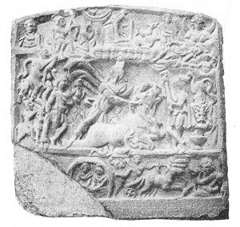  
Fig. 35.  
BAS-RELIEF OF APULUM, DACIA.

In the center, the tauroctonous Mithra with the two torch-bearers; to
the left, Mithra mounted on the bull, and Mithra taurophorous; to the
right, a lion stretched lengthwise above a cup (symbols of fire and
water). Upper border: Bust of Luna; new-born Mithra reclining near the
banks of a stream; shepherd standing, with lambs; bull in a hut and bull
in a boat; underneath, the seven altars; Mithra drawing a bow; bust of
the Sun. Lower border: Banquet of Mithra and the Sun; Mithra mounting
the quadriga of the Sun; the Ocean surrounded by a serpent. (*T. et M.*,
p. 309.)

 

p. 140

But from the heights of Heaven he never ceased to protect the faithful
ones that piously served him.

This mythical recital of the origin of the world enables us to
understand the importance which the tauroctonous god enjoyed in his
religion, and to comprehend better what the pagan theologians endeavored
to express by the title "mediator." Mithra is the creator to whom
Jupiter-Ormazd committed the task of establishing and of maintaining
order in nature. He is, to speak in the philosophical language of the
times, the Logos that emanated from God and shared His omnipotence; who,
after having fashioned the world as demiurge, continued to watch
faithfully over it. The primal defeat of Ahriman had not reduced him to
absolute impotence; the struggle between the good and the evil was still
conducted on earth between the emissaries of the sovereign of Olympus
and those of the Prince of Darkness; it raged in the celestial spheres
in the opposition of propitious and adverse stars, and it reverberated
in the hearts of men,--the epitomes of the universe.

Life is a battle, and to issue forth from it victorious the law must be
faithfully fulfilled that the divinity himself revealed to the ancient
Magi. What were the obligations that Mithraism imposed upon its
followers? What were those "commandments" to which its adepts had to bow
in order to be rewarded in

p. 141

the world to come? Our incertitude on these points is extreme, for we
have not the shadow of a right to identify the precepts revealed in the
Mysteries with those formulated in the Avesta. Nevertheless, it would
appear certain that the ethics of the Magi of the Occident had made no
concession to the license of the Babylonian cults and that it had still
preserved the lofty character of the ethics of the ancient Persians.
Perfect purity had remained for them the cult toward which the life of
the faithful should tend. Their ritual required repeated lustrations and
ablutions, which were believed to wash away the stains of the soul. This
catharsis or purification both conformed to the Mazdean traditions and
was in harmony with the general tendencies of the age. Yielding to these
tendencies, the Mithraists carried their principles even to excess, and
their ideals of perfection verged on asceticism. Abstinence from certain
foods and absolute continence were regarded as praiseworthy.

Resistance to sensuality was one of the aspects of the combat with the
principle of evil. To support untiringly this combat with the followers
of Ahriman, who, under multiple forms, disputed with the gods the empire
of the world, was the duty of the servitors of Mithra. Their dualistic
system was particularly adapted to fostering individual effort and to
developing human energy. They did not lose themselves, as did the other
sects, in

p. 142

contemplative mysticism; for them, the good dwelt in action. They rated
strength higher than gentleness, and preferred courage to lenity. From
their long association with barbaric religions, there was perhaps a
residue of

 

 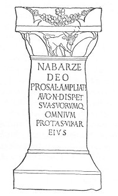  
Fig. 36.  
VOTIVE INSCRIPTION TO MITHRA NABARZE (VICTORIOUS).

Found at Sarmizegetusa. (*T. et M.*, p. 231.)

 

cruelty in their ethics. A religion of soldiers, Mithraism exalted the
military virtues above all others.

In the war which the zealous champion of piety carries on unceasingly
with the malign

p. 143

demons, he is assisted by Mithra. Mithra is the god of help, whom one
never invokes in vain, an unfailing haven, the anchor of salvation for
mortals in all their trials, the dauntless champion who sustains his
devotees in their frailty, through all the tribulations of life. As with
the Persians, so here he is still the defender of truth and justice, the
protector of holiness, and the intrepid antagonist of the powers of
darkness. Eternally young and vigorous, he pursues them without mercy;
"always awake, always alert," it is impossible to surprise him; and from
his never-ceasing combats he always emerges the victor. This is the idea
that unceasingly occurs in the inscriptions, the idea expressed by the
Persian surname Nabarze (Fig. [36](#img_36).md), by the Greek and Latin
epithets of ἀνίκητος, *invictus*, *insuperabilis*. As the god of armies,
Mithra caused his *protégés* to triumph over their barbarous
adversaries, and likewise in the moral realm he gave them victory over
the instincts of evil, inspired by the Spirit of Falsehood, and he
assured them salvation both in this world and in that to come.

Like all the Oriental cults, the Persian Mysteries mingled with their
cosmogonic fables and their theological speculations, ideas of
deliverance and redemption. They believed in the conscious survival
after death of the divine essence that dwells within us, and in
punishments and rewards beyond the tomb.

p. 144

The souls, of which an infinite multitude peopled the habitations of the
Most High, descended here below to animate the bodies of men, either
because they were compelled by bitter necessity to fall into this
material and corrupt world, or because they had dropped of their own
accord upon the earth to undertake here the battle against the demons.
When after death the genius of corruption took possession of the body,
and the soul quitted its human prison, the devas of darkness and the
emissaries of Heaven disputed for its possession. A special decree
decided whether it was worthy to ascend again into Paradise. If it was
stained by an impure life, the emissaries of Ahriman dragged it down to
the infernal depths, where they inflicted upon it a thousand tortures;
or perhaps, as a mark of its fall, it was condemned to take up its abode
in the body of some unclean animal. If, on the contrary, its merits
outweighed its faults, it was borne aloft to the regions on high.

The heavens were divided into seven spheres, each of which was conjoined
with a planet. A sort of ladder, composed of eight superposed gates, the
first seven of which were constructed of different metals, was the
symbolic suggestion in the temples, of the road to be followed to reach
the supreme region of the fixed stars. To pass from one story to the
next, each time the wayfarer had to enter a gate guarded by

p. 145

an angel of Ormazd. The initiates alone, to whom the appropriate
formulas had been taught, knew how to appease these inexorable
guardians. As the soul traversed these different zones, it rid itself,
as one would of garments, of the passions and faculties that it had
received in its descent to the earth. It abandoned to the Moon its vital
and nutritive energy, to Mercury its desires, to Venus its wicked
appetites, to the Sun its intellectual capacities, to Mars its love of
war, to Jupiter its ambitious dreams, to Saturn its inclinations. It was
naked, stripped of every vice and every sensibility, when it penetrated
the eighth heaven to enjoy there, as an essence supreme, and in the
eternal light that bathed the gods, beatitude without end. [1](#fn_36.md)

It was Mithra, the protector of truth, that presided over the judgment
of the soul after its decease. It was he, the mediator, that served as a
guide to his faithful ones in their courageous ascent to the empyrean;
he was the celestial father that received them in his resplendent
mansion, like children who had returned from a distant voyage.

The happiness reserved for these quintessentialized monads in a
spiritual world is rather difficult to conceive, and doubtless this
doctrine had but feeble attraction for vulgar

p. 146

minds. Another belief, which was added to the first by a sort of
superfœtation, offered the prospect of more material enjoyment. The
doctrine of the immortality of the soul was rounded off by the doctrine
of the resurrection of the flesh.

The struggle between the principles of good and evil is not destined to
continue into all eternity. When the age assigned for its duration shall
have rolled away, the scourges sent by Ahriman will compass the
destruction of the world. A marvellous bull, analogous to the primitive
bull, will then again appear on earth, and Mithra will redescend and
reawaken men to life. All will sally forth from the tombs, will assume
their former appearance, and recognize one another. Humanity entire will
unite in one grand assembly, and the god of truth will separate the good
from the bad. Then in a supreme sacrifice, he will immolate the divine
bull; will mingle its fat with the consecrated wine, and will offer to
the just this miraculous beverage which will endow them all with
immortality. Then Jupiter-Ormazd, yielding to the prayers of the
beatified ones, will cause to fall from the heavens a devouring fire
which will annihilate all the wicked. The defeat of the Spirit of
Darkness will be achieved, and in the general conflagration Ahriman and
his impure demons will perish and the rejuvenated universe enjoy unto
all eternity happiness without end.

p. 147

We who have never experienced the Mithraic spirit of grace are apt to be
disconcerted by the incoherence and absurdity of this body of doctrine,
such as it has been shown forth in our reconstruction. A theology at
once naive and artificial here combines primitive myths, the
naturalistic tendency of which is still transparent, with an
astrological system whose logical structure only serves to render its
radical falsity all the more palpable. All the impossibilities of the
ancient polytheistic fables here subsist side by side with philosophical
speculations on the evolution of the universe and the destiny of man.
The discordance between tradition and reflection is extremely marked
here and it is augmented by the contrariety between the doctrine of
fatalism and that of the efficacy of prayer and the need of worship. But
this religion, like any other, must not be estimated by its metaphysical
verity. It would ill become us to-day to dissect the cold corpse of this
faith in order to ascertain its inward organic vices. The important
thing is to understand how Mithraism lived and grew great, and why it
failed to win the empire of the world.

Its success was in great part undoubtedly due to the vigor of its
ethics, which above all things favored action. In an epoch of anarchy
and emasculation, its mystics found in its precepts both stimulus and
support. The conviction that the faithful ones formed part of a

p. 148

sacred army charged with sustaining with the Principle of Good the
struggle against the power of evil, was singularly adapted to provoking
their most pious efforts and transforming them into ardent zealots.

The Mysteries exerted another powerful influence, also, in fostering
some of the most exalted aspirations of the human soul: the desire for
immortality and the expectation of final justice. The hopes of life
beyond the tomb which this religion instilled in its votaries were one
of the secrets of its power in these troublous times, when solicitude
for the life to come disturbed all minds.

But several other sects offered to their adepts just as consoling
prospects of a future life. The special attraction of Mithraism dwelt,
therefore, in other qualities of its doctrinal system. Mithraism, in
fact, satisfied alike both the intelligence of the educated and the
hearts of the simple-minded. The apotheosis of Time as First Cause and
that of the Sun, its physical manifestation, which maintained on earth
heat and light, were highly philosophical conceptions. The worship
rendered to the Planets and to the Constellations, the course of which
determined terrestrial events, and to the four Elements, whose infinite
combinations produced all natural phenomena, is ultimately reducible to
the worship of the principles and agents recognized by ancient science,
and the theology of the Mysteries

p. 149

was, in this respect, nothing but the religious expression of the
physics and astronomy of the Roman world.

This theoretical conformity of revealed dogmas with the accepted ideas
of science was calculated to allure cultivated minds, but it had no hold
whatever upon the ignorant souls of the populace. These, on the other
hand, were eminently amenable to the allurements of a doctrine that
deified the whole of physical and tangible reality. The gods were
everywhere, and they mingled in every act of life; the fire that cooked
the food and warmed the bodies of the faithful, the water that allayed
their thirst and cleansed their persons, the very air that they
breathed, and the light that illuminated their paths, were the objects
of their adoration. Perhaps no other religion ever offered to its
sectaries in a higher degree than Mithraism opportunities for prayer and
motives for veneration. When the initiated betook himself in the evening
to the sacred grotto concealed in the solitude of the forests, at every
step new sensations awakened in his heart some mystical emotion. The
stars that shone in the sky, the wind that whispered in the foliage, the
spring or brook that babbled down the mountain-side, even the earth that
he trod under his feet, were in his eyes divine, and all surrounding
nature provoked in him a worshipful fear for the infinite forces that
swayed the universe.

------------------------------------------------------------------------

### Footnotes

[119:1](mom07.htm#fr_32.md) See *supra*, page
[10](mom04.htm#page_10.md).

[127:1](mom07.htm#fr_33.md) See *supra*, page
[10](mom04.htm#page_10.md).

[131:1](mom07.htm#fr_34.md) See the lower part of
Fig. [24](#img_24.md).

[138:1](mom07.htm#fr_35.md) See *supra*, [p.
117](#page_117), Fig. [25](#img_25.md), and *infra*, [p.
196](mom09.htm#page_196), Fig. [45](mom09.htm#img_45.md).

[145:1](mom07.htm#fr_36.md) This Mithraic doctrine
has recently been compared with other analogous beliefs and studied in
detail by M. Bossuet. "Die Himmelreise der Seele" (*Archiv für
Relikionswissenschaft*, Vol. IV., 1901, p. 160 ff.).

------------------------------------------------------------------------

[Next: The Mithraic Liturgy, Clergy and Devotees](mom08.md)
