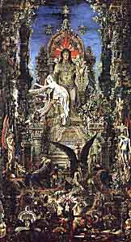

  
[Intangible Textual Heritage](../../index)  [Classics](../index) 

------------------------------------------------------------------------

  
Jupiter and Semele by Gustave Moreau, 1895 (click to enlarge)

# The Religion of Numa

##### And Other Essays on the Religion of Ancient Rome

## by Jesse Benedict Carter

#### \[1906\]

------------------------------------------------------------------------

This is a short survey of the history of Roman religion, particularly
the Roman pantheon, from its origins as abstract animistic deities, the
infiltration of Greek gods and goddesses, the influence of the
Sibyllines, the introduction of Near Eastern Goddess worship and other
deities, and finally the rise of the God-Emperors, codified under
Augustus.

------------------------------------------------------------------------

[Title Page](numa00)  
[Preface](numa01)  
[Contents](numa02)  
[The Religion of Numa](numa03)  
[The Reorganisation of Servius](numa04)  
[The Coming of the Sibyl](numa05)  
[The Decline of Faith](numa06)  
[The Augustan Renaissance](numa07)  
