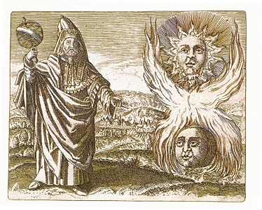

  
[Intangible Textual Heritage](../../index)  [Classics](../index.md) 

------------------------------------------------------------------------

[Buy this Book at
Amazon.com](https://www.amazon.com/exec/obidos/ASIN/1564592766/internetsacredte.md)

------------------------------------------------------------------------

<table width="75%">
<colgroup>
<col style="width: 50%" />
<col style="width: 50%" />
</colgroup>
<tbody>
<tr class="odd">
<td width="50%" data-valign="TOP"></td>
<td width="50%" data-valign="CENTER"><h1 id="the-golden-verses-of-pythagoras" data-align="CENTER">The Golden Verses of Pythagoras</h1>
<h2 id="by-fabre-dolivet" data-align="CENTER">by Fabre d'Olivet</h2>
<h4 id="section" data-align="CENTER">[1917]</h4></td>
</tr>
</tbody>
</table>

------------------------------------------------------------------------

[Contents](#contents)    [Start Reading](ogv00.md)

------------------------------------------------------------------------

|                                                                                                                           |
|---------------------------------------------------------------------------------------------------------------------------|
|  |

Fabre d'Olivet (b. 1768, d. 1825), a French esoteric writer, originally
published this book in 1813. The first section, an essay on esoteric
Poetics, was dedicated to the Section of Literature of the Imperial
Institute of France. The [second portion](ogv11.md) contains the Greek text
of the Golden Verses, along with French and English translations. The
final part of the book is an extended essay on the Golden Verses.

The Golden Verses are also available at this site in a more recent
English [translation by Florence Firth](../gvp/index.md).

Note that your browser must be set up to display polytonic Greek and
Hebrew Unicode to view this text properly. Full information can be found
[here](../../unicode.md).

------------------------------------------------------------------------

 [Title Page](ogv00.md)  
[Table of Contents](ogv01.md)  
[Translator’s Foreword](ogv02.md)  

### Discourse Upon the Essence and Form of Poetry

[Introduction](ogv03.md)  
[§ I](ogv04.md)  
[§ II](ogv05.md)  
[§ III](ogv06.md)  
[§ IV](ogv07.md)  
[§ V](ogv08.md)  
[§ VI](ogv09.md)  
[§ VII](ogv10.md)  

 

[The Golden Verses of Pythagoras](ogv11.md)  

### Examinations of the Golden Verses

[1. The Golden Verses of the Pythagoreans](ogv12.md)  
[2. Render to the Immortal Gods the Consecrated Cult; Guard Then Thy
Faith](ogv13.md)  
[3. Revere the Memory of the Illustrious Heroes, of Spirits
Demi-Gods](ogv14.md)  
[4. Be a Good Son, Just Brother, Spouse Tender, and Good
Father](ogv15.md)  
[5. Choose For Thy Friend, the Friend of Virtue...](ogv16.md)  
[If Thou Canst at Least: For A Most Rigid Law Binds Power To
Necessity](ogv17.md)  
[7. Still it is Given Thee to Fight and Overcome Thy Foolish Passions:
Learn Thou to Subdue Them](ogv18.md)  
[8. Be Sober, Diligent, and Chaste; Avoid All Wrath...](ogv19.md)  
[9. Speak Not Nor Act Before Thou Hast Reflected; Be Just](ogv20.md)  
[10. Remember That a Power Invincible Ordains to Die](ogv21.md)  
[11. That riches and the honours Easily acquired, are easy thus to
lose](ogv22.md)  
[12. As to the evils which Destiny involves](ogv23.md)  
[13. Even as Truth, does Error have its lovers](ogv24.md)  
[14. Keep closed both eye and ear ’gainst prejudice](ogv25.md)  
[15. Consult, Deliberate, and Freely Choose](ogv26.md)  
[16. Let fools act aimlessly and without cause, Thou shouldst, in the
present, contemplate the future](ogv27.md)  
[17. That which thou dost not know, pretend not that thou dost. Instruct
thyself: for time and patience favour all.](ogv28.md)  
[18. Neglect not thy health](ogv29.md)  
[19. . . . Dispense with moderation, Food to the body, and to the mind
repose](ogv30.md)  
[20. Too much attention or too little shun; for envy thus, to either
excess is alike attached](ogv31.md)  
[21. Luxury and avarice have similar results. One must choose in all
things a mean just and good.](ogv32.md)  
[22. What have I omitted, and what done?](ogv33.md)  
[23. Abstain thou if ‘tis evil; persevere if good](ogv34.md)  
[24. Meditate Upon My Counsels, Love Them; Follow Them: to the Divine
Virtues Will They Know How to Lead Thee](ogv35.md)  
[25. The sacred Tetrad](ogv36.md)  
[26. Invoke these Gods with fervour](ogv37.md)  
[27. Know the Principle and End of All](ogv38.md)  
[28. If Heaven Wills It, Thou Shalt Know That Nature, Alike in
Everything, Is the Same in Every Place](ogv39.md)  
[29. Thine Heart Shall No More Feed On Vain Desires](ogv40.md)  
[30. The Evils Which Devour Men Are of Their Choice the Fruit](ogv41.md)  
[31. Unfortunates Seek Afar the Goodness Whose Source Within They
Bear](ogv42.md)  
[32. For few know happiness](ogv43.md)  
[33. God! Thou Couldst Save Them by Opening Their Eyes](ogv44.md)  
[34. But No: ’Tis For the Humans of a Race Divine, to Discern Error, and
to See the Truth](ogv45.md)  
[35. Nature serves them](ogv46.md)  
[36. Letting Intelligence O’er Thy Body Reign](ogv47.md)  
[37. Thou Shalt Be Thyself A God](ogv48.md)  
