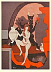
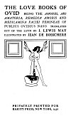
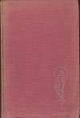

  
[Intangible Textual Heritage](../../../index)  [Classics](../../index) 
[Ovid](../index)  [Index](index)  [Next](lboo01) 

------------------------------------------------------------------------

[Buy this Book at
Amazon.com](https://www.amazon.com/exec/obidos/ASIN/1417905824/internetsacredte)

------------------------------------------------------------------------

# THE LOVE BOOKS OF OVID

#### BEING THE AMORES, ARS AMATORIA, REMEDIA AMORIS AND MEDICAMINA FACIEI FEMINEAE

#### OF PUBLIUS OVIDIUS NASO

#### TRANSLATED OUT OF THE LATIN BY J. LEWIS MAY

#### ILLUSTRATED BY JEAN DE BOSSCHERE

##### PRIVATELY PRINTED FOR

##### RARITY PRESS, NEW YORK, 1930 (NO COPYRIGHT).

[  
Click to enlarge](img/front.jpg)

[  
Click to enlarge](img/title.jpg)  
Title Page  

[  
Click to enlarge](img/cover.jpg)  
Cover  

Scanned at Intangible Textual Heritage, January, 2002. Proofed and
Formatted by John Bruno Hare. Additional formatting June 2006. This
edition is in the public domain in the United States because it was not
published with a valid copyright message, and was not subsequently
renewed at the US Copyright Office as required by law at the time.

 

------------------------------------------------------------------------

[Next: Introduction: I](lboo01)
