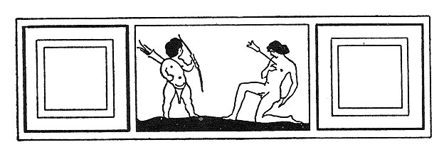

  
[Intangible Textual Heritage](../../../index)  [Classics](../../index.md) 
[Ovid](../index)  [Index](index)  [Previous](lboo06)  [Next](lboo08.md) 

------------------------------------------------------------------------

[Buy this Book at
Amazon.com](https://www.amazon.com/exec/obidos/ASIN/1417905824/internetsacredte.md)

------------------------------------------------------------------------

p. 3

 

## ELEGY I:

### THE POET EXPLAINS HOW IT IS HE COMES TO SING OF LOVE INSTEAD OF BATTLES.

 

<table data-border="0" width="100%">
<colgroup>
<col style="width: 33%" />
<col style="width: 33%" />
<col style="width: 33%" />
</colgroup>
<tbody>
<tr class="odd">
<td data-valign="top" width="45%">
WAS about to sing, in heroic strain, of arms and fierce combats. ’Twas a subject suited to my verse, whose lines were all of equal measure. But Cupid, so ’tis said, began to laugh, and stole away one foot. Who was it, cruel boy, gave thee this right to meddle with poetry? We poets belong to the train of the Muses and follow not in thine. What would be said if Venus were to seize upon the arms of golden-haired Minerva, and if golden-haired Minerva were to wave thy lighted torches in the wind? Who would deem it well that Ceres should queen it o’er the wood-crowned heights, and that the tilling of the fields should be the quivered Virgin's care? Shall Apollo, with his glorious tresses, go armed with the spear, what time Mars wakes into song the strings of the Aonian lyre? Too great already are thine empire and thy power; wherefore then, boy, wouldst thou make wider yet the frontiers of thy realm? Is all the world thine? Shall Helicon and the Vale of Tempe call thee master, too? Shall Apollo himself cease to be lord of his own lyre? Brave was the line that sounded the opening of my new poem, but lo! Love comes and stays my soaring flight. No boy have I, nor long-haired girl, to inspire me in these lighter strains.

Such was the burden of my plaint when, on a sudden, Cupid lowered his quiver and drew forth therefrom arrows to pierce my heart. Then, bending his curving bow with a will upon his knee, he said, "Poet, here is matter

p. 4

for thy song." Ah, hapless me, Love's arrow did but all too surely find its mark. On fire am I, and Love, and none but Love now rules my heart that ne'er was slave till now. Now let six feet my book begin, and let it end in five. Farewell fierce War, farewell thy measure too. Only with the myrtle of the salt sea's marge shalt thou bind thy fair head, my Muse, who needs must tune thy numbers to eleven feet.
</td>
<td data-valign="top" width="10%">
 
</td>
<td data-valign="top" width="45%">
Arma gravi numero violentaque bella parabam 
    edere, materia conveniente modis. 
par erat inferior versus--risisse Cupido 
    dicitur atque unum surripuisse pedem. 
5 'Quis tibi, saeve puer, dedit hoc in carmina iuris? 
    Pieridum vates, non tua turba sumus. 
quid, si praeripiat flavae Venus arma Minervae, 
    ventilet accensas flava Minerva faces? 
quis probet in silvis Cererem regnare iugosis, 
10     lege pharetratae Virginis arva coli? 
crinibus insignem quis acuta cuspide Phoebum 
    instruat, Aoniam Marte movente lyram? 
sunt tibi magna, puer, nimiumque potentia regna; 
    cur opus adfectas, ambitiose, novum? 
15 an, quod ubique, tuum est? tua sunt Heliconia tempe? 
    vix etiam Phoebo iam lyra tuta sua est? 
cum bene surrexit versu nova pagina primo, 
    attenuat nervos proximus ille meos; 
nec mihi materia est numeris levioribus apta, 
20     aut puer aut longas compta puella comas.' 
Questus eram, pharetra cum protinus ille soluta 
    legit in exitium spicula facta meum, 
lunavitque genu sinuosum fortiter arcum, 
    'quod' que 'canas, vates, accipe' dixit 'opus!' 
25 Me miserum! certas habuit puer ille sagittas. 
    uror, et in vacuo pectore regnat Amor. 
Sex mihi surgat opus numeris, in quinque residat: 
    ferrea cum vestris bella valete modis! 
cingere litorea flaventia tempora myrto, 
30     Musa, per undenos emodulanda pedes!
</td>
</tr>
</tbody>
</table>

------------------------------------------------------------------------

[Next: Elegy II: The Triumph Of Love.](lboo08.md)
