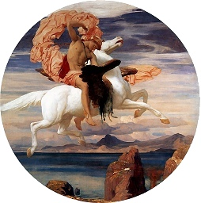

  
[Intangible Textual Heritage](../../../index)  [Classics](../../index) 
[Ovid](../index) 

------------------------------------------------------------------------

[Buy this Book at
Amazon.com](https://www.amazon.com/exec/obidos/ASIN/1853267902/internetsacredte)

------------------------------------------------------------------------

<table width="75%">
<colgroup>
<col style="width: 50%" />
<col style="width: 50%" />
</colgroup>
<tbody>
<tr class="odd">
<td width="50%" data-valign="TOP"></td>
<td width="50%" data-valign="CENTER"><h1 id="metamorphoses" data-align="CENTER">Metamorphoses</h1>
<h2 id="by-ovid" data-align="CENTER">by Ovid</h2>
<h5 id="translated-into-english-verse-under-the-direction-of-sir-samuel-garth-by-john-dryden-alexander-pope-joseph-addison-william-congreve-and-other-eminent-hands" data-align="CENTER">translated into English verse under the direction of Sir Samuel Garth by John Dryden, Alexander Pope, Joseph Addison, William Congreve and other eminent hands</h5></td>
</tr>
</tbody>
</table>

------------------------------------------------------------------------

[Contents](#contents)    [Start Reading](metatp)

|                                                                                                                           |
|---------------------------------------------------------------------------------------------------------------------------|
|  |

------------------------------------------------------------------------

 [Title Page](metatp)  

### English

[Book The First](meta01)  
[Book the Second](meta02)  
[Book the Third](meta03)  
[Book the Fourth](meta04)  
[Book the Fifth](meta05)  
[Book the Sixth](meta06)  
[Book the Seventh](meta07)  
[Book the Eighth](meta08)  
[Book the Nine](meta09)  
[Book the Tenth](meta10)  
[Book the Eleventh](meta11)  
[Book the Twelfth](meta12)  
[Book the Thirteenth](meta13)  
[Book the Fourteenth](meta14)  
[Book the Fifteenth](meta15)  

### Latin

[Liber Primus](metal01)  
[Liber Secundus](metal02)  
[Liber Tertius](metal03)  
[Liber Quartus](metal04)  
[Liber Quintus](metal05)  
[Liber Sextus](metal06)  
[Liber Septimus](metal07)  
[Liber Octavus](metal08)  
[Liber Nonus](metal09)  
[Liber Decimus](metal10)  
[Liber Undecimus](metal11)  
[Liber Duodecimus](metal12)  
[Liber Tertius Decimus](metal13)  
[Liber Quartus Decimus](metal14)  
[Liber Quintus Deciums](metal15)  
