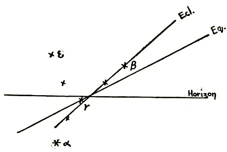

  
[Intangible Textual Heritage](../../index)  [Classics](../index) 
[Index](index)  [Previous](pcc02)  [Next](pcc04) 

------------------------------------------------------------------------

p. 19

### II.

### SOLAR MYTHS AND CHRISTIAN FESTIVALS

To the ordinary public--notwithstanding the immense amount of work which
has of late been done on this subject--the connection between Paganism
and Christianity still seems rather remote. Indeed the common notion is
that Christianity was really a miraculous interposition into and
dislocation of the old order of the world; and that the pagan gods (as
in Milton's Hymn on the Nativity) fled away in dismay before the sign of
the Cross, and at the sound of the name of Jesus. Doubtless this was a
view much encouraged by the early Church itself--if only to enhance its
own authority and importance; yet, as is well known to every student, it
is quite misleading and contrary to fact. The main Christian doctrines
and festivals, besides a great mass of affiliated legend and ceremonial,
are really quite directly derived from, and related to, preceding Nature
worships; and it has only been by a good deal of deliberate
mystification and falsification that this derivation has been kept out
of sight.

In these Nature-worships there may be discerned three fairly independent
streams of religious or quasi-religious enthusiasm: (1) that connected
with the phenomena of the heavens, the movements of the Sun, planets and
stars, and the awe and wonderment they excited; (2) that connected with
the seasons and the very important matter of the growth of vegetation
and food on the Earth; and (3)

p. 20

that connected with the mysteries of Sex and reproduction. It is obvious
that these three streams would mingle and interfuse with each other a
good deal; but as far as they were separable the first would tend to
create Solar heroes and Sun-myths; the second Vegetation-gods and
personifications of Nature and the earth-life; while the third would
throw its glamour over the other two and contribute to the projection of
deities or demons worshipped with all sorts of sexual and phallic rites.
All three systems of course have their special rites and times and
ceremonies; but, as, I say, the rites and ceremonies of one system would
rarely be found pure and unmixed with those. belonging to the two
others. The whole subject is a very large one; but for reasons given in
the Introduction I shall in this and the following chapter--while not
ignoring phases (2) and (3)--lay most stress on phase (1) of the
question before us.

At the time of the life or recorded appearance of Jesus of Nazareth, and
for some centuries before, the Mediterranean and neighboring world had
been the scene of a vast number of pagan creeds and rituals. There were
Temples without end dedicated to gods like Apollo or Dionysus among the
Greeks, Hercules among the Romans, Mithra among the Persians, Adonis and
Attis in Syria and Phrygia, Osiris and Isis and Horus in Egypt, Baal and
Astarte among the Babylonians and Carthaginians, and so forth.
Societies, large or small, united believers and the devout in the
service or ceremonials connected with their respective deities, and in
the creeds which they confessed concerning these deities. And an
extraordinarily interesting fact, for us, is that notwithstanding great
geographical distances and racial differences between the adherents of
these various cults, as well as differences in the details of their
services, the general outlines of their creeds and ceremonials were--if
not identical--so markedly similar as we find them.

p. 21

I cannot of course go at length into these different cults, but I may
say roughly that of all or nearly all the deities above-mentioned it was
said and believed that:

\(1\) They were born on or very near our Christmas Day.

\(2\) They were born of a Virgin-Mother.

\(3\) And in a Cave or Underground Chamber.

\(4\) They led a life of toil for Mankind.

\(5\) And were called by the names of Light-bringer, Healer, Mediator,
Savior, Deliverer.

\(6\) They were however vanquished by the Powers of Darkness.

\(7\) And descended into Hell or the Underworld.

\(8\) They rose again from the dead, and became the pioneers of mankind
to the Heavenly world.

\(9\) They founded Communions of Saints, and Churches into which
disciples were received by Baptism.

\(10\) And they were commemorated by Eucharistic meals.

Let me give a few brief examples.

Mithra was born in a cave, and on the 25th December. [1](#fn_4) He was born of a Virgin. [2](#fn_5) He traveled far and wide as a teacher and
illuminator of men. He slew the Bull (symbol of the gross Earth which
the sunlight fructifies). His great festivals were the winter solstice
and the Spring equinox (Christmas and Easter). He had twelve companions
or disciples (the twelve months). He was buried in a tomb, from which
however he rose again; and his resurrection was celebrated yearly with
great rejoicings. He was called Savior and Mediator, and sometimes
figured as a Lamb; and sacramental feasts in remembrance of him were
held by his followers. This legend is apparently partly astronomical

p. 22

and partly vegetational; and the same may be said of the following about
Osiris.

Osiris was born (Plutarch tells us) on the 361st day of the year, say
the 27th December. He too, like Mithra and Dionysus, was a great
traveler. As King of Egypt he taught men civil arts, and "tamed them by
music and gentleness, not by force of arms"; [1](#fn_6) he was the discoverer of corn and wine. But
he was betrayed by Typhon, the power of darkness, and slain and
dismembered. "This happened," says Plutarch, "on the 17th of the month
Athyr, when the sun enters into the Scorpion" (the sign of the Zodiac
which indicates the oncoming of Winter). His body was placed in a box,
but afterwards, on the 19th, came again to life, and, as in the cults of
Mithra, Dionysus, Adonis and others, so in the cult of Osiris, an image
placed in a coffin was brought out before the worshipers and saluted
with glad cries of "Osiris is risen." "His sufferings, his death and his
resurrection were enacted year by year in a great mystery-play at
Abydos." [2](#fn_7)

The two following legends have more distinctly the character of
Vegetation myths.

Adonis or Tammuz, the Syrian god of vegetation, was a very beautiful
youth, born of a Virgin (Nature), and so beautiful that Venus and
Proserpine (the goddesses of the Upper and Underworlds) both fell in
love with him. To reconcile their claims it was agreed that he should
spend half the year (summer) in the upper world, and the winter half
with Proserpine below. He was killed by a boar (Typhon) in the autumn.
And every year the maidens "wept for Adonis" (see Ezekiel viii. 14). In
the spring a festival of his resurrection was held--the women set out to
seek him, and having found the supposed corpse placed it (a wooden
image) in a coffin or hollow tree, and performed wild rites and
lamentations, followed by even

p. 23

wilder rejoicings over his supposed resurrection. At Aphaca in the North
of Syria, and halfway between Byblus and Baalbec, there was a famous
grove and temple of Astarte, near which was a wild romantic gorge full
of trees, the birthplace of a certain river Adonis--the water rushing
from a Cavern, under lofty cliffs. Here (it was said) every year the
youth Adonis was again wounded to death, and the river ran red with his
blood, [1](#fn_8) while the scarlet anemone
bloomed among the cedars and walnuts.

The story of Attis is very similar. He was a fair young shepherd or
herdsman of Phrygia, beloved by Cybele (or Demeter), the Mother of the
gods. He was born of a Virgin--Nana--who conceived by putting a ripe
almond or pomegranate in her bosom. He died, either killed by a boar,
the symbol of winter, like Adonis, or self-castrated (like his own
priests); and he bled to death at the foot of a pine tree (the pine and
pine-cone being symbols of fertility). The sacrifice of his blood
renewed the fertility of the earth, and in the ritual celebration of his
death and resurrection his image was fastened to the trunk of a
pine-tree (compare the Crucifixion). But I shall return to this legend
presently. The worship of Attis became very widespread and much honored,
and was ultimately incorporated with the established religion at Rome
somewhere about the commencement of our Era.

The following two legends (dealing with Hercules and with Krishna) have
rather more of the character of the solar, and less of the vegetational
myth about them. Both heroes were regarded as great benefactors of
humanity; but the former more on the material plane, and the latter on
the spiritual.

Hercules or *Heracles* was, like other Sun-gods and benefactors

p. 24

of mankind, a great Traveler. He was known in many lands, and everywhere
he was invoked as Saviour. He was miraculously conceived from a divine
Father; even in the cradle he strangled two serpents sent to destroy
him. His many labors for the good of the world were ultimately
epitomized into twelve, symbolized by the signs of the Zodiac. He slew
the Nemæan Lion and the Hydra (offspring of Typhon) and the Boar. He
overcame the Cretan Bull, and cleaned out the Stables of Augeas; he
conquered Death and, descending into Hades, brought Cerberus thence and
ascended into Heaven. On all sides he was followed by the gratitude and
the prayers of mortals.

As to Krishna, the Indian god, the points of agreement with the general
divine career indicated above are too salient to be overlooked, and too
numerous to be fully recorded. He also was born of a Virgin (Devaki) and
in a Cave, [1](#fn_9) and his birth announced by
a Star. It was sought to destroy him, and for that purpose a massacre of
infants was ordered. Everywhere he performed miracles, raising the dead,
healing lepers, and the deaf and the blind, and championing the poor and
oppressed. He had a beloved disciple, Arjuna, (cf. John) before whom he
was transfigured. [2](#fn_10) His death is
differently related--as being shot by an arrow, or crucified on a tree.
He descended into hell; and rose again from the dead, ascending into
heaven in the sight of many people. He will return at the last day to be
the judge of the quick and the dead.

Such are some of the legends concerning the pagan and pre-Christian
deities--only briefly sketched now, in order that we may get something
like a true perspective of the whole subject; but to most of them, and
more in detail, I shall return as the argument proceeds.

What we chiefly notice so far are two points; on the one hand the
general similarity of these stories with that

p. 25

of Jesus Christ; on the other their analogy with the yearly phenomena of
Nature as illustrated by the course of the Sun in heaven and the changes
of Vegetation on the earth.

\(1\) The similarity of these ancient pagan legends and beliefs with
Christian traditions was indeed so great that it excited the attention
and the undisguised wrath of the early Christian fathers. They felt no
doubt about the similarity, but not knowing how to explain it fell back
upon the innocent theory that the Devil--in order to confound the
Christians--had, *centuries before*, caused the pagans to adopt certain
beliefs and practices! (Very crafty, we may say, of the Devil, but also
very innocent of the Fathers to believe it!) Justin Martyr for instance
describes [1](#fn_11) the institution of the
Lord's Supper as narrated in the Gospels, and then goes on to say:
"Which the wicked devils have *imitated* in the mysteries of Mithra,
commanding the same thing to be done. For, that bread and a cup of water
are placed with certain incantations in the mystic rites of one who is
being initiated you either know or can learn." Tertullian also
says [2](#fn_12) that "the devil by the
mysteries of his idols imitates even the main part of the d vine
mysteries." . . . "He baptizes his worshippers in water and makes them
believe that this purifies them from their crimes." . . . "Mithra sets
his mark on the forehead of his soldiers; he celebrates the oblation of
bread; he offers an image of the resurrection, and presents at once the
crown and the sword; he limits his chief priest to a single marriage; he
even has his virgins and ascetics." [3](#fn_13)
Cortez, too, it will be remembered complained that the Devil had
positively taught to the Mexicans the same things which God had taught
to Christendom.

p. 26

Justin Martyr again, in the *Dialogue with Trypho* says that the Birth
in the Stable was the prototype of the birth of Mithra in the Cave of
Zoroastrianism; and boasts that Christ was born when the Sun takes its
birth in the Augean Stable, [1](#fn_14) coming
as a second Hercules to cleanse a foul world; and St. Augustine says "we
hold this (Christmas) day holy, not like the pagans because of the birth
of the Sun, but because of the birth of him who made it." There are
plenty of other instances in the Early Fathers of their indignant
ascription of these similarities to the work of devils; but we need not
dwell over them. There is no need for *us* to be indignant. On the
contrary we can now see that these animadversions of the Christian
writers are the evidence of how and to what extent in the spread of
Christianity over the world it had become fused with the Pagan cults
previously existing.

It was not till the year A.D. 530 or so--five centuries after the
supposed birth of Christ--that a Scythian Monk, Dionysius Exiguus, an
abbot and astronomer of Rome, was commissioned to fix the day and the
year of that birth. A nice problem, considering the historical science
of the period! For year he assigned the date which we now adopt, [2](#fn_15) and for day and month he adopted the 25th
December--a date which had been in popular use since about 350 B.C., and
the very date, within a day or two, of the supposed birth of the
previous Sungods. [3](#fn_16) From that

p. 27

fact alone we may fairly conclude that by the year 530 or earlier the
existing Nature-worships had become largely fused into Christianity. In
fact the dates of the main pagan religious festivals had by that time
become so popular that Christianity was *obliged* to accommodate itself
to them. [1](#fn_17)

 

This brings us to the second point mentioned a few pages back--the
analogy between the Christian festivals and the yearly phenomena of
Nature in the Sun and the Vegetation.

Let us take Christmas Day first. Mithra, as we have seen, was reported
to have been born on the 25th December (which in the Julian Calendar was
reckoned as the day of the Winter Solstice *and* of the Nativity of the
Sun); Plutarch says (*Isis and Osiris*, c. 12) that Osiris was born on
the 361st day of the year, when a Voice rang out proclaiming the Lord of
All. Horus, he says, was born on the 362nd day. Apollo on the same.

Why was all this? Why did the Druids at Yule Tide light roaring fires?
Why was the cock supposed to crow all Christmas Eve ("The bird of
dawning singeth all night long")? Why was Apollo born with only one hair
(the young Sun with only one feeble ray)? Why did Samson (name derived
from *Shemesh*, the sun) lose all his strength when he lost his hair?
Why were so many of these gods--Mithra, Apollo, Krishna, Jesus, and
others, born in caves or underground chambers? [2](#fn_18) Why, at the Easter

p. 28

\[paragraph continues\] Eve festival of the Holy Sepulchre at Jerusalem
is a light brought from the grave and communicated to the candles of
thousands who wait outside, and who rush forth rejoicing to carry the
new glory over the world? [1](#fn_19) Why
indeed? except that older than all history and all written records has
been the fear and wonderment of the children of men over the failure of
the Sun's strength in Autumn--the decay of their God; and the anxiety
lest by any means he should not revive or reappear?

Think for a moment of a time far back when there were absolutely *no*
Almanacs or Calendars, either nicely printed or otherwise, when all that
timid mortals could see was that their great source of Light and Warmth
was daily failing, daily sinking lower in the sky. As everyone now knows
there are about three weeks at the fag end of the year when the days are
at their shortest and there is very little change. What was happening?
Evidently the god had fallen upon evil times. Typhon, the prince of
darkness, had betrayed him; Delilah, the queen of Night, had shorn his
hair; the dreadful Boar had wounded him; Hercules was struggling with
Death itself; he had fallen under the influence of those malign
constellations--the Serpent and the Scorpion. Would the god grow weaker
and weaker, and finally succumb, or would he conquer after all? We can
imagine the anxiety with which those early men and women watched for the
first indication of a lengthening day; and the universal joy when the
Priest (the representative of primitive science) having made some simple
observations, announced from the Temple steps that the day *was*
lengthening--that the Sun was really born again to a new and glorious
career. [2](#fn_20)

p. 29

Let us look at the elementary science of those days a little closer. How
without Almanacs or Calendars could the day, or probable day, of the
Sun's rebirth be fixed? Go out next Christmas Evening, and at midnight
you will see the brightest of the fixed stars, Sirius, blazing in the
southern sky--not however due south from you, but somewhat to the left
of the Meridian line. Some three thousand years ago (owing to the
Precession of the Equinoxes) that star at the winter solstice did not
stand at midnight where you now see it, but almost exactly *on* the
meridian line. The coming of Sirius therefore to the meridian at
midnight became the sign and assurance of the Sun having reached the
very lowest point of his course, and therefore of having arrived at the
moment of his re-birth. Where then was the Sun at that moment? Obviously
in the underworld beneath our feet. Whatever views the ancients may have
had about the shape of the earth, it was evident to the mass of people
that the Sungod, after illuminating the world during the day, plunged
down in the West, and remained there during the hours of darkness in
some cavern under the earth. Here he rested and after bathing in the
great ocean renewed his garments before reappearing in the East next
morning.

But in this long night of his greatest winter weakness, when all the
world was hoping and praying for the renewal of his strength, it is
evident that the new birth would come--if it came at all--at midnight.
This then was the sacred hour when in the underworld (the Stable or the
Cave or whatever it might be called) the child was born who was destined
to be the Savior of men. At that moment Sirius stood on the southern
meridian (and in more southern lands than ours this would be more nearly
overhead); and that star--there is little doubt--is the Star in the East
mentioned in the Gospels.

To the right, as the supposed observer looks at Sirius on the midnight
of Christmas Eve, stands the magnificent

p. 30

\[paragraph continues\] Orion, the mighty hunter. There are three stars
in his belt which, as is well known, lie in a straight line pointing to
Sirius. They are not so bright as Sirius, but they are sufficiently
bright to attract attention. A long tradition gives them the name of the
Three Kings. Dupuis [1](#fn_21) says: "Orion a
trois belles étoiles vers le milieu, qui sont de seconde grandeur et
posées en ligne droite, l'une près de l'autre, le peuple les appelle
*les trois rois*. On donne aux trois rois Magis les noms de Magalat,
Galgalat, Saraim; et Athos, Satos, Paratoras. Les Catholiques les
appellent Gaspard, Melchior, et Balthasar." The last-mentioned group of
names comes in the Catholic Calendar in connection with the feast of the
Epiphany (6th January); and the name "Trois Rois" is commonly to-day
given to these stars by the French and Swiss peasants.

 

Immediately after Midnight then, on the 25th December, the Beloved Son
(or Sun-god) is born. If we go back in thought to the period, some three
thousand years ago, when at that moment of the heavenly birth Sirius,
coming from the East, did actually stand on the Meridian, we shall come
into touch with another curious astronomical coincidence. For at the
same moment we shall see the Zodiacal constellation of the Virgin in the
act of rising, and becoming visible in the East divided through the
middle by the line of the horizon.

The constellation Virgo is a Y-shaped group, of which, the star at the
foot, is the well-known *Spica*, a star of the first magnitude. The
other principal stars, γ at the centre, and β and ε at the extremities,
are of the second magnitude. The whole resembles more a *cup* than the
human figure; but when we remember the symbolic meaning of the *cup*,
that seems to be an obvious explanation of the name *Virgo*, which the
constellation has borne since

p. 31

the earliest times. \[The three stars β, γ and α, lie very nearly on the
Ecliptic, that is, the Sun's path--a fact to which we shall return
presently.\]

At the moment then when Sirius, the star from the East, by coming to the
Meridian at midnight signalled the Sun's new birth, the Virgin was seen
just rising on the Eastern sky--the horizon line passing through her
centre. And many people think that this astronomical fact is the
explanation of the very widespread legend of the Virgin-birth. I

 

do not think that it is the sole explanation--for indeed in all or
nearly all these cases the acceptance of a myth seems to depend not upon
a single argument but upon the convergence of a number of meanings and
reasons in the same symbol. But certainly the fact mentioned above is
curious, and its importance is accentuated by the following
considerations.

In the Temple of Denderah in Egypt, and on the inside of the dome, there
is or *was* an elaborate circular representation of the Northern
hemisphere of the sky and the

p. 32

\[paragraph continues\] Zodiac. [1](#fn_22) Here
Virgo the constellation is represented, as in our star-maps, by a woman
with a spike of corn in her hand (Spica). But on the margin close by
there is an annotating and explicatory figure--a figure of Isis with the
infant Horus in her arms, and quite resembling in style the Christian
Madonna and Child, except that she is sitting and the child is on her
knee. This seems to show that--whatever other nations may have done in
associating Virgo with Demeter, Ceres, Diana, [2](#fn_23) etc.--the Egyptians made no doubt of the
constellation's connection with Isis and Horus. But it is well known as
a matter of history that the worship of Isis and Horus descended in the
early Christian centuries to Alexandria, where it took the form of the
worship of the Virgin Mary and the infant Savior, and so passed into the
European ceremonial. We have therefore the Virgin Mary connected by
linear succession and descent with that remote Zodiacal cluster in the
sky! Also it may be mentioned that on the Arabian and Persian globes of
Abenezra and Abuazar a Virgin and Child are figured in connection with
the same constellation. [3](#fn_24)

A curious confirmation of the same astronomical connection is afforded
by the Roman Catholic Calendar. For if this be consulted it will be
found that the festival of the Assumption of the Virgin is placed on the
15th August, while the festival of the Birth of the Virgin is dated the
8th September. I have already pointed out that the stars, α, β and γ of
Virgo are almost exactly on the Ecliptic, or Sun's path through the sky;
and a brief reference to the Zodiacal signs and the star-maps will show
that the Sun each year enters the sign of *Virgo* about the
first-mentioned date, and leaves it about the second date. At the
present day the Zodiacal signs (owing to precession) have shifted

p. 33

some distance from the constellations of the same name. But at the time
when the Zodiac was constituted and these names were given, the first
date obviously would signalize the actual disappearance of the cluster
*Virgo* in the Sun's rays--i. e. the Assumption of the Virgin into the
glory of the God--while the second date would signalize the reappearance
of the constellation or the Birth of the Virgin. The Church of Notre
Dame at Paris is supposed to be on the original site of a Temple of
Isis; and it is said (but I have not been able to verify this myself)
that one of the side entrances--that, namely, on the left in entering
from the North (cloister) side--is figured with the signs of the Zodiac
*except* that the sign Virgo is replaced by the figure of the Madonna
and Child.

So strange is the scripture of the sky! Innumerable legends and customs
connect the rebirth of the Sun with a Virgin parturition. Dr. J. G.
Frazer in his Part IV of *The Golden Bough* [1](#fn_25) says: "If we may trust the evidence of an
obscure scholiast the Greeks \[in the worship of Mithras at Rome\] used
to celebrate the birth of the luminary by a midnight service, coming out
of the inner shrines and crying, 'The Virgin has brought forth! The
light is waxing!' (Ἡ παρθένος τέτοκεν, αὔξει φῶς.)" In Elie Reclus'
little book *Primitive Folk* [2](#fn_26) it is
said of the Esquimaux that "On the longest night of the year two
*angakout* (priests), of whom one is disguised as a *woman*, go from hut
to hut extinguishing all the lights, rekindling them from a vestal
flame, and crying out, 'From the new sun cometh a new light!'"

All this above-written on the Solar or Astronomical origins of the myths
does not of course imply that the Vegetational origins must be denied or
ignored. These latter were doubtless the earliest, but there is no
reason--as said in the Introduction (ch. i)--why the two elements

p. 34

should not to some extent have run side by side, or been fused with each
other. In fact it is quite clear that they must have done so; and to
separate them out too rigidly, or treat them as antagonistic, is a
mistake. The Cave or Underworld in which the New Year is born is not
only the place of the Sun's winter retirement, but also the hidden
chamber beneath the Earth to which the dying Vegetation goes, and from
which it re-arises in Spring. The amours of Adonis with Venus and
Proserpine, the lovely goddesses of the upper and under worlds, or of
Attis with Cybele, the blooming Earth-mother, are obvious
vegetation-symbols; but they do not exclude the interpretation that
Adonis (Adonai) may also figure as a Sun-god. The Zodiacal
constellations of Aries and Taurus (to which I shall return presently)
rule in heaven just when the Lamb and the Bull are in evidence on the
earth; and the yearly sacrifice of those two animals and of the growing
Corn for the good of mankind runs parallel with the drama of the sky, as
it affects not only the said constellations but also *Virgo* (the
Earth-mother who bears the sheaf of corn in her hand).

I shall therefore continue (in the next chapter) to point out these
astronomical references--which are full of significance and poetry; but
with a recommendation at the same time to the reader not to forget the
poetry and significance of the terrestrial interpretations.

Between Christmas Day and Easter there are several minor festivals or
holy days--such as the 28th December (the Massacre of the Innocents),
the 6th January (the Epiphany), the 2nd February (Candlemas [1](#fn_27) Day), the period of Lent (German *Lenz*,
the Spring), the Annunciation

p. 35

of the Blessed Virgin, and so forth--which have been commonly celebrated
in the pagan cults before Christianity, and in which elements of Star
and Nature worship can be traced; but to dwell on all these would take
too long; so let us pass at once to the period of Easter itself.

------------------------------------------------------------------------

### Footnotes

[21:1](pcc03.htm#fr_4) The birthfeast of Mithra
was held in Rome on the 8th day before the Kalends of January, being
also the day of the Circassian games, which were sacred to the Sun. (See
F. Nork, *Der Mystagog*, Leipzig.)

[21:2](pcc03.htm#fr_5) This at any rate was
reported by his later disciples (see Robertson's *Pagan Christs*, p.
338).

[22:1](pcc03.htm#fr_6) See Plutarch on *Isis and
Osiris*.

[22:2](pcc03.htm#fr_7) *Ancient Art and Ritual*,
by Jane E. Harrison, chap. i.

[23:1](pcc03.htm#fr_8) A discoloration caused by
red earth washed by rain from the mountains, and which has been observed
by modern travelers. For the whole story of Adonis and of Attis see
Frazer's *Golden Bough*, part iv.

[24:1](pcc03.htm#fr_9) Cox's *Myths of the Aryan
Nations*, p. 107.

[24:2](pcc03.htm#fr_10) *Bhagavat Gita*, ch. xi.

[25:1](pcc03.htm#fr_11) I *Apol*. c. 66.

[25:2](pcc03.htm#fr_12) *De Præscriptione
Hereticorum*, c. 40; *De Bapt*. c. 3; *De Corona*, c. 15.

[25:3](pcc03.htm#fr_13) For reference to both
these examples see J. M. Robertson's *Pagan Christs*, pp. 321, 322.

[26:1](pcc03.htm#fr_14) The Zodiacal sign of
*Capricornus*, see infra (iii. [49](pcc04.htm#page_49)).

[26:2](pcc03.htm#fr_15) See *Encycl. Brit*. art.
"Chronology."

[26:3](pcc03.htm#fr_16) "There is however a
difficulty in accepting the 25th December as the real date of the
Nativity, December being the height of the rainy season in Judæa, when
neither flocks nor shepherds could have been at night in the fields of
Bethlehem" (!). *Encycl. Brit*. art. "Christmas Day." According to
Hastings's *Encyclopædia*, art. "Christmas," "Usener says that the Feast
of the Nativity was held originally on the 6th January (the Epiphany),
but in 353-4 the Pope Liberius displaced it to the 25th December . . .
but there is no evidence of a Feast of the Nativity taking place at all,
before the fourth century A.D." It was not till 534 A.D. that Christmas
Day and Epiphany were reckoned by the law-courts as *dies non*.

[27:1](pcc03.htm#fr_17) As, for instance, the
festival of John the Baptist in June took the place of the pagan
midsummer festival of water and bathing; the Assumption of the Virgin in
August the place of that of Diana in the same month; and the festival of
All Souls early in November, that of the world-wide pagan feasts of the
dead and their ghosts at the same season.

[27:2](pcc03.htm#fr_18) This same legend of gods
(or idols) being born in caves has, curiously enough, been reported from
Mexico, Guatemala, the Antilles, and other places in Central America.
See C. F. P. von Martius, *Ethnographie Amerika, etc*. (Leipzig, 1867),
vol. i, p. 758.

[28:1](pcc03.htm#fr_19) Compare the Aztec
ceremonial of lighting a holy fire and communicating it to the multitude
from the wounded breast of a human victim, celebrated every 52 years at
the end of one cycle and the beginning of another--the constellation of
the Pleiades being in the Zenith (Prescott's *Conquest of Mexico*, Bk.
I, ch. 4).

[28:2](pcc03.htm#fr_20) It was such things as
these which doubtless gave the Priesthood its power.

[30:1](pcc03.htm#fr_21) Charles F. Dupuis
(*Origine de Tous les Cultes*, Paris, 1822) was one of the earliest
modern writers on these subjects.

[32:1](pcc03.htm#fr_22) Carefully described and
mapped by Dupuis, see *op. cit*.

[32:2](pcc03.htm#fr_23) For the harvest-festival
of Diana, the Virgin, and her parallelism with the Virgin Mary, see *The
Golden Bough*, vol. i, 14 and ii, 121.

[32:3](pcc03.htm#fr_24) See F. Nork, *Der
Mystagog* (Leipzig, 1838).

[33:1](pcc03.htm#fr_25) Book II, ch. vi.

[33:2](pcc03.htm#fr_26) In the *Contemporary
Science Series*, I. 92.

[34:1](pcc03.htm#fr_27) This festival of the
Purification of the Virgin corresponds with the old Roman festival of
*Juno Februata* (i. e. purified) which was held in the last month
(February) of the Roman year, and which included a candle procession of
Ceres, searching for Proserpine. (F. Nork, *Der Mystagog*.)

------------------------------------------------------------------------

[Next: III. The Symbolism Of The Zodiac](pcc04)
