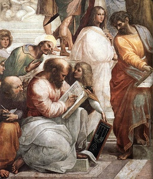

  
[Intangible Textual Heritage](../../index)  [Classics](../index.md) 
[Esoteric](../../eso/index.md) 

------------------------------------------------------------------------

[Buy this Book at
Amazon.com](https://www.amazon.com/exec/obidos/ASIN/1602063931/internetsacredte.md)

------------------------------------------------------------------------

<table width="75%">
<colgroup>
<col style="width: 50%" />
<col style="width: 50%" />
</colgroup>
<tbody>
<tr class="odd">
<td width="50%" data-valign="TOP"></td>
<td width="50%" data-valign="CENTER"><h1 id="pythagoras-and-the-delphic-mysteries" data-align="CENTER">Pythagoras and the Delphic Mysteries</h1>
<h2 id="by-edouard-schuré" data-align="CENTER">by Edouard Schuré</h2>
<h4 id="section" data-align="CENTER">[1906]</h4></td>
</tr>
</tbody>
</table>

------------------------------------------------------------------------

[Contents](#contents)    [Start Reading](pdm00.md)

------------------------------------------------------------------------

|                                                                                                                           |
|---------------------------------------------------------------------------------------------------------------------------|
|  |

This is a short biography of Pythagoras, written from a Theosophical,
esoteric perspective. No actual texts of Pythagoras have survived: we
only have second hand summaries and pastiches, such as the [Golden
Verses](../gvp/index.md). However, his impact on successive thinkers has
been enormous. This work serves as a short, readable introduction to the
man, his thought and times, and the modern esoteric interpretation of
his place in the history of ideas.

------------------------------------------------------------------------

 [Title Page](pdm00.md)  
[Contents](pdm01.md)  
[Chapter I. Greece in the Sixth Century](pdm02.md)  
[Chapter II. Years of Travel](pdm03.md)  
[Chapter III. The Temple of Delphi—The Science of Apollo—Theory of
Divination—The Pythoness Theoclea](pdm04.md)  
[Chapter IV. The Order and the Doctrine](pdm05.md)  
[Chapter V. Marriage of Pythagoras—Revolution at Croton—The Master's
End—The School and its Destiny](pdm06.md)  
[Advertisements](pdm07.md)  
