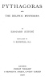
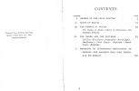

  
[Intangible Textual Heritage](../../index)  [Classics](../index.md) 
[Esoteric](../../eso/index)  [Index](index)  [Next](pdm01.md) 

------------------------------------------------------------------------

[Buy this Book at
Amazon.com](https://www.amazon.com/exec/obidos/ASIN/1602063931/internetsacredte.md)

------------------------------------------------------------------------

*Pythagoras and the Delphic Mysteries*, by Edouard Shuré, \[1906\], at
Intangible Textual Heritage

------------------------------------------------------------------------

|                                                                                                      |
|------------------------------------------------------------------------------------------------------|
| "Know thyself, and thou wilt know the Universe and the Gods."—*Inscription on the Temple of Delphi*. |

 

<table data-border="0">
<colgroup>
<col style="width: 100%" />
</colgroup>
<tbody>
<tr class="odd">
<td data-valign="top">
Evolution is the law of Life, 
Number is the law of the Universe, 
Unity is the law of God.
</td>
</tr>
</tbody>
</table>

# PYTHAGORAS

###### AND

## THE DELPHIC MYSTERIES

###### BY

### EDOUARD SCHURÉ

###### TRANSLATED BY

##### F. ROTHWELL, B.A.

#### LONDON

#### PHILIP WELLBY

#### 6 HENRIETTA STREET, COVENT GARDEN

#### MCMVI

#### \[1906\]

Scanned at Intangible Textual Heritage, September 2007. Proofed and
formatted by John Bruno Hare. This text is in the public domain in the
United States because it was published prior to January 1st, 1923.

RICHARD CLAY & SONS, LIMITED,  
BREAD STREET HILL, E.C., AND  
BUNGAY, SUFFOLK.

[  
Click to enlarge](img/cover.jpg.md)  
Front Cover and Spine  

[  
Click to enlarge](img/title.jpg.md)  
Title Page  

[  
Click to enlarge](img/verso.jpg.md)  
Verso  

------------------------------------------------------------------------

[Next: Contents](pdm01.md)
