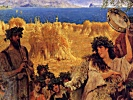
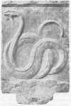
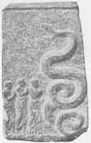
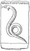

  
[Intangible Textual Heritage](../../index)  [Classics](../index) 
[Index](index)  [Previous](pgr02)  [Next](pgr04) 

------------------------------------------------------------------------

[Buy this Book at
Amazon.com](https://www.amazon.com/exec/obidos/ASIN/0691015147/internetsacredte)

------------------------------------------------------------------------

  
The First Two Chapters of *Prolegomena to the Study of Greek Religion*,
by Jane Ellen Harrison, \[1922\], at Intangible Textual Heritage

------------------------------------------------------------------------

p. 1

### CHAPTER I.

### OLYMPIAN AND CHTHONIC RITUAL.

‘δαίμοσι μειλιχίοισιν ἱλάσματα καὶ μακάρεσσιν οὐρανίοις.’

IN characterizing the genius of the Greeks Mr Ruskin says: '*there is no
dread in their hearts; pensiveness, amazement, often deepest grief and
desolation, but terror never. Everlasting calm in the presence of all
Fate, and joy such as they might win, not indeed from perfect beauty,
but from beauty at perfect rest*.' The lovely words are spoken of course
mainly with reference to art, but they are meant also to characterize
the Greek in his attitude towards the invisible, in his religion--meant
to show that the Greek, the favoured child of fortune yet ever unspoilt,
was exempt from the discipline to which the rest of mankind has been
subject, never needed to learn the lesson that in the Fear of the. Lord
is the beginning of Wisdom.

At first sight it seems as though the statement were broadly true. Greek
writers of the fifth century B.C. have a way of speaking of; an attitude
towards, religion, as though it were wholly a thing of joyful
confidence, a friendly fellowship with the gods, whose service is but a
high festival for man. In Homer sacrifice is but, as it were, the signal
for a banquet of abundant roast flesh and sweet wine; we hear nothing of
fasting, of cleansing, and atonement. This we might perhaps explain as
part of the general splendid unreality of the heroic saga, but sober
historians of the fifth century B.C. express the same spirit. Thucydides
is assuredly by nature no reveller, yet religion is to him in the main
'a rest from toil.' He makes Pericles say [1](#fn_0): 'Moreover we have

p. 2

provided for our spirit very many opportunities of recreation, by the
celebration of games and sacrifices throughout the year.'

Much the same external, quasi-political, and always cheerful attitude
towards religion is taken by the 'Old Oligarch [1](#fn_1): He is of course thoroughly orthodox and
even pious, yet to him the main gist of religion appears to be a
decorous social enjoyment. In easy aristocratic fashion he rejoices that
religious ceremonials exist to provide for the less well-to-do citizens
suitable amusements that they would otherwise lack. 'As to sacrifices
and sanctuaries and festivals and precincts, the People, knowing that it
is impossible for each poor man individually to sacrifice and feast and
have sanctuaries and a beautiful and ample city, has discovered by what
means he may enjoy these privileges. The whole state accordingly at the
common cost sacrifices many victims, while it is the People who feast on
them and divide them among themselves by lot'; and again [2](#fn_2), as part of the splendour of Athens, he
notes that 'she celebrates twice as many religious holidays as any other
city.' The very language used by this typical Athenian gentleman speaks
for itself. Burnt-sacrifice (θυσία), feasting, agonistic games, stately
temples are to him the essence of religion; the word sacrifice brings to
his mind not renunciation but a social banquet; the temple is not to him
so much the awful dwelling-place of a divinity as an integral part of a
'beautiful and ample city.'

Thucydides and Xenophon need and attempt no searching analysis of
religion. Socrates of course sought a definition, a definition that left
him himself sad and dissatisfied, but that adequately embodied popular
sentiment and is of importance for our enquiry. The end of the
Euthyphron is the most disappointing thing in Plato; Socrates extracts
from Euthyphron what he thinks religion is; what Socrates thought he
cannot or will not tell [3](#fn_3).

Socrates in his enquiry uses not one abstract term for religion --the
Greeks have in fact no one word that covers the whole field--he uses
two [4](#fn_4), piety (τὸ εὐσεβές) and holiness
(τὸ ὅσιον).

p. 3

\[paragraph continues\] Euthyphron of
course begins with cheerful confidence: he and all other respectable men
know quite well what piety and holiness are. He willingly admits that
'holiness is a part of justice,' that part of justice that appertains to
the gods; it is giving the gods their due. He also allows, not quite
seeing to what the argument is tending, that piety and holiness are 'a
sort of tendance (θεραπεία) of the gods.' This 'tendance,' Socrates
presses on, 'must be of the nature of service or ministration,' and
Euthyphron adds that it is the sort of service that servants show their
masters. Socrates wants to know in what particular work and operation
the gods need help and ministration. Euthyphron answers with some
impatience that, to put it plainly and cut the matter short, holiness
consists in 'a man understanding how to do what is pleasing to the gods
in word and deed, i.e. by prayer and sacrifice. Socrates eagerly seizes
his advantage and asks: 'You mean then that holiness is a sort of art of
praying and sacrificing?' 'Further,' he adds, 'sacrifice is giving to
the gods, prayer is asking of them, holiness then is a art of asking and
giving.' If we give to the gods they must want something of us, they
must want to 'do business with us.' 'Holiness is then an art in which
gods and men do business with each other.' So Socrates triumphantly
concludes, to the manifest discomfort of Euthyphron, who however can
urge no tenable objection. He feels as a pious man that the essence of
the service or tendance he owes to the gods is of the nature of a
freewill tribute of honour, but he cannot deny that the gods demand this
as a *quid pro quo*.

Socrates, obviously unfair though he is, puts his finger on the weak
spot of Greek religion as orthodoxly conceived in the fifth century B.C.
Its formula is *do ut des*. It is, as Socrates says, a 'business
transaction' and one in which, because god is greater than man, man gets
on the whole the best of it. The argument of the Euthyphron is of
importance to us because it clearly defines one, and a prominent, factor
in Greek religion, that of *service* (θεραπεία); and in this service,
this kindly 'tendance,' there is no element of fear. If man does his
part in the friendly transaction, the gods will do theirs. None of the
deeper problems of what we moderns call religion are even touched: there
is no question of sin, repentance, sacrificial atonement, purification,
no fear of judgment to come, no longing after a future complete
beatitude.

p. 4

\[paragraph continues\] Man offers what
seems to him in his ignorance a reasonable service to gods conceived of
as human and rational. There is no trace of scepticism; the gods
certainly exist, otherwise as Sextus Empiricus [1](#fn_5) quaintly argues 'you could not serve them':
and they have human natures. 'You do not serve Hippocentauri, because
Hippocentauri are non-existent.'

To the average orthodox Greek the word θεραπεία, service, tendance,
covered a large, perhaps the largest, area of his conception of
religion. It was a word expressing, not indeed in the Christian sense a
religion whose mainspring was love, but at least a religion based on a
rational and quite cheerful mutual confidence. The Greeks have however
another word expressive of religion, which embodies a quite other
attitude of mind, the word δεισιδαιμονία, *fear of spirits;* fear, not
tendance, fear not of gods but of spirit-things, or, to put it
abstractly, of the supernatural.

It is certainly characteristic of the Greek mind that the word
δεισιδαιμονία and its cognates early began to be used in a bad sense,
and this to some extent bears out Mr Ruskin's assertion. By the time of
Theophrastos ὁ δεισιδαίμων is frankly in our sense the superstitious
man,' and superstition Theophrastos defines as not just and proper
reverence but simply cowardice in regard to the supernatural.' Professor
Jebb [2](#fn_6) has pointed out that already in
Aristotle the word δεισιδαίμων has about it a suspicion of its weaker
side. An absolute ruler, Aristotle [3](#fn_7)
says, will be the more powerful if his subjects believe that he fears
the spiritual beings' (ἐὰν δεισιδαίμονα νομίζωσιν εἶναι) but he adds
significantly 'he must show himself such without fatuity' (ἄνευ
ἀβελτερίας).

Plutarch has left us an instructive treatise on 'the fear of the
supernatural.' He saw in this fear, this superstition, the great element
of danger and weakness in the religion that he loved so well. His
intellect steeped in Platonism revolted from its unmeaning folly, and
his gentle gracious temperament shrank from its cruelty. He sees [4](#fn_8) in superstition not only an error, a wrong
judgment of the mind, but that worse thing a 'wrong judgment inflamed by
passion.' Atheism is a cold error, a mere dislocation of the mind:
superstition is a 'dislocation complicated, inflamed,

p. 5

by a bruise.' 'Atheism is an apathy towards the divine which fails to
perceive the good: superstition is an excess of passion which suspects
the good to be evil; the superstitious are afraid of the gods yet fly to
them for refuge, flatter and yet revile them, invoke them and yet heap
blame upon them.'

Superstition grieved Plutarch in two ways. He saw that it terrified men
and made them miserable, and he wanted all men to be as cheerful and
kindly as himself; it also made men think evil of the gods, fear them as
harsh and cruel. He knew that the canonical religion of the poets was an
adequate basis for superstitious fear, but he had made for himself a way
out of the difficulty, a way he explains in his treatise on 'How the
poets ought to be taken.' 'If Ares be evil spoken of we must imagine it
to be said of 'War, if Hephaistos of Fire, if Zeus of Fate, but if
anything honourable it is said of the real gods [1](#fn_9).' Plutarch was too gentle to say sharply and
frankly:

'If gods do aught that's shameful, they are no
gods [2](#fn_10),'

but he shifted the element of evil, of fear and hate, from his
theological ideals to the natural and purely human phenomena from which
they had emerged. He wants to treat the gods and regard them as he
himself would be treated and regarded, as kindly civilized men. 'What!'
he says [3](#fn_11), 'is he who thinks there are
no gods an impious man, while he who describes them as the superstitious
man does, does he not hold views much more impious? Well anyhow I for my
part would rather people would say of me there never was or is any such
a man as Plutarch, than that they should say Plutarch is an unstable,
changeable fellow, irritable, vindictive, and touchy about trifles; if
you invite friends to dinner and leave out Plutarch, or if you are busy
and omit to call on him, or if you do not stop to speak to him, he will
fasten on you and bite you, or he will catch your child and beat him, or
turn his beast loose into your crops and spoil your harvest.'

But though he is concerned for the reputation of the gods, his chief
care and pity are for man. Atheism shuts out a man, he says, from the
pleasant things of life. 'These most pleasant things,' he adds [4](#fn_12) in characteristic fashion, 'are festivals
and feastings in

p. 6

connection with sacred things, and initiations and orgiastic festivals,
and invocations and adorations of the gods. At these most pleasant
things the atheist can but laugh his sardonic laugh, but the
superstitious man would fain rejoice and cannot, his soul is like the
city of Thebes:

"It brims with incense and burnt sacrifice  
And brims with paeans and with lamentations."

\[paragraph continues\] A garland is on
his head and pallor on his face, he offers sacrifice and is afraid, he
prays and yet his tongue falters, he offers incense and his hand
trembles, he turns the saying of Pythagoras into foolishness: "Then we
become best when we approach the gods, for those who fear spirits when
they approach the shrines and dwellings of the gods make as though they
came to the dens of bears and the holes of snakes and the lairs of
sea-monsters."' In his protest against the religion of fear Plutarch
rises to a real eloquence [1](#fn_13). 'He that
dreads the gods dreads all things, earth and sea, air and heaven,
darkness and light, a voice, a silence, a dream. Slaves forget their
masters in sleep, sleep looses their fetters, salves their gangrened
sores, but for the superstitious man his reason is always adreaming but
his fear always awake.'

Plutarch is by temperament, and perhaps also by the decadent time in
which he lived, unable to see the good side of the religion of fear,
unable to realize that in it was implicit a real truth, the
consciousness that all is not well with the world, that there is such a
thing as evil. Tinged with Orphism as he was, he took it by its gentle
side and never realized that it was this religion of fear, of
consciousness of evil and sin and the need of purification, of which
Orphism took hold and which it transformed to new issues. The cheerful
religion of 'tendance' had in it no seeds of spiritual development; by
Plutarch's time, though he failed to see this, it had done its work for
civilization.

Still less could Plutarch realize that what in his mind was a
degradation, superstition in our sense, had been to his predecessors a
vital reality, the real gist of their only possible religion. He
deprecates the attitude of the superstitious man who enters the presence
of his gods as though he were approaching the hole of a snake, and
forgets that the hole of a snake had been to his ancestors,

p. 7

and indeed was still to many of his contemporaries, literally and
actually the sanctuary of a god. He has explained and mysticized away
all the primitive realities of his own beloved religion. It can, I
think, be shown that what Plutarch regards as superstition was in the
sixth and even the fifth century before the Christian era the *real*
religion of the main bulk of the people, a religion not of cheerful
tendance but of fear and deprecation. The formula of that religion was
not *do ut des* 'I give that you may give,' but *do ut abeas* 'I give
that you may go, and keep away.' The beings worshipped were not
rational, human, law-abiding gods, but vague, irrational, mainly
malevolent δαίμονες, spirit-things, ghosts and bogeys and the like, not
yet formulated and enclosed into god-head. The word δεισιδαιμονία tells
its own tale, but the thing itself was born long before it was baptized.

Arguments drawn from the use of the word δεισιδαιμονία by particular
authors are of necessity vague and somewhat unsatisfactory; the use of
the word depends much on the attitude of mind of the writer.
Xenophon [1](#fn_14) for example uses
δεισιδαιμονία in a good sense, as of a bracing confidence rather than a
degrading fear. 'The more men are god-fearing, spirit-fearing
(δεισιδαίμονες), the less do they fear man.' It would be impossible to
deduce from such a statement anything as to the existence of a lower and
more 'fearful' stratum of religion.

Fortunately however we have evidence, drawn not from the terminology of
religion, but from the certain facts of ritual, evidence which shows
beyond the possibility of doubt that the Greeks of the classical period
recognised two different classes of rites, one of the nature of
'service' addressed to the Olympians, the other of the nature of
'riddance' or aversion' addressed to an order of beings wholly alien. It
is this second class of rites which haunts the mind of Plutarch in his
protest against the 'fear of spirits'; it is to this second class of
rites that the 'Superstitious Man' of Theophrastos was unduly addicted;
and this second class of rites, which we are apt to regard as merely
decadent, superstitious, and as such unworthy of more than a passing
notice and condemnation, is primitive and lies at the very root and base
of Greek religion.

p. 8

First it must clearly be established that the Greeks themselves
recognised two diverse elements in the ritual of their state. The
evidence of the orator Isocrates [1](#fn_15) on
this point is indefeasible. He is extolling the mildness and humanity of
the Greeks. In this respect they are, he points out, 'like the better
sort of gods.' 'Some of the gods are mild and humane, others harsh and
unpleasant.' He then goes on to make a significant statement: '*Those of
the gods who are the source to us of good things have the title of
Olympians, those whose department is that of calamities and punishments
have harsher titles; to the first class both private persons and states
erect altars and temples, the second is not worshipped either with
prayers or burnt-sacrifices, but in their case we perform ceremonies of
riddance*.' Had Isocrates commented merely on the titles of the gods, we
might fairly have said that these titles only represent diverse aspects
of the same divinities, that Zeus who is Maimaktes, the Raging One, is
also Meilichios, Easy-to-be-entreated, a god of vengeance and a god of
love. But happily Isocrates is more explicit; he states that the two
classes of gods have not only diverse natures but definitely different
rituals, and that these rituals not only vary for the individual but are
also different by the definite prescription of the state. The ritual of
the gods called Olympian is of burnt-sacrifice and prayer, it is
conducted in temples and on altars: the ritual of the other class has
neither burnt-sacrifice nor prayer nor, it would seem, temple or altar,
but consists in ceremonies apparently familiar to the Greek under the
name of ἀποπομπαί, 'sendings away.'

 

For ἀποπομπαί the English language has no convenient word. Our religion
still countenances the fear of the supernatural, but we have outgrown
the stage in which we perform definite ceremonies to rid ourselves of
the gods. Our nearest equivalent to ἀποπομπαί is 'exorcisms,' but as the
word has connotations of magic and degraded superstition I prefer to use
the somewhat awkward term 'ceremonies of riddance.'

Plato more than once refers to these ceremonies of riddance. In the
*Laws* [2](#fn_16) he bids the citizen, if some
prompting intolerably

p. 9

base occur to his mind, as e.g. the desire to commit sacrilege, 'betake
yourself to ceremonies of riddance, go as suppliant to the shrines of
the gods of aversion, fly from the company of wicked men without turning
back.' The reference to a peculiar set of rites presided over by special
gods is clear. These gods were variously called ἀποτρόπαιοι and
ἀποπομπαῖοι, the gods of Aversion and of Sending-away.

Harpocration [1](#fn_17) tells us that
Apollodorus devoted the sixth book of his treatise *Concerning the gods*
to the discussion of the θεοὶ ἀποπομπαῖοι, the gods of Sending-away. The
loss of this treatise is a grave one for the history of ritual, but
scattered notices enable us to see in broad outline what the character
of these gods of Aversion was. Pausanias [2](#fn_18) at Titane saw an altar, and in front of it
a barrow erected to the hero Epopeus, and 'near to the tomb,' he says,
'are the gods of Aversion, beside whom are performed the ceremonies
which the Greeks observe for the averting of evils.' Here it is at least
probable, though from the vagueness of the statement of Pausanias not
certain, that the ceremonies were of an underworld character such as it
will be seen were performed at the graves of heroes. The gods of
Aversion by the time of Pausanias, and probably long before, were
regarded as gods who presided over the aversion of evil; there is little
doubt that to begin with these gods were the very evil men sought to
avert. The domain of the spirits of the underworld was confined to
things evil. Babrius [3](#fn_19) tells us that
in the courtyard of a pious man there was a precinct of a hero, and the
pious man was wont to sacrifice and pour libations to the hero, and pray
to him for a return for his hospitality. But the ghost of the dead hero
knew better; only the regular Olympians are the givers of good, his
province as a hero was limited to evil only. He appeared in the middle
of the night and expounded to the pious man this truly Olympian
theology:

'Good Sir, no hero may give aught of good;  
For *that* pray to the gods. We are the givers  
Of all things evil that exist for men.'

\[paragraph continues\] It will be seen,
when we come to the subject of hero-worship, that this is a very
one-sided view of the activity of heroes. Still it remains, broadly
speaking, true that dead men and the powers of the underworld were the
objects of fear rather than love, their cult was of 'aversion' rather
than 'tendance.'

p. 10

A like distinction is drawn by Hippocrates [1](#fn_20) between the attributes, spheres, and
ritual of Olympian and chthonic divinities. He says: we ought to pray to
the gods, for good things to Helios, to Zeus Ouranios, to Zeus Ktesias,
to Athene Ktesia, to Hermes, to Apollo; but in the case of things that
are the reverse we must pray to Earth and the heroes, that all hostile
things may be averted.'

It is clear then that Greek religion contained two diverse, even
opposite, factors: on the one hand the element of *service* (θεραπεία),
on the other the element of *aversion* [2](#fn_21) (ἀποτροπή). The rites of service were
connected by ancient tradition with the Olympians, or as they are
sometimes called the Ouranians: the rites of *aversion* with ghosts,
heroes, underworld divinities. The rites of service were of a cheerful
and rational character, the rites of aversion gloomy and tending to
superstition. The particular characteristics of each set of rites will
be discussed more in detail later; for the present it is sufficient to
have established the fact that Greek religion for all its superficial
serenity had within it and beneath it elements of a darker and deeper
significance.

 

So far we have been content with the general statements of Greek writers
as to the nature of their national religion, and the evidence of these
writers has been remarkably clear. But, in order to form any really just
estimate, it is necessary to examine in detail the actual ritual of some
at least of the national festivals. To such an examination the next
three chapters will be devoted.

 

The main result of such an examination, a result which for clearness'
sake may be stated at the outset, is surprising. We shall find a series
of festivals which are nominally connected with, or as the handbooks
say, 'celebrated in honour of' various Olympians; the Diasia in honour
of Zeus, the Thargelia of Apollo and Artemis, the Anthesteria of
Dionysos. The service of these Olympians we should expect to be of the
nature of joyous tendance.' To our surprise, when the actual rites are
examined,

p. 11

we shall find that they have little or nothing to do with the particular
Olympian to whom they are supposed to be addressed; that they are not in
the main rites of burnt-sacrifice, of joy and feasting and agonistic
contests, but rites of a gloomy underworld character, connected mainly
with purification and the worship of ghosts. The conclusion is almost
forced upon us that we have here a theological stratification, that the
rites of the Olympians have been superimposed on another order of
worship. The [contrast](errata.htm#0) between the two classes of rites
is so marked, so sharp, that the unbroken development from one to the
other is felt to be almost impossible.

 

To make this clear, before we examine a series of festivals in regular
calendar order, one typical case will be taken, the Diasia, the supposed
festival of Zeus; and to make the argument intelligible, before the
Diasia is examined, a word must be said as to the regular ritual of this
particular Olympian. The ritual of the several Olympian deities does not
vary in essentials; an instance of sacrifice to Zeus is selected because
we are about to examine the Diasia, a festival of Zeus, and thereby
uniformity is secured.

Agamemnon [1](#fn_22), beguiled by Zeus in a
dream, is about to go forth to battle. Zeus intends to play him false,
but all the same he accepts the sacrifice. It is a clear instance of *do
ut des*.

The first act is of prayer and the scattering of barley grains; the
victim, a bull, is present but not yet slain:

'They gathered round the bull and straight the
barley grain did take,  
And ’mid them Agamemnon stood and prayed, and thus he spake:  
O Zeus most great, most glorious, Thou who dwellest in the sky  
And storm-black cloud, oh grant the dark of evening come not nigh  
At sunset ere I blast the house of Priam to black ash,  
And burn his doorways with fierce fire, and with my sword-blade gash  
His doublet upon Hector's breast, his comrades many a one  
Grant that they bite the dust of earth ere yet the day be done.'

Next follows the slaying and elaborate carving of the bull for the
banquet of gods and men:

'When they had scattered barley grain and thus their
prayer had made,  
The bull's head backward drew they, and slew him, and they flayed  
His body and cut slices from the thighs, and these in fat  
They wrapped and made a double fold, and gobbets raw thereat  
They laid and these they burnt straightway with leafless billets dry  
And held the spitted vitals Hephaistos' flame anigh--  
The thighs they burnt; the spitted vitals next they taste, anon  
The rest they slice and heedfully they roast till all is done--  
When they had rested from their task and all the banquet dight,  
They feasted, in their hearts no stint of feasting and delight.'

p. 12

Dr Leaf [1](#fn_23) observes on the passage:
'The significance of the various acts of the sacrifice evidently refers
to a supposed invitation to the gods to take part in a banquet. Barley
meal is scattered on the victim's head that the gods may share in the
fruits of the earth as well as in the meat. Slices from the thigh as the
best part are wrapped in fat to make them burn and thus ascend in sweet
savour to heaven. The sacrificers after roasting the vitals taste them
as a symbolical sign that they are actually eating with the gods. When
this religious act has been done, the rest of the victim is consumed as
a merely human meal.'

Nothing could be simpler, clearer. There is no mystic communion, no
eating of the body of the god incarnate in the victim, no awful taboo
upon what has been offered to, made over to, the gods, no holocaust.
Homer knows of victims slain to revive by their blood the ghosts of
those below, knows of victims on which oaths have been taken and which
are utterly consumed and abolished, but the normal service of the
Olympians is a *meal shared*. The gods are as Plato [2](#fn_24) would say 'fellow guests' with man. The
god is Ouranios, so his share is burnt, and the object of the burning is
manifestly sublimation not destruction.

With the burnt-sacrifice and the joyous banquet in our minds we turn to
the supposed festival of Zeus at Athens and mark the contrast, a
contrast it will be seen so great that it compels us to suppose that the
ritual of the festival of the Diasia had primarily nothing whatever to
do with the worship of Olympian Zeus.

#### THE DIASIA.

Our investigation begins with a festival which at first sight seems of
all others for our purpose most unpromising, the Diasia [3](#fn_25). Pollux, in his chapter [4](#fn_26) on 'Festivals which take their names from
the divinities worshipped,' cites the Diasia as an instance--'the

p. 13

\[paragraph continues\] Mouseia are from
the Muses, the Hermaia from Hermes, the Diasia and Pandia from Zeus
(Διός), the Panathenaia from Athene.' What could be clearer? It is true
that the modern philologist observes what naturally escaped the
attention of Pollux, i.e. that the *i* in Diasia is long, that in Διός
short, but what is the quantity of a vowel as against the accredited
worship of an Olympian?

To the question of derivation it will be necessary to return later, the
nature of the cult must first be examined. Again at the outset facts
seem against us. It must frankly be owned that as early as the middle of
the seventh century B.C. in common as well as professional parlance, the
Diasia was a festival of Zeus, of Zeus with the title Meilichios.

 

Our first notice of the Diasia comes to us in a bit of religious history
as amusing as it is instructive, the story of the unworthy trick played
by the Delphic oracle on Cylon. Thucydides [1](#fn_27) tells how Cylon took counsel of the oracle
how he might seize the Acropolis, and the priestess made answer that he
should attempt it on 'the greatest festival of Zeus.' Cylon never
doubted that 'the greatest festival of Zeus' was the Olympian festival,
and having been (B.C. 640) an Olympian victor himself, he felt that
there was about the oracle 'a certain appropriateness.' But in fine
oracular fashion the god had laid a trap for the unwary egotist,
intending all the while not the Olympian festival but the Attic Diasia,
'for,' Thucydides explains, 'the Athenians too have what is called the
Diasia, the greatest festival of Zeus, of Zeus Meilichios.' The passage
is of paramount importance because it shows clearly that the obscurity
lay in the intentional omission by the priestess of the cultus epithet
Meilichios, and in that epithet as will be presently seen lies the whole
significance of the cult. Had Zeus *Meilichios* been named no normal
Athenian would have blundered.

Thucydides goes on to note some particulars of the ritual of the Diasia;
the ceremonies took place outside the citadel, sacrifices were offered
by the whole people collectively, and many

Schol. ad loc. ....

p. 14

of those who sacrificed offered not animal sacrifices but offerings in
accordance with local custom. The word ἱερεῖα, the regular ritual term
for animal sacrifices, is here opposed to θύματα ἐπιχώρια, local
sacrifices. But for the Scholiast the meaning of 'local sacrifices'
would have remained dubious; he explains, and no doubt rightly, that
these customary 'local sacrifices' were cakes made in the shape of
animals. The principle *in sacris simulata pro veris accipi* was and is
still of wide application, and as there is nothing in it specially
characteristic of the Diasia it need not be further exemplified.

Two notices of the Diasia in the *Clouds* of Aristophanes [1](#fn_28) yield nothing. The fact that Strepsiades
bought a little cart at the Diasia for his boy or even cooked a sausage
for his relations is of no significance. Wherever any sort of religious
ceremony goes on, there among primitive peoples a fair will be set up
and outlying relations will come in and must be fed, nor does it concern
us to decide whether the cart bought by Strepsiades was a real cart or
as the Scholiast suggests a cake-cart. Cakes in every conceivable form
belong to the common fund of *quod semper quod ubique*. Of capital
importance however is the notice of the Scholiast on line 408 where the
exact date of the Diasia is given. It was celebrated on the 8th day of
the last decade of the month Anthesterion--i.e. about the 14th of March.
The Diasia was a Spring festival and therein as will be shown later ([p.
52](pgr04.htm#page_52)) lies its true significance.

From Lucian we learn that by his time the Diasia had fallen somewhat
into abeyance; in the *Icaro-Menippos* Zeus complains that his altars
are as cold as the syllogisms of Chrysippos. Worn out old god as he was,
men thought it sufficient if they sacrificed every six years at Olympia.
'Why is it,' he asks ruefully, 'that for so many years the Athenians
have left out the Diasia?' It is significant that here again, as in the
case of Cylon, the Olympian Zeus has tended to efface from men's mind
the ritual of him who bore the title Meilichios. The Scholiast [2](#fn_29) feels that some explanation of an obsolete
festival is desirable, and explains: 'the Diasia, a festival at Athens,
which they keep with a certain element of

p. 15

chilly gloom (στυγνότης), offering sacrifices to Zeus Meilichios.' This
' chilly gloom ' arrests attention at once. What has Zeus of the high
heaven, of the upper air, to do with 'chilly gloom,' with things
abhorrent and abominable? Styx is the chill cold water of death, Hades
and the Erinyes are 'chilly ones' (στυγεροί), the epithet is utterly
aloof from Zeus. The Scholiast implies that the 'chilly gloom' comes in
from the sacrifice to Zeus *Meilichios*. Zeus *quâ* Zeus gives no clue,
it remains to examine the title Meilichios.

 

Xenophon in returning from his Asiatic expedition was hindered, we are
told [1](#fn_30), by lack of funds. He piously
consulted a religious specialist and was informed that 'Zeus Meilichios'
stood in his way and that he must sacrifice to the god as he was wont to
do at home. Accordingly on the following day Xenophon 'sacrificed and
offered a holocaust of pigs in accordance with ancestral custom and the
omens were favourable.'

The regular ancestral ritual to Zeus Meilichios was a holocaust of pigs,
and the god himself was regarded as a source of wealth, a sort of
Ploutos. Taken by itself this last point could not be pressed, as
probably by Xenophon's time men would pray to Zeus pure and simple for
anything and everything; taken in conjunction with the holocaust and the
title Meilichios, the fact, it will presently be seen, is significant.
There is of course nothing to prove that Xenophon sacrificed at the time
of the Diasia, though this is possible; we are concerned now with the
cult of Zeus Meilichios in general, not with the particular festival of
the Diasia. It may be noted that the Scholiast, on the passage of
Thucydides already discussed, says that the 'animal sacrifices' at the
Diasia were πρόβατα, a word usually rendered 'sheep'; but if he is
basing his statement on any earlier authority πρόβατα may quite well
have meant pig or any four-legged household animal; the meaning of the
word was only gradually narrowed down to 'sheep.'

It may be said once for all that the exact animal sacrificed is not of
the first importance in determining the nature of the god. Pigs came to
be associated with Demeter and the underworld

p. 16

divinities, but that is because these divinities belong to a primitive
stratum, and the pig then as now was cheap to rear and a standby to the
poor. The animal sacrificed is significant of the status of the
worshipper rather than of the content of the god. The argument from the
pig must not be pressed, though undoubtedly the cheap pig as a sacrifice
to Zeus is exceptional.

The manner of the sacrifice, not the material, is the real clue to the
significance of the title Meilichios. Zeus as Meilichios demanded a
holocaust, a whole burnt-offering. The Zeus of Homer demanded and
received the tit-bits of the victim, though even these in token of
friendly communion were shared by the worshippers. Such was the custom
of the Ouranioi, the Olympians in general. Zeus Meilichios will have all
or nothing. His sacrifice is not a happy common feast, it is a dread
renunciation to a dreadful power; hence the atmosphere of 'chilly
gloom.' It will later be seen that these *un*-eaten sacrifices are
characteristic of angry ghosts demanding placation and of a whole class
of underworld divinities in general, divinities who belong to a stratum
of thought more primitive than Homer. For the present it is enough to
mark that the service of Zeus Meilichios is wholly alien to that of the
Zeus of Homer. The next passage makes still clearer the nature of this
service.

Most fortunately for us Pausanias, when at Myonia in Locris,
visited [1](#fn_31) a sanctuary, not indeed of
Zeus Meilichios, but of 'the Meilichians.' He saw there no temple, only
a grove and an altar, and he learnt the nature of the ritual. 'The
sacrifices to "the Meilichians" are at night-time and it is customary to
consume the flesh on the spot before the sun is up.' Here is no question
of Zeus; we have independent divinities worshipped on their own account
and with nocturnal ceremonies. The suspicion begins to take shape that
Zeus must have taken over the worship of these dread Meilichian
divinities with its nocturnal ceremonial. The suspicion is confirmed
when we find that Zeus Meilichios is, like the Erinyes, the avenger of
kindred blood. Pausanias [2](#fn_32) saw near
the Kephissos 'an ancient altar of Zeus Meilichios; on it Theseus
received purification from the descendants of Phytalos after he had
slain among other robbers Sinis who was related to himself through
Pittheus.'

p. 17

Again Pausanias [1](#fn_33) tells us that, after
an internecine fray, the Argives took measures to purify themselves from
the guilt of kindred blood, and one measure was that they set up an
image of Zeus Meilichios. Meilichios, Easy-to-be-entreated, the Gentle,
the Gracious One, is naturally the divinity of purification, but he is
also naturally the other euphemistic face of *Maimaktes*, he who rages
eager, panting and thirsting for blood. This Hesychius [2](#fn_34) tells us in an instructive gloss.
Maimaktes-Meilichios is double-faced like the Erinyes-Eumenides. Such
undoubtedly would have been the explanation of the worship of Zeus
Meilichios by any educated Greek of the fifth century B.C. with his
monotheistic tendencies. Zeus he would have said is all in all, Zeus
Meilichios is Zeus in his underworld aspect--Zeus-Hades.

Pausanias [3](#fn_35) saw at Corinth three
images of Zeus, all under the open sky. One he says had no title,
another was called He of the underworld (χθόνιος), the third The
Highest. What earlier cults this triple Zeus had absorbed into himself
it is impossible to say.

Such a determined monotheism is obviously no primitive conception, and
it is interesting to ask on what facts and fusion of facts it was
primarily based. Happily where literature and even ritual leave us with
suspicions only, art compels a clearer definition.

 

The two reliefs in figs. [1](#img_001) and [2](#img_002) were found at
the Peiraeus and are now in the Berlin Museum [4](#fn_36). From the inscription on the relief in
[fig. 1](#img_001) and from numerous other inscribed reliefs found with
it, it is practically certain that at the place in which they were found
Zeus Meilichios was worshipped. In any case the relief in [fig.
1](#img_001) is clearly dedicated to him. Above the splendid coiled
beast is plainly inscribed to Zeus Meilichios'

p. 18

(Διὶ Μειλιχίῳ). We are brought face to face with the astounding fact
that Zeus, father of gods and men, is figured by his worshippers as a
snake. 

<table data-align="RIGHT">
<colgroup>
<col style="width: 100%" />
</colgroup>
<tbody>
<tr class="odd">
<td data-valign="CENTER"><a href="img/001.jpg"> 
Click to enlarge</a> 
FIG. 1 
</td>
</tr>
</tbody>
</table>

So astonishing is the inscription that M. Foucart [1](#fn_37), who first discussed these reliefs,
suggested that in Zeus Meilichios we have merely a Hellenic rendering of
a Phenician divinity, Baal Melek or Moloch. The worship of such a
divinity would be well in place at the harbour of Munychia, and as M.
Foucart points out, the names of the dedicators lack the demotic.
Unfortunately for this interesting theory we have no evidence that
'Moloch' was ever worshipped in snake form. Another way out of the
difficulty was sought; the snake it was suggested was, not the god
himself, but his attribute. But this solution does not square with
facts. Zeus is one of the few Greek gods who never appear attended by a
snake. Asklepios, Hermes, Apollo, even Demeter and Athene have their
snakes;

p. 19

\[paragraph continues\] Zeus never.
Moreover when the god developed from snake form to human form, as, it
will later be shown, was the case with Asklepios, *the snake he once
was* remains coiled about his staff or attendant at his throne. In the
case of Zeus Meilichios in human form *the snake he once was not*
disappears clean and clear.

 

<table data-align="RIGHT">
<colgroup>
<col style="width: 100%" />
</colgroup>
<tbody>
<tr class="odd">
<td data-valign="CENTER"><a href="img/002.jpg"> 
Click to enlarge</a> 
FIG. 2 
</td>
</tr>
</tbody>
</table>

The explanation of the snake as merely an attribute is indeed impossible
to any unbiassed critic who looks at the relief in [fig. 2](#img_002).
Here clearly the snake is the object worshipped by the woman and two men
who approach with gestures of adoration. The colossal size of the beast
as it towers above its human adorers is the *Magnificat* of the artist
echoed by the worshippers. When we confront the relief in [fig.
3](#img_003), also found at the Peiraeus, with those in figs.
[1](#img_001) and [2](#img_002), the secret is out at last. In [fig.
3](#img_003) a man followed by a woman and child approaches an altar,
behind which is seated a bearded god holding a sceptre and patera for
libation. Above is clearly inscribed 'Aristarche to Zeus Meilichios'
(Ἀριστάρχη Διὶ Μειλιχίῳ). And the truth is nothing more or less than
this. The human-shaped Zeus has slipped himself quietly into the place
of the old snake-god. Art sets plainly forth what has been dimly
shadowed in ritual and mythology. It is not that Zeus the Olympian has
an underworld aspect'; it is the cruder fact that he of the upper air,
of the thunder and lightning, extrudes an ancient serpent-demon of the
lower world, Meilichios. Meilichios is no foreign Moloch, he is
home-grown, autochthonous before the formulation of Zeus.

p. 20

How the shift may have been effected art again helps us to

  [  
Click to enlarge](img/003.jpg)  
FIG. 3  

conjecture. In the same sanctuary at the Peiraeus that yielded the
reliefs in figs. [1](#img_001) and [2](#img_002) was found

<table data-align="RIGHT">
<colgroup>
<col style="width: 100%" />
</colgroup>
<tbody>
<tr class="odd">
<td data-valign="CENTER"><a href="img/004.jpg"> 
Click to enlarge</a> 
FIG. 4 
</td>
</tr>
</tbody>
</table>

the inscribed relief [1](#fn_38) in [fig.
4](#img_004). We have a similar bearded snake and above is inscribed
'Heracleides to the god.' The worshipper is not fencing, uncertain
whether he means Meilichios or Zeus; he brings his offering to the local
precinct where the god is a snake and dedicates it to *the* god, the god
of that precinct. It is not monotheism, rather it is parochialism, but
it is a conception tending towards a later monotheism. When and where
the snake is simply 'the god,' the fusion with Zeus is made easy.

In [fig. 5](#img_005) is figured advisedly a monument of snake worship,
which it must be distinctly noted comes, not from the precinct of Zeus
Meilichios at the Peiraeus, but from\_ Eteonos in Boeotia. When we come
to the discussion of hero-worship, it will be seen that all over Greece
the dead hero was worshipped in snake form

p. 21

and addressed by euphemistic titles akin to that of Meilichios. The
relief from Boeotia is a good instance of such worship and is

  [  
Click to enlarge](img/005.jpg)  
FIG. 5  

chosen because of the striking parallelism of its art type with that of
the Peiraeus relief in [fig. 3](#img_003). The maker of this class of
votive reliefs seems to have kept in stock designs of groups of pious
worshippers which he could modify as required and to which the necessary
god or snake and the appropriate victim could easily be appended. Midway
in conception between the Olympian Zeus with his sceptre and the snake
demon stands another relief [1](#fn_39) ([fig.
6](#img_006)), also from the Peiraeus sanctuary. Meilichios is human, a
snake no longer, but he is an earth god, he bears the cornucopia [2](#fn_40), his victim is the pig. He is that
Meilichios to whom Xenophon offered the holocaust of pigs, praying for
wealth; he is also the Zeus-Hades of Euripides. We might have been
tempted to call him simply Hades or Ploutos but for the inscription
\[Κριτο\]βόλη Διὶ Μειλιχίῳ, 'Kriloboule to Zeus Meilichios,' which makes
the dedication certain.

By the light then of these reliefs the duality, the inner discrepancy of
Zeus Meilichios admits of a simple and straightforward solution. It is
the monument of a superposition of cults.

p. 22

But the difficulty of the name of the festival, *Diasia*, remains. There
is no reason to suppose that the name was given late; and, if primitive,
how can we sever it from Διός?

  [  
Click to enlarge](img/006.jpg)  
FIG. 6  

It is interesting to note that the ancients themselves were not quite at
ease in deriving Diasia from Διός. Naturally they were not troubled by
difficulties as to long and short vowels, but they had their misgivings
as to the connotation of the word, and they try round uneasily for
etymologies of quite other significance. The Scholiast on Lucian's
*Timon* [1](#fn_41) says the word is probably
derived from διασαίνειν 'to fawn on,' 'to propitiate.' Suidas [2](#fn_42) says it comes from διαφυγεῖν αὐτοὺς εὐχαῖς
τὰς ἄσας, because in the Diasia 'men escaped from curses by prayers.' If
etymologically absurd, certainly, as will be seen, a happy guess.

Such derivations are of course only worth citing to show that even in
ancient minds as regards the derivation of Diasia from Διός misgiving
lurked.

The misgiving is emphasized by the modern philologist. The derivation of
Diasia with its long from Διός with its short *i* is scientifically
improbable if not impossible. Happily another derivation that at least
satisfies scientific conditions has been suggested by Mr R. A. Neil. Not
only does it satisfy scientific conditions but it also confirms the view
arrived at by independent

p. 23

investigation of the ritual and art representations of Zeus Meilichios.
Mr Neil [1](#fn_43) suggests that in several
Greek words showing the stem δῑο this stem may stand by the regular
falling away of the medial σ for δῑσο and is identical with the Latin
*dīro* [2](#fn_44). *dirus*, he notes, was
originally a purely religious word. Such words would be the Dīasia,
whatever the termination may be, the Δῖα of Teos, and perhaps the Πάνδια
of Athens. Seen in the light of this new etymology the Diasia becomes
intelligible: it is the festival of curses, imprecations; it is
nocturnal and associated with rites of placation and purgation, two
notions inextricably linked in the minds of the ancients.

We further understand why Meilichios seems the male double of Erinys and
why his rites are associated with 'chilly gloom.' The Diasia has
primarily and necessarily nothing to do with Διός, with Zeus; it has
everything to do with 'dirae,' magical curses, exorcisms and the like.
The keynote of primitive ritual, it will become increasingly clear, is
exorcism.

 

In the light of this new derivation it is possible further to explain
another element in the cult of Zeus Meilichios hitherto purposely left
unnoticed, the famous Διὸς κώδιον, the supposed 'fleece of Zeus.' The
Διὸς κώδιον is, I think, no more the fleece of Zeus than the Diasia is
his festival.

Polemon, writing at the beginning of the second century B.C.,
undoubtedly accepted the current derivation, and on the statement of
Polemon most of our notices of 'the fleece of Zeus' appear to be based.
Hesychius [3](#fn_45) writes thus: 'The fleece
of Zeus: they use this expression when the victim has been sacrificed to
Zeus, and those who were being purified stood on it with their left
foot.

p. 24

\[paragraph continues\] Some say it means
a great and perfect fleece. But Polemon says it is the fleece of the
victim sacrificed to Zeus.

But Polemon is by no means infallible in the matter of etymology, though
invaluable as reflecting the current impression of his day. Our
conviction that the Διὸς κώδιον is necessarily 'the fleece of Zeus' is
somewhat loosened when we find that this fleece was by no means confined
to the ritual of Zeus, and in so far as it was connected with Zeus, was
used in the ritual only of a Zeus who bore the titles Meilichios and
Ktesios. Suidas [1](#fn_46) expressly states
that 'they sacrifice to Meilichios and to Zeus Ktesios and they keep the
fleeces of these (victims) and call them "Dian," and they use them when
they send out the procession in the month of Skirophorion, and the
Dadouchos at Eleusis uses them, and others use them for purifications by
strewing them under the feet of those who are polluted.'

It is abundantly clear that Zeus had no monopoly in the fleece supposed
to be his; it was a sacred fleece used for purification ceremonies in
general. He himself had taken over the cult of Meilichios, the Placable
One, the spirit of purification; we conjecture that he had also taken
over the fleece of purification.

Final conviction comes from a passage in the commentary of
Eustathius [2](#fn_47) on the purification of
the house of Odysseus after the slaying of the suitors. Odysseus purges
his house by two things, first after the slaying of the suitors by
water, then after the hanging

p. 25

of the maidens by fire and brimstone. His method of purifying is a
simple and natural one, it might be adopted to-day in the disinfecting
of a polluted house. This Eustathius notes, and contrasts it with the
complex magical apparatus in use among the ancients and very possibly
still employed by the pagans of his own day. He comments as follows:
'The Greeks thought such pollutions were purified by being "sent away."
Some describe one sort of purifications some others, and these
purifications they carried out of houses after the customary
incantations and they cast them forth in the streets with averted faces
and returned without looking backwards. But the Odysseus of the poet
does not act thus, but performs a different and a simpler act, for he
says:

"Bring brimstone, ancient dame, the cure of ills,
and bring me fire  
 That I the hall may fumigate."'

In the confused fashion of his day and of his own mind Eustathius sees
there is a real distinction but does not recognise wherein it lies. He
does not see that Homer's purification is actual, physical, rational,
not magical. He goes on: 'Brimstone is a sort of incense which is
reputed to cleanse pollutions. Hence the poet distinguishes it, calling
it "cure of ills." In this passage there are none of the incantations
usual among the ancients, nor is there the small vessel in which the
live coals were carried and thrown away vessel and all backwards.'

What half occurs to Eustathius and would strike any intelligent modern
observer acquainted with ancient ritual is that the purification of the
house of Odysseus is as it were scientific; there is none of the
apparatus of magical 'riddance.' Dimly and darkly he puts a hesitating
finger on the cardinal difference between the religion of Homer and that
of later (and earlier) Greece, that Homer is innocent, save for an
occasional labelled magician, of magic. The Archbishop seems to feel
this as something of a defect, a shortcoming. He goes on: 'It must be
understood that purifications were effected not only as has just been
described, by means of sulphur, but there are also certain plants that
were useful for this purpose; at least according to Pausanias there is
verbena, a plant in use for purification, and the pig was sometimes
employed for such purposes, as appears in the *Iliad*.' This mention of
means of purification in general brings irresistibly to the mind of
Eustathius a salient instance, the very

p. 26

fleece we are discussing. He continues: 'Those who interpret the word
διοπομπεῖν say that they applied the term δῖον to the fleece of the
animal that had been sacrificed to Zeus Meilichios in purifications at
the end of the month of Maimakterion [1](#fn_48)
when they performed the Sendings and when the castings out of pollutions
at the triple ways took place: and they held in their hands a sender
which was they say the kerukeion, the attribute of Hermes, and from a
sender of this sort, *pompos*, and from the δῖον, the fleece called
"Dian," they get the word διοπομπεῖν, divine sending.'

From this crude and tentative etymological guessing two important points
emerge. Eustathius does not speak of the 'fleece of Zeus,' but of the
Dian or perhaps we may translate divine fleece. δῖος is with him an
adjective to be declined, not the genitive of Ζεύς. This loosens
somewhat the connection of the fleece with Zeus, as the adjective δῖος
could be used of anything divine or even magical in its wonder and
perfection. Further, and this is of supreme importance, he connects the
Dian fleece with the difficult word διοπομπεῖν, and in this lies the
clue to its real interpretation. 'That this,' he goes on--meaning his
derivation of διοπομπεῖν from πομπός the kerukeion of Hermes and δῖον
the divine fleece--'is so we find from special investigation, but in
more general parlance by διοπομπεῖν and ἀποδιοπομπεῖν is meant the
sending away of unclean things in the name of Zeus Averter of Evil.'
Eustathius evidently gets nervous; his 'special investigation' is
leading him uncomfortably near the real truth, uncomfortably far from
the orthodox Zeus, so he pulls himself up instinctively.

The explanation of the strange word ἀποδιοπομπεῖν, to which Eustathius
at the close of his remarks piously reverts, is still accredited by
modern lexicons. ἀποδιοπομπεῖσθαι--the middle form is the more
usual--means, we are told, 'to avert threatened evils by offerings to
Zeus [2](#fn_49).' Are scholars really prepared
to believe that ἀποδιοπομπεῖσθαι means, to put it shortly, 'to Zeus
things away'? The lexicons after this desperate etymology proceed:
'hence, to conjure away, to reject with abhorrence,' and finally, under
a heading apart, 'ἀποδιοπομπεῖσθαι οἶκον, to purify a house.' Surely
from beginning to end the meaning inherent in the word

p. 27

is simply 'to rid of pollution'; ἀποδιοπομπεῖσθαι is substantially the
same as ἀποπέμπειν, to send away, to get rid of, but--and this is the
important point--the element διο emphasizes the means and method of the
'sending.' The quantity of the ι in ἀποδιοπομπεῖσθαι we have no means of
knowing, the ι in Diasia the feast of Zeus Meilichios is long, the ι in
the δῖον κώδιον used in his service is long, the δῖον κώδιον is used in
ritual concerned with διοπομπούμενα, its purpose is ἀποδιοπομπεῖσθαι. Is
it too bold to see in the mysterious διο the same root as has been seen
in Diasia and to understand ἀποδιοπομπεῖσθαι as 'to effect riddance by
magical imprecation or deprecation'?

 

The word *dirus* is charged with magic, and this lives on in the Greek
word δῖος which is more magical than divine. It has that doubleness, for
cursing and for blessing, that haunts all inchoate religious terms. The
fleece is not divine in our sense, not definitely either for blessing or
for cursing; it is taboo, it is 'medicine,' it is magical. As magical
medicine it had power to purify, i.e. in the ancient sense, not to
cleanse physically or purge morally, but to rid of evil influences, of
ghostly infection.

Magical fleeces were of use in ceremonies apparently the most diverse,
but at the bottom of each usage lies the same thought, that the skin of
the victim has magical efficacy as medicine against impurities.
Dicaearchus [1](#fn_50) tells us that at the
rising of the dog-star, when the heat was greatest, young men in the
flower of their age and of the noblest families went to a cave called
the sanctuary of Zeus Aktaios, and also (very significantly it would
seem) called the Cheironion; they were girded about with fresh fleeces
of triple wool. Dicaearchus says that this was because it was so cold on
the mountain; but if so, why must the fleeces be fresh? Zeus Aktaios, it
is abundantly clear, has taken over the cave of the old Centaur Cheiron;
the magic fleeces, newly slain because all 'medicine' must be fresh,
belong to his order as they belonged to the order of Meilichios.

Again we learn that whoever would take counsel of the oracle of
Amphiaraos [2](#fn_51) must first purify
himself, and Pausanias himself

p. 28

adds the explanatory words, 'Sacrificing to the god is a ceremony of
purification.' But the purification ceremony did not, it would appear,
end with the actual sacrifice, for he explains, 'Having sacrificed a ram
they spread the skin beneath them and go to sleep, awaiting the
revelation of a dream'; here again, though the name is not used, we have
a δῖον κώδιον, a magic fleece with purifying properties. It is curious
to note that Zeus made an effort to take over the cult of Amphiaraos, as
he had taken that of Meilichios; we hear of a Zeus Amphiaraos [1](#fn_52), but the attempt was not a great success;
probably the local hero Amphiaraos, himself all but a god, was too
strong for the Olympian.

 

The results of our examination of the festival of the Diasia are then
briefly this. The cult of the Olympian Zeus has overlaid the cult of a
being called Meilichios, a being who was figured as a snake, who was a
sort of Ploutos, but who had also some of the characteristics of an
Erinys; he was an avenger of kindred blood, his sacrifice was a
holocaust offered by night, his festival a time of 'chilly gloom.' A
further element in his cult was a magical fleece used in ceremonies of
purification and in the service of heroes. The cult of Meilichios is
unlike that of the Olympian Zeus as described in Homer, and the methods
of purification characteristic of him wholly alien. The name of his
festival means 'the ceremonies of imprecation.'

 

The next step in our investigation will be to take in order certain
well-known Athenian festivals, and examine the ceremonies that actually
took place at each. In each case it will be found that, though the
several festivals are ostensibly consecrated to various Olympians, and
though there is in each an element of prayer and praise and sacrificial
feasting such as is familiar to us in Homer, yet, when the ritual is
closely examined, the main part of the ceremonies will be seen to be
magical rather than what we should term religious. Further, this ritual
is addressed, in so far as it is addressed to any one, not to the
Olympians of the upper air, but to snakes and ghosts and underworld
beings; its

p. 29

main gist is purification, the riddance of evil influences, this
riddance being naturally prompted not by cheerful confidence but by an
ever imminent fear.

In the pages that follow but little attention will be paid to the
familiar rites of the Olympians, the burnt-sacrifice and its attendant
feast, the dance and song; our whole attention will be focussed on the
rites belonging to the lower stratum. This course is adopted for two
reasons. First, the rites of sacrifice as described by Homer are simple
and familiar, needing but little elucidation and having already received
superabundant commentary, whereas the rites of the lower stratum are
often obscure and have met with little attention. Second, it is these
rites of purification belonging to the lower stratum, primitive and
barbarous, even repulsive as they often are, that furnished ultimately
the material out of which 'mysteries' were made--mysteries which, as
will be seen, when informed by the new spirit of the religions of
Dionysos and Orpheus, lent to Greece its deepest and most enduring
religious impulse.

#### ATTIC CALENDAR.

NOTE. Names of Festivals selected for special
discussion are printed in large type. Names of Festivals incidentally
discussed in italics.

|      |              |                 |                                                                                                       |
|------|--------------|-----------------|-------------------------------------------------------------------------------------------------------|
| 1\.  | Hecatombaion | July, August    | Kronia, Panathenaia                                                                                   |
| 2\.  | Metageitnion | Aug., September | Metageitnia                                                                                           |
| 3\.  | Boedromion   | Sept., October  | Eleusinia and *Greater Mysteries*                                                                     |
| 4\.  | Pyanepsion   | Oct., November  | THESMOPHORIA. Pyanepsia and Oschophoria \[Id. Oct. (Oct. 15) October Horse\]                          |
| 5\.  | Maimakterion | Nov., December  | ‘Διὸς κώδιον’                                                                                         |
| 6\.  | Poseideon    | Dec., January   | *Haloa*                                                                                               |
| 7\.  | Gamelion     | Jan., February  | Gamelia (Lenaia?)                                                                                     |
| 8\.  | Anthesterion | Feb., March     | ANTHESTERIA, DIASIA, *Lesser Mysteries* \[XV. Kal. Mart. (Feb. 15) Lupercalia\] \[(Feb. 21) Feralia\] |
| 9\.  | Elaphebolion | March, April    | Dionysia                                                                                              |
| 10\. | Munychion    | April, May      | Munychia, Brauronia                                                                                   |
| 11\. | Thargelion   | May, June       | THARGELIA, *Kallynteria*, *Plynteria* (May 15 Argei, June 15 Vestalia, Q. St. D. F.)                  |
| 12\. | Skirophorion | June, July      | *Skirophoria*, *Arrephoria*, Dipolia, Bouphonia                                                       |

The Athenian official calendar began in the month Hecatombaion
(July-August) at the summer's height. In it was

p. 30

celebrated the great festival of the Panathenaia, whose very name marks
its political import. Such political festivals, however magnificent and
socially prominent, it is not my purpose to examine; concerning the gist
of primitive religious conceptions, they yield us little. The
Panathenaia is sacred rather to a city than a goddess. Behind the
Panathenaia lay the more elementary festival of the Kronia, which
undoubtedly took its name from the faded divinity Kronos; but of the
Kronia the details known are not adequate for its fruitful examination.

A cursory glance at the other festivals noted in our list shows that
some, though not all, gave their names to the months in which they were
celebrated, and (a fact of high significance) shows also that with one
exception, the Dionysia, these festivals are not named after Olympian or
indeed after any divinities. Metageitnia, the festival of 'changing your
neighbours,' is obviously social or political. The Eleusinia are named
after a place, so are the Munychia and Brauronia. The Thesmophoria,
Oschophoria, Skirophoria and Arrephoria are festivals of *carrying
something*; the Anthesteria, Kallynteria, Plynteria festivals of persons
who *do something*; the Haloa a festival of *threshing-floors*, the
Thargelia of *first fruits*, the Bouphonia of *ox-slaying*, the
Pyanepsia of *bean-cooking*. In the matter of nomenclature the Olympians
are much to seek.

The festivals in the table appended are arranged according to the
official calendar for convenience of reference, but it should be noted
that the agricultural year, on which the festivals primarily depend,
begins in the autumn with sowing, i.e. in Pyanepsion. The Greek
agricultural year fell into three main divisions, the autumn sowing
season followed by the winter, the spring with its first blossoming of
fruits and flowers beginning in Anthesterion, and the early summer
harvest (ὀπώρα) beginning in Thargelion, the month of first-fruits; to
this early harvest of grain and fruits was added with the coming of the
vine the vintage in Boedromion, and the gathering in of the later
fruits, e.g. the fig. All the festivals fall necessarily much earlier
than the dates familiar to us in the North. In Greece to-day the wheat
harvest is over by the middle or end of June.

No attempt will be made to examine all the festivals, for two practical
reasons, lack of space and lack of material, but fortunately

p. 31

for us we have adequate material for the examination of one
characteristic festival in each of the agricultural seasons, the
Thesmophoria for autumn, the Anthesteria for spring, the Thargelia for
early summer, and in each case the ceremonies of the several seasons can
be further elucidated by the examination of the like ceremonies in the
Roman calendar. To make clear the superposition of the two strata, which
for convenience' sake may be called Olympian and chthonic, the
Diasia [1](#fn_53) has already been examined. In
the typical festivals now to be discussed a like superposition will be
made apparent, and from the detailed examination of the lower chthonic
stratum it will be possible to determine the main outlines of Greek
religious thought on such essential points as e.g. purification and
sacrifice.

It would perhaps be more methodical to begin the investigation with the
autumn, with the sowing festival of the Thesmophoria, but as the
Thesmophoria leads more directly to the consummation of Greek religion
in the Mysteries it will be taken last. The reason for this will become
more apparent in the further course of the argument. We shall begin with
the *Anthesteria*.

------------------------------------------------------------------------

### Footnotes

[1:1](pgr03.htm#fr_0) Thuc. II. 38, and in the
same spirit Plato (*Legg*. 653 n) writes ....

[2:1](pgr03.htm#fr_1) Ps.-Xen. *Rep. Athen*. n.
99.

[2:2](pgr03.htm#fr_2) Ps.-Xen. *Rep. Athen*. III.
8.

[2:3](pgr03.htm#fr_3) Plat. *Euthyph*. 15 D.

[2:4](pgr03.htm#fr_4) So far as it is possible to
distinguish the two, τὸ εὐσεβές is religion from man's side, his
attitude towards the gods, τὸ ὅσιον religion from the gods' side, the
claim they make on man. τὸ ὅσιον is the field of what is made over,
consecrated to the gods. The further connotations of the word as
employed by Orphism will be discussed later. 'Holiness' is perhaps the
nearest equivalent τὸ ὅσιον in the *Euthyphron*.

[4:1](pgr03.htm#fr_5) Sext. Empir. *adv. Math*.
ix. 123.

[4:2](pgr03.htm#fr_6) *The Characters of
Theophrastus*, p. 264.

[4:3](pgr03.htm#fr_7) Arist. *Polit*. p. 1315 a
1.

[4:4](pgr03.htm#fr_8) Plut. *de Superstit*. I.

[5:1](pgr03.htm#fr_9) Plut. *de aud. poet*. 4.

[5:2](pgr03.htm#fr_10) Eur. frg. 292.

[5:3](pgr03.htm#fr_11) Plut. *de Superstit.* X.

[5:4](pgr03.htm#fr_12) Plut, *de Superstit*. IX.

[6:1](pgr03.htm#fr_13) Plut. *de Superstit*.
III.

[7:1](pgr03.htm#fr_14) Xen. *Cyropaed*. III. 3.
58.

[8:1](pgr03.htm#fr_15) Isocr. *Or*. v. 117.

[8:2](pgr03.htm#fr_16) Plat. *Legg*. 854 B ....

[9:1](pgr03.htm#fr_17) Harpocrat. s.v.
ἀποπομπάς.

[9:2](pgr03.htm#fr_18) P. II. 11. 1.

[9:3](pgr03.htm#fr_19) Babr. *Fab*. 63.

[10:1](pgr03.htm#fr_20) Hippocr. περὶ ἐνυπνίων
639, ....

[10:2](pgr03.htm#fr_21) English has no
convenient equivalent for ἀποτροπή, which may mean either turning
ourselves away from the thing or turning the thing away from us.
*Aversion*, which for lack of a better word I have been obliged to
adopt, has too much personal and no ritual connotation. Exorcism is
nearer, but too limited and explicit. Dr Oldenberg in apparent
unconsciousness of θεραπεία and ἀποτροπή uses in conjunction the two
words Cultus and Abwehr. To his book, *Die Religion des Veda*, though he
hardly touches on Greek matters, I owe much.

[11:1](pgr03.htm#fr_22) Hom. *Il*. II. 421.

[12:1](pgr03.htm#fr_23) *Companion to the
Iliad*, p. 77. I have advisedly translated οὐλοχύται by barley grain,
not meal, because I believe the οὐλοχύταιto be a primitive survival of
the custom of offering actual grain, but this disputed question is here
irrelevant. I follow Dr H. von Fritze, *Hermes* XXXII. 1897, p. 236.

[12:2](pgr03.htm#fr_24) *Legg*. 653
ξυνεορταστάς.

[12:3](pgr03.htm#fr_25) The sources for the
Diasia are all collected in the useful and so far as I am aware complete
work, Oskar Band, *Die Attischen Diasien--ein Beitrag zur Griechischen
Heortologie*, Wissenschaftliche Beilage zum Programm der Victoriaschule,
Ostern 1883 (Berlin). Many of the more important sources are easily
accessible in Mr Farnell's *Cults of the Greek States*, vol. I. pp. 171,
172. Mr Farnell regards Zeus Meilichios as merely a form of the Olympian
Zeus, not as a *contaminatio* of two primarily distinct religious
conceptions.

[12:4](pgr03.htm#fr_26) *On*. I. 37.

[13:1](pgr03.htm#fr_27) Thucyd. I. 126 ....

[14:1](pgr03.htm#fr_28) *vv*. 864 and 408.

[14:2](pgr03.htm#fr_29) Luc. *Icaro-Menip*. 24
schol. ad loc. ....

[15:1](pgr03.htm#fr_30) Xen *Anab*. VII. 9. 4.
.... The incident probably took place in February, the month of the
Diasia. See Mr H. G. Dakyns, *Xen*. vol. I. p. 315.

[16:1](pgr03.htm#fr_31) P. x. 38. 8.

[16:2](pgr03.htm#fr_32) P. I. 37. 4.

[17:1](pgr03.htm#fr_33) P. II. 20. 1.

[17:2](pgr03.htm#fr_34) Hesych. s.v. Μαιμάκτης·
μειλίχιος, καθάρσιος.

[17:3](pgr03.htm#fr_35) P. II. 2. 8.

[17:4](pgr03.htm#fr_36) Permission to republish
the two reliefs figured here and that in [fig. 5](#img_005) has been
courteously granted me by Professor Kekulé von Stradowitz, Director of
the Berlin Museum, and I owe to his kindness the excellent photographs
from which the reproductions are made. From the official catalogue
(*Beschreibung der Antiken Skulpturen* in Berlin) I quote the following
particulars as to material, provenance &c.

1\. *Cat*. 722, H. 0•58, Br. 0•31. Hymettus marble found with No. 723 at
the Zea harbour not far from Ziller's house. Taken to Berlin 1872.
Inscribed ΔΙΙ ΜΕΙΛΙΧΙΩΙ. Date fourth century D.C., see *CIA*. II. 3,
1581, cf. *CIA*. II. 3. 1578, 1582, 1583.

2\. *Cat*. 723, material, provenance, date, same as 722.

[18:1](pgr03.htm#fr_37) *Bull. de Corr. Hell*.
vii. p. 507. I regret that in the first edition of my book I treated M.
Foucart's theory with, I fear, scant ceremony. The possibility of a
*contaminatio* between the Phenician Baal and Zeus Meilichios cannot be
lightly dismissed. For a discussion of the subject see especially
Clermont-Ganneau, *Le dieu Satrape*, p. 65, on the river Meilichos at
Patrae, and Lagrange, *Etudes sur les Religions Sémitiques*, p. 105. But
until evidence is forthcoming of the snake-form of Moloch it is simpler
to see in the snake Meilichios an indigenous snake demon of the under
world.

[20:1](pgr03.htm#fr_38) *Bull. de Corr. Hell*.
1883, p. 510.

[21:1](pgr03.htm#fr_39) From a photograph
(Peiraeus 12) published by kind permission of the German Archaeological
Institute, see *Eph. Arch*. 1886, p. 47.

[21:2](pgr03.htm#fr_40) The cornucopia would be
a natural attribute for Zeus Ktesios who Dr Martin Nilsson kindly tells
me appears in snake form (inscribed) on a votive relief in the local
Museum at Thebes.

[22:1](pgr03.htm#fr_41) Lucian, *Tim*. c. 7.

[22:2](pgr03.htm#fr_42) Suidas s.v. Διάσια.

[23:1](pgr03.htm#fr_43) *J.H.S.* XIX. p. 114,
note 1.

[23:2](pgr03.htm#fr_44) Mr P. Giles kindly tells
me that a rare Sanskrit word *dveshas* meaning 'hate' and the like
exists and phonetically would nearly correspond to the Latin *dirus*.
The corresponding form in Greek would appear as δειος, unless in late
Greek. But from the end of the fifth century B.C. onwards the
pronunciation would be the same as δῖος, and if the word survived only
in ritual terms it would naturally be confused with δῖος. Almost all
authorities on Latin however regard the *ru* in *dirus* as a suffix
containing an original *r* as in *mirus*, *durus* etc. This view, which
would be fatal to the etymology of dirus proposed in the text, seems
supported by a statement of Servius (if the statement be accurate) on
*Aen*. III. 235 'Sabini et Umbri quae nos mala *dira* appellant,' as,
though *s* between vowels passes in Latin and Umbrian into *r*, it
remains an *s* sound in Sabine.

[23:3](pgr03.htm#fr_45) Hesych. s.v. .... From
Athenaeus also we learn that Polemon had treated in some detail of the
'fleece of Zeus'; Athenaeus says (XI. p. 478 c), ......

[24:1](pgr03.htm#fr_46) Suidas s.v. .... For Δία
Gaisford conjectures Διὸς but from the passage of Eustathius (see infr.)
it is clear that we must read δῖα.

[24:2](pgr03.htm#fr_47) Eustath. ad *Od*. XXII.
481 § 1934-5 .... Eustathius passes on to speak of purification by blood
and the φαρμακοί, see .

[26:1](pgr03.htm#fr_48) Maimaktes, it will be
remembered, is the other face of Meilichios, see supra.

[26:2](pgr03.htm#fr_49) See Liddell and Scott,
s.v.

[27:1](pgr03.htm#fr_50) Dicaearch. *Frg. Hist*.
II. 262.

[27:2](pgr03.htm#fr_51) P. I. 34. 2-5. Strabo
(VI. p. 284) says that the Daunians when they consulted the oracle of
the hero Calchas sacrificed a black ram to him and slept on the fleece.
The worshippers of the 'Syrian Goddess,' Lucian says (*De Syr. Dea* 35),
knelt on the p. 28 ground and put the feet and
the head of the victim on their heads. He probably means that they got
inside the skin and wore it with the front paws tied round the neck as
Heracles wears the lion-skin.

[28:1](pgr03.htm#fr_52) Dicaearchus I. 6.

[31:1](pgr03.htm#fr_53) For all questions
respecting *Zeus* I am now able to refer to Mr A. B. Cook's great work
*Zeus, a study in ancient religion*, Cambridge University Press, 1914. I
would draw special attention to his criticism of my view of the Diasia
which will appear in vol. II of *Zeus*.

------------------------------------------------------------------------

[Next: Chapter II. The Anthesteria](pgr04)
