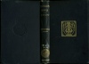
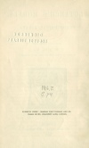

  
[Intangible Textual Heritage](../../../index)  [Classics](../../index.md) 
[Plutarch](../index)  [Index](index)  [Next](pte01.md) 

------------------------------------------------------------------------

[Buy this Book at
Amazon.com](https://www.amazon.com/exec/obidos/ASIN/142863326X/internetsacredte.md)

------------------------------------------------------------------------

  
*Plutarch's Morals: Theosophical Essays*, tr. by Charles William King,
\[1908\], at Intangible Textual Heritage

------------------------------------------------------------------------

p. i

###### BOHN'S CLASSICAL LIBRARY

###### PLUTARCH'S MORALS

p. ii

|                                                                                                                                                                                  |
|----------------------------------------------------------------------------------------------------------------------------------------------------------------------------------|
| LONDON: GEORGE BELL AND SONS PORTUGAL ST. LINCOLN'S INN, W.C. CAMBRIDGE: DEIGHTON, BELL & CO. NEW YORK: THE MACMILLAN CO. BOMBAY: A. H. WHEELER & CO. |

p. iii

# PLUTARCH'S MORALS.

## THEOSOPHICAL ESSAYS.

###### TRANSLATED BY THE LATE

### C. W. KING, M.A.,

##### AUTHOR OF "THE GNOSTICS AND THEIR REMAINS."

 

#### LONDON

#### GEORGE BELL AND SONS

#### \[1908\]

Scanned, proofed and formatted at Intangible Textual Heritage by John
Bruno Hare, September 2008. This text is in the public domain in the US
because it was published prior to 1923.

NOTE: Image caption and 'alt' text in brackets was inserted by the
formatter based on the authors’ 'Description of the Woodcuts.'—JBH.

 
[  
Click to enlarge](img/cover.jpg.md)  
Cover  

  [  
Click to enlarge](img/title.jpg.md)  
Title Page  

 
[  
Click to enlarge](img/verso.jpg.md)  
Verso  

p. iv

CHISWICK PRESS: CHARLES WHITTINGHAM AND CO.  
TOOKS COURT, CHANCERY LANE, LONDON.

------------------------------------------------------------------------

[Next: Preface](pte01.md)
