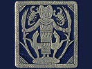

  
[Intangible Textual Heritage](../../../index)  [Classics](../../index) 
[Plutarch](../index)  [Index](index)  [Previous](pte02)  [Next](pte04) 

------------------------------------------------------------------------

[Buy this Book at
Amazon.com](https://www.amazon.com/exec/obidos/ASIN/142863326X/internetsacredte)

------------------------------------------------------------------------

  
*Plutarch's Morals: Theosophical Essays*, tr. by Charles William King,
\[1908\], at Intangible Textual Heritage

------------------------------------------------------------------------

p. x p. xi

### DESCRIPTION OF THE WOODCUTS.

[Title Page.](pte00.htm#img_title)

Diana of the Ephesians, a palm-branch in
each hand, a hind on each side, looking up to her as their mistress: in
the field over head, two scorpions. This deity originally symbolized
Earth, and was actually identified with Isis; but in later times, being
called by the name of the Grecian Artemis, she similarly became the
President of the Moon. Trebellius Pollio therefore speaks of the Goths
burning the Temple of the "Luna Ephesia," in the reign of Gallienus.
(Black Jasper.)

P. [v](pte01.htm#page_v). A group of the chief attributes of Apollo, in
his double character. The Gryphon, composed of the lion and eagle (types
of solar power), grasps the lyre belonging to the god of Poetry, whilst
on the Delphic rock behind is perched the raven, the most sure prophet
of all birds of augury. (Amethyst.)

P. [viii](pte01.htm#page_viii). Apollo seated before the Delphic tripod,
wearing the topknot and flowing robe alluded to by Plutarch ([p.
165](pte06.htm#page_165)). He takes the title of "Musagetes" when
arrayed in this costume; which therefore became the professional dress
of all musicians. Nero, who thought himself the Roman Apollo, appeared
in statues and struck coins (still extant) with his own figure
"citharœdico habitu," as Suetonius has recorded. (Sard.)

P. [71](pte04.htm#page_71). Bust of Isis, with the lotus-flower on her
forehead, and the sceptre in her hand. (Sard.)

P. [137](pte05.htm#page_137). Apollo standing in front of the Delphic
tripod. The inscription LAUR. MED. shows
that the gem once belonged to Lorenzo de’ Medici. (Sard.)

P. [172](pte06.htm#page_172). The Pythia, seated in profound meditation
in front of the Tripod. (Antique Paste.)

P. [196](pte07.htm#page_196). The Delphic E, "of gold," as the
inscription declares. This symbol became a talisman in much request
amongst the Romans, for reasons sufficiently obvious to any one who
reads Plutarch's exposition of its meaning. (Cameo.)

P. [275](pte09.htm#page_275). Erinnys, the Avenger of Blood, hastening
in pursuit of the guilty. Archaic Greek style. (Sard.)

P. [278](pte10.htm#page_278). Apollo, seated in the attitude of
meditation: by his side stands the earliest Pythia, Herophile; the staff
is placed in her hand to symbolize her extreme age. (Sard.)

p. xii

P. [287](pte11.htm#page_287). "Deus Lunus," the Asiatic conception of
the Spirit of the Moon. The earliest of all, the Assyrian, embodied the
idea in the form of an aged man, "Sin," leaning on his staff, and almost
the counterpart of our popular notion of the "Man in the Moon;" but in
process of time it was softened down into the effeminate boy represented
on the present gem. The chief seat of his worship was Carrhæ in
Mesopotamia, where it flourished down to a late period of the Roman
Empire: for Julian paid him worship there, "after the established
custom," as he marched by on his Persian expedition. (Sard.)

------------------------------------------------------------------------

[Next: On Isis and Osiris](pte04)
