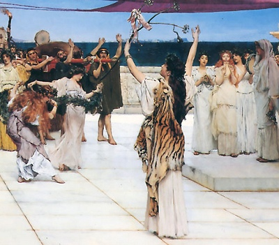

  
[Intangible Textual Heritage](../../../index)  [Classics](../../index) 
[Plutarch](../index) 

------------------------------------------------------------------------

[Buy this Book at
Amazon.com](https://www.amazon.com/exec/obidos/ASIN/0674993365/internetsacredte)

------------------------------------------------------------------------

[Buy this Book on
Kindle](https://www.amazon.com/exec/obidos/ASIN/B002LE787Q/internetsacredte)

------------------------------------------------------------------------

<table width="75%">
<colgroup>
<col style="width: 50%" />
<col style="width: 50%" />
</colgroup>
<tbody>
<tr class="odd">
<td width="50%" data-valign="TOP"> 
A Dedication to Bacchus, Alma-Tadema Laurence [1889] (Public Domain Image)</td>
<td width="50%" data-valign="CENTER"><h1 id="the-roman-and-greek-questions" data-align="CENTER">The Roman and Greek Questions</h1>
<h2 id="by-plutarch-tr.-frank-cole-babbitt" data-align="CENTER">by Plutarch, tr. Frank Cole Babbitt</h2>
<h4 id="section" data-align="CENTER">[1938]</h4></td>
</tr>
</tbody>
</table>

------------------------------------------------------------------------

[Contents](#contents)    [Start Reading](rgq00)    [Page
Index](pageidx)    [Text \[Zipped\]](rgq.txt.gz)

------------------------------------------------------------------------

|                                                                                                                           |
|---------------------------------------------------------------------------------------------------------------------------|
|  |

These are the Roman and Greek Questions of Plutarch, extracted from
Babbitt's Loeb Classics translation of the Moralia. Plutarch, who was an
initiated priest of Apollo of Delphi, here attempts to shed light on
numerous ancient folklore enigmas. Some of these are apparently
survivals from the distant past, and very signficant for the study of
the evolution of classical paganism. This was one of the first attempts
to explain folklore in both rational and mythopoetic terms, as well as a
treasure trove of ancient lore which makes fascinating reading.

------------------------------------------------------------------------

 [Title Page](rgq00)  

### The Roman Questions

[Introduction](rgq01)  
[1-9.](rgq02)  
[10-19.](rgq03)  
[20-29.](rgq04)  
[30-39.](rgq05)  
[40-49.](rgq06)  
[50-59.](rgq07)  
[60-69.](rgq08)  
[70-79.](rgq09)  
[80-89.](rgq10)  
[90-99.](rgq11)  
[100-109.](rgq12)  
[110-113.](rgq13)  

### The Greek Questions

[Introduction](rgq14)  
[1-9.](rgq15)  
[10-19.](rgq16)  
[20-29.](rgq17)  
[30-39.](rgq18)  
[40-49.](rgq19)  
[50-59.](rgq20)  
