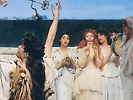

  
[Intangible Textual Heritage](../../../index)  [Classics](../../index.md) 
[Plutarch](../index)  [Index](index)  [Previous](rgq19.md) 

------------------------------------------------------------------------

[Buy this Book at
Amazon.com](https://www.amazon.com/exec/obidos/ASIN/0674993365/internetsacredte.md)

------------------------------------------------------------------------

[Buy this Book on
Kindle](https://www.amazon.com/exec/obidos/ASIN/B002LE787Q/internetsacredte.md)

------------------------------------------------------------------------

  
*The Roman and Greek Questions*, by Plutarch, tr. Frank Cole Babbitt,
\[1936\], at Intangible Textual Heritage

------------------------------------------------------------------------

50-59.

50\. Why is it that the Argives drive
their sheep to the precinct of Agenor when they wish to mate them?

Is it because Agenor took most excellent care of his sheep and acquired
more flocks than any other king?

 

51\. Why is it that Argive children in a
certain festival call themselves, in jest, "Pear-throwers "?

Is it because the first men that were led down by Inachus from the
mountains to the plain lived, as they say, on wild pears? They also say
that wild pears were first discovered by the Greeks in the Peloponnesus
at a time when that country was still called Apia, [a](#fn_338.md) wherefore wild pears were named *apioi*.

 

52\. What is the reason why the Eleans
lead their mares outside the boundaries of their country to mate them
with asses? [b](#fn_339.md)

Is it because of all kings Oenomaüs was the most fond of horses, and,
since he particularly loved

p. 240 p. 241

this animal, he laid many terrible curses upon any that should thus mate
horses in Elis; and it is in fear of that curse that they endeavour to
keep clear of it?

 

53\. Why was it the custom among the
Cnossians for those who borrowed money to snatch it?

Was it that if they defaulted they might be liable to the charge of
violence, and so be punished the more?

 

54\. What is the reason why in Samos they
invoke the Aphroditê of Dexicreon?

Is it because a sorcerer Dexicreon, making use of a rite of
purification, freed the women of Samos from the unbridled licentiousness
in which they indulged because of their great luxury and wantonness?

Or is it because Dexicreon was a shipmaster and sailed to Cyprus on a
trading voyage, and, when he was about to freight his ship, Aphroditê
bade him put into it water and nothing else, and set sail as quickly as
possible? He obeyed and, putting much water aboard the ship, sailed
away; after a time the wind died down and the ship was becalmed in the
open sea. To the other merchants and shipmasters, who were athirst, he
sold the water and amassed much money. Wherefore he fashioned an image
of the goddess and called it by his own name. If this is really true, it
appears that the goddess wished not to make one man rich, but to save
the lives of many through one man.

 

55\. Why is it that whenever the Samians
are engaged in sacrificing to Hermes the Giver of Joy they allow whoever
so desires to steal from them and filch their clothes?

p. 242 p. 243

Because in obedience to an oracle they changed their abode from Samos to
Mycalê and supported themselves by piracy there for ten years; and after
this they sailed again to Samos and overcame their enemies.

 

56\. From what does the place Panhaema on
the island of Samos derive its name?

Is it because the Amazons sailed from the country of the Ephesians [a](#fn_340.md) across to Samos when they were
endeavouring to escape from Dionysus? But he built boats and crossed
over and, joining battle, slew many of them near this place, which the
spectators in amazement called Panhaema [b](#fn_341.md) because of the vast quantity of blood
shed there. And of the elephants [c](#fn_342.md)
some are said to have been slain near Phloeum, and their bones are
pointed out there; but some relate that Phloeum also was cleft by them
as they uttered a loud and piercing cry.

 

57\. For what reason is the great hall in
Samos called the Hall of Fetters?

After the murder of Demoteles and the dissolution of his monarchic
government the Land-owners [d](#fn_343.md)
controlled the State, and at this time the Megarians made an expedition
against the Perinthians, who were colonists of the Samians; as it is
related, they brought with them fetters for their captives. When the
Land-owners learned of this, they dispatched aid to the Perinthians with
all speed, appointing nine

p. 244 p. 245

generals and manning thirty ships. Two of these ships, as they were
sailing out, were destroyed by a thunderbolt in front of the harbour;
but the generals kept on with the others, defeated the Megarians, and
took six hundred of them alive. Elated by their victory, they conceived
the project of overthrowing the oligarchy of the Land-owners at home.
Now the officials in charge of the government had provided an occasion
for undertaking this, by writing to the generals to bring back the
captive Megarians bound in their own fetters. The generals, accordingly,
took the letter, and secretly showed it to certain of the Megarians and
persuaded them to join with themselves and free the city. When they took
counsel together concerning the deed, they decided to knock loose the
rings that fastened the fetters, and in this condition to put them on
the legs of the Megarians, holding them up with thongs to their girdles,
so that the fetters might not slip down and fall off when their legs
became relaxed in walking. Having thus equipped the men and given a
sword to each, they sailed back to Samos and disembarked, and there they
led the Megarians through the market-place to the council-chamber, where
practically all the Land-owners were sitting together. Then, at a given
signal, the Megarians fell upon them and slew them. When the city had
thus been freed, they made citizens of those Megarians who so desired;
and they constructed a great building and dedicated the fetters there;
and from this the building was called the Hall of Fetters.

 

58\. Why is it that among the Coans the
priest of Heracles at Antimacheia dons a woman's garb, and

p. 246 p. 247

fastens upon his head a woman's head-dress before he begins the
sacrifice?

Heracles, putting out with his six ships from Troy, encountered a storm;
and when his other ships had been destroyed, with the only one remaining
he was driven by the gale to Cos. He was cast ashore upon the Laceter,
as the place is called, with nothing salvaged save his arms and his men.
Now he happened upon some sheep and asked for one ram from the shepherd.
This man, whose name was Antagoras, was in the prime of bodily strength,
and bade Heracles wrestle with him; if Heracles could throw him, he
might carry off the ram. And when Heracles grappled with him, the
Meropes came to the aid of Antagoras, and the Greeks to help Heracles,
and they were soon engaged in a mighty battle. In the struggle it is
said that Heracles, being exhausted by the multitude of his adversaries,
fled to the house of a Thracian woman; there, disguising himself in
feminine garb, he managed to escape detection. But later, when he had
overcome the Meropes in another encounter, and had been purified, he
married Chalciopê and assumed a gay-coloured raiment. Wherefore the
priest sacrifices on the spot where it came about that the battle was
fought, and bridegrooms wear feminine raiment when they welcome their
brides.

 

59\. Whence came the clan of
"Wagon-rollers" among the Megarians?

In the time of the unbridled democracy which brought about both the
return-interest [a](#fn_344.md) and the temple
sacrilege, a sacred mission of Peloponnesians passed through the
Megarid, on its way to Delphi and

p. 248 p. 249

had encamped, as chance dictated, in their wagons, with their wives and
children, in Aegeiri beside the lake. But the boldest spirits among the
Megarians, inflamed with wine, in their insolence and savagery rolled
back the wagons and pushed them into the lake, so that many members of
the mission were drowned. Now because of the unsettled state of their
government the Megarians took no notice of the crime; but the
Amphictyonic Assembly, since the mission was sacred, took cognizance of
the matter and punished some of the guilty men with banishment and
others with death. The descendants of these men were called
"Wagon-rollers."

 

 

 

------------------------------------------------------------------------

### Footnotes

[239:a](rgq20.htm#fr_340.md) *Cf*. Pausanias, ii.
5. 7; Aelian, *Varia Historia*, iii. 39.

[239:b](rgq20.htm#fr_341.md) *Cf*. Herodotus, iv.
30; Pausanias, v. 5. 2; 9. 2; mules were not bred in Elis because of a
curse, and this, seemingly, should be the meaning here; but the
corruption in the text of one word, which should have designated asses,
has made the mules somewhat dubious.

[243:a](rgq20.htm#fr_342.md) p. 242 *Cf*. Pausanias, vii. 2. 7.

[243:b](rgq20.htm#fr_343.md) "Allblood."

[243:c](rgq20.htm#fr_344.md) p. 243 Wilamowitz and Halliday emend to ἐλεφάντων.
This has, at first view, some plausibility, but completely lacks
corroborative evidence. Nonnus, *Dionysiaca*, xxvi. 326 ff. is not by
any means parallel.

[243:d](rgq20.htm#fr_345.md) Thucydides, viii. 21,
recounts the later struggles of the Land-owners and the People.

[247:a](rgq20.htm#fr_346.md) *Cf*. 295 C–D, *supra*.

 
