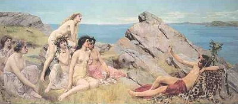

  
[Intangible Textual Heritage](../../index)  [Classics](../index) 

------------------------------------------------------------------------

[Buy this Book at
Amazon.com](https://www.amazon.com/exec/obidos/ASIN/0766180832/internetsacredte)

------------------------------------------------------------------------

<table width="75%">
<colgroup>
<col style="width: 50%" />
<col style="width: 50%" />
</colgroup>
<tbody>
<tr class="odd">
<td width="50%" data-valign="TOP"> 
Bacchus and the Choir of Nymphs, John Reinhard Weguelin</td>
<td width="50%" data-valign="CENTER"><h1 id="pagan-regeneration" data-align="CENTER">Pagan Regeneration</h1>
<h5 id="a-study-of-mystery-initiations-in-the-graeco-roman-world" data-align="CENTER">A Study of Mystery Initiations in the Graeco-Roman World</h5>
<h2 id="by-harold-r.-willoughby" data-align="CENTER">BY Harold R. Willoughby</h2>
<h4 id="section" data-align="CENTER">[1929]</h4></td>
</tr>
</tbody>
</table>

------------------------------------------------------------------------

[Contents](#contents)    [Start Reading](pr00)    [Text
\[Zipped\]](pr.txt.gz)

------------------------------------------------------------------------

|                                                                                                                           |
|---------------------------------------------------------------------------------------------------------------------------|
|  |

------------------------------------------------------------------------

 [Title Page](pr00)  
[Preface](pr01)  
[Contents](pr02)  
[Chapter I: Pagan Piety in the Graeco-Roman World](pr03)  
[Chapter II: The Greater Mysteries At Eleusis](pr04)  
[Chapter III: Dionysian Excesses](pr05)  
[Chapter IV: Orphic Reform](pr06)  
[Chapter V: The Regenerative Rites of the Great Mother](pr07)  
[Chapter VI: Death and New Birth in Mithraism](pr08)  
[Chapter VII: Isiac Initiation](pr09)  
[Chapter VIII: The New Birth Experience in Hermeticism](pr10)  
[Chapter IX: The Mysticism of Philo](pr11)  
[Chapter X: The Social Significance of Mystery Initiation](pr12)  
