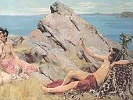

  
[Intangible Textual Heritage](../../index)  [Classics](../index) 
[Index](index)  [Previous](pr00)  [Next](pr02) 

------------------------------------------------------------------------

[Buy this Book at
Amazon.com](https://www.amazon.com/exec/obidos/ASIN/0766180832/internetsacredte)

------------------------------------------------------------------------

  
*Pagan Regeneration*, by Harold R. Willoughby, \[1929\], at Intangible
Textual Heritage

------------------------------------------------------------------------

# PREFACE

IT MUST frankly be confessed that this study of mystery initiations in
the Graeco-Roman world is but a prolegomenon to further research in
early Christian origins. For some years the author has been fascinated
by the problem of the genesis of Pauline mysticism. How did it come
about that, with Judaism and primitive Christianity essentially
unmystical in character, Pauline Christianity developed in a way to
accentuate the mystical phases of religious experience? The writer hopes
that some day circumstances will permit him to make a contribution
toward the solution of this problem. In order to answer this question it
is patently necessary to investigate the gentile religious milieu in
which Pauline Christianity had its development.

Researches in the field of Graeco-Roman religions prove conclusively
that apologists for early Christianity and even eminent classicists have
been inclined to underestimate the genuineness of gentile religious
interests and the extent to which religion dominated life in pagan lands
when Christianity was emerging. Of the gentile cults probably the most
popular in the first century, and certainly the least known and
understood in the twentieth, were the so-called mystery religions.
Notwithstanding the protestations of apologists there is ample evidence
that in both the west and the east the mystery cults were widely
disseminated and very influential before Christianity appeared on the
scene. In the following pages care is taken to exhibit this evidence in
relation to each of the mystery systems.

A detailed investigation of typical cult experiences further convinced
the author that the central meaning of mystery initiation--the
regeneration, both essential and ethical, of the individual devotee--has
largely escaped the notice of even sympathetic researchers. To bring out
this meaning in the terminology and thought-forms of the initiates
themselves, as recorded in scattered and fragmentary remains both
monumental and literary, is one of the major purposes for which these
studies are published.

Additional researches in Hermetic and Philonian literature demonstrated
how important this mystical type of religious experience was considered
to be, not only by religio-philosophical groups but also by individual
thinkers quite outside the circle of gentile cult brotherhoods. To the
writer Philo's case was particularly interesting, because it illustrated
the extent to which the thought and experiences of a diaspora Jew might
be influenced by gentile religious practices.

An analytical investigation of the social milieu in which the mystery
cults operated brought to light the fundamental character of the
interests and needs met by mystery initiation. On the one hand this made
intelligible the undoubted popularity of the mystery cults themselves;
on the other hand it served to suggest why it was the early Christian
propagandists, in order to win gentile adherents to their cult, came to
place such insistent emphasis on the experience of individual
regeneration.

By means of the dedicatory page the author has tried to express a
gratitude and appreciation that lie too deep for words. He would also
make grateful acknowledgment to Professor Shirley Jackson Case, who
guided his early studies in the mystery religious, and to Professor
Edgar J. Goodspeed, who gave helpful advice and encouragement. The
reading of proof, the verification of references, and the preparation of
the Index have been largely the work of Dr. A.D. Beittel and Mr. R.B.
Brewer. Their painstaking exactness is deserving of commendation. Above
all the writer would express his appreciation to a number of his own
students who with patience more than Christian have endured tedious
lectures about pagan mysteries.

H.R.W. Godspeed Hall The University of Chicago July 4, 1929

------------------------------------------------------------------------

[Next: Contents](pr02)
