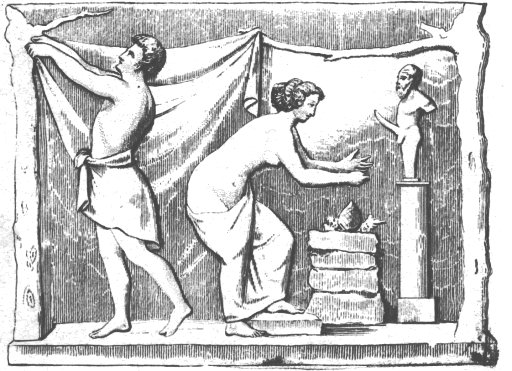

[Intangible Textual Heritage](../../index)  [Classical
Paganism](../index)  [Sacred Sexuality](../../sex/index) 

------------------------------------------------------------------------

<table>
<colgroup>
<col style="width: 50%" />
<col style="width: 50%" />
</colgroup>
<tbody>
<tr class="odd">
<td> 
Envocation to Priapus: 19th Century Engraving of a Bas-Relief from Pompeii</td>
<td><h1 id="priapeia" data-align="CENTER">PRIAPEIA</h1>
<h3 id="sive-diversorum-poetarum-in-priapum-lusus" data-align="CENTER"><em>sive diversorum poetarum in Priapum lusus</em></h3>
<h5 id="or" data-align="CENTER"><em>or</em></h5>
<h2 id="sportive-epigrams-on-priapus" data-align="CENTER">SPORTIVE EPIGRAMS ON PRIAPUS</h2>
<h4 id="by-divers-poets-in-english-verse-and-prose" data-align="CENTER">by divers poets in English verse and prose</h4>

translation by Leonard C. Smithers and Sir Richard Burton

[1890]
</td>
</tr>
</tbody>
</table>

------------------------------------------------------------------------

[Epigrams](#epigrams)  [Notes](#notes)  
[First Lines](1stline)  

------------------------------------------------------------------------

[Title Page](prpa)  
[Contents](prpb)  
[Introduction](prpc)  
[A Word to the Reader](prpd)  

### Epigrams

[To the Reader](prp00)  
[1. In play, Priapus (thou canst testify)](prp01)  
[2. Darkly might I to thee say: Oh give me for ever and ever](prp02)  
[3. These tablets, sacred to the Rigid God](prp03)  
[4. All the conditions (they say) Priapus made with the
youngling](prp04)  
[5. Though I be wooden Priapus (as thou see'st)](prp05)  
[6. Oft in my speech one letter is lost; for Predicate always](prp06)  
[7. Matrons avoid this site, for your chaste breed](prp07)  
[8. 'Why be my parts obscene displayed without cover?' thou
askest](prp08)  
[9. Why laugh such laughter, O most silly maid?](prp09)  
[10. 'Ware of my catching! If caught, with rod I never will harm
thee](prp10)  
[11. A she (than Hector's parent longer aged,](prp11)  
[12. Thou shalt be pedicate (lad!), thou also (lass!) shalt be
rogered](prp12)  
[13. Here' Here! nor dare expect (whoe'er thou be)](prp13)  
[14. Charged to my charge the fieldlet who shall dare](prp14)  
[15. Rare as those apples wherewith Hippomenes Schoeneïs
ravished](prp15)  
[16. What hast thou, meddling watch, with me to do?](prp16)  
[17. Aye in this prickle of ours the bonniest boon to be found
is](prp17)  
[18. Will ever Telethusa, posture-mime](prp18)  
[19. Thunders are under Jove; with the trident weaponed is
Neptune](prp19)  
[20. Wealth is my loss! Do thou vouchsafe lend aid to my
prayer,](prp20)  
[21. An fro' me woman shall thieve or plunder me man or a
man-child,](prp21)  
[22. Whoso of violets here shall pluck or rose,](prp22)  
[23. Here has the bailiff, now of this plentiful garden the
guardian,](prp23)  
[24. This staff of office cut from tree as 'tis,](prp24)  
[25. Hither, Quirites! (here what limit is?)](prp25)  
[26. Well-known darling of folk in the Circus Maximus far
famed,](prp26)  
[27. Thou, of unrighteous thought, that hardly canst](prp27)  
[28. Priapus! perish I an words obscene](prp28)  
[29. Dreadful wi' sickle and dire with thy greater part, O
Priapus!](prp29)  
[30. Hie thee amid these vines whereof an thou gather a
grape-bunch](prp30)  
[31. Long as thy wanton hand to pluck refrain](prp31)  
[32. A damsel drier than the raisin'd grape,](prp32)  
[33. Wont the Priapi of old were to have both Naiads and
Dryads](prp33)  
[34. At holy offering to the Lustful GodThief, for first thieving shalt
be swived, but an](prp34)  
[35. Thief, for first thieving shalt be swived, but an](prp35)  
[36. We all show special notes of bodily shape:](prp36)  
[37. Why on memorial tablet do they limn](prp37)  
[38. Simply to thee I say whatever to say shall behove me](prp38)  
[39. Form-charms in Mercury have might to please](prp39)  
[40. Yon Telethusa befamed amid the damsels Suburran](prp40)  
[41. Whoso comes hither shall a bard become](prp41)  
[42. Bailiff Aristagoras of his grapes high-pedigree'd
boasting](prp42)  
[43. Refrain from deeming all my sayings be](prp43)  
[44. What shouldest say this spear (although I'm wooden) be
wishing](prp44)  
[45. Whenas the Rigid God espied a wight](prp45)  
[46. Ho girl! no whiter-skinned than Moorish man](prp46)  
[47. Who of you people here shall come to sup](prp47)  
[48. Tho' see you drenchèd wet that part of me](prp48)  
[49. Thou, who art 'customed to view around the walls of our
temple](prp49)  
[50. A certain person, an thou please (Priapus!)](prp50)  
[51. What be this pother? For what cause suspects](prp51)  
[52. Ho thou, which hardly thy rapacious hand](prp52)  
[53. Bacchus often is wont with a moderate bunch to be sated](prp53)  
[54. E, D, an thou write, conjoining the two with a hyphen](prp54)  
[55. Who could believe my words? 'Tis shame to confess that the
sickle](prp55)  
[56. Thou too dost mock me, Thief! and the infamous](prp56)  
[57. A chough, a caries, an eld-worn grave](prp57)  
[58. Whatever thief shall trick my faith may he](prp58)  
[59. Know, lest due warning be denied by thee](prp59)  
[60. Hadst thou as many of apples as offers of verses
(Priapus!)](prp60)  
[61. Why, cultivator, vainly moan to me](prp61)  
[62. Sleep, O ye watchdogs! safe, while aid in guarding the
garden](prp62)  
[63. 'Tis not enough, my friends, I set my seat](prp63)  
[64. One than a goose's marrow softer far](prp64)  
[65. This, with his snout aye alert to uproot the lilies
a-blowing](prp65)  
[66. Thou, who lest manly mark thy glances meet](prp66)  
[67. PEnelope's first syllable followed by firstling of DIdo](prp67)  
[68. An I rustical seem to have spoken somewhat unlearned](prp68)  
[69. What then? Had Trojan yard Taenerian dame and her Cunnus](prp69)  
[70. When the fig's honied sweet thy taste shall catch](prp70)  
[71. A starveling stranger made me laughing-stock](prp71)  
[72. An thou pluck of this orchard fruit to my guarding
committed](prp72)  
[73. Of vergers diligent guard (Priapus!), threat](prp73)  
[74. Not to be moved am I; shouldst thou, Thief, venture on
thieving](prp74)  
[75. Why, O ye pathic girls, with sidelong oglings observe me?](prp75)  
[76. Right through the middle of lads and of lasses a passage shall
pierce](prp76)  
[77. Dodona is hallowed, Jupiter, to thee](prp77)  
[78. Though I be agèd now, though head and chin](prp78)  
[79. The Gods and Goddesses deny thy teeth](prp79)  
[80. Although with yard distent (Priapus!) weighted](prp80)  
[81. Know that this crass coarse yard nor lengthens nor stands as
becomes it](prp81)  
[82. While there is life 'tis fitting to hope, O rustical
guardian!](prp82)  
[83. Bailiff of house whilom, now I of fieldlet the tiller](prp83)  
[84. What news be here? what send those angry gods?](prp84)  
[85. Neither of garden nor of blessed vine](prp85)  
[86. Roses in spring in the autumn fruits and in summer they bring
me](prp86)  
[87. I thuswise fashioned I by rustic art](prp87)  
[88. This place, O youths, I protect, nor less this turf-builded
cottage](prp88)  
[89. This grove to thee devote I give, Priapus!](prp89)  
[90. Thou who with prickle affrightest men and passives with
sickle!](prp90)  
[91. I am not hewèd of the fragile elm](prp91)  
[92. A robber famed for greed exceeding wonder](prp92)  
[93. Carved me no rustic boor his artless sickle a-plying](prp93)  
[94. An thou would fain go filled thou mayest devour our
Priapus](prp94)  
[95. First a wild-fig-tree trunk was I, not useful as timber](prp95)  

### Notes

[A list of terms used in the Priapeia as designations of
Priapus](prp96)  
[List of terms used in the Priapeia to designate the virile member of
Priapus](prp97)  
[Alphabetical list of additional terms used by Latin authors in
designation of the male sexual organ](prp98)  
[List of terms used in the Priapeia to designate the female sexual
organ](prp99)  
[Alphabetical list of additional terms used by Latin authors in
designation of the female sexual organ](prp100)  
[Sodomy with Women](prp101)  
[Erotic Classical Writers](prp102)  
[List of agricultural and horticultural terms used tropically in a
venereal sense](prp103)  
[Sodomy](prp104)  
[Irrumation](prp105)  
[The Supine Posture in Coition](prp106)  
[Dancing Girls](prp107)  
[Masturbation](prp108)  
[Depilation by Catamites](prp109)  
[Braccae](prp110)  
[Bestiality](prp111)  
[Postures of Coition](prp112)  
[Infibulation](prp113)  
[The Cunnilinges](prp114)  
