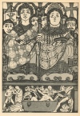
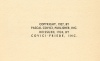
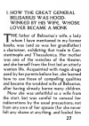

  
[Intangible Textual Heritage](../../../index)  [Classics](../../index) 
[Procopius](../index)  [Index](index)  [Next](shp01) 

------------------------------------------------------------------------

[Buy this Book at
Amazon.com](https://www.amazon.com/exec/obidos/ASIN/076617039X/internetsacredte)

------------------------------------------------------------------------

*The Secret History of Procopius*, tr. by Richard Atwater, \[1927\], at
Intangible Textual Heritage

------------------------------------------------------------------------

# SECRET HISTORY

# OF

# PROCOPIUS

### NEWLY TRANSLATED FROM THE GREEK WITH AN INTRODUCTION BY

### RICHARD ATWATER

#### NEW YORK

#### COVICI-FRIEDE, PUBLISHERS

#### \[1927\]

[  
Click to enlarge](img/cover.jpg)  
Front Cover and Spine  

[  
Click to enlarge](img/front.jpg)  
Frontispiece  

[  
Click to enlarge](img/title.jpg)  
Title Page  

[  
Click to enlarge](img/verso.jpg)  
Verso  

[  
Click to enlarge](img/02700.jpg)  
Page 27  

Scanned at Intangible Textual Heritage, June 2007. Proofed and formatted
by John Bruno Hare. This text is in the public domain in the United
States because it was published between 1923 and 1962 and its copyright
was not renewed in a timely fashion at the copyright office.

------------------------------------------------------------------------

[Next: Contents](shp01)
