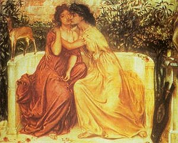

[Intangible Textual Heritage](../../index)  [Classics](../index) 
[Sappho](../sappho/index) 

------------------------------------------------------------------------

[Buy this book at
Amazon](https://www.amazon.com/exec/obidos/ASIN/0486256707/internetsacredte)

------------------------------------------------------------------------

<table width="75%">
<colgroup>
<col style="width: 50%" />
<col style="width: 50%" />
</colgroup>
<tbody>
<tr class="odd">
<td width="50%" data-valign="CENTER"></td>
<td width="50%" data-valign="CENTER"><h1 id="the-songs-of-bilitis" data-align="CENTER">The Songs of Bilitis</h1>
<h2 id="by-pierre-louÿs" data-align="CENTER">by Pierre Louÿs</h2>
<h4 id="translated-by-alvah-c.-bessie" data-align="CENTER">translated by Alvah C. Bessie</h4>
<h4 id="illustrations-by-willy-pogany" data-align="CENTER">illustrations by Willy Pogany</h4>
<h4 id="not-renewed" data-align="CENTER">[1926, not renewed]</h4></td>
</tr>
</tbody>
</table>

------------------------------------------------------------------------

[Contents](#contents)    [Start Reading](sob000)

------------------------------------------------------------------------

First published in Paris in 1894, this purports to be translations of
poems by a woman named Bilitis, a contemporary and acquaintance of
Sappho. This caused a sensation, not only because finding an intact
cache of poems from a completely unknown Greek poet *circa* 600 B.C.
would be a miracle, but because of its open and sensitive exploration of
lesbian eroticism. Actually Bilitis never existed. The poems were a
clever forgery by Pierre Louÿs--the "translator"; to lend weight, he had
even included a bibliography with bogus supporting works. Louÿs actually
did have a good command of the classics, and he salted *Bilitis* with a
number of quotations from real poets, including Sappho, to make it even
more convincing.

Just because this is a fake does not detract from its literary value.
And just because it was written by a man did not prevent it from
acquiring cultural significance for Lesbians. In fact, one of the
earliest organizations of Lesbians in the United States was called the
Daughters of Bilitis (although this could have been because it was a
reference that would elude most people).

Prior to the 1960s, in the US, English translations of *Bilitis* were
considered risqué enough to warrant lavish privately printed limited
editions. This was a dodge to circumvent now-defunct censorship laws.
The version this particular etext is based on was printed in 1926, and
has sensual and very witty Art Deco illustrations by Wily Pogany.

For more information on the context of this work, refer to my [essay on
Sappho](../sappho/saphintr).

--J. B. Hare

------------------------------------------------------------------------

 [Title Page](sob000)  
[Contents](sob001)  
[The Life Of Bilitis](sob002)  

### I. Bucolics In Pamphylia

[I. Bucolics In Pamphylia](sob003)  
[The Tree](sob004)  
[Pastoral Song](sob005)  
[Maternal Counsel](sob006)  
[Bare Feet](sob007)  
[The Old Man and the Nymphs](sob008)  
[Song](sob009)  
[Pedestrian](sob010)  
[Awakening](sob011)  
[Rain](sob012)  
[Flowers](sob013)  
[Impatience](sob014)  
[Comparisons](sob015)  
[The Stream in the Wood](sob016)  
[Phitta Meliai](sob017)  
[The Symbolic Ring](sob018)  
[Moonlight Dances](sob019)  
[Little Children](sob020)  
[Stories](sob021)  
[Her Friend, Married](sob022)  
[Confidences](sob023)  
[The Moon with Blue Eyes](sob024)  
[Song](sob025)  
[Lykas](sob026)  
[Offering to the Goddess](sob027)  
[The Accommodating Friend](sob028)  
[Prayer to Persephone](sob029)  
[Game of Dice](sob030)  
[The Distaff](sob031)  
[The Flute](sob032)  
[Tresses](sob033)  
[The Goblet](sob034)  
[Roses in the Night](sob035)  
[Regrets](sob036)  
[Interrupted Sleep](sob037)  
[To the Washerwomen](sob038)  
[Song](sob039)  
[Bilitis](sob040)  
[The Cottage](sob041)  
[The Lost Letter](sob042)  
[Song](sob043)  
[The Vow](sob044)  
[Night](sob045)  
[Cradle Song](sob046)  
[The Tomb of the Naïads](sob047)  

### II. Elegies At Mytilene

[II. Elegies At Mytilene](sob048)  
[To the Ship](sob049)  
[Psappha](sob050)  
[The Dance of Glottis and Kyse](sob051)  
[Counsels](sob052)  
[Incertitude](sob053)  
[Meeting](sob054)  
[The Little Clay Astarte](sob055)  
[Desire](sob056)  
[The Wedding](sob057)  
[The Living Past](sob058)  
[Metamorphosis](sob059)  
[The Nameless Tomb](sob060)  
[Mnasidika's Three Beauties](sob061)  
[The Grotto of the Nymphs](sob062)  
[Mnasidika's Breasts](sob063)  
[The Doll](sob064)  
[Tenderness](sob065)  
[Games](sob066)  
[Shadowlight](sob067)  
[The Sleeper](sob068)  
[The Kiss](sob069)  
[Jealous Cares](sob070)  
[The Mad Embrace](sob071)  
[The Heart](sob072)  
[Night Words](sob073)  
[Absence](sob074)  
[Love](sob075)  
[Purification](sob076)  
[Mnasidika's Lullaby](sob077)  
[Sea-Side Promenade](sob078)  
[The Object](sob079)  
[Evening by the Fire](sob080)  
[Prayers](sob081)  
[Eyes](sob082)  
[Cosmetics](sob083)  
[Mnasidika's Silence](sob084)  
[Scene](sob085)  
[Waiting](sob086)  
[Solitude](sob087)  
[Letter](sob088)  
[Attempt](sob089)  
[Effort](sob090)  
[To Gyrinno](sob091)  
[Last Attempt](sob092)  
[Rending Memory](sob093)  
[The Wax Doll](sob094)  
[Funeral Chant](sob095)  

### III. Epigrams in the Isle of Cyprus

[III. Epigrams in the Isle of Cyprus](sob096)  
[Hymn to Astarte](sob097)  
[Hymn to the Night](sob098)  
[The Maenads](sob099)  
[The Sea of Kypris](sob100)  
[The Priestesses of Astarte](sob101)  
[The Mysteries](sob102)  
[Egyptian Courtesans](sob103)  
[I Sing my Flesh and my Life](sob104)  
[Perfumes](sob105)  
[Conversation](sob106)  
[The Torn Dress](sob107)  
[Jewels](sob108)  
[The Impartial One](sob109)  
[Clear Water of the Basin](sob110)  
[Desire](sob111)  
[The Inn](sob112)  
[Domesticity](sob113)  
[The Bath](sob114)  
[To Her Breasts](sob115)  
[Mydzouris](sob116)  
[The Triumph of Bilitis](sob117)  
[To the Wooden God](sob118)  
[Dancer with Castanets](sob119)  
[The Flute Player](sob120)  
[The Warm Girdle](sob121)  
[To a Happy Husband](sob122)  
[To One Who Has Strayed](sob123)  
[Intimacies](sob124)  
[The Command](sob125)  
[The Masque of Pasiphaë](sob126)  
[The Juggleress](sob127)  
[The Flower Dance](sob128)  
[Violence](sob129)  
[Song](sob130)  
[Advice to a Lover](sob131)  
[Friends for Dinner](sob132)  
[The Tomb of a Young Courtesan](sob133)  
[The Little Flower-Vendor](sob134)  
[Dispute](sob135)  
[Melancholy](sob136)  
[Little Phanion](sob137)  
[Information](sob138)  
[The Vendor of Women](sob139)  
[Stranger](sob140)  
[Memory of Mnasidika](sob141)  
[Young Mother](sob142)  
[The Unknown](sob143)  
[Trickery](sob144)  
[The Last Lover](sob145)  
[The Dove](sob146)  
[Morning Rain](sob147)  
[True Death](sob148)  

### The Tomb of Bilitis

[The Tomb of Bilitis](sob149)  
[First Epitaph](sob150)  
[Second Epitaph](sob151)  
[Last Epitaph](sob152)  

 

[Bibliography](sob153)  

 

[Translator's Notes](sob154)  
