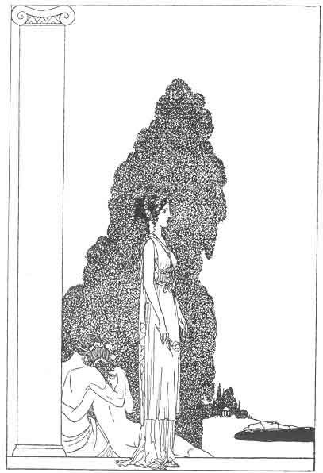
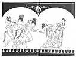

[Intangible Textual Heritage](../../index)  [Classics](../index.md) 
[Sappho](../sappho/index)  [Index](index)  [Next](sob001.md) 

------------------------------------------------------------------------

## PIERRE LOUŸS'

# THE SONGS OF BILITIS

###### Translated from the Greek [title](sob154.htm#xref_title.md)

#### PRIVATELY PRINTED FOR SUBSCRIBERS BY MACY-MASIUS: *Publishers* NEW YORK

#### ENGLISH VERSION BY ALVAH C. BESSIE

#### ILLUSTRATIONS BY WILLY POGANY

\[1926\]

Scanned at Intangible Textual Heritage, November, 2003. J. Lelievre,
redactor. This text is in the public domain in the United States because
it was not renewed at the US Copyright Office in a timely fashion as
required by law at the time. It may not be in the public domain in other
countries. These files may be used for any non-commercial purpose,
provided this notice of attribution is left intact.

|                                                   |                                                   |
|---------------------------------------------------|---------------------------------------------------|
|   |   |

[  
Click to enlarge](img/end.jpg.md)  
Endpapers  

 

p. 10

THE TRANSLATOR'S DEDICATION:

       . . . Τάδε νῦν ἐταίραις  
ταῖς ἔμαισι τέρπνα κάλως ἀείσω.  
                                --SAPPHO

but more specifically

For NANCY BEVILL    
                   "You, Cassandre?"

p. 11

THE AUTHOR'S DEDICATION:

This little book of ancient love is respectfully dedicated to the young
ladies of the society of the future.

AN ASTERISK IN THESE FOLLOWING PAGES IS USED TO DENOTE THE FACT THAT
SOME COMMENT UPON THE WORD OR PHRASE THUS MARKED WILL BE FOUND IN THE
NOTES

------------------------------------------------------------------------

[Next: Contents](sob001.md)
