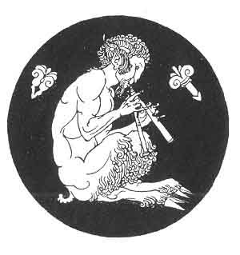

[Intangible Textual Heritage](../../index)  [Classics](../index.md) 
[Sappho](../sappho/index)  [Index](index)  [Previous](sob002.md) 
[Next](sob004.md) 

------------------------------------------------------------------------

p. 21

# I

# BUCOLICS IN PAMPHYLIA

 

Ἁδὺ δέ μοι τὸ μέλισμα, ϰαὶ ἤν σύριγγι μελίσδω  
ϰἤν αὐλῷ λαλέω, ϰἤν δώναϰι, ϰἤν πλαγιαυλίῳ  
                                                  THEOCRITUS [21](sob154.htm#xref_21.md)

 

------------------------------------------------------------------------

[Next: The Tree](sob004.md)
