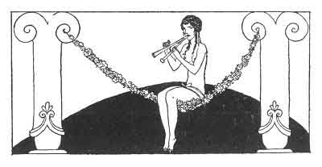

[Intangible Textual Heritage](../../index)  [Classics](../index.md) 
[Sappho](../sappho/index)  [Index](index)  [Previous](sob003.md) 
[Next](sob005.md) 

------------------------------------------------------------------------

p. 22

 

### THE TREE

I undressed to climb a tree; my naked thighs embraced the smooth and
humid bark; my sandals climbed upon the branches.

High up, but still beneath the leaves and shaded from the heat, I
straddled a wide-spread fork and swung my feet into the void.

It had rained. Drops of water fell and flowed upon my skin. My hands
were soiled with moss and my heels were reddened by the crushed
blossoms.

I felt the lovely tree living when the wind passed through it; so I
locked my legs tighter, and crushed my open lips to the hairy nape of a
bough.

------------------------------------------------------------------------

[Next: Pastoral Song](sob005.md)
