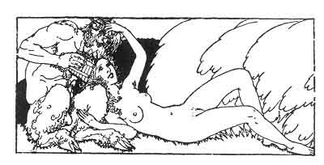

[Intangible Textual Heritage](../../index)  [Classics](../index.md) 
[Sappho](../sappho/index)  [Index](index)  [Previous](sob015.md) 
[Next](sob017.md) 

------------------------------------------------------------------------

p. 34

 

### THE STREAM IN THE WOOD

I bathed alone in the stream in the wood. I must have frightened the
poor naïads, for I could scarcely see them far away in the dark water.

I called to them. To mimic them I plaited iris blossoms, black as my
hair, about my neck, twined with knots of yellow gilly-flowers.

With a long floating weed, I made myself a green girdle, and to see it I
pressed my breasts and inclined my head a little.

And I called: "Naïads! naïads! play with me, be nice." But the naïads
are transparent, and perhaps I even caressed their lissom arms,
unknowing!

------------------------------------------------------------------------

[Next: Phitta Meliai](sob017.md)
