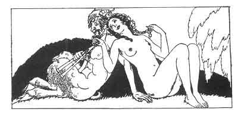

[Intangible Textual Heritage](../../index)  [Classics](../index) 
[Sappho](../sappho/index)  [Index](index)  [Previous](sob016) 
[Next](sob018) 

------------------------------------------------------------------------

p. 35

 

### PHITTA MELIAI

As soon as the sun's heat diminishes, we will go and play on the banks
of the river; we will struggle for a frail crocus, or for a sopping
hyacinth.

We will make a human necklace, and we'll weave a wreath of girls. We
will take each other by the hand, and grasp each other's tunic-skirts.

Phitta Meliai! give us honey! Phitta Naïades! let us bathe with you.
Phitta Meliades! shade sweetly our perspiring bodies.

And we will offer you, oh! beneficent nymphs, no shameful wine, but oil
and milk and many crook-horned goats.

------------------------------------------------------------------------

[Next: The Symbolic Ring](sob018)
