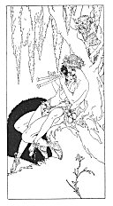

[Intangible Textual Heritage](../../index)  [Classics](../index.md) 
[Sappho](../sappho/index)  [Index](index)  [Previous](sob031.md) 
[Next](sob033.md) 

------------------------------------------------------------------------

p. 50

 

[  
Click to enlarge](img/05000.jpg.md)

 

p. 51

 

### THE FLUTE

For the Hyacinthian day he gave me some Panic pipes, of measured reeds
well-cut, bound each to each with soft white wax, sweet as honey to my
lips.

He teaches me to play, I seated on his knees; perhaps I tremble just a
bit too much. He then plays after me in tones so sweet I scarce can hear
them.

We did not have a word to tell each other, we were so close together all
the time, but the songs we sang were answers to each other, and time
again our mouths would seek the flute to find each other's there.

How late it is! the green night-frog commences now to sing. My mother
never will believe I stayed so long to try to find the girdle that I
lost.

------------------------------------------------------------------------

[Next: Tresses](sob033.md)
