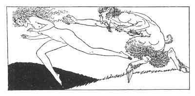

[Intangible Textual Heritage](../../index)  [Classics](../index.md) 
[Sappho](../sappho/index)  [Index](index)  [Previous](sob037.md) 
[Next](sob039.md) 

------------------------------------------------------------------------

p. 57

 

### TO THE WASHERWOMEN

Oh, washerwomen, do not say that you have seen me! I trust myself to
you; do not betray me! Between my garment and my breasts, I bring you
something to be washed.

I am like a little frightened hen. . . I cannot say just yet if I dare
tell . . . My beating heart may even kill me now . . . I am bringing you
a cloth.

A garment and the ribbons about my limbs. You see; there is some blood.
By Apollo, it was in spite of me! I struggled hard enough; but men who
love are stronger than we are.

Wash them well; spare neither salt nor chalk. I'll pledge four oboli for
you at Aphrodite's feet; and even a silver drachma.

------------------------------------------------------------------------

[Next: Song](sob039.md)
