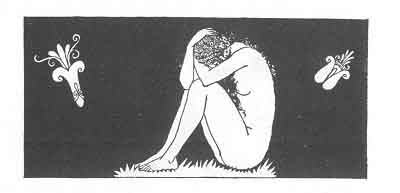

[Intangible Textual Heritage](../../index)  [Classics](../index.md) 
[Sappho](../sappho/index)  [Index](index)  [Previous](sob046.md) 
[Next](sob048.md) 

------------------------------------------------------------------------

p. 66

 

### THE TOMB OF THE NAÏADS

I walked through the frost-encrusted wood; my hair blossomed with tiny
icicles before my mouth and my sandals were heavy with soiled and
caked-up snow.

He said to me: "What do you seek?"--"I follow the tracks of the satyr.
His little cleft foot-prints alternate like holes in a snow-white robe."
He said tome: "The satyrs are dead.

"The satyrs, and the nymphs also. For thirty years there has not been so
terrible a winter. The tracks you see are those of a goat. But stay
here, here is their tomb."

And with the iron of his hoe he broke the ice of the spring in which the
naïads were wont to laugh of yore. He took some of the great frozen
chunks, and, raising them to the pale heavens, looked through them.

------------------------------------------------------------------------

[Next: II. Elegies At Mytilene](sob048.md)
