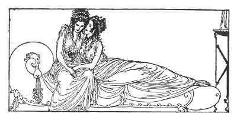

[Intangible Textual Heritage](../../index)  [Classics](../index) 
[Sappho](../sappho/index)  [Index](index)  [Previous](sob061) 
[Next](sob063) 

------------------------------------------------------------------------

p. 81

 

### THE GROTTO OF THE NYMPHS

Your little feet are daintier than those of silver
Thetis. [81](sob154.htm#xref_81) You cross your arms and press your
breasts together, and rock them softly, like two snowy doves.

Beneath your hair you hide your moistened eyes, your trembling mouth and
the red flowers of your ears; but naught shall stay my gentle glance or
the warm breath of my kiss.

For in the secret of your body it is you, beloved Mnasidika, who hide
the grotto of the nymphs which aged Homer sings, the place where the
naïads weave their purple robes.

Where drop by drop the quenchless springs do flow, and from which the
Northern gate permits men to descend, and where the South Gate lets
Immortals enter.

------------------------------------------------------------------------

[Next: Mnasidika's Breasts](sob063)
