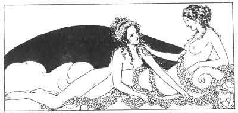

[Intangible Textual Heritage](../../index)  [Classics](../index) 
[Sappho](../sappho/index)  [Index](index)  [Previous](sob067) 
[Next](sob069) 

------------------------------------------------------------------------

p. 88

 

### THE SLEEPER

She sleeps in her undone hair, her hands entwined behind her neck. But
does she dream? Her lips are parted and her breath is gentle.

With a little dab of down I dry, without awakening her, the perspiration
from her arms, the fever from her cheeks. Her closed eyelids are two
purple flowers.

I shall arise quietly; I'll go draw water, milk the cow, and beg some
fire from our neighbors. I want to be coiffed and dressed completely
when she opens her eyes.

Sleep, remain awhile between her lovely curving lashes, and spin out the
happy night with a dream of happy omen.

------------------------------------------------------------------------

[Next: The Kiss](sob069)
