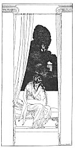

[Intangible Textual Heritage](../../index)  [Classics](../index.md) 
[Sappho](../sappho/index)  [Index](index)  [Previous](sob075.md) 
[Next](sob077.md) 

------------------------------------------------------------------------

p. 96

 

### PURIFICATION

There you are! Undo your bandelettes, your clasps and tunic. Undress
right to your sandals, down to the ribbons twined about your legs, down
to the cincture bound about your breast.

Sponge the black from your brows and the rouge from your lips. Wash the
whiting from your shoulders and unroll your knotted tresses in the
water.

For I want you pure, such as you were born upon the bed, at the feet of
your fertile mother and before your noble sire.

So chaste that my hand within your hand will make you blush to the lips,
and a whispered word of mine within your ear will madden your rolling
eyes.

[  
Click to enlarge](img/09700.jpg.md)

 

------------------------------------------------------------------------

[Next: Mnasidika's Lullaby](sob077.md)
