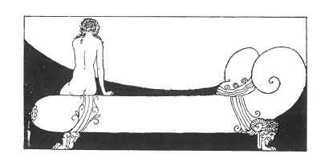

[Intangible Textual Heritage](../../index)  [Classics](../index) 
[Sappho](../sappho/index)  [Index](index)  [Previous](sob084) 
[Next](sob086) 

------------------------------------------------------------------------

p. 106

 

### SCENE

Where were you? --At the florist's. I bought some lovely irises. Behold
them, I have brought them just for you. --And you took all that time to
buy four flowers? --The merchant kept me waiting.

--Your cheeks are pale, and your eyes are shining. --The weariness of
walking such away. --Your hair is wet and tangled. --The heat is great,
the wind has tossed my hair.

--Your girdle was untied. I made the knot myself, and not as hard as
that. --So loose it opened; a passing slave tied it up for me.

--There is a spot on your dress. --The flowers dripped. --Mnasidika, my
little soul, your irises are far more beautiful than can be bought in
all of Mytilene. --How well I know it, oh, how well I know!

------------------------------------------------------------------------

[Next: Waiting](sob086)
