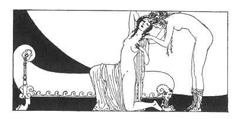

[Intangible Textual Heritage](../../index)  [Classics](../index.md) 
[Sappho](../sappho/index)  [Index](index)  [Previous](sob089.md) 
[Next](sob091.md) 

------------------------------------------------------------------------

p. 111

 

### EFFORT

More! enough of sighing and stretching out your arms! Begin again! Or do
you think that love is relaxation? Gyrinno, 'tis a task, and by far the
most severe.

Awaken! You must not go to sleep! What matters to me your purple eyelids
and the streak of pain which burns your slender legs. Astarte boils and
bubbles in my loins.

We went to bed before twilight. Here already is the naughty dawn; but I
am not so easily fatigued. I shall not sleep before the second night.

I shall not sleep: you *must* not go to sleep. Ah! how bitter is the
taste of dawn! Gyrinno, judge of it! Kisses are more difficult, but
stranger, longer, slow. . .

------------------------------------------------------------------------

[Next: To Gyrinno](sob091.md)
