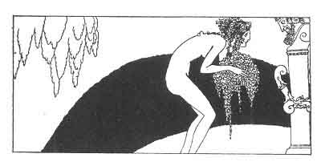

[Intangible Textual Heritage](../../index)  [Classics](../index.md) 
[Sappho](../sappho/index)  [Index](index)  [Previous](sob097.md) 
[Next](sob099.md) 

------------------------------------------------------------------------

p. 119

 

### HYMN TO THE NIGHT

The midnight masses of the trees move no more than do the mountains. The
stars are crowded in a spreading sky. A breeze warm as a human breath
caresses my cheeks and eyes.

Oh! Night who gave birth to the Gods! how sweet thou art upon my lips!
how warm thou art in my hair! how thou enterest into me this evening,
and I feel that I am big with all thy spring!

The flowers which are going to bloom will take their birth from me. The
wind which breathes so softly is my breath. The wafted perfume is my own
desire. All the living stars are in my eyes.

Thy voice, is it the murmur of the sea, or is it the silence of the
fields? Thy voice, I do not understand it, but it dizzies me, and my
tears bathe both my hands.

------------------------------------------------------------------------

[Next: The Maenads](sob099.md)
